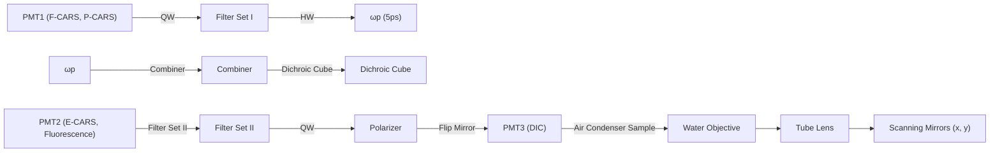

# Vibrational imaging of lipid droplets in live fibroblast cells with coherent anti-Stokes Raman scattering microscopy

Xiaolin Nan, Ji-Xin Cheng,1 and X. Sunney Xie2

Department of Chemistry and Chemical Biology, Harvard University, Cambridge, MA 02138

Abstract A new vibrational imaging method based on coherent anti-Stokes Raman scattering (CARS) has been used for high-speed, selective imaging of neutral lipid droplets (LDs) in unstained live fibroblast cells. LDs have a high den sity of C-H bonds and show a high contrast in laser-scanning CARS images taken at $\mathbf { 2 , 8 4 5 \ c m ^ { - 1 } } ,$ , the frequency for aliphatic C-H vibrations. The contrast from LDs was confirmed by comparing CARS and Oil Red O (ORO)-stained fluorescence images. The fluorescent labeling processes were examined with CARS microscopy. It was found that ORO staining of fixed cells caused aggregation of LDs, whereas fixing with formaldehyde or staining with Nile Red did not affect LDs. CARS microscopy was also used to monitor the 3T3-L1 cell differentiation process, revealing that there was an obvious clearance of LDs at the early stage of differentiation. After that, the cells started to differentiate and reaccumulate LDs in the cytoplasm in a largely unsynchronized manner. Differentiated cells formed small colonies surrounded by undifferentiated cells that were devoid of LDs. These observations demonstrate that CARS microscopy can follow dynamic changes in live cells with chemical selectivity and noninvasiveness. CARS microscopy, in tandem with other techniques, provides exciting possibilities for studying LD dynamics under physiological conditions without perturbation of cell functions.—Nan X., J-X. Cheng, and X. S. Xie. Vibrational imaging of lipid droplets in live fibroblast cells with coherent anti-Stokes Raman scattering microscopy. J. Lipid Res. 2003. 44: 2202–2208.

Supplementary key words 3T3-L1 • adipocyte differentiation • nonlinear optical microscopy

Typically found in adipocytes and hepatocytes, lipid droplets (LDs) were previously thought to be merely an energy reservoir of the cell. In recent years, they have drawn increased attention from cell biologists (1–4), starting with the discovery that LDs carry various proteins, such as perilipin (5, 6), adipocyte differentiation-related protein (ADRP) (7), and caveolin (8) and serve as the pool of unesterified cholesterols (6). They were also found to be important cellular signaling sites (8) and may play important roles in lipid catabolism (9). Traditionally, fluorescent dyes such as Oil Red O (ORO) (10) and Nile Red (11) have been extensively used for fluorescent labeling of LDs. Immunofluorescence against LD-associated proteins has also been used for indirect observation of LDs (12). In general, these methods are only applicable to fixed samples. Another problem associated with these methods is the deformation of LD structure, probably introduced by the sample fixation and staining procedures that are necessary for these techniques (13). Differential interference contrast (DIC) and phase contrast microscopes are readily available (14) for live cell imaging, but they have no chemical selectivity and thus are unable to distinguish small LDs from other cellular structures. On the other hand, Raman microscopy, which has spectral selectivity, allows chemical imaging of unstained samples (15), but the low cross-section of spontaneous Raman scattering limits the sensitivity. Consequently, it takes several hours to acquire a typical Raman image of a biological sample (16). A new method for high-speed imaging of unstained LDs in live cells would allow for a better understanding of their functions under physiological conditions.

Coherent anti-Stokes Raman scattering (CARS) microscopy is a recently developed technique for high-sensitivity vibrational imaging of live cells (17–22). In this technique, a pump beam at frequency $\mathfrak { \omega } _ { \mathrm { p } }$ and a Stokes beam at frequency ${ \boldsymbol { \omega } } _ { \mathrm { s } }$ are tightly focused onto the sample to generate an anti-Stokes (CARS) signal at frequency $2 \omega _ { \mathrm { p } } \mathrm { - } \omega _ { \mathrm { s } } . \mathrm { ~ A ~ }$ strong resonant CARS signal is generated when the frequency difference $( \omega _ { \mathrm { p } } - \omega _ { \mathrm { s } } )$ is tuned to a Raman-active molecular vibration. This provides the chemical selectivity in CARS microscopy. Because the contrast is based on vibrational modes of endogenous molecules, there is no need for staining of the sample. CARS microscopy is much more sensitive than Raman microscopy because of the coherent addition of the CARS radiation from a collection of vibrational oscillators in the focal volume. In addition, CARS is a multiphoton process, the signal has a nonlinear dependence on excitation laser intensity, and is only generated from the small focal volume of high laser intensity. Thus, as in two-photon fluorescent microscopy (23), CARS has an inherent three-dimensional resolution. With a laserscanning scheme, CARS imaging of live cells has been achieved at a scanning rate of several seconds per frame of 512  512 pixels (22), allowing vibrational imaging of dynamic processes in live cells (22, 24).

CARS microscopy is a sensitive probe of lipids because of the high density of C-H bonds in lipid molecules. CARS imaging of lipids in live cells based on the resonant signal from the aliphatic C-H stretching vibration has been demonstrated previously (18, 22). Multiplex CARS microspectroscopy has been developed for distinguishing lipid phase structure in liposomes (25, 26). In addition, polarizationsensitive detection has been applied to remove the nonresonant background from water and other biological molecules and to allow for selective imaging of lipid features in live cells (22, 27). Recently, Potma and Xie (28) demonstrated the detection of single lipid bilayer with CARS.

Structurally, LDs are aggregates of neutral lipids, mainly triglycerides (TGs) and some sterol esters (1–4). They are very rich in C-H chemical bonds and are expected to give strong CARS signals. In this study, we applied laser-scanning CARS microscopy to the investigation of LDs in live, unstained 3T3-L1 cells. Polarization-sensitive detection was incorporated into our laser-scanning CARS microscope for selective imaging of LDs in the cytoplasm. It was possible to evaluate the fluorescent labeling processes with ORO and Nile Red in real time with CARS microscopy. Furthermore, the LD content was monitored during the differentiation process of 3T3-L1 cells. In contrast to previous observations of lipid accumulation (29), a transient disappearance of LDs in the cytoplasm was observed at the early stage of differentiation, which was followed by the growth of new LDs. The new LDs were accumulated in a largely unsynchronized manner. Differentiated cells formed small colonies surrounded by undifferentiated cells, with lipid accumulation occurring at the same time. These observations prove that CARS microscopy is a powerful tool in real-time, noninvasive imaging of LDs and that it offers valuable information for a better understanding of the biogenesis and functions of LDs in live cells.

## MATERIALS AND METHODS

## Cell cultures

3T3-L1 cells (American Type Cell Culture, ATCC) were grown in Dulbecco’s Modified Eagle’s Medium (DMEM, ATCC) supplemented with 10% bovine calf serum (BCS) (Cellgro) under 5% $\mathrm { C O _ { 2 } } .$ . Media were changed every 2 to 3 days. Culture was performed in chambered slides (Labtek, Rochester, NY) to facilitate imaging.

3T3-L1 cell differentiation was carried out using a protocol described by Rubin et al. (30). Briefly, 3T3-L1 cells were first grown in 10% BCS/DMEM medium to confluence. Two days after that (day 0), the medium was changed to induction medium containing 10% FBS/DMEM with 0.5 mM isobutylmethylxanthine (IBMX) (Sigma), 1 M Dexamethasone (Dex) (Sigma), and 1 g/ml insulin (Sigma). All concentrations were final. Two days after induction, the medium was changed back to 10% FBS/ DMEM with 1 g/ml insulin, and 10% FBS/DMEM after another 2 days. Solutions were filter sterilized.

Both BCS/DMEM and FBS/DMEM were supplemented with 1% Pen/Strep/Glu (Invitrogen) and 1% MEM Sodium Pyruvate (Invitrogen) and filter sterilized before use.

## ORO and Nile Red staining

The protocol we used for ORO staining was derived from the procedure developed by Koopman, Schaart, and Kesselink (10) with minor modifications. The stock staining solution was prepared by dissolving 100 mg ORO (Sigma) in 20 ml of 60% triethyl phosphate (Sigma). Prior to use, this solution was further diluted by adding 13 ml distilled water followed by a 0.22 m film filtration. The staining solutions prepared by this method could stand for a very long period (over 6 months) without any sign of precipitation; they did not show any crystallization during cell staining. Nile Red staining solution was prepared by diluting a saturated solution of Nile Red in acetone in PBS to 1:1,000.

For staining, cells were first fixed with 3.7% (v/v) formaldehyde for 10 min and washed twice by HBSS buffer. The 1.5 ml staining solution was added to a $2 ~ \mathrm { { c m } ^ { 2 } }$ chambered slide culture dish and incubated for 15–30 min at room temperature. After that, the cells were washed with PBS buffer twice for 1 min each. Images were taken immediately after staining.

## Laser-scanning CARS and fluorescent microscopy

A schematic setup of the laser-scanning CARS microscope (22) (modified from an Olympus FV300/IX70 laser-scanning confocal microscope) is shown in Fig. 1. Two synchronized 80 MHz, 5 ps (transform limited, spectral width $2 . 9 ~ \mathrm { c m } ^ { - 1 } )$ nearinfrared laser beams (pump laser at 712 nm and Stokes laser at 892 nm) were generated from a pair of synchronized Ti:Sapphire lasers (Tsunami, Spectra-Physics). The two beams were combined in a collinear geometry and focused on the sample using a water objective (Olympus UpLanApo/IR 60, NA 1.2). CARS images were acquired by raster scanning a pair of galvanometer mirrors. Forward-detected CARS (F-CARS) (18), epi-detected CARS (21), DIC, and fluorescence imaging can be carried out on the same setup. The laser powers used in our CARS experiments were 15 mW for the pump beam and 7.5 mW for the Stokes beam, measured after the water objective. Polarizationsensitive detection was conducted to remove nonresonant background (27), for which a quarter-wave and a half-wave plate were placed in the pump beam path. They were configured such that the polarizations of the pump and Stokes beams formed an angle of 71.6. An analyzer was put in front of the detector to reject the nonresonant background.

flowchart

Fig. 1. Schematic of a coherent anti-Stokes Raman scattering (CARS) microscope with polarization-sensitive detection. Two 5-ps laser (Tsunami, Spectra-Physics) pulse trains at 712 nm and 892 nm, respectively, are collinearly combined and introduced into an Olympus FV300/IX70 confocal laser-scanning microscope. Halfwave plate (HW) and quarter-wave plate (QW) are placed in the beam path for the pump beam. Band-pass filter sets are used to separate the CARS signal from the excitation beams. See the Materials and Methods section for details. PMT, photomultiplier tube.

Fluorescent imaging of ORO-stained cells was performed on the same Olympus FV300/IX-70 laser-scanning microscope illuminated by an He-Ne laser (543 nm, LHGR 0050, PMS Electro-Optics). A long-pass filter (BA570IF, Olympus) with a cutoff at 570 nm was used to exclude incident light from the epi-fluorescence signal.

## RESULTS AND DISCUSSION

## CARS imaging of LDs in live 3T3-L1 cells

The first step toward selective imaging of LDs with CARS is to determine the resonant CARS frequency at which LDs give the strongest signal. In our previous work, frequencies of $2 , 8 4 5 \ \mathrm { c m } ^ { - 1 }$ (26) and $2 { , } 8 7 0 \ \mathrm { c m } ^ { - 1 }$ (22) were used for selective imaging of aliphatic C-H vibrations, but the frequency suitable for LDs (mainly TG molecules) has not been measured. We recorded the CARS spectrum of LDs in live differentiated 3T3-L1 cells that are known to contain large LDs. As shown in Fig. 2A, peak CARS signal intensity was reached at $2 , 8 4 5 ~ \mathrm { c m } ^ { - 1 }$ on LDs, the same position observed for phospholipid structures (25). In accordance with this measurement, images of differentiated 3T3-L1 cells showed the brightest contrast for LDs at $2 , 8 4 5 \ \mathrm { c m } ^ { - 1 }$ .

F-CARS images taken at $2 , 8 4 5 \ \mathrm { c m } ^ { - 1 }$ on preconfluent 3T3-L1 cells (Fig. 2B) contain many bright spots, standing out from other features (such as the nuclear membrane). Contrast from these bright spots could be further enhanced through polarization-sensitive detection by removing the nonresonant background (e.g., from water) from CARS signals (27). As seen in Fig. 2C, only the bright spots in Fig. 2B remain in the polarization-CARS (P-CARS) image. When the CARS frequency was tuned away from 2,845 $\mathrm { c m } ^ { - 1 } ( \mathrm { e . g . , 2 , 7 4 5 \mathrm { c m } ^ { - 1 } ) }$ (Fig. 2D), no contrast was observed in the P-CARS image. This provides evidence that the contrast in images taken at $2 , 8 4 \dot { 5 } \mathrm { c m } ^ { - 1 }$ arise from the CARS signal generated by densely packed lipid structures (i.e., LDs).

Identification of these bright spots as LDs was confirmed by comparing confocal fluorescence images of stained LDs with corresponding P-CARS images. Shown in Fig. 3A is a P-CARS image of an ORO-stained 3T3-L1 cell sample (fixed), and shown in Fig. 3B is the fluorescence image of the same cell. As expected, P-CARS and fluorescence images showed identical contrast, with only slight differences likely caused by the foci change, because different laser sources were used for CARS and fluorescent imaging.

line chart

| Raman Shift (cm⁻¹) | Intensity (a.u.) |
| ------------------ | ---------------- |
| 2845               | 3600             |

natural_image

Microscopic image of a cellular structure with scattered bright spots (no text or symbols visible)

natural_image

Microscopic image showing scattered bright spots on a dark background, labeled 'C' in top-left corner (no other text or symbols)

natural_image

Microscopic image with a 10 μm scale bar, showing no visible text or symbols

Fig. 2. CARS spectrum of a 10 m diameter lipid droplet (LD) in a differentiated 3T3-L1 cell at Raman shifts from $2 , 7 5 \hat { 0 } \ : \mathrm { c m } ^ { - 1 } \ : \mathrm { t o } \ : 2 , 8 8 5 \ : \mathrm { c m } ^ { - 1 } \ : ( \mathrm { A } )$ ; forward-detected CARS (F-CARS) image of a live 3T3-L1 cell taken a $\cdot 2 , 8 4 5 \thinspace \mathrm { c m ^ { - 1 } \thinspace ( B ) }$ ; polarization-CARS (P-CARS) image of the same cell at $2 , 8 4 5 \mathrm { c m } ^ { - 1 } \left( \mathbf { C } \right)$ ; and P-CARS image of the same cell taken at $2 , 7 4 5 \mathrm { c m } ^ { - 1 } \left( \mathbf { D } \right)$ .

natural_image

Microscopic image showing scattered bright spots on a dark background with a 10 μm scale bar (no text or symbols beyond label)

natural_image

Microscopic view of a cellular or particulate structure with scattered bright spots on a dark background (no text or symbols)

Fig. 3. Comparison of a P-CARS image taken at 2,845 cm1 (A) and an Oil Red O (ORO)-stained fluorescence image of a fixed 3T3-L1 cell (B). Identical contrast observed in the two images proves the validity of CARS imaging of LDs.

With the laser powers applied in the experiment (15 mW for pump and 7.5 mW for Stokes at the sample), the shortest acquisition time for a CARS image of 512  512 pixels is approximately 1 s. This is determined by the upper limit of the scanning speed of our setup, and can in principle be further shortened with the current signal level. The low average power and fast scanning speed, in combination with low peak-power picosecond and nearinfrared laser pulses, significantly reduced photodamage to the sample. Cellular damage was seldom seen during continuous scanning of up to several minutes when the above power levels were used. The smallest droplets seen in the fluorescence and CARS images have a full width at a half-maximum of -300 nm, which is comparable to the diffraction limit. The actual size of the LDs might be smaller. These small LDs can hardly be resolved in DIC images, due to lack of chemical selectivity.

The coincidence of fluorescence and CARS images of LDs is not accidental. Oil-soluble dye molecules stain LDs by penetrating into the hydrophobic core structures formed by alkyl chains. Like LDs, phospholipid bilayers also have a hydrophobic domain and could also be stained by these dyes, albeit to a much smaller extent, because they contain only a tiny sheet of fatty chains. Indeed, it was shown that cell membranes could be stained when the sample was overloaded with ORO staining solution (10) (also observed in our experiments, data not shown). At the same time, the hydrophobic structure of alkyl chains carries an inherently high density of C-H bonds and is an ideal object for CARS imaging. In contrast, a phospholipid bilayer provides much less C-H vibrational modes than LDs in the focal volume. The quadratic dependence of CARS signal intensity on the number of vibrational oscillators in the focal volume guarantees that the highest contrast in these images is from LDs, despite the fact that phospholipids have the same resonance frequency for CARS as TG molecules (25).

## Monitoring ORO and Nile Red staining of LDs

Fluorescence labeling with ORO and Nile Red (and other dyes) in fixed cells has been the standard method for visualizing LDs. A major concern about the use of these methods is that the fixing and staining procedures may perturb the structure of LDs in cells. For example, a recent study by Fukumoto and Fujimoto (13) showed that ORO labeling caused obvious aggregation of adjacent LDs while Nile Red did not. However, due to the inability to observe unstained LDs in live cells, little is known about whether the fixing process will introduce artifacts into the LD structures. With CARS microscopy, we are able to inspect LD structures in cells undergoing fixation and ORO or Nile Red staining.

Figure 4A–C shows CARS images of a single 3T3-L1 cell right before replacing the growth medium with 3.7% formaldehyde fixing solution, and 5 min and 15 min after the medium replacement, respectively. The cellular profile was well resolved, as were the LDs in the F-CARS im ages. Apparently, formaldehyde fixation did not affect LD structures within the time course studied. This is reasonable, because LDs are hydrophobic structures that may not be affected by the aqueous formaldehyde solution. In contrast, Didonato and Brasaemle (31) recently showed that the use of organic solvents (such as ethanol and acetone) disturbed LD structures significantly.

Incubation of cells with Nile Red staining medium (again, an aqueous solution) also showed no obvious effect on LD morphology or distribution. Figure 4D–F are F-CARS images of the same cell taken at different times after applying Nile Red to the sample. Nearly identical features were seen among these three images, and also among all images in Fig. 4A–F. The small changes observed here were most likely caused by the intracellular movement of LDs instead of by Nile Red staining, considering that LDs might not be tightly bound structures (even in fixed cells).

Unlike staining with Nile Red, obvious changes in LD structure occurred when ORO staining solution was applied to fixed cells (Fig. 4G–I, a different cell sample). The same phenomenon was observed when ethanol was used as the solvent (13). Although an aqueous staining solution was used in this experiment, it contained a high concentration of triethyl phosphate (a surfactant used to assist the dissolution of ORO in water). Like ethanol, triethyl phosphate can interact with oil and water phases at the same time and was able to mediate the fusion of adjacent LDs by reducing the oil/water interfacial energy barrier among them. TG molecules that were still in the endoplasmic reticulum (ER) lumen and not yet incorporated into LDs could also be “extracted” out of the ER membranes. This was indicated by the fact that many isolated LDs grew bigger after staining. Furthermore, prior to staining, LDs looked more like an extended part of the surrounding organelles, inasmuch as no obvious boundaries could be seen between them. After staining, however, boundaries among LDs and surrounding structures became sharp, suggesting that a phase separation took place between the membranous structures and LDs. For similar reasons, the ORO staining buffer even disrupted the nuclear membrane integrity (see Fig. 4G–I).

These observations provide direct evidence that treatment with formaldehyde to fix cellular structures is safe for preserving LD structure, while labeling LDs with dyes (especially when oil-soluble solvents are used) carries the risk of affecting LD structure. Superior to fluorescent labeling, CARS microscopy allows high-sensitivity imaging of LDs in live cells without any staining.

natural_image

Microscopic image showing cellular or particulate structures with a 5 μm scale bar (no text or symbols beyond label)

natural_image

Microscopic image showing cellular structures with scattered bright spots (no text or symbols visible)

natural_image

Microscopic grayscale image showing cellular or tissue structures with scattered bright spots (no text or symbols visible)

natural_image

Microscopic image showing cellular or particulate structures with scattered bright spots (no text or symbols visible)

natural_image

Microscopic image showing scattered bright spots on a dark background, labeled 'E' in the top-left corner (no other text or symbols)

natural_image

Microscopic image showing cellular or particulate structures with bright spots (no text or symbols visible)

natural_image

Microscopic image of a biological structure with two white circles highlighting specific regions (no text or symbols present)

natural_image

Microscopic image of a biological structure with two white circles highlighting specific regions (no text or symbols present)

natural_image

Microscopic view of a biological or material sample with circular annotations highlighting specific features (no text or symbols present)

Fig. 4. F-CARS images of a live 3T3-L1 cell treated with 3.7% formaldehyde fixing buffer (A–C). Images were taken prior to fixation (A), at 5 min (B), and at 15 min (C) after adding the 3.7% formaldehyde fixing buffer. No evident changes in LD structure were seen during fixation. CARS images of the same cell as in A–C incubated in Nile Red staining buffer (D–F). Images were taken 5 min (D), 10 min (E), and 15 min (F) after changing fixing buffer to Nile Red staining solution. No aggregation or redistribution of LDs was seen during Nile Red staining. F-CARS images were taken on a different cell sample (G–I), which underwent the same fixing procedure and was incubated in ORO staining buffer. Images were taken 5 min (G), 10 min (H), and 15 min (I) after adding ORO solution. Obvious changes in LD structures, mainly the aggregation of adjacent LDs (see arrows and circled areas in panels G–I) were observed. All CARS images were taken at $2 , 8 4 5 \thinspace \mathrm { c m } ^ { - 1 }$ .

## Following 3T3-L1 differentiation

In previous sections, we showed the ability of CARS microscopy to follow cellular processes happening on the time scale from seconds to minutes. Although fluorescence microscopy is capable of monitoring dynamics on this time scale, fluorescence probes for live cell observation of LDs are rarely available. For continuous observations on a longer time scale (e.g., days), however, fluorescence imaging based on staining is not suitable because of cellular degradation of the dyes. CARS microscopy is particularly advantageous for continuous observation at this long time scale.

A good example of cellular processes on a long time scale involving LDs is the well-established 3T3-L1 fibroblast conversion to fat cells (29, 32). The 3T3-L1 fibroblasts are induced 2 days after reaching confluence with an induction medium containing IBMX, Dex, and insulin. After that, cells start to accumulate TG droplets and eventually become adipocyte (fat) cells. Cell morphology and gene expression profiles also change significantly during this process (33).

The most obvious characteristic of this process is the accumulation of TG droplets in cells, which can be readily probed with CARS microscopy. As shown in Figs. 2 and 3, preconfluent 3T3-L1 fibroblasts already contained a fair amount of TG droplets, with diameters of -1–2 m, scattered in the cytoplasm. A similar picture remained until induction (day 2, Fig. 5A). A reduction of LDs was observed 24 h after adding the induction medium (Fig. 5B), and at 48 h most of the cells contained few or no LDs (Fig. 5C). This was specific to postconfluent 3T3-L1 cells, as we did not see the reduction of LD content in preconfluent 3T3-L1 cells or in preconfluent and postconfluent NIH-3T3 cells when the same induction medium was added to the cell culture. To the best of our knowledge, this disappearance and accumulation process of LDs in differentiating 3T3-L1 cells has not been reported before, probably because of the difficulty with previous methods. (34–37)

The clearance of cytoplasmic LDs is most likely due to the increased activity of hormone-sensitive lipase (HSL), the enzyme responsible for hydrolyzing intracellular TG and sterol esters (34–37). The activity of HSL was shown to increase many-fold starting from day 2 of 3T3-L1 differentiation, and the acquirement of HSL activity is regarded as one of the hallmarks of 3T3-L1 adipocyte differentiation (34). Thus, the clearance of LDs from the cytoplasm can be regarded as an indicator of increased expression level and/or activity of HSL. On the other hand, the inability of the same induction medium to remove LDs from preconfluent 3T3-L1 or preconfluent and postconfluent NIH-3T3 cells suggests a low expression level of HSL in those cells.

natural_image

Microscopic image showing scattered bright spots on a dark background, scale bar indicates 10 μm (no text or symbols present)

natural_image

Microscopic image showing a circular pattern with scattered bright spots against a dark background (no text or symbols)

natural_image

Microscopic view of cellular or particulate structures with dark background and scattered bright spots (no text or symbols)

natural_image

Microscopic view of scattered bright spots on a dark background, no text or symbols visible

natural_image

Microscopic view of fluorescently labeled cells or particles in a dark environment (no text or symbols visible)

natural_image

Microscopic view of spherical particles or bubbles in a dark matrix (no text or symbols)

Fig. 5. P-CARS images taken at $2 , 8 4 5 \ \mathrm { c m } ^ { - 1 }$ of the same 3T3-L1 cell culture at different times after adding induction media: 0 h (A), 24 h (B), 48 h (C), 60 h (D), 96 h (E), and 192 h (F). At each time point, several images at different areas were taken on the same cell sample. The image that best represents the average LD content and distribution at each time is shown.

At a later time, cells were seen to grow LDs again (Figs. 5D–F). Although the disappearance of LDs happened synchronously, i.e., all cells started to lose LDs on the same day (and remained devoid of LDs), the reaccumulation of LDs was largely unsynchronized. Morphology changes, as marked by the appearance of clear boundaries between cells, were seen, and this was accompanied by the accumulation of LDs. LDs were observed first in individual cells, and small colonies of differentiated cells formed at a later time (Fig. 6A). Cells surrounding (Fig. 6A) or outside (Fig. 6B) these colonies were “silent,” insofar as no LDs were observed in their cytoplasm until several days later. Because the cells had almost no LDs in their cytoplasm right after induction, the reappearance of LDs could be regarded as an indication of the increased activity of TG-synthetic enzymes [e.g., diacylglycerol acyltransferase (38)].

As mentioned earlier, LDs are not isolated structures and are involved in celluar signaling processes (8). Many proteins, such as ADRP and perilipin, are located exclusively on the surface of LDs (1–7). The fact that LDs in the cytoplasm disappeared at a certain point suggests a significant redistribution of the LD-associated proteins and possible alteration of LD-related signaling processes. Furthermore, because the LDs in differentiated cells are newly synthesized, one would speculate that the surface of LDs may be covered by different components before and after differentiation. For example, it was reported that perilipin replaced ADRP on the LD surface during 3T3-L1 differentiation (7). Further investigation is needed to fully understand the role of LD clearance in the 3T3-L1 differentiation process.

In summary, we have presented coherent anti-Stokes Raman microscopy as a new method for selective imaging of LDs in live cells. CARS imaging requires no labeling of the sample and can be carried out in real time and over long time periods in live cells with high sensitivity. At a frequency of $2 , 8 4 5 ~ \mathrm { c m } ^ { - 1 }$ , CARS images exclusively resolve cellular LDs with a high contrast. The effect of fixing and fluorescent staining on LD structure has been evaluated for the first time based on CARS imaging of unstained live cells. Using 3T3-L1 fibroblast cell differentiation as an example, this study shows that CARS microscopy is a powerful tool for studying differentiation kinetics and its relation to lipogenesis. In addition, the ultrashort laser pulses used for CARS imaging are also good light sources for two-photon fluorescence, which is suitable for imaging fluorescence-labeled orangelles and proteins [e.g., green fluorescence protein-tagged ADRP (39)]. CARS microscopy, when combined with two-photon fluorescence microscopy and other techniques, offers exciting possibilities for studying the formation, organization, and functions of LDs in live cells.

natural_image

Microscopic view of cellular structures with white circular markers, scale bar indicates 15 μm (no text or symbols present)

natural_image

Microscopic view of cellular structures with a 10 μm scale bar, showing no text or symbols present.

Fig. 6. F-CARS images taken at $2 , 8 4 5 \ \mathrm { c m ^ { - 1 } }$ of 3T3-L1 cells undergoing differentiation. Images were taken at 60 h after induction (A), at one location, where cells containing LDs were surrounded by those without LDs; and 60 h after induction (B), at a different location, where all the cells were still devoid of LDs.

This work was supported by National Institutes of Health Grant GM-62536-01 and in part by the Materials Research Science and Engineering Center of Harvard University. The authors thank Dr. Eric Potma and Dr. Laura Kaufman for helpful discussions. We also thank Dr. John Pezacki, Dr. Angela Tonary, Dr. Torsten Siebert, and Yanouchka Rouleau from the National Research Council of Canada for critical reading of the manuscript.

## REFERENCES

1. Murphy, D. J. 2001. The biogenesis and functions of lipid bodies in animals, plants and microorganisms. Prog. Lipid Res. 40: 325–438.  
2. Zweytick, D., K. Athenstaedt, and G. Daum. 2000. Intracellular lipid particles of eukaryotic cells. Biochimica et Biophsica Acta. 1469: 101–130.  
3. Brown, D. A. 2001. Lipid droplets: protein floating on a pool of fat. Curr. Biol. 11: R446–R449.  
4. van Meer, G. 2001. Caveolin, cholesterol, and lipid droplets? J. Cell Biol. 152: F29–F34.  
5. Blanchette-Mackie, E. J., N. K. Dwyer, T. Barber, R. A. Coxey, T. Takeda, C. M. Rondinone, J. L. Theodorakis, A. S. Greenberg, and C. Londos. 1995. Perilipin is located on the surface layer of intracellular lipid droplets in adipocytes. J. Lipid Res. 36: 1211–1226.  
6. Londos, C., D. L. Brasaemle, J. Gruia-Gray, D. A. Servetnick, C. J. Shultz, D. M. Levin, and A. R. Kimmel. 1995. Perilipin: unique proteins associated with intracellular netural lipid droplets in adipocytes and steroidogenic cells. Biochem. Soc. Trans. 23: 611–615.  
7. Brasaemle, D. L., T. Barber, N. E. Wolins, G. Serrero, E. J. Blanchette-Mackie, and C. Londos. 1997. Adipocyte differentiation-related protein is an ubiquitously expressed lipid storage droplet-associated protein. J. Lipid Res. 38: 2249–2263.  
8. Fujimoto, T., H. Kogo, K. Ishiguro, K. Tauchi, and R. Nomura. 2001. Caveolin-2 is targeted to LDs, a new ‘membrane domain’ in the cell. J. Cell Biol. 152: 1079–1086.  
9. Prattes, S., G. Hörl, A. Hammer, A. Blaschitz, W. F. Graier, W. Sattler, R. Zechner, and E. Steyrer. 2000. Intracellular distribution and mobilization of unesterified cholesterol in adipocytes: triglyceride droplets are surrounded by cholesterol-rich ER-like layer structures. J. Cell Sci. 113: 2977–2989.  
10. Koopman, R., G. Schaart, and M. K. C. Kesselink. 2001. Optimisation of Oil Red O staining permits combination with immunofluorescence and automated quantification of lipids. Histochem. Cell Biol. 116: 63–68.  
11. Greenspan, P., E. P. Mayer, and S. D. Fowle. 1985. Nile Red: a selective fluorescent stain for intracellular lipid droplets. J. Cell Biol. 100: 965–973.  
12. Brasaemle, D. L., B. Rubin, I. A. Harten, J. Gruia-Gray, A. R. Kimmel, and C. Londos. 2000. Perilipin A increases triacylglycerol storage by decreasing the rate of triacylglycerol hydrolysis. J. Biol. Chem. 275: 38486–38493.  
13. Fukumoto, S., and T. Fujimoto. 2002. Deformation of lipid droplets in fixed samples. Histochem. Cell Biol. 118: 423–428.  
14. Lodish, H., A. Berk, S. L. Zipursky, P. Matsudaira, D. Baltimore, and J. Darnell. 1999. Molecular Cell Biology. 4th edition. W. H. Freeman and Company, New York. 148.  
15. Turrell, G., and J. Corset. 1996. Raman Microscopy: Development and Applications. Academic Press, San Diego, California. 367–375.  
16. Shafer-Peltier, K. E., A. S. Haka, M. Fitzmaurice, J. Crowe, J. Myles, R. R. Dasari, and M. S. Feld. 2002. Raman microspectroscopic model of human breast tissue: implications for breast cancer diagnosis in vivo. J. Raman Spectrosc. 33: 552–563.  
17. Duncan, M. D., J. Reintjes, and J. J. Manuccia. 1982. Scanning coherent anti-Stokes Raman microscope. Opt. Lett. 7: 350–352.  
18. Zumbush, A., G. R. Holtom, and X. S. Xie. 1999. Three-dimensional vibrational imaging by coherent anti-Stokes Raman scattering. Phys. Rev. Lett. 82: 4142–4145.  
19. Cheng, J-X., A. Volkmer, and X. S. Xie. 2002. Theoretical and experimental characterization of coherent anti-Stokes Raman scattering microscopy. J. Opt. Soc. Am. B. 19: 1363–1375.  
20. Cheng, J-X., A. Volkmer, L. D. Book, and X. S. Xie. 2001. An epidetected coherent anti-Stokes Raman scattering (E-CARS) microscope with high spectral resolution and high sensitivity. J. Phys. Chem. B. 105: 1277–1280.  
21. Volkmer, A., J-X. Cheng, and X. S. Xie. 2001. Vibrational imaging with high sensitivity via epidetected coherent anti-Stokes Raman scattering microscopy. Phys. Rev. Lett. 87: 023901-1–023901-4.  
22. Cheng, J-X., Y. K. Jia, G. Zheng, and X. S. Xie. 2002. Laser scanning coherent anti-Stokes Raman scattering microscopy and application to cell biology. Biophys. J. 83: 502–509.  
23. Denk, W., J. H. Strickler, and W. W. Web. 1990. Two-photon laser scanning fluorescence microscopy. Science. 248: 73–76.  
24. Potma, E. O., W. P. de Boeij, P. J. M. van Haastert, and D. A. Wiersma. 2001. Real-time visualization of intracellular hydrodynamics in single living cells. Proc. Natl. Acad. Sci. USA. 98: 1577– 1582.  
25. Müller, M., and J. M. Schins. 2002. Imaging the thermodynamic state of lipid membranes with multiplex CARS microscopy. J. Phys. Chem. B. 106: 3715–3723.  
26. Cheng, J-X., A. Volkmer, L. D. Book, and X. S. Sunney. 2002. Multiplex coherent Raman scattering microspectroscopy and study of lipid vesicles. J. Phys. Chem. B. 106: 8493–8498.  
27. Cheng, J-X., L. D. Book, and X. S. Xie. 2001. Polarization coherent anti-Stokes Raman scattering microscopy. Opt. Lett. 26: 1341–1343.  
28. Potma, E., and X. S. Xie. 2003. Detection of single lipid bilayer with coherent anti-Stokes Raman scattering (CARS) microscopy. J. Raman Spectrosc. 34: 642–650.  
29. Green, H., and O. Kehinde. 1976. Spontaneous heritable changes leading to increased adipose conversion in 3T3 Cells. Cell. 7: 105– 113.  
30. Rubin, C. S., A. Hirsch, C. Fung, and O. M. Rosen. 1978. Development of hormone receptors and hormonal responsiveness in vitro. J. Biol. Chem. 253: 7570–7578.  
31. Didonato, D., and D. L. Brasaemle. 2003. Fixation methods for study of lipid droplets by immunofluorescence microscopy. J. Histochem. Cytochem. 51: 773–780.  
32. Green, H., and M. Meuth. 1974. An established pre-adipose cell line and its differentiation in culture. Cell. 3: 127–133.  
33. George, F. M., C. M. Smas, and H. S. Sul. 1998. Understanding adipocyte differentiation. Physiol. Rev. 78: 783–809.  
34. Kawamura, M., D. F. Jennis, E. V. Wancewicz, L. L. Joy, J. C. Khoo, and D. Steinberg. 1981. Hormone-sensitive lipase in differentiated 3T3–L1 cells and its activation by cyclic AMP-dependent protein kinase. Proc. Natl. Acad. Sci. USA. 78: 732–736.  
35. Kraemer, F. B., and W-J. Shen. 2002. Hormone-sensitive lipase: control of intracellular tri-(di-)acylglycerol and cholesteryl ester hydrolysis. J. Lipid Res. 43: 1585–1594.  
36. Langin, D., C. Holm, and M. Lafontan. 1996. Adipocyte hormonesensitive lipase: a major regulator of lipid metabolism. Proc. Nutr. Soc. 55: 93–109.  
37. Holm, C., D. Langin, V. Manganiello, P. Belferage, and E. Degerman. 1997. Regulation of hormone-sensitive lipase activity in adipose tissue. Methods Enzymol. 286: 45–67.  
38. Coleman, R. A., B. C. Reed, J. C. Mackall, A. K. Student, M. D. Lane, and R. M. Bell. 1978. Selective changes in microsomal enzymes of triacylglycerol phosphatidylcholine, and phosphatidylethanolamine biosynthesis during differentiation of 3T3–L1 preadipocytes. J. Biol. Chem. 253: 7256–7261.  
39. Targett-Adams, P., D. Chambers, S. Gledhill, R. G. Hope, J. F. Coy, A. Girod, and J. McLauchlan. 2003. Live cell analysis and targeting of the lipid droplet-binding adipocyte differentiation-related protein. J. Biol. Chem. 278: 15998–16007.