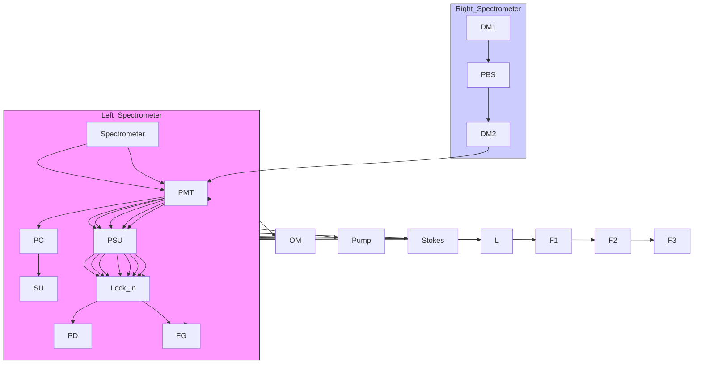

# Vibrational imaging of tablets by epi-detected stimulated Raman scattering microscopy†

Mikhail N. Slipchenko,a Hongtao Chen,b David R. Ely,c Yookyung Jung,d M. Teresa Carvajal\*c and Ji-Xin Cheng\*ab

Received 20th April 2010, Accepted 12th June 2010

DOI: 10.1039/c0an00252f

Proper chemical imaging tools are critical to the pharmaceutical industry due to growing regulatory demand for intermediate and end-product content uniformity testing. Herein we demonstrate stimulated Raman scattering (SRS) imaging of active pharmaceutical ingredient (API) and four excipients within tablets. Tablets from six manufactures were imaged with a speed of 53 s per frame of 512 - 512 pixels (i.e., 200 ms per pixel) and a lateral spatial resolution as high as 0.62 mm. The SRS chemical imaging was compared to confocal Raman mapping and coherent anti-Stokes Raman scattering (CARS) chemical imaging in terms of speed and chemical selectivity. The acquisition speed of SRS imaging is ca. 104 times faster than confocal Raman mapping and SRS technique showed superior to CARS chemical selectivity for studied samples. Our data demonstrate the potential of SRS microscopy in high-speed screening of pharmaceutical solid dosage forms.

## Introduction

Pharmaceutical dosage forms consist of a mixture of ingredients combined to produce desirable drug delivery characteristics. A tablet is made from a mixture of an active pharmaceutical ingredient (API) and excipients, usually powders, compacted into a solid form. The tablet formation process represents the last stage in the down-stream processing within the pharmaceutica industry and is crucial for production of formulations with identical characteristics. It is difficult to control the content uniformity in case of low drug concentration.1–3 An inhomogeneous distribution of active components and excipients within a tablet may alter the release profile that could be detrimental to a patient. Therefore, imaging techniques capable of mapping distribution of API and excipients are crucial for production o high-quality tablet formulations.

A panel of optical tools including near-infrared,4–8 mid infrared,9 terahertz,6 Raman,7,10,11 and laser-induced breakdown spectroscopy12,13 has been employed for imaging of tablet’s components. Near-infrared (NIR) and Raman chemical imaging already found a wide range of applications in pharmaceutica process monitoring and quality control.14 Both techniques are based on collection of spectral information at a number of spatial positions, either by shifting the sample and obtaining full spectrum at every position, or by obtaining whole images of the sample at a number of spectral windows. The latter approach produces chemical images of each component if all the components have distinct spectral features. In practice, the spectral features of the components are often heavily overlapped, espe cially in case of NIR, and multivariate analysis is used to deconvolute spectral information.15 In terms of imaging speed and chemical selectivity, NIR technique allows relatively fas chemical imaging (order of few minutes) of components. In addition, large field of view can be used for simultaneous imaging of multiple samples. Since most of NIR chemical imaging is performed in the diffuse reflectance regime, the spatial resolution is limited to tens of the microns due to penetration of NIR radiation into the sample.16 The low spatial resolution of NIR chemical imaging makes it difficult to map minor components (e.g. magnesium stearate) due to their small fraction in the probed volume.17 With less overlapped spectra of components and higher spatial resolution, Raman imaging has shown better sensitivity to minor components compared to NIR imaging.7 Confocal Raman mapping can achieve spatial resolution as high as 1 mm. The drawback of confocal Raman mapping is its long data acquisition time (order of tens of hours). Line illumination18,19 and global illumination Raman techniques19–21 offer one to two orders of magnitude higher acquisition speeds than confocal Raman.22,23 The global illumination, however, is less sensitive to minor components due to diffusion of the excitation laser light inside the sample.24,25

To overcome the low signal level problem encountered in Raman microscopy, coherent Raman scattering (CRS) micros copy techniques have been developed. In CRS microscopy, the use of two synchronized lasers ensures the focus of excitation energy on a single Raman band. Currently there are two versions of CRS microscopy based on coherent anti-Stokes Raman scattering (CARS) and stimulated Raman scattering (SRS). In CARS microscopy the coherent addition builds up a large signal from the focal volume.26 For pharmaceutical research, CARS microscopy has been used for mapping paclitaxel distribution and dissolution in various drug-eluting stent films27–29 and for monitoring the solid-state properties of tablets upon drug dissolution.30 Due to the interference from the non-resonant background, most biomedical applications of CARS imaging are limited to strong and well separated Raman transitions, e.g. the C–H stretch vibration abundant in lipid bodies inside simple organisms31,32 and in myelin sheath.33 Various methods including polarization-sensitive detection,34 time-resolved detection,35 phase-sensitive heterodyne detection,36–39 and frequency modulation,40 have been developed for removing the non-resonant background in CARS but the added complexity hinders their biomedical applications. The second CRS imaging technique is based on SRS, represented by an intensity gain of the Stokes beam or an intensity loss of the pump beam. SRS removes the non-resonant background via heterodyne detection41 and has been shown to provide spectral information identical to spontaneous Raman.42–46 By making use of MHz frequency modu lation to reject the low-frequency laser noise, high-speed and high-sensitivity SRS imaging on the order of few tens of seconds per image of $5 1 2 \times 5 1 2$ pixels has been demonstrated.43,44 More recently, using a ps laser source, a compound Raman microscope that implements high-speed CARS/SRS imaging of a sample and confocal Raman spectral analysis at points of interest has been developed.45

The work presented herein demonstrates epi-detected SRS imaging of amlodipine besylate tablets provided by six manufacturers. Amlodipine besylate is a widely used drug for lowering the blood pressure, it blocks the calcium needed for muscle contraction in arterial muscles. Using a compound Raman microscope capable of CARS/SRS imaging and confocal Raman microspectroscopy, we mapped the spatial distribution of API and the excipients in tablets from six manufacturers. Further more we have compared the performance of SRS microscopy to that of confocal Raman mapping and CARS microscopy in terms of speed, spatial resolution and chemical selectivity.

## Experimental

## CARS and SRS imaging

The optical layout is depicted in Fig. 1. Two lasers (Tsunami, Spectra-Physics, CA) produced 80 MHz synchronized pulse trains with 5-ps pulse duration, which were used as pump (u ) and Stokes (u ) beams for coherent Raman microscopy. $\omega _ { \mathrm { p } }$ and $\omega _ { S }$ beams were collinearly combined and directed into an inverted confocal microscope (FV300/IX71, Olympus America Inc, PA). For SRS imaging, the pump beam intensity was modulated by a Pockels cell (360-80, Con-optics, CT) at 1.13 MHz frequency. The laser beams were focused onto the sample using 10- air objective (numerical aperture (N.A.) ¼ 0.40), 20- air objective (N.A. ¼ 0.75) or 60- water-immersion objective (N.A. ¼ 1.2). The back scattered signal was collected by the same objectives. A polarization beam splitter (CASIX, China) installed in a standard microscope cube was used to transmit the linearly polarized excitation beams and reflect the polarization-scrambled signal to the back port of the microscope, where the photons at the Stokes beam wavelength were selected by a bandpass filter (850/90 nm, Chroma) and detected by a large area photodiode (DET100A, Thorlabs, NJ). A lock-in amplifier (SR844, Stanford Research Systems, CA) was used to detect the stimulated Raman gain signal with a time constant of 100 ms. The output channel of the lock-in amplifier was positively biased to avoid the feeding of a negative signal into an analog to digital converter which had a range from 0 to 5 V. SRS images of 512 - 512 pixels were acquired with 200 ms/pixel dwell time, resulting in a total of 53 s per frame.

flowchart

Fig. 1 Optical layout and block-diagram for a compound Raman microscope. OM is an optical modulator, SU is a scanning unit, L is an achromatic lens of 100mm focal length. DM1 and DM2 are exchangeable dichroic mirrors for Raman microscpectroscopy and CARS microscopy, respectively. A cube polarization beam splitter (PBS) is used to reflect the back-scattered photons to a photodiode (PD) for SRS imaging. PMT is a photomultiplier tube for backward (epi) CARS imaging. F1, F2 and F3 are filters for Raman microspectroscopy, SRS imaging and CARS imaging, respectively. The two beams are focused into the sample using air and water-immersion objectives. The back-scattered signal is collected by the same objectives. The dashed inserts show the envelopes of laser beam intensities for SRS detection before and after sample. The insert shows the block diagram of compound Raman microscope. PC: personal computer. FG: function generator. Lock-in: lock-in amplifier.

The CARS imaging was performed on the same setup. A short-pass dichroic mirror (670DCXR, Chroma, VT) was used to reflect the CARS signal to a photomultiplier tube detector (PMT, H7422-40, Hamamatsu, Japan) at the back port of the microscope. The CARS imaging speed was 3 s per frame of 512 - 512 pixels (10 ms/pixel dwell time).

## Raman microspectroscopy

Confocal Raman microspectroscopy was realized by mounting a spectrometer (Shamrock SR-303i-A, Andor Technology, Belfast, UK) to the side port of the microscope as reported previously.45 A long-pass dichroic mirror (720DCSP, Chroma, VT) was used to reflect the Raman signal to the spectrometer. To achieve 3D spatial resolution the spectrometer slit assembly was replaced with a pinhole of 100-mm diameter. The pump laser was tuned to 707 nm for Raman excitation. A bandpass filter (825/ 150, Chroma) was placed in front of the spectrometer to block the laser line. The spectrometer is equipped with 300 g/mm grating, which allows Raman shift coverage from 800 to $3 1 0 0 ~ \mathrm { c m } ^ { - 1 }$ . The spectral resolution of 11 cm1 is determined by measuring the FWHM of the laser line. The spectrum is detected by a deep-depleted CCD (DU920N-BR-DD, Andor Technology).

## Raman microscopy

A Raman microscope (WiTec Alpha300RA at the Purdue Laboratory for Chemical Nanotechnology) was used for Raman imaging. The Raman microscope is equipped with a $2 0 \times$ air objective (N.A. ¼ 0.4). A 785 nm laser with 20 mW power at the sample is used for excitation. A fiber with 50 mm core diameter, which acted as a confocal pinhole, was used for signal collection.

## Materials

Amlodipine besylate (AB) tablets from Pfizer (Norvasc), Apotex, Greenstone, Ethex, Teva Pharmaceutical, and Upsher-Smith Laboratories (see Fig. S1) were studied. The tablets contain 5 milligrams of API. Excipients in all samples except from Apotex are composed of microcrystalline cellulose (MCC), dibasic calcium phosphate anhydrous (DCPA), sodium starch glycolate (SSG) and magnesium stearate (MS). The tablet from Apotex contains microcrystalline cellulose, lactose mono hydrate, magnesium stearate, and corn starch. The tablets were directly placed on coverslip for epi-detected SRS, CARS, and confocal Raman imaging.

## Results and discussion

## SRS imaging of API and excipients

We performed SRS imaging of API and excipients of the tablet from Pfizer. The Raman spectra of pure components are shown in Fig. 2A. The C–C stretching band of $\mathbf { A B ^ { 4 7 } }$ at 1650 $\mathrm { c m } ^ { - 1 }$ and the P–O stretching band of $\mathrm { D C P A ^ { 4 8 } }$ at 985 $\mathrm { c m } ^ { - 1 }$ can be used directly for SRS imaging since they do not overlap with bands of other excipients (See Fig. 2 B2 and B3). The C–H stretching region around 2900 $\mathrm { c m } ^ { - 1 }$ has overlapping bands from MCC, SSG and MS. In order to obtain SRS images of these three components we imaged the tablet at 2850 cm1 and at 2900 cm1 (See Fig. 2 B1 and B4). Based on the known Raman intensities of excipients at these Raman shifts the image obtained at 2850 cm1 has 1.4 times higher signal of MS, 2.3 times lower signal of MCC and 5.5 times lower signal of SSG compared to the image obtained at $2 9 0 0 ~ \mathrm { c m } ^ { - 1 } .$ . To obtain separate images of SSG and MS we divided pixel intensity of SRS image at 2900 cm1 by 2.3 and subtracted it from the SRS image at 2850 cm1 .The resultant image has zero intensity at position of MCC, negative intensity at positions of SSG and positive intensity at position of MS. The negative and positive signals were used to obtain distribution of SSG and MS, respectively (see Fig. 2 B5 and B6). The SRS imaging of SSG can be also done at 840 cm1 since its Raman spectrum has no overlap from other components at that Raman shift. The overlaid images of all components give image shown in Fig. 2C. The few dark spots in Fig. 2C are most probable due to the roughness on the surface of the tablet which is estimated from the AFM scans to be on the order of 5 mm (see Fig. S2) and is similar to the estimated depth of field (full width at half maximum) of 7 mm (see Figure S3).

To confirm that the observed signals are from the drug molecules and excipients, confocal Raman microspectroscopy was performed at the points of interest (see Fig. S4). Raman spectra obtained at positions which correspond to particles of MCC, DCPA, AB, SSG and MS are similar to those of pure components in Fig. 2A.

The spatial resolution of SRS images shown in Fig. 2 is limited by the N.A. of objective. Using a 60- water-immersion objective (N.A. ¼ 1.2), small features with a lateral resolution of 0.62 mm (FWHM) could be resolved (see Fig. S5).

We have also performed depth scan with the 60- water immersion objective $( \mathrm { N } . \mathrm { A } . = 1 . 2 ) $ and found a very small pene tration into the tablets, i.e., the SRS signals arose from a surface layer of ca. 10 mm. This small penetration depth indicates that multiple particles in pharmaceutical solid dosage forms effec: tively scatter photons. Thus, the photons diffuse into a small volume close to the excitation point and scatter backward. These backscattered photons are effectively collected in the epi direction by the same high numerical aperture objective, producing a strong epi-SRS signal.

line chart

| Raman shift (cm⁻¹) | Series 1 | Series 2 | Series 3 | Series 4 |
| ------------------ | -------- | -------- | -------- | -------- |
| 1000               | High     | Medium   | Low      | Very Low |
| 1500               | Medium   | Low      | Medium   | Very Low |
| 2800               | Medium   | Low      | Medium   | Very Low |
| 3000               | Medium   | Low      | Medium   | Very Low |

natural_image

Fluorescent microscopy image showing cellular structures with blue, green, red, and yellow staining (no text or symbols)

Fig. 2 SRS images of API and excipients within a tablet (Pfizer). (A) Raman spectra of powders of MCC (green), DCPA (blue), AB (red), SSG (dark yellow) and MS (magenta), from top to bottom respectively. (B1–B4) SRS images obtained at 2900 cm1 , 1650 cm1 , 985 cm1 , and 2850 cm1 . The dashed lines in (A) indicate corresponding Raman shifts at which SRS images were taken. The images B5 and B6 were obtained from B1 and B4 by deconvolution based on the known ratios of Raman intensities at 2850 $\mathrm { c m ^ { - 1 } }$ and at 2900 $\mathrm { c m } ^ { - 1 }$ for MCC, DCPA, and MS. (C) Overlaid images B1, B2, B3, B5 and B6 showing distribution of MCC (green), DCPA (blue), AB (red), SSG (yellow/orange) and MS (magenta). Images were acquired with the 20- (N.A. ¼ 0.75) objective. The power of the pump and Stokes beams at the sample was 20 mW and 15 mW, respectively. Scale bars are 100 mm.

## Large area SRS imaging

Because particle size in solid dosage forms is often larger than 10 mm it is possible to use lower numerical aperture objectives for large area imaging. The SRS depth of fields of $1 0 \times \left( \mathrm { N . A . } = 0 . 4 0 \right)$ objective was measured to be 24 mm for glass/oil interface (see Fig. S3) which is adequate for imaging large particles found in pharmaceutical dosage forms. Fig. 3 shows the large area chemical imaging of tablets from 6 manufactures. The distribu tions of drug particles in tablets from different manufactures do not show large variability (see Figs. S6 and S7). On the other hand the amount and distribution of excipients are unique for each company. The image of tablet from Apotex clearly demonstrates its different composition. Here the absent of dibasic calcium phosphate results in absent of blue color and considerable amount of lactose monohydrate, shows up as a yellow color. Even tablets made from the same chemical components demonstrate different distribution and amount of main excipients. For example, tablet from Pfizer consists of small well mixed particles of cellulose and dibasic, with both components present in the same amount. The tablet from Greenstone has more cellulose and less dibasic particles of about same size as in Pfizer formulation. The tablet from Ethex has larger particles of main excipients compare to Pfizer tablet, and cellulose and dibasic particles are poorly mixed in tablet from Upsher-Smith. The micrometer size particles of magnesium stearate which play the role of the lubricant are present in formulations from al manufactures.

SRS chemical imaging provides high speed and high quality data which can be used for statistical analysis of particle sizes and distribution patents in solid dosage forms. As an example, we analyzed the distribution of API in six manufactures using correlation analysis (see Figs. S6 and S7).

## Confocal Raman mapping of API and excipients

In order to directly compare SRS performance with standard chemical mapping technique based on spontaneous Raman scattering, we mapped the tablet (Pfizer) using a commercial confocal Raman microscope equipped with a 785 nm excitation laser, a 20- objective $( \mathrm { N } . \mathrm { A } . = 0 . 4 )$ , and a confocal pinhole of 50 mm in diameter. The image area was $1 7 5 ~ { \mu \mathrm { m } } \times 1 7 5$ mm with a pixel size of 1.16 mm. At each pixel, a Raman spectrum covering 1000 to $1 7 0 0 ~ \mathrm { c m } ^ { - 1 }$ was recorded with an acquisition time of 4 s (28 h total time). The acquisition speed could be increased up to 4 times based on the quality of the spectra. The three Raman bands at $1 0 9 5 \mathrm { c m } ^ { - 1 } , 1 0 6 0 \mathrm { c m } ^ { - 1 }$ and $1 6 5 0 \mathrm { c m } ^ { - 1 }$ were used to map the MCC, DCPA and AB, respectively. Due to lack of C–H spectral information it wasn’t possible to obtain distribution of sodium starch glycolate and magnesium stearate. Note that Raman spectra shown in Fig. 4C carry full information about fingerprint region and by applying multivariate analysis it is possible to obtain the distribution of minor components.

Fig. 4A shows the spectrally integrated intensity image. Strong fluorescent particles were observed and the fluorescence back ground removal was necessary to obtain Raman images of different components shown in Fig. 4 (A2–A4). The overlaid images of (A2), (A3) and (A4) are shown in Fig. 4B. The Raman image shows distribution of API and two major excipients with a similar pixel sizes and image quality compared to SRS image in Fig. 2C but covering 7 times smaller area of the tablet.

natural_image

Fluorescent microscopy image showing cellular structures with color-coded markers (no text or symbols)

natural_image

Fluorescent microscopy image showing Apotex-stained tissue with color-coded cellular structures (no text or symbols)

natural_image

Microscopic image of a greenish tissue sample with scattered colored particles and an inset showing magnified detail (no text or symbols)

natural_image

Fluorescent microscopy image showing cellular structures with labeled regions (no readable text or symbols)

natural_image

Fluorescent microscopy image showing cellular structures with TEVA label and inset highlighting a region (no readable text or symbols)

natural_image

Fluorescence microscopy image showing cellular structures with green, blue, and red staining (no text or symbols)

Fig. 3 Large area SRS imaging of tablets. The SRS images were obtained at same wavelengths as in Fig. 2 for each tablet and overlaid. Green, blue, red, yellow/orange, and magenta colors represent MCC, DCPA, AB, SSG and MS, respectively. In case of tablet from Apotex the yellow color correspond to lactose monohydrate and corn starch. Due to similar Raman intensity ratio between 2900 cm1 and $2 8 5 0 \mathrm { c m } ^ { - 1 }$ we were not able to distinguish lactose monohydrate and corn starch. Lactose has a distinct peak at $3 5 6 \mathrm { c m } ^ { - 1 }$ that could be used for SRS imaging. Inserts are four times magnified areas of the images indicated by dashed squares. Images were acquired with the 10- (N.A. ¼ 0.40) objective. The power of the pump and Stokes beams at the sample was 20 mW and 30 mW, respectively. Scale bar is 200 mm.

natural_image

Microscopic image showing fluorescently labeled cellular structures with scale bar (no text or symbols)

natural_image

Microscopic view of cellular or particulate structures with no visible text or symbols

natural_image

Microscopic view of cellular or tissue structure labeled A2 (no text or symbols present)

natural_image

Microscopic image showing cellular or particulate structures with bright spots against a dark background (no text or symbols)

natural_image

Fluorescent microscopy image showing cellular structures with red, green, and blue staining (no text or symbols)

line chart

| Raman shift (cm⁻¹) | Red Line Intensity | Blue Line Intensity | Green Line Intensity |
| ------------------ | ------------------ | ------------------- | -------------------- |
| 1000               | Low                | Medium              | High                 |
| 1200               | Medium             | Low                 | Medium               |
| 1400               | Low                | Medium              | Medium               |
| 1600               | High               | Low                 | Medium               |

Fig. 4 Spontaneous Raman imaging of a tablet (Pfizer). (A1) Total integrated CCD intensity image (integrated over the entire spectral range). (A2–A4) Raman images based on Raman intensities integrated over 30 cm1 spectral ranges centered at 1095 cm1 (green), 1060 cm1 (blue) and 1650 cm1 (red) which corresponds to Raman bands of MCC, DCPA and AB, respectively. (B) Overlaid A2, A3 and A4 images. (C) Representative Raman spectra from green, blue, and red areas of (B). The dashed lines indicate the spectral integrating areas for Raman imaging. Scale bars are 50 mm. Image size is 150 - 150 pixels. The total time spent to obtain the Raman image was 28 h.

The results shown in Fig. 2 and 4 allow us to compare the performance of SRS chemical imaging and confocal Raman mapping. The direct comparison is complicated by use of different objectives, laser sources, and a nature of spatial resolution for these techniques. Nevertheless, based on our data we can conclude that confocal Raman mapping requires order of 1 s per pixel whereas SRS images can be obtained with order of 100 msec per pixel. Therefore, the SRS speed is about 104 times faster. The significant improvement in speed is achieved by stimulated scattering versus spontaneous scattering43 and by spectral focusing on the single Raman band. The SRS speed can be increased in case of strong Raman scatters by using shorter integration time. The spatial resolution in confocal Raman mapping is largely determined by the confocal pinhole and in practice lateral resolution is limited to few microns. The higher resolution results in signal depletion due to corresponding decrease of confocal pinhole. The SRS, on the other hand, is a nonlinear process where the signal arises only from the focal volume. Considering the case of Gaussian pump and probe beams which are focused collinearly through a sample, it has been shown that the SRS signal is independent of focusing and linear in both pump and probe power.49The increase of the numerical aperture leads to the smaller focal volume and results in higher SRS signal from small particles. Thus, SRS chemica imaging can easily reach sub micron resolution without compromising the signal level (see Fig. S5).

## Comparison of SRS and CARS imaging

The tablet from Pfizer was also used to compare the performance of SRS and CARS in imaging amlodipine besylate. Note that in this work we utilized the simplest CARS detection method where all photons in the spectral window around CARS signal wave length is directly detected by PMT. Fig. 5A and B shows the SRS and CARS images taken at the Raman shift of $1 6 5 0 \mathrm { c m } ^ { - 1 }$ to map AB. Both techniques produce similar intensity distribution cor responding to API particles. The intensity profiles shown in

Fig. 5A and 5B indicate that the CARS image has a better signal to noise ratio than the SRS image. $\omega _ { \mathrm { p } } \mathrm { ~ - ~ } \omega _ { \mathrm { S } }$ was then tuned to $2 2 0 0 \mathrm { c m } ^ { - 1 }$ which is off-resonance for all components. In the SRS image (Fig. 5C) only several dots appeared and remained there even when pump and Stokes lasers were desynchronized. This signal is possibly caused by the photothermal effect due to dust particles on the surface of the cover slip or on the surface of the tablet. On the contrast, in the CARS image at $2 2 0 0 ~ \mathrm { c m } ^ { - 1 }$ (Fig. 5D), the same pattern as in Fig. 5B was observed. The intensity profiles in Fig. 5C and 5D further confirm the difference between CARS and SRS at the off-resonance Raman shift. To identify the origin of discrepancy between SRS and CARS images at off resonant Raman shift we performed spectral analysis of SRS and CARS signals. By point scan of the Stokes beam we measured the SRS spectral profile of $1 6 5 0 ~ \mathrm { c m } ^ { - 1 }$ line of amlodipine besylate and compared it to Raman spectrum (see Fig. 5E). As expected, the SRS spectrum exactly matches the Raman spectrum. We then acquired the spectra in the region covered by the CARS bandpass filters (Fig. 5F). With both $\omega _ { \mathrm { p } } -$ $\mathfrak { \omega _ { \mathrm { S } } } = 1 6 5 0 \mathrm { c m } ^ { - 1 }$ and $\omega _ { \mathrm { p } } - \omega _ { \mathrm { S } } = 2 2 0 0 \mathrm { c m } ^ { - 1 }$ , we found the narrow CARS peaks riding on the top of a strong two-photon autofluorescence from the API molecules. This broad autofluorescence was the main contribution to the signal detected by PMT. This conclusion was further confirmed by acquiring the CARS image (not shown here) with desynchronized in time pump and Stokes lasers, which showed the same intensity distribution as in Fig. 5B. In this work we used 65 nm band pass filter for CARS detection. The use of a narrower band pass filter and longer excitation wavelengths for pump and Stokes would allow discriminating the CARS signal from the autofluorescence background even using simple detection approach. However, even in the absence of the autofluorescence the CARS resonant signal is only two-fold stronger than the non-resonant signa (Fig. 5F). Note, that the use of more sophisticated CARS techniques as frequency modulation40 or phase-sensitive heterodyne detection36–39 can eliminate both the autofluorescence and the nonresonant background in a CARS images.

We note that single-photon or two-color two-photon fluores cence could be modulated at the same frequency as the SRS signal and received by the detector if spectrally overlapped with the probe beam. Nevertheless, fluorescence is not seen in the SRS images because fluorescence is an incoherent process which cannot be amplified by the local oscillator field.

text_image

A. SRS, 1650 cm⁻¹
2000

text_image

C. SRS, 2200 cm⁻¹
2000

line chart

| Raman shift (cm⁻¹) | Raman | SRS  |
| ------------------ | ----- | ---- |
| 1630               | 0.1   | 0.05 |
| 1640               | 0.3   | 0.2  |
| 1650               | 1.0   | 1.0  |
| 1660               | 0.5   | 0.2  |
| 1670               | 0.0   | 0.0  |

line chart

| µm | Value |
| --- | ----- |
| 50 | 1000.0 |

line chart

| µm  | Value |
| --- | ----- |
| 0   | 0     |
| 50  | ~50   |
| 100 | ~1000 |
| 150 | ~50   |
| 200 | ~1000 |

line chart

| Wavelength (nm) | ω_p - ω_S = 1650 cm⁻¹ | ω_p - ω_S = 2200 cm⁻¹ |
| --------------- | ---------------------- | ---------------------- |
| 620             | ~2300                  | ~1000                  |
| 630             | ~2000                  | ~800                   |
| 640             | ~1800                  | ~700                   |
| 650             | ~1500                  | ~600                   |

Fig. 5 Comparison of SRS and CARS imaging and spectral analysis of amlodipine besylate in a tablet (Pfizer). (A–B) SRS and CARS images of tablet at $1 6 5 0 \ \mathrm { c m } ^ { - 1 } . \ ( \mathrm { C } - \mathrm { D } )$ SRS and CARS images of the same area at $2 2 0 0 \mathrm { c m } ^ { - 1 }$ . Inserts show profiles of dashed lines in A–D. (E) The normalized spectral profiles of 1650 $\mathrm { c m ^ { - 1 } }$ line of amlodipine besylate. The SRS spectrum (red curve with squares) was measured by point scan of the Stokes beam frequency. Intensity at each wavelength was obtained from integration of the area of image containing large particles of amlodipine besylate. In order to compensate for the positive bias of the output channel of the lock-in amplifier, time-off images were subtracted from time-on images prior to analysis of intensities. The Raman spectrum of pure amlodipine besylate (black curve) was acquired from the powder using 6 mW of 707 nm excitation beam. For CARS and SRS imaging and SRS spectroscopy the power of the pump and Stokes beams at the sample was 10 mW and 30 mW, respectively. (F) Emission spectra of API in the region of CARS signal wavelength. The top curve (black) corresponds to the resonant excitation of API molecules $( \omega _ { \mathrm { p } } -$ $\omega _ { \mathrm { s } } = 1 6 5 0 \mathrm { c m } ^ { - 1 } )$ ) and the bottom curve (red) corresponds to the non-resonant excitation $( \omega _ { \mathrm { p } } - \omega _ { \mathrm { s } } = 2 2 0 0 \mathrm { c m } ^ { - 1 } )$ . The spectra were obtained from the point at the drug particle. Both pump and Stokes powers were 5 mW at the sample. Integration time was 1 s. The intensity units are counts of CCD (dark current is subtracted). $\mathbf { A } 6 0 \times ( \mathbf { N . A . } = 1 . 2 )$ water-immersion objective was used for data shown in $\mathrm { A { - } F . T o }$ obtain the on- and off-resonance images the pump and Stokes lasers were tuned to $1 2 1 8 0 \mathrm { c m } ^ { - 1 }$ and $1 3 8 4 0 \mathrm { c m } ^ { - 1 }$ (Raman shift $1 6 5 0 \mathrm { c m } ^ { - 1 } )$ and to $1 3 9 5 5 \mathrm { c m } ^ { - 1 }$ and $1 1 7 5 5 \mathrm { c m } ^ { - 1 }$ (Raman shift 2200 cm1 ), respectively.

Although the SRS signal is free from the non-resonant back ground, there are a number of optical processes including stim ulated absorption or emission50,51 the optical Kerr effect, and the thermal lensing effect,52 which could potentially produce the background. In practice, stimulated absorption or emission50,51 can be minimized by using longer excitation wavelengths. The optical Kerr effect or thermal lensing effect52 can be minimized by using a large N.A. objective for signal collection.43,45 In addition the thermal lensing effect can be reduced by high frequency modulation (>1 MHz).31,32 Another drawback of SRS technique is that each image only contains information from a single Raman shift. The lack of spectral information in SRS microscopy can be partially compensated by taking Raman spectra at points of interest in a SRS image. Such compound Raman analysis has allowed high-speed vibrational imaging and high-speed spectroscopic analysis of a sample.45

## Conclusions

We have shown high-speed vibrational mapping of API and excipients within tablets based on epi-detected stimulated Raman scattering (SRS) generated with two synchronized ps lasers. SRS offers an imaging speed that is ca. $1 0 ^ { 4 }$ times higher than confocal Raman under the settings described herein. Since SRS is free of non-resonant background and fluorescence contribution, it allows selective imaging of drug molecules and the excipients based on the respective Raman bands. Additionally, confocal Raman microspectroscopy using the ps laser source on the same platform enabled spectroscopic analysis of features in a SRS image. Taken together, our work shows the prospective appli cations of SRS microscopy to high-speed and high-resolution evaluation of the particle size, structural integrity, and homo geneity of active pharmaceutical ingredient and excipients in pharmaceutical solid dosage forms. Specifically, the submicron resolution and high imaging speed makes SRS microscopy a potential technique for monitoring low-dose blend uniformity as well as dynamical studies of material degradation and drug release.

## Acknowledgements

This work is supported by R01 grant EB007243 for J. X. Cheng and National Science Foundation 000364-EEC, Dane O.Kildsig Center for Pharmaceutical Processing Research and to the FACE (French American Cultural Exchange) on behalf of PUF (Partner University Fund) program for M. T. Carvajal. The authors cordially thank Dr Alexander Ribbe for assistance in Raman imaging and Ms. Elizabeth W. Ely for assistance with grammar and phraseology. Thanks to Steve Byrn and Ziyang Su for donating some of the tablets.

## References

1 Herbert A. Lieberman, Leon Lachman and J. B. Schwartz, Pharmaceutical dosage forms–tablets, 2 edn, Informa Health Care, 1990.  
2 R. L. Williams, W. P. Adams, G. Poochikian and W. W. Hauck, Pharm. Res., 2002, 19, 359–366.  
3 W. Bonawi-Tan and J. A. S. Williams, J. Manuf. Syst., 2004, 23, 299– 308.  
4 G. Reich, Adv. Drug Delivery Rev., 2005, 57, 1109–1143.  
5 M.A.T., M.A.K. and Rakhi B. Shah, J. Pharm. Sci., 2007, 96, 1356– 1365.  
6 L. Maurer and H. Leuenberger, Int. J. Pharm., 2009, 370, 8–16.  
7 S. Sa- -sic, Appl. Spectrosc., 2007, 61, 239–250.  
8 R. D. Ely, PhD thesis, Purdue University, 2010.  
9 C. Coutts-Lendon and J. L. Koenig, Appl. Spectrosc., 2005, 59, 976– 985.  
10 J. Breitenbach, W. Schrof and J. Neumann, Pharm. Res., 1999, 16, 1109–1113.  
11 L. Sage, Anal. Chem., 2009, 81, 3222–3226.  
12 L. St-Onge, E. Kwong, M. Sabsabi and E. B. Vadas, Spectrochim. Acta, Part B, 2002, 57, 1131–1140.  
13 R. L. Green, M. D. Mowery, J. A. Good, J. P. Higgins, S. M. Arrivo, K. McColough, A. Mateos and R. A. Reed, Appl. Spectrosc., 2005, 59, 340–347.  
14 A. A. Gowen, C. P. O’Donnell, P. J. Cullen and S. E. J. Bell, Eur. J. Pharm. Biopharm., 2008, 69, 10–22.  
15 L. Zhang, M. J. Henson and S. S. Sekulic, Anal. Chim. Acta, 2005, 545, 262–278.  
16 S. J. Hudak, K. Haber, G. Sando, L. H. Kidder and E. N. Lewis, NIR news, 2007, 18, 6–8.  
17 J. M. Amigo and C. Ravn, Eur. J. Pharm. Sci., 2009, 37, 76–82.  
18 M. Bowden, D. J. Gardiner, G. Rice and D. L. Gerrard, J. Raman Spectrosc., 1990, 21, 37–41.  
19 M. Delhaye and P. Dhamelincourt, J. Raman Spectrosc., 1975, 3, 33– 43.  
20 G. J. Puppels, M. Grond and J. Greve, Appl. Spectrosc., 1993, 47, 1256–1267.  
21 W. H. Doub, W. P. Adams, J. A. Spencer, L. F. Buhse, M. P. Nelson and P. J. Treado, Pharm. Res., 2007, 24, 934–945.  
22 D. Zhang, J. D. Hanna, Y. Jiang and D. Ben-Amotz, Appl. Spectrosc., 2001, 55, 61–65.  
23 S. Schlucker, M. D. Schaeberle, S. W. Huffman and I. W. Levin, Anal. Chem., 2003, 75, 4312–4318.  
24 S. Sasic and D. A. Clark, Appl. Spectrosc., 2006, 60, 494–502.  
25 C. Don and S. Slobodan, Cytometry, Part A, 2006, 69A, 815–824.  
26 J. X. Cheng, A. Volkmer and X. S. Xie, J. Opt. Soc. Am. B, 2002, 19, 1363–1375.  
27 E. Kang, H. Wang, I. K. Kwon, J. Robinson, K. Park and J. X. Cheng, Anal. Chem., 2006, 78, 8036–8043.  
28 E. Kang, J. Robinson, K. Park and J. X. Cheng, J. Controlled Release, 2007, 122, 261–268.  
29 Eunah Kang, H. Wang, I. K. Kwon, Y.-H. Song, K. Kamath, K. M. Miller, J. Barry, J. X. Cheng and K. Park, J. Biomed. Mater. Res Part. A. 2008. 87A. 913920  
30 M. Windbergs, M. Jurna, H. L. Offerhaus, J. L. Herek, P. Kleinebudde and C. J. Strachan, Anal. Chem., 2009, 81, 2085–2091.  
31 S. Hiki, K. Mawatari, A. Hibara, M. Tokeshi and T. Kitamori, Anal Chem., 2006, , 2859–2863.  
32 S. Berciaud, L. Cognet, G. A. Blab and B. Lounis, Phys. Rev. Lett., 2004, 93, 257402.  
33 H. Wang, Y. Fu, P. Zickmund, R. Shi and J. X. Cheng, Biophys. J., 2005, 89, 581–591.  
34 J. X. Cheng, L. D. Book and X. S. Xie, Opt. Lett., 2001, 26, 1341–1343.  
35 A. Volkmer, L. D. Book and X. S. Xie, Appl. Phys. Lett., 2002, 80, 1505–1507.  
36 D. L. Marks and S. A. Boppart, Phys. Rev. Lett., 2004, 92, 123905.  
37 E. O. Potma, C. L. Evans and X. S. Xie, Opt. Lett., 2006, 31, 241–243.  
38 S. H. Lim, A. G. Caster, O. Nicolet and S. R. Leone, J. Phys. Chem. B. 2006. 110. 51965204.  
39 M. Jurna, J. P. Korterik, C. Otto, J. L. Herek and H. L. Offerhaus, Opt. Express, 2008, 16, 15863–15869.  
40 F. Ganikhanov, C. L. Evans, B. G. Saar and X. S. Xie, Opt. Lett., 2006, 31, 1872–1874.  
41 M. D. Levenson and S. S. Kano, Introduction to Nonlinear Laser Spectroscopy, Academic Press, San Diego, 1988.  
42 E. Ploetz, S. Laimgruber, S. Berner, W. Zinth and P. Gilch, Appl. Phys. B: Lasers Opt., 2007, 87, 389–393.  
43 C. W. Freudiger, W. Min, B. G. Saar, S. Lu, G. R. Holtom, C. He, J. C. Tsai, J. X. Kang and X. S. Xie, Science, 2008, 322, 1857–1861.  
44 P. Nandakumar, A. Kovalev and A. Volkmer, New J. Phys., 2009, 11, 033026.  
45 M. N. Slipchenko, T. T. Le, H. Chen and J. X. Cheng, J. Phys. Chem. B. 2009. 113. 76817686.  
46 Y. Ozeki, F. Dake, S. i. Kajiyama, K. Fukui and K. Itoh, Opt. Express, 2009, 17, 3651–3658.  
47 L. Szab, V. Chis, A. P^irnau, N. Leopold, O. Cozar and S. Orosz, J. Mol. Struct., 2009, 924–926, 385–392.  
48 J. W. Xu, I. S. Butler and D. F. R. Gilson, Spectrochim. Acta, Part A, 1999, , 2801–2809.  
49 A. Owyoung, IEEE J. Quantum Electron., 1978, 14, 192–203.  
50 T. Ye, D. Fu and W. S. Warren, Photochem. Photobiol., 2009, 85, 631– 645.  
51 W. Min, S. Lu, S. Chong, R. Roy, G. R. Holtom and X. S. Xie, Nature, 2009, 461, 1105–1109.  
52 K. Uchiyama, A. Hibara, H. Kimura, T. Sawada and T. Kitamori, Jpn. J. Appl. Phys., 2000, 39, 5316–5322.