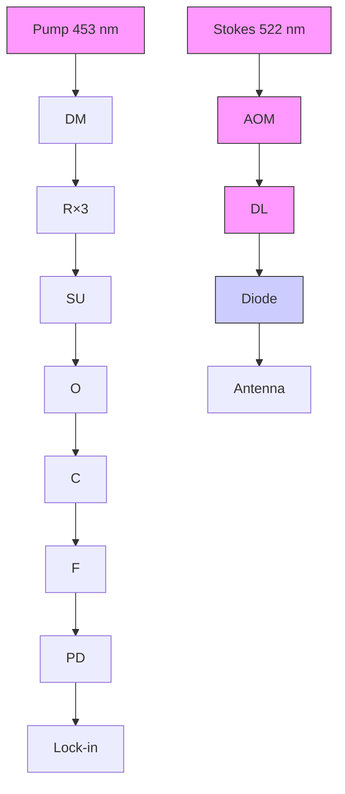

# Vibrational Nanoscopy of Intracellular Compartments via Visible Fourier Reweighted Stimulated Raman Scattering

Haonan Lin 1,2, Yuying Tan1 and Ji-Xin Cheng 1,

1Department of Biomedical Engineering, 2Department of Electrical & Computer Engineering, Boston University, Boston, MA 02215, USA Haonan Lin: hnlin@bu.edu; Yuying Tan: tyuying@bu.edu; Ji-Xin Cheng: jxcheng@bu.edu

Abstract: We present visible Fourier-reweighted stimulated Raman scattering (VFR-SRS), a vibrational imaging scheme that achieves sub-100 nm resolution by computationally amplifying high spatial frequency components, enabling label-free nanoscopic imaging of intracellular compartments.

## 1. Introduction

Stimulated Raman scattering (SRS) microscopy [1] can perform label-free imaging of biomolecules using their intrinsic chemical vibration bonds in real-time. Conventional SRS utilizes two tightly focused NIR ultrafast lasers (pump at 800 nm and Stokes at 1040 nm) and generates images in a laser scanning configuration, which yields a lateral resolution of \~ 300 nm. Such resolution is insufficient to study a vast variety of intracellular structures, including cytoskeletal components, mitochondrial substructures, nuclear pores, etc. Fluorescence nanoscopy, based on structured illumination, depletion, or localization, has enabled sub-100 nm nanoscopic imaging of organelles, however, these techniques rely on attaching specific dye molecules that are not always compatible with small metabolites. Plus, the highly overlapped fluorescence emission spectrum hinders simultaneous imaging of multiple organelles in the same system.

(a)  

flowchart

(b)  
  
(c)

line chart

| Raman Shifts (cm⁻¹) | Int. (n.u.) |
| ------------------- | ----------- |
| 2850                | 0           |
| 2900                | 22          |
| 2950                | 0           |
| 3000                | 3           |

(d)  

natural_image

Two grayscale microscopic images labeled Frame 1 and Frame 10, each with a 5 μm scale bar (no text or symbols beyond labels)

(e)  

(f)  
  
(g)

(h)  

line chart

| Pixels | FR SRS | SRS   |
| ------ | ------ | ----- |
| 0      | 0.0    | 0.0   |
| 10     | 0.05   | 0.02  |
| 20     | 0.1    | 0.08  |
| 30     | 1.0    | 1.0   |
| 40     | 0.1    | 0.08  |
| 50     | 0.05   | 0.02  |
| 60     | 0.0    | 0.0   |

Figure 1. Concept of VFR-SRS. (a) Setup. (b) Diagram of spectral focusing (c) Spectral resolution calibration using DMSO. (d) Continuous SRS scanning of SKOV3 human cancer cells. (e) OTF for pump, SRS and FR-SRS. (f-g) Pump-probe transient absorption image of 30 nm AuNP before and after Fourier reweighting. (h) Line profile comparison of a single AuNP.

Here, we propose visible Fourier-reweighted stimulated Raman scattering (VFR-SRS), a label-free vibrational imaging scheme with sub-100 nm lateral resolution. We switch the laser source from NIR to visible (pump at 453 nm and Stokes at 522 nm), providing a significant improvement in resolution (130 nm) compared to the NIR counterparts. Visible SRS for cell imaging has been challenging due to the nonlinear photodamage induced by visible femtosecond pulses. We chirp the femtosecond pulses to 4 picoseconds and address nonlinear photodamage on cells, which permits high-fidelity cellular imaging in a bio-safe condition. To further push the spatial resolution below 100 nm, we leverage the properties of the optical transfer function for SRS, which permits sub-100 nm spatial frequency components but suffers from strong attenuation and noise distortion. These high-resolution structures are computationally amplified by a two-step approach, which first suppresses the high spatial frequency noise with a self-supervised Noise2Void [2] denoiser, and then applies a reweighting function in the Fourier domain to amplify high-frequency signals permitted by the pass band of the OTF. Consequently, our system can enable nanoscopic label-free chemical imaging on biological specimens, providing new tools for molecular biology to visualize metabolites and intracellular nanostructures in a label-free and high-content manner.

## 2. Results and Discussions

Setup for the visible SRS system is depicted in Fig. 1a. Two synchronized femtosecond pulses (906 nm and 1045 nm) generated by the same laser source (Insight X3, Spectra-Physics, USA) are first frequency-doubled by nonlinear crystals to produce visible pump (453 nm) and Stokes (522 nm) beams. The visible beams are then chirped by high dispersion glass rods (SF57, Schott, Switzerland) to temporally separate different wavelength components by means of spectral focusing (Fig. 1b). By tuning the temporal delay between the two pulses, the beating frequency is continuously changed to generate a Raman spectrum. Using 45 cm rods for pump and 60 cm rods for Stokes, the pulse duration has been elongated to 4 picoseconds. The extensive chirping of the pulses effectively separates Raman modes in the frequency domain, leading to a superior sub-10 cm-1 spectral resolution in the CH region (Fig. 1c). The significantly reduced peak pulse energy effectively addresses nonlinear photodamage on cells. As shown in Fig. 1d, we apply 20 mW for pump and 20 mW for Stokes on mammalian cancer cells SKOV3, and do not observe morphological change during 10 consecutive scans.

natural_image

Microscopic image of a circular biological structure with orange fluorescence, scale bar 5 μm, labeled (a) 2930 cm⁻¹

natural_image

Microscopic image of a red-stained biological cell with fluorescent labeling, scale bar 5 μm (no text or symbols)

line chart

| Raman shift (cm⁻¹) | BSA Int (a.u.) | TAG Int (a.u.) |
| ------------------ | -------------- | -------------- |
| 2850               | 1.0            | 0.8            |
| 2900               | 1.4            | 1.0            |
| 2950               | 2.0            | 1.0            |
| 3000               | 1.0            | 0.2            |

Figure 2. VFR-SRS of biological specimens. (a-b) VFR-SRS imaging of SKOV3 cells at 2930 $\mathrm { c m ^ { - 1 } }$ and $2 8 5 0 ~ \mathrm { c m ^ { - 1 } }$ . (c) Spectra of protein (BSA) and lipid (TAG) standards.

As a nonlinear optical process involving two tightly focused laser fields, the point spread function (PSF) of SRS can be described as the multiplication of pump and Stokes PSF. Ignoring the frequency differences between pump and Stokes and assuming a Gaussian PSF, the PSF can be written as a squared Gaussian. Based on convolution theory, the optical transfer function (OTF) of such PSF has a spatial frequency cutoff that is two times higher than a single photon pump OTF, yet due to higher attenuation at high spatial frequencies, the raw SRS images only have \~ 1.4 times resolution enhancement. To enhance the spatial resolution of SRS and achieve the full resolving potential granted by the OTF, we first apply a self-supervised Noise2Void deep learning denoiser to suppress high-frequency noise, and then apply a reweighting function in the frequency domain to amplify the high-resolution features. An example of the OTF for pump, SRS and Fourier reweighted SRS is shown in Fig. 1e. To validate the spatial resolution enhancement, we used 30 nm AuNP (Fig. 1f-h) and measured the pump-probe transient absorption which shares the same OTF as SRS. The results show that the resolution is enhanced from 132 nm to 93 nm, demonstrating the nanoscopic resolving capability of the system.

We further tested the biocompatibility of the system by imaging SKOV3 mammalian cancer cells on our setup. As shown in Fig. 2a-b, we performed 2-color VFR-SRS imaging at 2930 cm-1 and $2 8 5 0 ~ \mathrm { c m ^ { - 1 } }$ , which represent CH3 and CH3 vibrational modes, respectively. All major metabolites, including protein and lipids, contribute on 2930 $\mathrm { c m ^ { - 1 } }$ while lipids have a major contribution at $2 8 5 0 ~ \mathrm { c m ^ { - 1 } }$ . Reference spectra for protein and lipids are shown in Fig. 2c using standard chemicals Bovine serum albumin (BSA) and triglycerides (TAG). Lipid droplets, nuclear membranes and cytoskeletal compartments are clearly depicted in the images, which demonstrate the rich chemical contrast and resolving capability of the system.

## 3. References

[1] J. X. Cheng and X. S. Xie, Science., vol. 350, no. 6264, 2015.  
[2] A. Krull, T. O. Buchholz, and F. Jug, Proc. IEEE Comput. Soc. Conf. Comput. Vis. Pattern Recognit., vol. 2019-June, pp. 2124–2132, 2019.