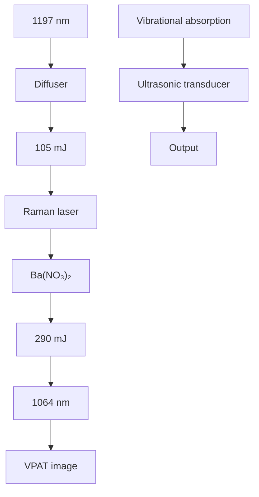
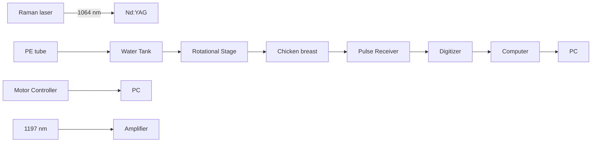

# Vibrational Photoacoustic Tomography: Chemical Imaging beyond the Ballistic Regime

Justin Rajesh Rajian,# Rui Li,# Pu Wang, and Ji-Xin Cheng\*

Weldon School of Biomedical Engineering & Department of Chemistry, Purdue University, West Lafayette, Indiana 47907, United States

ABSTRACT: Proof-of-concept of vibrational photoacoustic tomography is demonstrated with a home-built Raman laser generating greater than 100 mJ of energy per pulse at a 1197 nm wavelength. We employed this system for excitation of the second overtone transition of C−H bonds. The vibrational photoacoustic signal from a C−H-rich polyethylene tube phantom placed under 3 cm thick chicken breast tissue was obtained with a signal-to-noise ratio of 2.5. Further, we recorded a photoacoustic image of a polyethylene ring placed under 5 mm chicken tissue with excellent contrast. This development opens new opportunities of performing label-free vibrational imaging in the deep tissue regime.

flowchart

SECTION: Spectroscopy, Photochemistry, and Excited States

s a molecular and functional imaging modality, photoacoustic tomography (PAT) has proved the imaging capability of several centimeters deep into biological tissues.1 In PAT, pulsed light is used to induce optical absorption inside of a tissue by diffused photons. Part of the absorbed energy is converted into heat, which raises the temperature of the absorbed region on the order of mK. This sudden temperature change then creates pressure transients and subsequent generation of photoacoustic (PA) waves detectable by an ultrasonic transducer in real time. From the measured signal, the distribution of optical absorbers is reconstructed. Until now, the contrast mechanism in PAT was mainly based on electronic absorption in the near-infrared region extending up to 950 nm. PAT imaging of hemoglobin5 and exogenous contrast agents such as dyes and nanoparticles8−11 has been reported. Inherent molecular vibration offers a contrast mechanism for chemical imaging in a label-free manner. In vibrational microscopy based on either infrared absorption or Raman scattering, the imaging depth is limited to the ballistic photon mean-free path, which is a few hundred micrometers in a biological sample. Owing to much weaker acoustic scattering in tissues as compared to optical scattering, PA detection of harmonic molecular vibration has enabled significant improvement in imaging depth.12−14 In this method, optical absorption is induced by overtone transitions at near-infrared wavelengths, such as the second overtone transition of the C−H bond occurring at around 1200 nm.15 Upon excitation, this vibrational energy quickly turns into heat, which leads to bond-selective PA signals. Overtone transitions have been used for intravascular PA imaging of lipid accumulation.13,16 In these studies,12−16 f ocused high-frequency ultrasonic transducers were used. The transducer was moved along a line or rotated about its own axis, and the PA signals were required from the focused region. The image was then built by converting time into distance according to the speed of sound and signal amplitude into a color map. The image depth with a focused transducer was limited to its focused region, generally on the millimeter scale. Further, the imaging configuration, which is similar to PA microscopy, was limited to thin samples. Therefore, less energy per pulse illumination was required, which was possible through the use of existing laser sources.

Despite these advances, vibrational photoacoustic tomography, abbreviated as VPAT hereafter, is not yet demonstrated. Tomography uses an unfocused transducer along with the unfocused light and is capable of obtaining centimeter scale depth information. A technical challenge for VPAT is the unavailability of a laser source having sufficient energy for diffused photon excitation of the entire object. The optical parametric oscillator currently used for PAT has been designed for excitation of hemoglobin and other contrast agents in wavelengths below 950 nm. Specifically, using a Nd:YAG laser as the pump source, the wavelengths above 1064 nm are provided by the idler beam of the optical parametric oscillator at very low conversion efficiency.

In this Letter, we report first VPAT system enabled by a home-built high-energy Raman laser. The Raman laser works based on the principle of stimulated Raman scattering, which shifts the input laser frequency by the vibrational frequency of the crystal. A Ba(NO ) crystal-based Raman laser with a maximum output energy of 21.4 mJ per pulse has been used for

Received: August 1, 2013

Accepted: September 11, 2013

Published: September 11. 2013

microscopic PA imaging of lipids.17 By using a larger $\mathrm { B a } ( \mathrm { N O } _ { 3 } ) _ { 2 }$ crystal and no prior focusing of the input laser, our new Raman laser is able to produce stable laser pulses at 1197 nm with a maximum pulse energy exceeding 100 mJ. Because this wavelength falls within the second overtone vibrational band of the C−H bond, C−H-rich species can be imaged in tomography mode.

Figure 1 shows the overtone vibrational absorption and PA wave generation processes. Vibrational absorption takes place

text_image

Pulsed laser
Diffuser
Optical
absorber
Sample
ΔT ~ 10⁻³ K
Acoustic waves
Transducer
Overtone absorption
v=3
v=2
v=1
v=0
Ω₂
Ω₁
Output waveform

Figure 1. Signal generation and detection in VPAT. $\nu = 0 , 1 , 2 ,$ and 3 denote ground and excited vibrational states.

when the incident photon frequency matches a transition frequency between the vibrational states (ν). The (n − 1)th overtone absorption takes place by transition from $\nu = 0$ to n, with $n = 2 , 3 , \ldots$ . Unlike microscopy, in VPAT, the entire object is irradiated by the laser. Both the scattered and nonscattered photons contribute to the overtone absorption and subsequent generation of PA waves. Because the imaging depth is primarily determined by how deep the light can reach in a given sample, a pulse energy of tens of mJ or more is required for an object of a few cubic cm in size. To evaluate the effect of scattering and absorption on the VPAT imaging depth, we estimated the photon energy density in deep tissue at 1200 nm by Monte Carlo simulations18 and compared it to that at 800 nm, where PAT imaging of blood is often performed. For the simulation, we considered a tissue with two layers, dermis of thickness 0.4 cm and subcutaneous tissue of varying thickness from 0 to 2.6 cm. Tissue optical parameters such as absorption and scattering coefficients were obtained from ref $^ { 1 9 , }$ and a refractive index of 1.4 was assumed. The simulated energy density versus the depth is given in Figure 2. It is seen that at 3.0 cm depth, the light fluence is reduced by ∼8 orders of magnitude, suggesting the need for a high-energy laser to perform VPAT. Moreover, it is noted that the fluence for 1200 nm at a 2.0 cm depth is 5 times higher than that for 800 nm. Such enhancement is due to lower scattering coefficients at longer wavelengths. Because the PA signal is proportional to the light fluence, this result indicates that 1200 nm excitation is beneficial for deep tissue vibrational imaging.

The schematic of our Raman laser is given in Figure 3a. A 1064 nm Nd:YAG laser beam with a 5 ns pulse width and 10 Hz repetition rate, after deflection by mirrors $\mathbf { M } _ { 1 }$ and $\mathbf { M } _ { 2 } ,$ passes through a polarizing beam splitter (PBS) to purify the polarization. Then, it passes through a half wave plate and a second PBS. This combination is used to adjust the input pulse energy to obtain the desired output. After deflection by mirrors $\mathbf { M } _ { 3 }$ and $\mathrm { M } _ { 4 } ,$ the beam enters into the cavity through a quarter wave plate, which protects the Nd:YAG laser from perturbation by backscattered light. The laser cavity contains a $\mathrm { B a } ( \mathrm { N O } _ { 3 } ) { \mathrm { . } }$ 4 crystal with size of 8 × 8 × 80 mm3 placed between mirrors $\mathbf { M } _ { 5 }$ and $\mathbf { M } _ { 6 } .$ . These mirrors are coated such that $\mathbf { M } _ { 5 }$ has high reflectivity at 1197 nm and high transmission at 1064 nm and $\mathbf { M } _ { 6 }$ has high reflectivity at 1064 nm and 40% transmission at 1197 nm.

line chart

| Depth (cm) | 800 nm     | 1200 nm    |
| ---------- | ---------- | ---------- |
| 0.5        | ~1.0       | ~1.0       |
| 1.0        | ~0.1       | ~0.1       |
| 1.5        | ~0.01      | ~0.01      |
| 2.0        | ~0.001     | ~0.001     |
| 2.5        | ~0.0001    | ~0.0001    |
| 3.0        | ~1E-6      | ~1E-6      |

Figure 2. Energy density (fluence) versus depth by Monte Carlo simulation on a tissue with a dermis layer $( \mu _ { \mathrm { a } } = 0 . 1 1$ cm−1 $, \mu _ { s } ^ { \prime } = 2 . 1 8$ $\mathrm { c m } ^ { - 1 }$ at 800 nm and $\mu _ { { \mathrm a } } = 0 . 1 3 ~ { \mathrm { c m } } ^ { - 1 } , \mu _ { { \mathrm s } } ^ { \mathrm { ' } } = 1 . 6 5 ~ { \mathrm { c m } } ^ { - 1 }$ at 1200 nm) and a subcutaneous layer $( \mu _ { { \mathrm a } } = 1 . 0 7 ~ \mathrm { c m } ^ { - 1 } , \mu _ { \mathrm { s } } ^ { \prime } = 1 1 . 6 ~ \mathrm { c m } ^ { - 1 }$ at 800 nm and $\mu _ { { \mathrm a } } = 1 . 0 6 ~ { \mathrm { c m } } ^ { - 1 } , \dot { \mu _ { s } } ^ { \prime } = { \mathrm { 7 } } { \mathrm { . 9 1 ~ c m } } ^ { - 1 }$ at 1200 nm).

The Raman laser outputs pulses with a narrow spectrum centered at 1197 nm, as given in Figure 3b. The performance of the laser was tested by measuring the output energy versus the input energy. Also, the energy was monitored as a function of time to examine the long-term stability. The plot of the output versus the input energy is given in Figure 3c. It is seen that the output energy varies linearly with the input in the range from 50 to 290 mJ. With the input energy of 290 mJ, an output of 105 mJ was obtained at 1197 nm, corresponding to a conversion efficiency of 36%. Such efficiency is higher than current optical parametric oscillator technology by ∼100 times at the specified wavelength. The Raman laser showed high stability over a time period of 1.5 h, as seen in Figure 3d. This stability is important to acquire high-quality tomography images.

The schematic of our VPAT imaging system is given in Figure 4. The 1197 nm laser output from the Raman laser delivering high-energy pulses at 10 Hz was used to irradiate the sample. These laser pulses passed through the center hole of a computer-controlled rotational stage before reaching the sample. An unfocused 10 MHz, 2 mm diameter ultrasonic transducer (XMS 310, Olympus NDT) attached to the rotational stage was used to receive the PA signal. The transducer and the sample were placed inside of a water tank to provide acoustic coupling between them. The transducer output was connected to a 20 dB preamplifier followed by a pulser/receiver (5072PR, Panametrics NDT) with gain of 20 dB. Then, it was sent into a data acquisition (DAQ) card, which was triggered by the Q-switch of the Nd:YAG laser. During imaging, the rotational stage was moved in steps around the sample in a circular path of radius 4.5 cm, and the PA signal was acquired for each step until one complete revolution. A LabVIEW program was used to control the rotational stage and collect the data.

text_image

a
1064 nm
M₁
HWP
PBS PBS
M₃
M₂
Ba(NO₃)₂
QWP
M₆ M₅
M₄
1197 nm

line chart

| Wavelength (nm) | Intensity (a.u.) |
| --------------- | ---------------- |
| 1190            | ~0               |
| 1195            | ~0               |
| 1200            | 55               |
| 1205            | ~0               |

line chart

| Input energy (mJ) | Output energy (mJ) |
| ----------------- | ------------------ |
| 50                | 0                  |
| 100               | 20                 |
| 150               | 40                 |
| 200               | 60                 |
| 250               | 80                 |
| 300               | 100                |

scatterplot

| Time (hr) | Output energy (mJ) |
| --------- | ------------------ |
| 0.0       | 15.0               |
| 0.5       | 20.0               |
| 1.0       | 20.0               |
| 1.5       | 20.0               |

Figure 3. Setup and performance of the Raman laser. (a) Schematic; (b) output spectral profile measured by a USB2000 spectrometer; (c) output energy versus the input; (d) output energy versus time. PBS: polarizing beam splitter. HWP: half wave plate. QWP: quarter wave plate.

flowchart

Figure 4. Schematic of the VPAT system. A single transducer rotating around the object was used to collect the PA signal. PE: polyethylene.

A phantom made of a polyethylene tube was used to demonstrate the proof-of-concept of VPAT. The tube has an outer diameter of 1.0 mm and an inner diameter of 0.6 mm. This material was selected because it is rich in C−H bonds, which is evident in the PA spectrum of polyethylene given in Figure 5a. In the spectral window shown here, there are two bands, one peaked at ∼1200 nm and the other peaked at ∼1440 nm. The first band centered at 1200 nm corresponds to the second overtone absorption of the C−H bond stretching vibration. The wavelength of the Raman laser used in this study is within this absorption band. To explore the imaging depth limit, we performed one-dimensional PA measurements on a 3 mm long polyethylene tube sample. A fresh chicken breast tissue layer was placed above the sample to mimic the in vivo situation. A laser energy of 57 mJ/cm2 was sent to the sample through the chicken tissue layer. The layer thickness was varied, and the corresponding PA signal from the sample was measured. Then, the peak to peak amplitude of the PA signal was estimated, the plot of which is given in Figure 5b. It shows a variation of more than 3 orders of magnitude in PA amplitude over a 3 cm thickness range. The pattern of the plot follows a linear relationship on the log scale, which is reasonable based on the Beer’s law. It should be noted that, even for a thickness of 3 cm, we could obtain signal from the target with a signal-to noise ratio of 2.5, as shown Figure 5c. To obtain this data at 3 cm depth, we performed an average of 100 pulse excitations, and a group of 20 data sets were taken and then averaged. For other depths, due to higher signal-to-noise ratio, averages of a smaller number of pulses were carried out. Because part of the light was absorbed by the chicken tissue, there was also PA signal emanated from it, as marked in Figure 5c. The chicken tissue was placed at a distance from the polyethylene tube (Figure 4), so that we could easily separate the two PA signals based on the time delay.

Two-dimensional VPAT imaging was performed with a phantom made out of the same polyethylene tube. Two ends of a piece of the tube were joined together by using an epoxy to form a ring shape. The ring was then placed approximately at the center of the circular path of the transducer by gluing it on a glass tube with epoxy. A 5 mm thick chicken breast layer was placed at a distance of 5 mm above the ring. Pulses from the Raman laser set at 80 mJ with a beam diameter of 1.0 cm irradiated the chicken tissue and illuminated the ring. The transducer was rotated in steps of 2°, and the PA signal was collected for each step at a rate of 100 kHz, until a complete revolution. Ten pulses were averaged for each measurement. It took about 10 min for acquisition of a complete set of data. The image was then reconstructed using a modified back projection algorithm.20 An image of the polyethylene ring obtained from the VPAT system is given in Figure 5d. The image shows a good contrast with an undetectable background contributed by water at the wavelength of 1197 nm.

According to the ANSI safety standards, the maximum permissible exposure on skin in the near-IR wavelength region is 100 mJ/cm2 .21 Although the laser wavelength used in this work is within that range, it is desirable to study whether it poses any serious harm to the cells in the tissues. Therefore, we performed a standard cell viability test using six well plates containing cultured human prostate cancer PC3 cells. Three of them were irradiated for 30 s by 1197 nm laser pulses with a 100 mJ/cm2 energy density. Immediately after irradiation, cells were stained by calcein and propidium iodide for 15 min and then imaged on a confocal microscope. The numbers of damaged cells and viable cells were counted, based on the staining by propidium iodide and calcein, respectively, and we found no significant cell death. This result justifies the safety of such energy density for VPAT imaging.

line chart

| Wavelength (nm) | PA amplitude (a.u.) |
| --------------- | ------------------- |
| 1200            | 4.8                 |
| 1450            | 3.5                 |

scatterplot

| Thickness (mm) | PA amplitude (a.u.) |
| -------------- | ------------------- |
| 4              | 1000                |
| 5              | 500                 |
| 6              | 250                 |
| 7              | 150                 |
| 8              | 100                 |
| 9              | 80                  |
| 10             | 60                  |
| 11             | 40                  |
| 12             | 30                  |
| 13             | 20                  |
| 14             | 15                  |
| 15             | 10                  |
| 16             | 8                   |
| 17             | 5                   |
| 18             | 3                   |
| 22             | 0.5                 |
| 29             | 0.1                 |

line chart

| t (μs) | PA amplitude (a.u.) |
| ------ | ------------------- |
| 0      | 1.0                 |
| 10     | 0.0                 |
| 20     | 0.0                 |
| 30     | 0.0                 |
| 40     | 1.0                 |
| 50     | 1.0                 |

heatmap

| x (mm) | y (mm) | Value |
|--------|--------|-------|
| 0      | 0      | 0.0   |
| 5      | 5      | 0.2   |
| 10     | 10     | 0.4   |
| 15     | 15     | 0.6   |
| 20     | 20     | 0.8   |
| 25     | 25     | 1.0   |
| 30     | 30     | 0.8   |

Figure 5. VPAT imaging of a polyethylene tube placed under a chicken breast tissue. (a) PA spectrum of polyethylene; (b) PA signal amplitude versus chicken layer thickness; (c) PA signal with a 3 cm thick chicken breast layer; (d) VPAT image of a polyethylene tube ring placed under a 5 mm chicken breast tissue.

In summary, we have demonstrated a VPAT imaging system enabled by a high-energy Raman laser at 1197 nm. Using this system, we have obtained vibrational PA signal from a C−Hrich polyethylene tube placed below 3 cm chicken breast tissue with an input laser pulse energy well below the ANSI safety limit. A VPAT image of a polyethylene tube placed under 5 mm chicken tissue was achieved with excellent contrast. We note that the single-element system in this study is slow in DAQ as compared to the linear array transducer being used for PAT or ultrasound imaging. Future work will focus on using linear arrays and a commercially available ultrasound machine for in vivo imaging.

## AUTHOR INFORMATION

## Corresponding Author

\*E-mail: jcheng@purdue.edu.

## Author Contributions

\# J.R.R. and R.L. contributed equally.

## Notes

The authors declare no competing financial interest.

## ACKNOWLEDGMENTS

This work was supported by NIH R21 EB015901. The authors thank Junjie Li and Wei Wu for helping with the cellular viability test.

## REFERENCES

(1) Kim, C.; Favazza, C.; Wang, L. H. V. In Vivo Photoacoustic Tomography of Chemicals: High-Resolution Functional and Molecular Optical Imaging at New Depths. Chem. Rev. 2010, 110, 2756− 2782.  
(2) Gamelin, J.; Aguirre, A.; Maurudis, A.; Huang, F.; Castillo, D.; Wang, L. V.; Zhu, Q. Curved Array Photoacoustic Tomographic System for Small Animal Imaging. J. Biomed. Opt. 2008, 13, 024007.  
(3) Kruger, R. A.; Lam, R. B.; Reinecke, D. R.; Del Rio, S. P.; Doyle, R. P. Photoacoustic Angiography of the Breast. Med. Phys. 2010, 37, 6096−6100.  
(4) Piras, D.; Xia, W. F.; Steenbergen, W.; van Leeuwen, T. G.; Manohar, S. Photoacoustic Imaging of the Breast Using the Twente Photoacoustic Mammoscope: Present Status and Future Perspectives. IEEE J. Sel. Top. Quantum Electron. 2010, 16, 730−739.  
(5) Laufer, J.; Delpy, D.; Elwell, C.; Beard, P. Quantitative Spatially Resolved Measurement of Tissue Chromophore Concentrations Using Photoacoustic Spectroscopy: Application to the Measurement of Blood Oxygenation and Haemoglobin Concentration. Phys. Med. Biol. 2007, 52, 141−168.  
(6) Rajian, J. R.; Girish, G.; Wang, X. D. Photoacoustic Tomography to Identify Inflammatory Arthritis. J. Biomed. Opt. 2012, 17, 096013.  
(7) Brecht, H. P.; Su, R.; Fronheiser, M.; Ermilov, S. A.; Conjusteau, A.; Oraevsky, A. A. Whole-Body Three-Dimensional Optoacoustic Tomography System for Small Animals. J. Biomed. Opt. 2009, 14, 064007.  
(8) Kim, J. W.; Galanzha, E. I.; Shashkov, E. V.; Moon, H. M.; Zharov, V. P. Golden Carbon Nanotubes as Multimodal Photoacoustic and Photothermal High-Contrast Molecular Agents. Nat. Nanotechnol. 2009, 4, 688−694.  
(9) Zhang, Q.; Iwakuma, N.; Sharma, P.; Moudgil, B. M.; Wu, C.; McNeill, J.; Jiang, H.; Grobmyer, S. R. Gold Nanoparticles as a  
Contrast Agent for In Vivo Tumor Imaging with Photoacoustic Tomography. Nanotechnology 2009, 20, 395102.  
(10) Taruttis, A.; Herzog, E.; Razansky, D.; Ntziachristos, V. Real-Time Imaging of Cardiovascular Dynamics and Circulating Gold Nanorods with Multispectral Optoacoustic Tomography. Opt. Exp. 2010, 18, 19592−19602.  
(11) Akers, W. J.; Kim, C.; Berezin, M.; Guo, K.; Fuhrhop, R.; Lanza, G. M.; Fischer, G. M.; Daltrozzo, E.; Zumbusch, A.; Cai, X.; Wang, L. V.; Achilefu, S. Noninvasive Photoacoustic and Fluorescence Sentinel Lymph Node Identification Using Dye-Loaded Perfluorocarbon Nanoparticles. Acs Nano 2011, 5, 173−182.  
(12) Wang, H. W.; Chai, N.; Wang, P.; Hu, S.; Dou, W.; Umulis, D.; Wang, L. H. V.; Sturek, M.; Lucht, R.; Cheng, J. X. Label-Free Bond Selective Imaging by Listening to Vibrationally Excited Molecules. Phys. Rev. Lett. 2011, 106, 238106.  
(13) Jansen, K.; van der Steen, A. F. W.; van Beusekom, H. M. M.; Oosterhuis, J. W.; van Soest, G. Intravascular Photoacoustic Imaging of Human Coronary Atherosclerosis. Opt. Lett. 2011, 36, 597−599.  
(14) Allen, T. J.; Hall, A.; Dhillon, A. P.; Owen, J. S.; Beard, P. C. Spectroscopic Photoacoustic Imaging of Lipid-Rich Plaques in the Human Aorta in the 740 to 1400 nm Wavelength Range. J. Biomed. Opt. 2012, 17, 061209.  
(15) Wang, P.; Rajian, J. R.; Cheng, J.-X. Spectroscopic Imaging of Deep Tissue through Photoacoustic Detection of Molecular Vibration. J. Phys. Chem. Lett. 2013, 2177−2185.  
(16) Wang, B.; Karpiouk, A.; Yeager, D.; Amirian, J.; Litovsky, S.; Smalling, R.; Emelianov, S. Intravascular Photoacoustic Imaging of Lipid in Atherosclerotic Plaques in the Presence of Luminal Blood. Opt. Lett. 2012, 37, 1244−1246.  
(17) Li, R.; Slipchenko, M. N.; Wang, P.; Cheng, J.-X. Compact High Power Barium Nitrite Crystal-Based Raman Laser at 1197 nm for Photoacoustic Imaging of Fat. J. Biomed. Opt. 2013, 18, 040502.  
(18) Wang, L. H.; Jacques, S. L.; Zheng, L. Q. MCML  Monte-Carlo Modeling of Light Transport in Multilayered Tissues. Comput Methods Programs Biomed. 1995, 47, 131−146.  
(19) Tuchin, V. Tissue Optics: Light Scattering Methods and Instruments for Medical Diagnosis; SPIE Press: Bellingham, WA, 2007.  
(20) Wang, X. D.; Xu, Y.; Xu, M. H.; Yokoo, S.; Fry, E. S.; Wang, L. H. V. Photoacoustic Tomography of Biological Tissues with High Cross-Section Resolution: Reconstruction and Experiment. Med. Phys. 2002, 29, 2799−2805.  
(21) Laser Institute of America American National Standard for Safe Use of Lasers ANSI Z136.1-2007; American National Standards Institute: Orlando, FL, 2007.