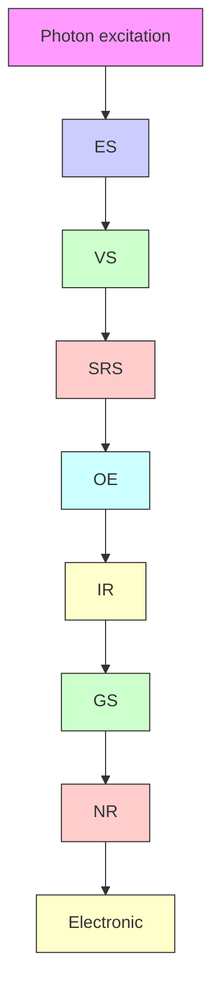
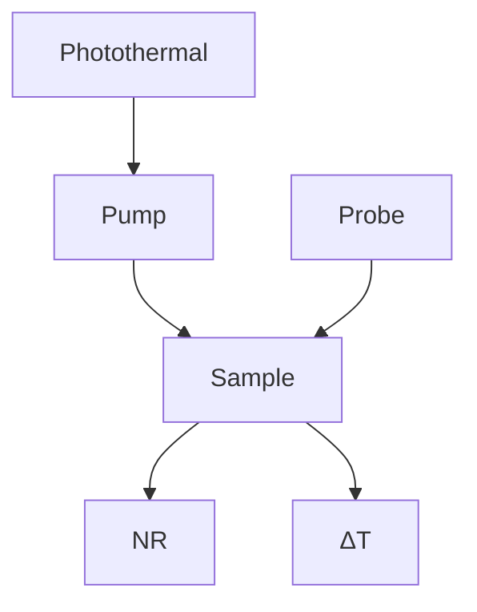
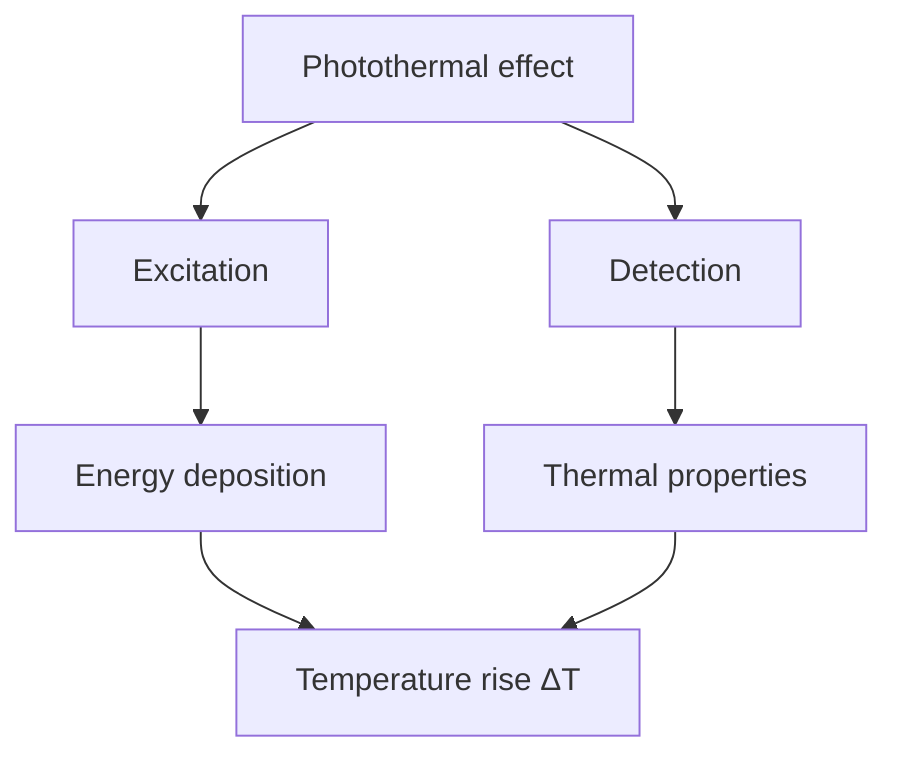
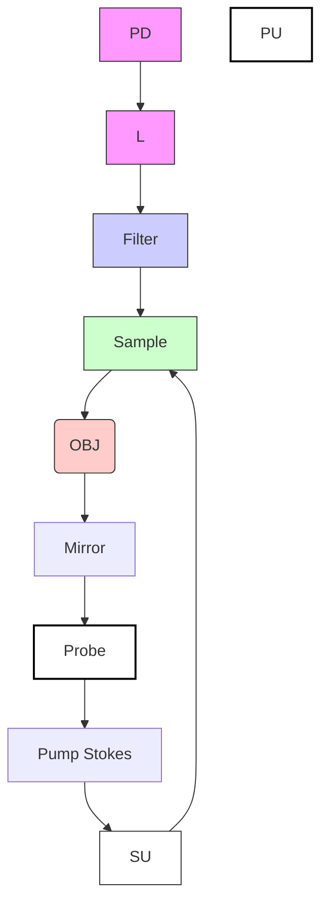

## OPTICA

# Vibrational photothermal imaging: theory, instrumentation, and applications

Jiaze Yin,1,2,† Pin-Tian Lyu,1,2,† Rylie Bolarinho,2,3 Yifan Zhu,2,3 Xiaowei Ge,1,2 Hongli Ni,1,2 Ji-Xin Cheng1,2,3,\*

1Department of Electrical and Computer Engineering, Boston University, Boston, Massachusetts 02215, USA  
2Photonics Center, Boston University, Boston, Massachusetts 02215, USA  
3Department of Chemistry, Boston University, Boston, Massachusetts 02215, USA  
†These authors contributed equally.  
\*jxcheng@bu.edu

Received 10 April 2025; revised 29 May 2025; accepted 15 July 2025; published 22 August 2025

Optical spectroscopic imaging is vital in biophotonics and materials science, yet achieving label-free, high-sensitivity molecular imaging remains a significant challenge. Vibrational photothermal microscopy has emerged as a highsensitivity label-free approach. By measuring the heat generated during the nonradiative relaxation of vibrationally excited molecules, vibrational photothermal microscopy has achieved micromolar detection sensitivity. Recent advancements in mid-infrared excitation have driven rapid progress in this field by enabling submicron-resolution chemical bond imaging. This review discusses the theoretical principles, contrast mechanisms, and instrumentation strategies of mid-infrared photothermal microscopy and introduces other emerging techniques in the vibrational photothermal microscopy family. Broad applications as a versatile chemical imaging tool are summarized. © 2025 Optica Publishing Group under the terms of the Optica Open Access Publishing Agreement

https://doi.org/10.1364/OPTICA.564920

## 1. INTRODUCTION

Optical spectroscopic imaging and sensing of molecules is a foundation of biophotonics and medical photonics. Of all the modalities, quantized optical absorption based on electronic, vibrational, overtone, stimulated Raman, or multi-photon transitions is fundamental [Fig. 1(a)]. However, the absorption contrast is superimposed on the transmitted photons, making it insufficient for imaging at the single nanoparticle and single-molecule levels. By measuring emitted photons at a new color, fluorescence microscopy offers single-molecule sensitivity through labeling of target molecules. Autofluorescence allows label-free detection but lacks the specificity needed for staging of diseases. Spontaneous Raman spectroscopy is label-free but suffers from an extremely small cross section. Coherent Raman scattering microscopy has much improved the imaging speed [1,2], whereas its ultimate sensitivity is limited by the shot noise in the non-resonant background or the excitation laser. Thus, highly sensitive label-free optical spectroscopic imaging of molecules remains an important topic in the field of biophotonics.

Upon an electronic or vibrational pump of a molecule to its excited states, most of the energy is converted to heat via nonradiative relaxation (NR), as shown in [Fig. 1(a)], except for dye molecules with high quantum efficiency. For vibrational excitation, the quantum efficiency is zero, and thus all energy is converted into heat. Therefore, photothermal detection, which measures heat-related parameters in a specimen [Fig. 1(b)], offers the most natural and sensitive way of molecular detection in a label-free manner. Based on overtone excitation of small molecules, photothermal spectroscopy was reported in the 1970s as an extremely sensitive absorption measurement [3]. In 1983, photothermal tomography based on the mirage effect (change of the refractive index) was proposed [4]. In the 1990s, various thermal lens microscopes were demonstrated [5,6]. In the early 2000s, optical photothermal imaging of a single gold nanoparticle and single dye molecules was demonstrated [7–9]. Meanwhile, AFMbased IR spectroscopy was developed for nanoscale photothermal imaging of dried thin specimens [10].

The life science and materials applications of photothermal microscopy have exploded upon the development of optically detected vibrational photothermal imaging technologies over the past 15 years. By kilohertz (kHz) modulation of a mid-infrared beam generated from an optical parametric oscillator (OPO), nonlinear infrared microscopy was reported in 2009 for imaging polystyrene beads and lipid droplets inside cells [11,12]. Using a quantum cascade laser (QCL) as a pump and a visible laser as a probe, infrared photothermal imaging of dried specimens was reported in 2012 [13]. The first demonstration of mid-infrared photothermal (MIP) imaging of live cells and organisms in 2016 [14] and the subsequent launch of mIRage [15], the commercial product of MIP microscopy, rendered mid-infrared photothermal imaging a rapidly rising field. Stimulated Raman photothermal (SRP) microscopy [16] and short-wave IR photothermal (SWIR) microscopy [17] were recently demonstrated as new members of the vibrational photothermal imaging family. In terms of the number of detectable molecules, mid-infrared photothermal imaging has reached micromolar sensitivity [14]. This extremely high sensitivity makes photothermal imaging an important tool for life science. Moreover, photothermal imaging is synergistic to fluorescence microscopy, as many dyes are thermally sensitive and can be used as a photothermal sensor [18,19]. Thus, one can use dyes to target a specific organelle or biomolecule, and photothermal spectroscopy can then be used to determine the content of the organelle or the structure of the biomolecule, information that is unobtainable by fluorescence microscopy.

flowchart

flowchart

Fig. 1. Vibrational photothermal effect. (a) Various absorption transitions upon photon excitation. GS, ground state; ES, electronic excited state; VS, virtual state; NR, nonradiative relaxation; SRS, stimulated Raman scattering. (b) A photothermal measurement involves light pumping and probing. During the NR process, photon energy is converted into heat, causing a localized temperature increase and subsequent changes that can be detected using a probe beam.

This minireview aims to introduce vibrational photothermal microscopy to the optics and photonics community, with a focus on MIP microscopy. Section 2 summarizes the theory of the photothermal process. Section 3 summarizes various contrast mechanisms. Section 4 summarizes the instrumentation strategies of MIP microscopy and tomography. Section 5 discusses the development of vibrational reporters for imaging exogenous molecules. Section 6 illustrates the broad applications enabled by MIP microscopy. Section 7 introduces SRP and SWIP microscopy. Section 8 presents an outlook of the field.

## 2. PHOTOTHERMAL PROCESS IN THE TIME,FREQUENCY, AND SPATIAL DOMAINS

The photothermal process consists of three stages, as illustrated in Fig. 2(a). Upon excitation, the absorbed photon energy is rapidly converted into heat through nonradiative relaxation on a picosecond timescale, generating a localized thermal field around the absorber. This localized heating leads to a temperature increase and thermoelastic expansion within the stress confinement time, typically on the nanosecond timescale. Finally, the energy dissipates through heat diffusion driven by the temperature gradient, occurring over a microsecond timescale. The photothermal process has been extensively studied in the time, frequency, and spatial domains, forming the theoretical foundation for understanding contrast mechanisms and designing detection methods.

(a)  

text_image

Energy deposition
i ~ps
Thermoelastic expansion
ii ~ns
Thermal diffusion
iii ~μs
Photothermal process

(b)  

(c)  

(d)  
  
Fig. 2. Illustration of the photothermal (PT) process across different timescales and signal representation in the time, frequency, and spatial domains. (a) The photothermal process occurs in three stages across different timescales: (i) energy deposition via nonradiative relaxation at the picosecond scale, (ii) thermoelastic expansion within the stress confinement time at the nanosecond scale (indicated by the dashed contour showing thermal expansion), and (iii) thermal diffusion from the absorber into the surrounding environment at the microsecond scale (represented by the dotted contour indicating the energy-confined region). (b) In the time domain, the photothermal signal is a local temperature modulation. The temperature, modulated by a pulsed pump laser, follows an exponential rise and decay process and is characterized by a decay constant τ . (c) In the frequency domain, photothermal modulation contains harmonics at the pump repetition rate. The amplitude and phase shift of these harmonics are determined by the sample’s frequency transfer function. (d) In the spatial domain, the photothermal signal is an evolving temperature profile due to thermal diffusion. The diffusion length is estimated as Dt , where $D$ is the thermal diffusion coefficient of the medium. The profiles of heat flux at diffusion time τ , 2τ , and 3τ are illustrated.

## A. Time Domain Formulation of the Photothermal Process

The photothermal effect is induced by local heating. Therefore, modeling the temperature change is the first step. Derived from Newton’s law of heating and cooling, the temperature versus time relationship can be expressed as [20]

$$
m C _ {s} \frac {\mathrm{d} T}{\mathrm{d} t} = \dot {Q} _ {\text { abs }} - \dot {Q} _ {\text { diss }}. \tag {1}
$$

Here, m and $C _ { s }$ represent the mass and specific heat capacity of the absorber, respectively, d $T / \mathrm { d } t$ is the temperature change over time, $\dot { Q } _ { \mathrm { { a b s } } }$ and $\dot { Q } _ { \mathrm { d i s s } }$ are the rates of absorbed and dissipated energy, respectively, with units of Watt. The heating source, $\bar { Q } _ { \mathrm { a b s } } ,$ , originates from light excitation, represented as $I ( t ) \sigma _ { \mathrm { a b s } }$ , where I (t ) is the excitation intensity function, and $\sigma _ { \mathrm { a b s } }$ is the absorption cross-section of the sample. Heat dissipation occurs in the presence of a temperature gradient, described by

$$
\dot {Q} _ {\text { diss }} = b S [ T (t) - T _ {0} ]. \tag {2}
$$

Here, $[ T ( t ) - T _ { 0 } ]$ is the time-dependent temperature difference between the absorber and the ambient environment $T _ { 0 } ,$ h is the heat transfer coefficient (assumed to be independent of T and averaged over the surface) with units of $\mathbb { W } / \mathrm { m } ^ { 2 } \mathrm { K } ,$ and S is the heat transfer surface area with units of $\mathrm { m } ^ { 2 }$ . Collectively, this heat dissipation term is linked with the heat conductivity of the environment, as well as the shape and surface area of the absorber.

In the presence of a square excitation pulse, the temperature $T ( t )$ solved from $\operatorname { E q . }$ (1) with the initial condition $T ( t ) \dot { = } T _ { 0 }$ is given by

$$
T (t) = T _ {0} + \frac {I \sigma_ {\mathrm{abs}}}{b S} \left(1 - e ^ {- \frac {b S}{m C _ {s}} t}\right). \tag {3}
$$

After excitation, when the heating source $\dot { Q } _ { \mathrm { { a b s } } }$ becomes zero, the temperature change is governed by $\dot { Q } _ { \mathrm { d i s s } } ,$ , and the cooling process is described by

$$
T (t) = T _ {0} + (T _ {\max} - T _ {0}) e ^ {- \frac {h S}{m C _ {s}} t}. \tag {4}
$$

Here, $T _ { \mathrm { m a x } }$ is the highest temperature reached before the excitation ends. For a given excitation pulse duration of $\tau _ { \mathrm { p u l s e } } ,$ $T _ { \mathrm { m a x } } = T ( \tau _ { \mathrm { p u l s e } } )$ .

Collectively, the temperature evolution of a photothermal process is written as [20]

$$
T (t) = \left\{ \begin{array}{l} T _ {0} + \frac {I \sigma_ {\mathrm{abs}}}{b S} \left(1 - e ^ {- \frac {b S}{m C _ {s}} t}\right), t \leq \tau_ {\text {pulse}}, \\ T _ {0} + \left(T _ {\max} - T _ {0}\right) e ^ {- \frac {b S}{m C _ {s}} t}, t > \tau_ {\text {pulse}}. \end{array} \right. \tag {5}
$$

Equation (5) describes the temporal evolution of the absorber’s temperature under photothermal excitation. The temperature ascent and decay follow two exponential decay processes, as illustrated in Fig. 2(b). These two exponential processes are characterized by the same time constant τ , which is defined by m $C _ { s } / b S$ . This time constant reflects the interplay between the heat capacity of the absorber and its thermal resistance. Absorbers with large heat capacity, such as bulky water and large particles, are expected to exhibit large time constants. Meanwhile, the dissipation coefficient, h S, is influenced by the heat transfer capabilities of the surrounding medium and the geometry of the absorbers. It signifies how rapidly heat is dissipated into the environment. When considering a small spherical absorber immersed in a uniform medium or the scenario of spherical thermal lens, the heat transfer coefficient (h S) can be estimated as 4π κr , where κ represents the heat conductivity of the medium and r is the particle radius [21]. The decay constant, τ , becomes $r ^ { 2 } \rho C _ { s } / 3 \kappa$ , where $\rho$ denotes the absorber density. Based on the decay constant, the time required for complete heat dissipation increases for larger-sized absorbers and in media with lower heat conductivity. The frequency domain and spatial domain representations [Figs. 2(c) and 2(d)] will be discussed in the following section.

Applying these equations, we conducted simulations of photothermal dynamics using PMMA nanoparticles with a 500 nm diameter under pulsed IR excitation, as illustrated in Fig. 3(a). For instance, a PMMA particle with a diameter of 500 nm has a time constant of 60 ns in water $( \kappa = 0 . 6 \mathrm { { W / m K ) } }$ [22], 128 ns in glycerol $\left( \kappa = 0 . 2 8 \mathrm { \ : W / m K } \right) [ 2 2 ]$ , and 179 ns in DMSO $( \kappa = 0 . 2 \bar { \mathrm { W / m K } } )$ [23]. As the particle size increases to a diameter of 1000 nm, the time constants in water, glycerol, and DMSO become 239, 512, and 718 ns, respectively. However, the time required for complete heat dissipation from a bulky medium, such as water, is much longer than that from a 500 or 1000 nm particle. For example, the measured water photothermal signal in a mid-infrared photothermal microscope has a time constant of 5.2 µs [24].

An essential insight derived from the temperature model is the selection of the excitation source for generating photothermal modulation. Given that most photothermal detection systems operate within the linear contrast range—where contrast scales linearly with temperature rise and absorption cross-section— achieving a strong signal necessitates enhancing the maximum temperature, $T _ { \mathrm { m a x } } ,$ reached during the excitation. The upper limit of temperature jump $( T _ { \mathrm { m a x } } - \bar { T _ { 0 } } )$ is contingent on $( I \sigma _ { \mathrm { a b s } } / b S )$ for a specific absorber, representing the absorption heating power divided by the dissipation coefficient. An excitation source with a high peak intensity (I ) is favored for inducing a larger temperature jump. Furthermore, the heating process becomes inefficient when the pulse duration exceeds the decay constant, as heat diffusion becomes more pronounced over time. Therefore, the optimal excitation source requirements involve a short pulse with high peak power.

In the scenario of imaging small objects with the presence of a medium background, the excitation pulse duration will influence the signal-to-background ratio due to their different decay constants, as shown in Fig. 3(b). Here, we calculated the ratio of the thermal response between two objects by 1 − e − τpulseτ1  $\left( 1 - e ^ { - { \frac { \tau _ { \mathrm { p u l s e } } } { \tau 1 } } } \right) /$ P $\left( 1 - e ^ { - \frac { \tau _ { \mathrm { p u l s e } } } { \tau 2 } } \right)$ . Through simulation, one can note that objects with faster decay exhibit the highest contrast over the slower decay objects at the onset of excitation. The contrast diminishes with a longer heating pulse duration. This characteristic proves advantageous in designing experiments for mid-infrared photothermal imaging of live cells. In such scenarios, where the water background decays much more slowly than the small organelles (with a decay constant over 5 µs), a shorter pulse excitation favors the signal from cellular components over the water background [25].

## B. Frequency Domain Analysis of the Photothermal Process

Using the derived temperature response function, one can formulate the photothermal process in the frequency domain, in which most detection systems operate. The frequency domain analysis is performed with the temperature of the absorber being analogous to an RC low-pass filter with the frequency transfer function ${ \bf \widehat H } ( f ) .$ The relative amplitude $| H ( f ) |$ versus frequency $f$ is calculated by [24]

$$
| H (f) | = \left| \frac {1}{1 + j 2 \pi \tau f} \right|. \tag {6}
$$

Here, $\underline { { j } }$ represents the imaginary number. The frequency response function provides insight into the speed at which the photothermal signal can be modulated and detected. Due to its low-pass characteristics, the demodulated signal is not only affected by the absorption of the sample but is also influenced by its thermal properties. As the chosen modulation and demodulation frequencies increase, a reduction in modulation depth is anticipated, potentially impacting the sensitivity of the system. The cut-off frequency, $f _ { c } ,$ of such a low-pass filter is given by $f _ { c } = 1 / 2 \pi \tau$ , where τ is the time constant. At frequency $f _ { c } ,$ the output amplitude becomes half of the input. The transfer function of objects with various decay constants is plotted in Fig. 3(c). The proper frequency of photothermal excitation should be chosen with considering $f _ { c }$ for avoiding the reduced signal amplitude.

In addition to demodulation at the fundamental modulation frequency, an increasing number of studies are employing highorder harmonics for demodulating the photothermal signal. The exploration of high-order harmonics has resulted in enhanced contrast between objects with distinct decay processes [24], and reports of breaking the diffraction limit have emerged [26]. In this context, we demonstrate that the frequency analysis model is also applicable for the harmonic analysis of photothermal dynamics. Through Fourier analysis, the frequency domain representation of the temperature modulation of the absorber is given by T( f ):

line chart

| Time (ns) | D=500 nm in Water, τ=60ns | D=500 nm in Glycerol, τ=128ns | D=500 nm in DMSO, τ=179ns | Slow decay background, τ=5.2μs |
| --------- | ------------------------ | ----------------------------- | ------------------------- | ------------------------------ |
| 0         | 0.0                      | 0.0                           | 0.0                       | 0.0                            |
| 200       | 1.0                      | 1.0                           | 1.0                       | 1.0                            |
| 400       | 0.8                      | 0.9                           | 0.95                      | 0.95                           |
| 600       | 0.4                      | 0.6                           | 0.7                       | 0.8                            |
| 800       | 0.2                      | 0.4                           | 0.5                       | 0.7                            |
| 1000      | 0.1                      | 0.2                           | 0.3                       | 0.6                            |
| 1200      | 0.0                      | 0.1                           | 0.1                       | 0.5                            |

line chart

| Pulse duration (ns) | Ratio of thermal response (a.u.) for τ₁=60ns/τ₂=5.2μs | Ratio of thermal response (a.u.) for τ₁=128ns/τ₂=5.2μs | Ratio of thermal response (a.u.) for τ₁=179ns/τ₂=5.2μs |
| ------------------- | ----------------------------------------------- | -------------------------------------------------- | ---------------------------------------------------- |
| 0                   | 75                                              | 38                                                 | 28                                                   |
| 100                 | 45                                              | 28                                                 | 20                                                   |
| 200                 | 30                                              | 20                                                 | 15                                                   |
| 300                 | 20                                              | 15                                                 | 12                                                   |
| 400                 | 15                                              | 12                                                 | 10                                                   |
| 500                 | 12                                              | 10                                                 | 9                                                    |
| 600                 | 10                                              | 9                                                  | 8                                                    |

line chart

| Frequency (kHz) | D=500nm in Water | D=500nm in Glycerol | D=500nm in DMSO | Slow decay BG |
| --------------- | ---------------- | ------------------- | --------------- | ------------- |
| 10              | 1.0              | 1.0                 | 1.0             | 1.0           |
| 100             | 1.0              | 1.0                 | 1.0             | 0.8           |
| 1000            | 0.9              | 0.9                 | 0.9             | 0.2           |
| 10000           | 0.4              | 0.4                 | 0.4             | 0.05          |
| 100000          | 0.1              | 0.1                 | 0.1             | 0.0           |

line chart

| Frequency (kHz) | D=500nm in Water | D=500nm in Glycerol | D=500nm in DMSO | Slow decay BG |
| --------------- | ---------------- | ------------------- | --------------- | ------------- |
| 1               | 0                | 0                   | 0               | 0             |
| 10              | ~2               | ~1                  | ~1              | ~5            |
| 100             | ~10              | ~8                  | ~7              | ~60           |
| 1000            | ~40              | ~35                 | ~30             | ~85           |
| 10000           | ~75              | ~70                 | ~65             | ~90           |
| 100000          | ~90              | ~88                 | ~85             | ~90           |

line chart

| Distance (nm) | D=500nm in Water | D=500nm in Glycerol | D=500nm in DMSO |
| ------------- | ---------------- | ------------------- | --------------- |
| 0             | 1.0              | 1.0                 | 1.0             |
| 200           | 0.35             | 0.38                | 0.4             |
| 500           | 0.0              | 0.0                 | 0.0             |

line chart

| Diffusion time (ns) | Water Diffusion length (nm) | Glycerol Diffusion length (nm) | DMSO Diffusion length (nm) |
| ------------------- | --------------------------- | ------------------------------ | -------------------------- |
| 60                  | 186                         | 186                            | 186                        |
| 128                 | 236                         | 236                            | 236                        |
| 179                 | 257                         | 257                            | 257                        |

Fig. 3. Simulations of the photothermal process in a 500 nm particle and surrounding medium. (a) Simulated temperature modulation of PMMA particles with a 500 nm diameter in different environments and slow decay background (BG) under square-wave heating pulses with a duration of 300 ns. (b) Ratio of thermal responses between absorbers with different time constants at varying pulse durations. (c) The frequency transfer function of absorbers corresponding to the simulation in (a). (d) Phase delay at different frequencies introduced by the absorbers depicted in (a). (e) The spatial profile of heat flux produced by a point at the boundary of PMMA particles with a 500 nm diameter in water, glycerol, and DMSO after one decay constant. The dashed line marks the amplitude where the heat flux decreases by a factor of e from its initial value. (f ) Relationship between diffusion length and diffusion time in dif ferent media. The star marks indicate the diffusion length of a 500 nm diameter PMMA particle after one decay constant in water, glycerol, and DMSO, which is 186, 236, and 257 nm, accordingly.

$$
T (f) = I (f) H (f), \tag {7}
$$

where I ( f ) is the frequency representation of the excitation pulse. Due to the wideband response of $H ( f )$ , higher-order harmonics emerge in the induced photothermal modulation [Fig. 2(c)], given that the heating pulse is not a single sinusoidal function. The frequency spectrum of the modulation signal follows the profile of the frequency spectrum of the input excitation, scaled with the characteristics of a low-pass filter. Higher-order harmonics are anticipated, particularly when the input excitation has low duty cycles. In recent advancements, the amplitude of high-order harmonics conveys distinct photothermal contrast, influenced by its scaling through the low-pass filter [24,26]. Utilizing the contrast in a harmonic’s amplitude enables the extraction of decay constant information, thereby enhancing resolution and improving the signal-to-background ratio. It is important to note that, along with the harmonic’s amplitude, the low-pass filter induces a phase shift in the harmonics. The phase shift generated by this filter is given by

$$
\phi (f) = - \tan^ {- 1} \left(\frac {f}{f _ {c}}\right). \tag {8}
$$

The phase shift of objects at various frequencies is shown in Fig. 3(d). The phase shift generated allows for the detection of the decay constant using phase-sensitive methods, such as a lock-in amplifier [27,28].

## C. Thermal Diffusion in the Spatial Domain

Beyond temporal dynamics, the spatial diffusion of heat is of great interest, particularly in the design and optimization of photothermal imaging systems. For instance, thermal diffusion enables the formation of thermal lenses while also contributing to the degradation of spatial resolution and the saturation of photothermal signals [29–31]. In this section, we analyze these diffusive phenomena to illustrate how thermal properties and excitation sources influence the generation of photothermal signals.

The non-stationary heat conduction problem can be addressed using the following parabolic heat diffusion equation, commonly known as Fourier’s second law [32]:

$$
\nabla^ {2} T - \frac {1}{D} \frac {T (r , t)}{d t} = 0. \tag {9}
$$

Here, $\nabla ^ { 2 }$ is the Laplacian operator, and D is the thermal diffusivity of the medium, denoting the rate at which temperature variations propagate through the medium. Thermal diffusivity is defined as $\stackrel { \cdot } { D } = \stackrel { \cdot } { k } / C ,$ , where k is the thermal conductivity, and $C$ is the heat capacity of the medium per unit volume. For a semiinfinite homogeneous diffusion medium, the equation can be solved as follows:

$$
\frac {d T (x , t)}{d t} = D \frac {d ^ {2} T (x , t)}{d x ^ {2}}. \tag {10}
$$

With the boundary condition $T ( x = 0 , \ t \geq 0 ) = T _ { 1 }$ , $T ( x > 0 , \ t = 0 ) = T _ { 0 } .$ the solution to Eq. (10) has the form

$$
T (x, t) = T _ {1} + (T _ {0} - T _ {1}) \operatorname{erf} \left(\frac {x}{2 \sqrt {D t}}\right). \tag {11}
$$

Here, erf is the error function. With such a temperature field derived, the system heat flow, q , within the system, can be expressed as a Gaussian spread of energy across both space and time:

$$
q = q _ {0} e ^ {- \frac {x ^ {2}}{4 D t}}. \tag {12}
$$

The diffusion length, denoted as L, represents the distance over which the amplitude of the heat flux decreases by a factor of e from its initial value. The diffusion length is related to the thermal diffusivity of the medium as $L = 2 \sqrt { D t }$ , as illustrated in Fig. 2(d). When extending this result to three dimensions, it becomes evident that, after a time t has elapsed, the heat has spread over a sphere with a radius of L . According to Eq. (12), Fig. 3(e) illustrates the spatial patterns of heat flux created by a point at the boundary of a 500 nm diameter PMMA particle simulated in Fig. 3(a). These results indicate that the diffusion length that happened during the cooling process is less than one micron, as the decay process occurs within hundreds of nanoseconds. This characteristic ensures spatial resolution in a photothermal microscope, as the decay constant for small objects is in the range of hundreds of nanoseconds. The influence of medium diffusivity is evaluated, as shown in Fig. 3(f ). By changing the medium from water $\mathrm { ( D = 0 . 1 4 3 \times 1 0 ^ { - 6 } \mathrm { m } ^ { 2 } / \mathrm { s ) } }$ to glycerol $\mathrm { \overline { { ( D = 0 . 1 0 8 \times 1 0 ^ { - 6 } m ^ { 2 } / s ) } } }$ and $\mathrm { D M S O _ { \mathrm { ~ ( D = 0 . 0 9 2 8 \times \bar { 1 0 } ^ { - 6 } m ^ { 2 } / s ) } } }$ , a trend of decreasing diffusion length is revealed.

## 3. CONTRAST MECHANISMS FOR OPTICALLYDETECTED PHOTOTHERMAL IMAGING

Building on the formulated photothermal process, this section explores the various contrast (i.e., signal generation) mechanisms employed in photothermal microscopy. In parallel, the spatial resolution of each approach is discussed in terms of the point spread function (PSF), which can generally be defined as the spatial profile of probe field modulation induced by a point-like heat source. Photothermal signals originate from the localized heating induced by optical excitation. The absorbed energy is converted into heat, causing a localized temperature rise that modifies the sample’s optophysical properties, including refractive index (n), size (d ), heat capacity $\bar { ( C _ { s } ) }$ , emission quantum yield (8) of dye molecules, and the Grüneisen parameter (0). These changes can be detected through multiple mechanisms, as illustrated in Fig. 4(a).

## A. Thermal Lensing Modulation

The first established model explaining photothermal contrast describes the thermal diffusion-induced refractive index change as an optical lens with negative or positive focusing power. The thermal lens induces beam deflection, which is detected as an optical power change on the detector, as illustrated in Fig. 4(b). This thermal lensing model evolved over the past decades to accurately describe the photothermal effect, ranging from solution to nanoparticles [22,33]. Although various theories have been introduced, the basic idea behind them is that the beam deflection alters the far-field distribution of the probe light. Here, we introduce the ball lens model that is adapted for a few vibrational photothermal imaging modalities [16,17].

(a)  

flowchart

(b)  

text_image

Thermal lensing
Probe focus
Δz
Absorber
θ₁
θ₂
R
Collection aperture

(c)  

text_image

Scattering field
σs(d,n)

(d)  

text_image

Optical phase
φs(d,n)

(e)  

text_image

Fluorescence
λex
ΦF(T)
λem
knr(T)

(f)  

text_image

Nonlinearity
Γ(T)
Γ(α, v)
T

Fig. 4. Various contrast mechanisms employed in photothermal imaging. (a) The photothermal effect alters the properties of a sample, which are optically detected for imaging. (b) Thermal lensing changes the probe beam divergence due to the change in the medium refractive index. (c) The intrinsic scattering field of the absorber is directly modulated in magnitude and pattern by the temperature rise due to the changes in size and refractive index. (d) The optical phase is sensitive to the local temperature, given to the sample size d and the refractive index n. (e) Fluorescence emission is sensitive to the local temperature due to thermal alternation of nonradiative decay pathways. (f ) The photoacoustically detected photothermal effect. The Grüneisen parameter, 0, varies with temperature, resulting in a stronger pressure wave under the same excitation in the heated state.

The temperature-induced probe intensity change is explained through the thermal lensing model. As the focused probe beam propagates through the transient temperature profile, it is deflected due to heat-induced changes in the refractive index (n). This deflection is detected as an intensity change using an aperturecontrolled system. Before heating, the probe beam has divergence angle $\theta _ { 1 }$ , and the far-field distribution follows a Gaussian intensity I(r ), as shown in Eq. (13), with the beam waist at $\omega _ { 1 }$ , defined by the focusing objective lens, where $\mathrm { I } _ { 0 } = 2 P _ { \mathrm { p r o b e } } / \pi \omega _ { 1 } ^ { 2 }$ , based on the total probe power $P _ { \mathrm { p r o b e } } { \mathrm { : } }$

$$
\mathrm{I} (r) = \mathrm{I} _ {0} \exp \left(- \frac {2 r ^ {2}}{\omega_ {1} ^ {2}}\right). \tag {13}
$$

By collecting the beam with an aperture with radius R, the detected power is written as

$$
P _ {1} (\omega_ {1}, R) = P _ {\text { probe }} \left[ 1 - \exp \left(- \frac {2 R ^ {2}}{\omega_ {1} ^ {2}}\right) \right]. \tag {14}
$$

Upon thermal-induced deflection, the divergence angle changes to $\theta _ { 2 } ,$ resulting in a modified far-field distribution with the beam waist at $\omega _ { 2 }$ . Followed by the same expression, the measured optical power is $P _ { 2 } ( \omega _ { 2 } , R )$ , and the difference of detected optical power, $\Delta P = P _ { 2 } - P _ { 1 }$ , is measured as a photothermal signal.

Under the approximation where the thermal lensing radius, $r ,$ is comparable to or larger than the size of the probe focus, and an axial displacement $\Delta z$ between the probe focus and the thermal lens exists, the detected power difference is related to the medium refractive index n and the thermal induced index change, 1n, and consequently to 1T by

$$
\Delta P \propto P _ {\text { probe }} \frac {\Delta z}{n r} \Delta n. \tag {15}
$$

In thermal lensing-based systems operating in the linear regime, thermal diffusion plays a critical role, as the signal amplitude is strongly influenced by the size of the thermal lens. The detection is most efficient when the probe beam size matches the thermal spot size [34]. Consequently, the lateral resolution is typically limited by the probe beam and follows Rayleigh’s criterion: $d = 0 . 6 1 \lambda / \mathrm { N A }$ . In addition, due to the diffraction nature of thermal lensing, the axial focal volume exhibits a two-lobed pattern with opposite signs [33]. This arises from the axial displacement between the probe focus and the thermal lensing region, making the axial PSF different from that of conventional optical imaging systems.

## B. Scattering Intensity Modulation

Beyond inducing a thermal lens in the medium, the temperature rise also alters the particle’s intrinsic scattering properties, which can be detected as shown in Fig. 4(c). The scattering cross-section, $\sigma _ { s } \left( d , n \right)$ , is strongly dependent on the sample size, $d ,$ and the refractive index, n. When modulations $\Delta \dot { d }$ and 1n occur, $\sigma _ { s }$ undergoes changes not only in magnitude but also in the far-field scattering distribution and optical phase retardation. These scattering modulations can be detected through dark-field [14,35] and interferometric scattering [36–38] microscopy. In the dark-field geometry, the illumination and scattering photons are spatially separated in the detection path. The ballistic illumination photons are reduced by selecting detection angles [14,35] before the detector. Therefore, only scattering photons are detected, which reduces the photon noise that arises from the illumination beam.

However, for small particles, where Rayleigh scattering intensity scales inversely with the sixth power of particle size, their scattered signal can drop below the detector’s noise floor, making it indistinguishable. Inspired by interferometric scattering detection of nanoparticles [39,40], a reference field can be introduced in photothermal systems to enhance weak scattering signals.

Unlike dark-field systems, interferometric scattering amplifies the weak scattering field by interference with the reference field. Consequently, interferometric scattering is more advantageous for detecting small particles, while the dark-field method is preferable for detecting larger particles.

In scattering-based systems, temperature modulation alters the scattering field of the absorber, resulting in differential contrast between the heated and unheated states. For subwavelength absorbers in the Rayleigh scattering regime, the photothermal signal shares the same PSF as the underlying imaging system [41,42].

## C. Optical Phase Modulation

In addition to scattering intensity, the photothermal signal can be detected by retrieving the optical phase, φs , as shown in Fig. 4(d). The difference of optical phase between the original state, $\dot { \varphi } _ { \mathfrak { c } } ^ { \mathrm { C o l d } }$ and the heated state, $\phi _ { s } ^ { \mathrm { \bf { \dot { H o t } } } }$ , with temperature change $\Delta \dot { T } _ { : }$ , is expressed as [43]

$$
\Delta \phi_ {s} = \phi_ {s} ^ {\text { Hot }} - \phi_ {s} ^ {\text { Cold }} = \frac {2 \pi d}{\lambda} (n \alpha + \beta) \Delta T, \tag {16}
$$

where α is the thermal expansion coefficient, and $\beta$ is the thermo-optic coefficient. The optical phase-based photothermal modalities hold the potential for imaging specimens that do not have strong scattering contrast, such as samples with a similar refractive index as the medium.

In optical phase-based systems, the refractive index change caused by local heating is reconstructed from phase maps. In standard quantitative phase imaging configurations, the lateral resolution is defined by the imaging optics and follows Rayleigh’s criterion. However, due to the nature of phase projection, the axial resolution depends on the system’s depth of field and can be improved with an advanced reconstruction method such as synthetic aperture [44].

## D. Fluorescence Intensity Modulation

Molecule-based temperature detection methods have gained attention recently. Among these, fluorescence thermometry has been successfully employed to extract vibrational photothermal signals, as illustrated in Fig. 4(e). When fluorescent molecules absorb photons and enter an excited state, the resulting local temperature rise increases the nonradiative rate, $k _ { n r } ,$ thereby modulating the quantum yield of dye emission, as shown in Eq. (17). This modulation, typically around 1%–5% per kelvin, makes fluorescence thermometry highly sensitive to sensing local temperature changes [18,19]:

$$
\Phi (T) = \frac {k _ {r}}{k _ {r} + \Sigma k _ {n r} (T)}. \tag {17}
$$

For fluorescence-based detection, the local temperature is directly measured via fluorophores. The spatial resolution, in this case, is governed by the PSF of the fluorescence imaging system.

The comparison of sensitivity between photothermal detection via fluorophores and refractive index measurement has been a subject of ongoing discussion. While fluorescence-based thermometry can exhibit one to two orders of magnitude greater relative signal change per unit temperature, successful detection against a fluorescent background requires a substantial number of photons to overcome shot noise, thereby limiting its overall sensitivity. In contrast, refractive index-based measurements typically involve probe beams with photon fluxes several orders of magnitude higher (often by four orders), resulting in improved sensitivity under comparable conditions.

Nevertheless, fluorescence-based photothermal detection offers distinct advantages in biological applications due to its high molecular and organelle specificity. By utilizing conventional cell-staining dyes, fluorescence-detected photothermal imaging enables chemical analysis of specific subcellular structures, opening new opportunities for investigating the functional roles of organelles in living systems [45].

## E. Nonlinear Temperature Dependency

It is important to note that the physical properties underlying the photothermal signal, such as heat capacity, $C _ { s } \left( T \right)$ , and thermal expansion coefficient, α(T), are themselves temperaturedependent. These parameters directly influence the amplitude of the photothermal effect and introduce nonlinearity. This nonlinearity is utilized to measure the local temperature by comparing the photothermal effect between the initial and heated states. This concept has been demonstrated in photoacoustically detected photothermal imaging [46], as shown in Fig. 4(f ). In this example, the Grüneisen parameter, 0[Cs (T), α(T)], which governs the photoacoustic amplitude, varies with temperature. As a result, a stronger pressure wave is generated at higher temperatures, and the corresponding change in photoacoustic intensity provides information about local temperature modulation. In this scenario, the spatial resolution is defined by the photoacoustic imaging system.

## 4. INSTRUMENTATION STRATEGIES FOR MIP MICROSCOPY AND TOMOGRAPHY

As illustrated in Fig. 5, MIP imaging geometries can be classified into three main categories. The first is the scanning configuration, where the mid-IR pump and visible probe are focused to a diffraction-limited spot, and images are generated by collecting point-by-point signals through lateral translation stages [14] or galvo scanning of the laser beams [47] [Figs. 5(a) and 5(b)]. The second category is the widefield configuration, in which the IR beam is loosely focused, and the visible beam illuminates the entire field of view rather than a single diffraction-limited spot [Figs. 5(c) and 5(d)]. The third category is photothermal tomography through multi-angle illumination of the visible beam, which enables 3D volumetric measurements [Figs. 5(e) and 5(f )].

## A. Point Scanning Systems

Point scanning systems have been developed in two geometries based on the geometry of beam focusing. In co-propagation systems, the IR and visible beams are combined using a dichroic mirror and directed through a reflective objective lens [Fig. 5(a)]. This all-reflective design minimizes chromatic aberration across the visible to mid-infrared spectrum, ensuring precise overlap of the focal spots of both beams during the scanning process. For transparent samples, the transmitted probe photons are collected by a condenser and focused onto a photodiode for forward detection [14]. In the case of highly scattering samples or when a reflective substrate is used, the reflected probe photons are collected by the same reflective objective lens and focused onto a photodiode in an epi-detection configuration [48].

  
Fig. 5. Instrumentation strategies for MIP microscopy and tomography. (a) A point-scanning system with a co-propagation geometry, where the pump and probe beams are focused by the same reflective objective lens. (b) A point-scanning system with a counter-propagation geometry, where the pump and probe beams are focused separately onto a sample, allowing the use of a higher NA objective lens for high-resolution imaging. (c) The widefield imaging system in the epi-reflection mode, utilizing the same objective lens for both illumination and imaging. The pump beam is weakly focused on a sample using a low-NA parabolic mirror. BS, nonpolarized beamsplitter. (d) The widefield imaging system with optical phase contrast, where the optical phase is retrieved using a common-path interference method. ${ \mathrm { G } } ,$ grating; $\mathrm { E } _ { s } ,$ , imaging field; $\bar { \mathrm { E } _ { r } } \bar { }$ , reference field. (e) The photothermal intensity diffraction tomography (IDT) system, employing a programmable laser diode ring to provide multi-angle illumination. (f ) The photothermal optical diffraction tomography (ODT) system, utilizing an interferometric method to reconstruct the complex imaging field from multiple illumination angles. GM, galvo mirror; Es , imaging field; $\mathrm { E } _ { r } ,$ reference field.

Co-propagation systems offer robust performance while maintaining minimal system complexity. However, the use of air-based reflective objective lenses limits the numerical aperture (NA) of such imaging systems to below 0.8. To address this limitation, a counter-propagation geometry was developed [36] [Fig. 5(b)]. In counter-propagation systems, the infrared and visible beams are separated and focused independently on the sample, enhancing the collection efficiency of visible photons and improving spatial resolution by utilizing high-NA immersion refractive objective lenses for the probing beam. A spatial resolution of 300 nm was achieved after deconvolution, using a probe wavelength of 532 nm and a 1.2 NA objective lens [38].

In scanning systems, single-element detectors such as photodiodes or avalanche photodiodes are commonly used to capture fast photothermal dynamics. Traditionally, photothermal signals have been retrieved using lock-in amplifiers [14,28,36]. However, unlike many pump–probe detection systems where signals are modulated with a 50% duty cycle, photothermal signals induced by short pulses are typically asymmetric with low duty cycles (<10%) [24]. This unique waveform has driven the development of alternative demodulation techniques, including waveform digitization [24] and boxcar detection [49], which are better suited for capturing transient signals compared to lock-in detection. Additionally, these emerging demodulation methods enable timedomain characterization of photothermal dynamics, facilitating the analysis of thermal diffusion within the sample.

## B. Widefield Systems

While scanning systems have demonstrated success, they face a limitation: a significant portion of IR photons do not contribute to the signal due to the mismatch between the IR and visible focal spot sizes [37]. To overcome this issue, widefield MIP systems utilizing cameras have been developed, enhancing detection throughput. The first widefield system was implemented in a counter-propagating and epi-detection configuration [37] [Fig. 5(c)], where Köhler illumination is employed to project the light source onto the back focal plane of a refractive objective, ensuring uniform sample illumination. The modulated IR pump beam is weakly focused onto the sample plane using either parabolic mirrors or infrared lenses. The reflected visible photons are collected through the same objective lens, separated from the illumination path by a beamsplitter, and then projected onto the camera via a tube lens. An advanced version employs pupil engineering techniques to modify the image formation path, allowing the system to switch between dark-field contrast and interferometric scattering contrast [42].

Beyond measuring the scattering intensity, optical phase detection has been incorporated into the widefield system. Optical phase information can be extracted using phase shift masks [50,51], quantitatively retrieved through either common-path interferometry [43,52] or phase-shifting methods [53]. An example of a common-path off-axis interferometry configuration is illustrated in Fig. 5(d). In this setup, the reference field is generated by spatially separating the sample-transmitted beam using a grating, followed by filtering out the high-frequency components of the first-order diffracted beam with a pinhole. The second-order beam remains unaffected and carries the sample information. When these two beams recombine at the camera plane, they produce interference fringes with a spatial frequency, k, determined by the off-axis angle, θ . The optical phase delay induced by the sample can be extracted and reconstructed using Fourier transform analysis. This common-path approach offers robust phase retrieval capabilities and high imaging speed, making it widely adopted in various phase-based photothermal imaging systems. Notably, several emerging phase-shifting methods, such as the Mirau interferometer [54] and balanced-path Mach–Zehnder interferometer [53], have shown great potential for extracting photothermal modulation.

Since cameras are commonly used in widefield systems and have limited bandwidth for capturing fast signals, the optical boxcar technique is employed to detect rapid photothermal modulation. This method uses a short-pulsed probe that is time-gated with pump excitation, creating a “hot frame” on the camera, where all detected photons correspond to the heated state. The photothermal image is then obtained by subtracting a “cold frame,” where photons are measured in the initial state. This approach allows slow-frame-rate cameras to capture nanosecond-scale photothermal modulation. Notably, with advancements in ultrafast cameras operating at the microsecond level, emerging widefield systems can directly capture the photothermal process without requiring short-pulse gating and further enhance the system throughput [31,55,56].

## C. Tomography Systems

With advancements in computational techniques, optical tomography has been incorporated into photothermal imaging, enabling volumetric imaging capabilities. Demonstrated optical tomography systems fall into two categories: a non-interferometric approach known as intensity diffraction tomography (IDT) [57], as shown in Fig. 5(e), and an interferometric method called optical diffraction tomography (ODT) [58], as shown in Fig. 5(f ). Both methods share the principle of imaging the same object from multiple illumination angles to enable 3D reconstruction. ODT employs an interference-based approach to directly capture the complex optical field, providing both intensity and phase information, whereas IDT records only intensity maps. IDT reconstructs volumetric images by solving an inverse propagation problem using computational algorithms. Due to the simplicity of its setup, IDT can be seamlessly integrated with photothermal excitation, utilizing a programmable laser diode ring as an illumination source. As cameras are used in both systems, the same demodu lation as in widefield systems is used to extract the photothermal signals.

## D. Considerations for Choosing Configurations

Current photothermal configurations can be broadly categorized into point-scanning and widefield systems. A primary consideration in practical implementation is the excitation laser fluence. In mid-infrared photothermal systems, QCLs typically deliver pulse energies in the nanojoule range. When the beam is loosely focused for widefield illumination, the fluence decreases quadratically with focal spot size, significantly diminishing the heating effect. However, with access to high-power sources such as OPO-based mid-infrared lasers, which offer microjoule to millijoule pulse energies [31,37,46], it becomes feasible to illuminate larger areas effectively, thereby enhancing imaging throughput.

The point-scanning configuration can be implemented in a confocal geometry, offering relatively high optical sectioning capability for 3D spectroscopy or depth-resolved imaging. In contrast, achieving 3D imaging with widefield setups typically requires more complex configurations, such as tomographic reconstruction. Additionally, the microsecond-scale detection speed of point-scanning systems enables high-throughput spectroscopy on the millisecond timescale, making them particularly attractive for applications that demand rapid acquisition of high-quality spectra.

## 5. PHOTOTHERMAL IMAGING WITHVIBRATIONAL REPORTERS

Label-free photothermal imaging relies on the intrinsic vibrational signatures of biomolecules, and its molecular specificity can be limited by spectral overlap in complex biological environments. For instance, the ubiquitous presence of amide bonds in proteins complicates the selective detection of certain proteins using the amide I or II bands. To address this challenge, recent advances have introduced vibrational reporters—engineered molecular tags with distinct and isolated absorption peaks—to improve chemical specificity.

These reporters can be realized by incorporating stable isotopes $( \mathrm { e . g . , \bar { D } , ^ { 1 3 } C , }$ and $^ { 1 5 } \mathrm { N } )$ or small chemical groups such as azides $( - \mathsf { N } _ { 3 } )$ , nitriles $( - C \equiv \Nu )$ , and alkynes $( - C \equiv \mathrm { C } )$ , which absorb in the cell-silent region (approximately $1 8 0 0 { - } 2 5 0 0 \mathrm { c m } ^ { - 1 } )$ , where background from endogenous biomolecules is minimal. Through metabolic labeling or bio-orthogonal chemistry, these moieties can be selectively integrated into specific biomolecules and metabolites, enabling targeted detection. Moreover, multicolor vibrational reporter imaging has emerged, where multiple functional groups with spectrally distinct peaks allow for simultaneous visualization of different molecular targets [59]. These reporter molecules are optimized for cross-section, photostability, and biocompatibility. Recent studies have successfully integrated them into vibrational photothermal imaging modalities, broadening the application scope to dynamic processes such as metabolic tracking, drug uptake, and protein labeling. Owing to the high sensitivity of photothermal techniques, vibrational tags can be detected at micromolar concentrations with minimal disruption to the biological system.

In a later section, we further highlight the application of vibrational reporters in studying cellular metabolism and enzymatic activity.

## 6. BROAD APPLICATIONS OF MIP IMAGING

MIP microscopy, also known as optical photothermal infrared (O-PTIR) microscopy, is revolutionizing the chemical imaging field by enabling molecular recognition with submicron spatial resolution. The rapid growth builds upon our high-performance MIP microscope reported in 2016, which became commercially available as the mIRage system in 2018. MIP microscopy, with its ability to offer detailed insights into the molecular composition of samples, is quickly emerging as a powerful tool for life analysis, material characterization, and environmental monitoring. The sections below highlight applications in life science, material science, and environmental science.

## A. Applications in Life Science

MIP microscopy has become a vital technique in life sciences, offering a unique perspective into the molecular structure of biomolecules such as proteins, lipids, nucleic acids, and carbohydrates. Using MIP microscopy, researchers can not only identify these biomolecules but also map their spatial distribution and concentration at submicron scales. This much-enhanced spatial resolution, as compared to FTIR microscopy, enables a detailed and accurate representation of biological processes, cellular functions, and disease mechanisms.

## 1. Applications to Microbiology

Microbiology explores a wide range of living entities, including bacteria, archaea, fungi, protists, algae, and viruses. Recently, MIP microscopy has emerged as a powerful tool for analyzing the chemical content, metabolism, and physiology of microbes at the single-cell or single-virus level. Notable applications include studying protein dynamics under drug stress, fungal cell wall composition, and single-virus analysis [67,68]. These studies are conducted either in a label-free manner or through isotope labeling, offering valuable insights into microbial behavior and interactions.

Recent advancements have enabled microbial functional studies by integrating MIP with fluorescence in situ hybridization (FISH) to develop the MIP-FISH platform, bridging together genotype and phenotype with single-cell resolution [69]. This approach enabled simultaneous metabolic imaging and bacterial identification by detecting isotopically labeled compounds such as proteins synthesized from 13C-labeled glucose. Such innovations facilitated high-throughput profiling of microbial communities, offering insights into microbial dynamics within complex environments.

In antimicrobial susceptibility testing (AST), MIP microscopy demonstrates significant potential. Guo et al. introduced a wide-field MIP platform for rapid AST by monitoring protein synthesis from 13C-glucose in Escherichia coli [70]. This system enabled single-cell metabolic imaging of hundreds of bacteria within seconds, revealing antibiotic effects within 1 h of treatment. Such rapid phenotypic assessments hold promises for addressing the global challenge of antimicrobial resistance. MIP microscopy also excels in studying bacterial responses to environmental stimuli and antibiotics. Xu et al. combined MIP with Raman spectroscopy to analyze bacterial metabolic changes under erythromycin treatment [71]. The technique’s sensitivity detected biochemical shifts at subinhibitory antibiotic concentrations, while its single-cell resolution revealed population heterogeneity, critical for understanding adaptive resistance mechanisms.

Advances in instrumentation have further expanded the applicability of MIP. Yin et al. developed a laser-scanning MIP system achieving video-rate imaging of living organisms. This improvement facilitates real-time observation of microbial dynamics [60] [Fig. 6(a)], such as lipid droplet motility in fungal vacuoles, enabling studies of cellular responses to environmental changes or treatments.

Furthermore, novel implementations of MIP enable tracking of molecular trafficking within microbial cells. Xia et al. employed click-free MIP imaging to visualize carbohydrate trafficking in Mycobacterium smegmatis (M. smeg) using azido-labeled trehalose [61] [Fig. 6(b)]. This approach highlighted the recycling pathways of trehalose and revealed intracellular heterogeneity in chemical interactions, expanding the potential for studying metabolic networks in live cells.

Collectively, these studies illustrate the versatility of MIP microscopy in microbiology, from characterizing metabolic pathways to enabling rapid diagnostic applications. Its integration with complementary techniques, such as fluorescence and Raman spectroscopy, continues to push the boundaries of microbial research, offering unparalleled insights into cellular processes and interactions.

(a)  

text_image

Spectroscopic stack
D
O
I
5 µm
1085 cm⁻¹
320 cm⁻¹

(b)  

text_image

Amide II 1553 cm⁻²
Azide 2180 cm⁻¹
-0.04 0.04 0 0.1 0 0.03 10 µm

(f)

text_image

GFP fluo
1658 cm⁻¹ α-helix
1628 cm⁻¹ β-sheet
1682 cm⁻¹ β-sheet
5 µm

(c)  

text_image

(g)
1744 cm⁻¹ 2096 cm⁻¹ 1654 cm⁻¹ 1744/1654 2096/1744 Brightfield
Ctrl
GRW-KD
0 120.0 60.0 500.0 2.0

(d)  

text_image

Control (Normal medium)
250 µM PA
250 µM PA-d₃₁
IPI1 2,193 cm⁻¹
IPI2 2,855 cm⁻¹
IPI1 2,193 cm⁻¹
IPI2 2,855 cm⁻¹

(h)  

text_image

0 1630 / 1656
1 1660 / 1656
0 1740 / 1656
1
Time point 1
0 1
Time point 2
20 µm
20 µm
20 µm
Oxidized lipids / β-sheets
Antiparallel β-sheets
A/B/C overlay
20 µm

(e)  

text_image

Brightfield
24 h
²H Oleic Acid
Ratio
13C Glucose
Ratio

Fig. 6. MIP applications in life science. (a) Fast hyperspectral imaging of the fungal cell wall [60]. (b) Imaging of live M. smeg treated with 6-azidotrehalose [61]. (c) Visualization of the phosphatase and caspase-3/7 activity profile in Dox-pretreated SJSA-1 cells [25]. (d) Imaging of fixed U2OS cells cultured in different growth media for 24 h [62]. (e) Visualization of rates of glucose-derived de novo lipid storage in live Huh-7 cells fed with both 2H OA and 13C glucose [63]. (f ) Fluorescence and MIP images for live yeast expressing htt103Q-GFP [64]. (g) O-PTIR images for control and granulin knockdown (GRN-KD)-induced transcription factor-microglia cells at indicated wavenumbers, corresponding ratio images, and brightfield images [65]. (h) Time-resolved imaging of amyloid structures in living tissue at submicron resolution [66]. (a), (b), (d), (e), (g), and (h) are reprinted under the Creative Commons Attribution (CC BY) License. (c) is reproduced by permission from Springer Nature. (f ) is reprinted with the permission of John Wiley & Sons.

## 2. Applications to Cell Metabolism

The need for advancing our understanding of cellular machinery has spurred the development of various imaging techniques, including fluorescence, Raman, and mass spectrometry-based methods. While these approaches have yielded significant discoveries, they are often hindered by challenges such as bulky labeling, moderate sensitivity, and/or low spatial resolution. MIP microscopy mitigates these limitations by providing enhanced sensitivity and chemical specificity, allowing for the precise detection of cellular components. This innovative technique offers a powerful tool for studying cellular processes at unprecedented resolution, facilitating deeper insights into complex biological systems and molecular interactions.

Recent innovations in MIP microscopy have focused on its application in enzyme activity mapping. He et al. developed an MIP system paired with nitrile-tagged enzyme activity reporters, termed nitrile chameleons, which allowed real-time tracking of enzymatic reactions with subcellular resolution [25]. By differentiating spectral shifts of nitrile bonds in the enzymatic substrates and products, this approach provided insights into enzyme interactions in processes such as apoptosis and phosphatase activity within living systems [Fig. 6(c)].

MIP microscopy has also been applied to lipid metabolism. Lim et al. employed two-color infrared photothermal microscopy to investigate neutral lipid synthesis in lipid droplets [62] [Fig. 6(d)]. This approach offered unprecedented molecular specificity and spatial resolution, facilitating the study of lipid storage dynamics under metabolic stress. As shown in Fig. 6(e), Shuster et al. utilized O-PTIR microscopy to monitor de novo lipogenesis (DNL) in adipocytes by tracking the incorporation of isotopically labeled glucose into lipid droplets [63]. This method revealed significant heterogeneity in DNL rates both within and between cells, highlighting the localized regulation of lipid metabolism.

Furthermore, Spadea et al. demonstrated the power of MIP microscopy in combination with Raman spectroscopy for analyzing subcellular structures in fixed and live cancer cells [72]. This dual approach provided complementary insights into the biochemical composition and structural dynamics of cellular components, with applications in metabolic studies under physiological conditions.

The technique’s ability to overcome traditional limitations of infrared and Raman spectroscopy, such as poor spatial resolution and water interference, has expanded its utility in live-cell studies. For instance, Davis et al. leveraged MIP microscopy to measure the differential effects of oleic acid on lipid droplet formation in hepatocytes and adipocytes [73]. Their findings revealed cell-typespecific responses, underscoring the metabolic adaptability of different tissues.

These advancements highlight the transformative potential of MIP microscopy in metabolic research. Its high sensitivity and compatibility with isotopically labeled probes and vibrational tags enable detailed investigations into cellular processes [74], from enzymatic activities to lipid dynamics, offering valuable insights into health and disease.

## 3. Applications to Neurology

MIP microscopy has proven invaluable in the study of neurodegenerative diseases, such as Alzheimer’s disease (AD) and Huntington’s disease (HD). These diseases are characterized by neuronal loss and the accumulation of neurotoxic amyloid protein aggregates, often rich in β-sheet structures. MIP microscopy offers a unique advantage in studying these conditions by providing both chemical specificity and submicron spatial resolution. This enables precise detection of protein misfolding and aggregation, key features shared across neurodegenerative diseases.

In Alzheimer’s disease (AD) research, MIP microscopy has been pivotal in characterizing amyloid-β (Aβ) aggregation. Klementieva et al. utilized O-PTIR super-resolution imaging to map the structural polymorphism of amyloid aggregates directly in neurons [75]. This method uncovered the presence of β-sheet-rich structures localized in dendritic spines, providing new insights into Aβ’s role in AD pathology. Similarly, Gustavsson et al. combined O-PTIR with synchrotron-based X-ray fluorescence to reveal the co-localization of β-sheet-enriched amyloid structures with oxidized lipids and metal clusters, shedding light on redox-mediated neurotoxicity [76].

MIP microscopy has also advanced our understanding of protein aggregation in Huntington’s disease. Guo et al. employed counter-propagating MIP imaging to investigate huntingtin inclusions in live cells, revealing a distinct spatial organization of β-sheet and α-helix structures [64] [Fig. 6(f )]. This approach demonstrated the potential of MIP for high-throughput, label-free structural analysis of intracellular aggregates.

Bai et al. introduced an O-PTIR platform integrated with azide-tagged infrared probes to map lipid metabolism at a singlecell resolution [65] [Fig. 6(g)]. Using human-derived models such as induced pluripotent stem cells (hiPSCs), hiPSC-derived microglia, and brain organoids, the study selectively visualized newly synthesized lipids. The azide tag allowed specific detection of lipid metabolites without interference from endogenous signals. This work revealed distinct metabolic patterns: progranulinknockdown microglia exhibited elevated lipid metabolism, while neurons in brain organoids showed lower lipid metabolic activity than astrocytes. The findings provided a new understanding of lipid dynamics in neurodegenerative contexts such as Alzheimer’s disease and frontotemporal dementia.

Beyond neurodegenerative diseases, MIP microscopy has proven effective in exploring neuronal dynamics. Lim et al. used MIP imaging to observe protein transport along axons in live neurons [77]. By detecting photothermal contrasts associated with traveling protein complexes, this study provided insights into vesicle trafficking, a fundamental process in neuronal communication. Samolis et al. developed a time-resolved MIP platform to image axon bundles in water-rich environments [49]. Their technique captured heat transfer dynamics at axon interfaces, overcoming the challenges posed by water’s strong infrared absorption.

Innovations in MIP instrumentation have enhanced its applicability in neuroscience. Prater et al. introduced a fluorescence-guided MIP system that combines epifluorescence imaging with O-PTIR spectroscopy, enabling precise analysis of protein structures in complex neuronal environments [78]. This hybrid approach offers a new level of specificity for studying amyloid and other protein aggregates.

Overall, these studies show the transformative potential of MIP microscopy in neurology. Its ability to integrate structural, chemical, and dynamic information at the subcellular level makes it a powerful tool for unraveling the complexities of the nervous system and neurodegenerative disorders.

## 4. Applications to Histology

MIP microscopy is advancing histological analysis by enabling high-resolution, label-free imaging of biological tissues. Overcoming the limitations of traditional infrared spectroscopy, MIP microscopy enables submicron spatial resolution without the need for extensive sample preparation or dehydration, thus preserving the native biochemical and structural integrity of tissues. This advancement to investigate dynamic molecular changes in situ has been demonstrated in diverse applications. These capabilities have paved the way for advancements in pathology, cancer diagnostics, and in vivo imaging.

Schnell et al. demonstrated the potential of MIP through an infrared-optical hybrid approach that enabled label-free histopathology with virtual staining [54]. This system achieved resolutions comparable to conventional methods, while removing the need for exogenous dyes, offering an efficient, cost-effective alternative for diagnostic workflows. Similarly, Reihanisaransari et al. applied hyperspectral photothermal imaging for ovarian cancer tissue subtyping, integrating machine learning for rapid, quantitative tumor characterization with enhanced speed and precision [85].

Further advancements in bone histology highlight the utility of MIP microscopy [86]. Reiner et al. employed O-PTIR spectroscopy to assess bone tissue composition at submicron scales [87], correlating mineral and collagen properties to bone stiffness and fragility. This approach provided detailed insights into bone heterogeneity, essential for understanding conditions such as osteoporosis.

For hydrated tissues, Gvazava et al. demonstrated MIP’s capabilities for live, label-free imaging of fresh samples, including brain and lung tissues [66] [Fig. 6(h)]. This study underscored MIP’s ability to preserve native biochemical and structural properties, critical for dynamic biological analyses. In cancer diagnostics, Bouzy et al. combined MIP and Raman imaging to analyze breast microcalcifications, revealing their chemical signatures and their relationship with malignancy [88].

Recent technological innovations have further expanded the applications of MIP microscopy. Li et al. introduced an oblique photothermal microscope (OPTM) for in vivo infrared spectroscopic imaging [89]. By significantly enhancing photon collection efficiency and reducing laser noise, this method enabled submicron-resolution imaging of live tissues, including skin. OPTM was applied for depth-resolved imaging of metabolic markers in animal and human skin and tracking topical drug delivery pathways, illustrating its potential for real-time, in situ molecular analysis. Prater et al. advanced fluorescence-detected MIP with widefield imaging capabilities, achieving high-speed, super-resolution imaging of autofluorescent biological tissues [90]. This hybrid method exemplifies the integration of complementary techniques to enhance analytical power.

In summary, MIP microscopy represents a transformative advancement in histology, providing unparalleled molecular and structural insights across diverse tissue types. Its integration with complementary techniques, such as Raman spectroscopy and machine learning, continues to enhance its diagnostic and analytical potential.

## B. Applications in Material Science

MIP microscopy has emerged as a transformative tool in material science, offering unparalleled sensitivity, spatial resolution, and chemical specificity. Its versatility spans numerous fields, including plasmonics, 2D materials, perovskites, catalysis, energy storage, explosives detection, cultural heritage, and pharmaceuticals.

In the field of plasmonics, MIP microscopy has advanced our understanding of nanoscale thermal and optical phenomena. Aleshire et al. applied infrared photothermal heterodyne imaging (IR-PHI) to investigate Fabry–Pérot resonances in high-aspectratio gold nanowires [79] [Fig. 7(a)]. By mapping the spatial distributions of plasmonic modes, they identified long dephasing times due to minimized radiation damping and resistive heating. This research underscored MIP’s ability to characterize plasmonic behavior with submicron precision, enabling new insights into energy transfer and heat dissipation in nanostructures.

MIP microscopy has been instrumental in elucidating chemical inhomogeneities and functionalization in 2D materials. Yoo et al. combined MIP with ultraviolet–visible absorption spectroscopy to analyze graphene oxide flakes [91]. Their findings revealed distinct absorption properties across nanoscale regions, contributing to a better understanding of functional group distributions and their effects on electronic properties. He et al. employed MIP microscopy to study self-assembled graphene nanoplatelets in epoxy composites [80,92] [Fig. 7(b)]. Their research demonstrated phase-separated microdomains, which could be tuned for specific mechanical and thermal properties. These findings highlight MIP’s role in designing multifunctional nanocomposites with tailored properties for industrial applications.

MIP microscopy has significantly contributed to the development of perovskite-based materials, which are pivotal for photovoltaics and optoelectronics. Chatterjee et al. used subdiffraction MIP imaging to analyze mixed cation perovskites, revealing large cation heterogeneities that directly affected photovoltaic performance [93]. By correlating local stoichiometric variations with optical band gaps, the study provided critical insights into the factors influencing solar cell efficiency. Qin et al. extended this work by studying 2D/3D heterostructures in Ruddlesden–Popper perovskites [81] [Fig. 7(c)]. They discovered self-formed 3D perovskite domains at the edges of 2D crystals, which enhanced exciton dissociation and carrier lifetimes. These findings shed light on edge photoluminescence phenomena, offering strategies for optimizing perovskite structures for advanced optoelectronic devices.

In catalysis, MIP microscopy has provided unparalleled insights into reaction mechanisms and material structures. Wu et al. demonstrated its application in analyzing plasma-enhanced CuCo alloy substrates for nitrate-to-ammonia conversion [82] [Fig. 7(d)]. They identified structural modifications that improved catalytic efficiency, emphasizing the potential of MIP to optimize catalyst design. Zhao et al. employed MIP microscopy to study $\mathrm { C u O } / \gamma { \cdot } \mathrm { A l } _ { 2 } \mathrm { \bar { O } } _ { 3 }$ catalysts for azo dye degradation [94]. By revealing nanoscale heterogeneities in catalytic surfaces, their work provided critical information on how structural features influence reactivity.

In energy storage, Sarra et al. investigated solid–electrolyte interphases (SEIs) on silicon nanowires in lithium-ion batteries using O-PTIR [83] [Fig. 7(e)]. They observed how different electrolyte additives affected SEI composition and morphology, offering valuable insights for improving battery longevity and performance.

(a)  

line chart

| Frequency (cm⁻¹) | L = 2.5 µm | L = 2.7 µm | L = 2.9 µm | L = 3.1 µm | L = 3.6 µm | L = 3.7 µm | L = 3.8 µm |
| ---------------- | ---------- | ---------- | ---------- | ---------- | ---------- | ---------- | ---------- |
| 2800             | ~0.8       | ~0.7       | ~0.6       | ~0.5       | ~0.4       | ~0.3       | ~0.2       |
| 3200             | ~0.9       | ~0.8       | ~0.7       | ~0.6       | ~0.5       | ~0.4       | ~0.3       |
| 3600             | ~0.8       | ~0.7       | ~0.6       | ~0.5       | ~0.4       | ~0.3       | ~0.2       |
| 4000             | ~0.7       | ~0.6       | ~0.5       | ~0.4       | ~0.3       | ~0.2       | ~0.1       |

(b)  

natural_image

Microscopic image showing a material surface with a highlighted region and a corresponding 2D thermal or elemental map (no text or symbols)

(c)  

text_image

3
6
4
5
1
2
10 µm
IR Wavenumber (cm⁻¹)

(f)  

text_image

Before steaming
1,747 cm⁻¹
S3
1,7 µm
25
(μw)
0

text_image

After immersion in water for 10 min
1.747 cm⁻¹
S4
1.7 µm
35
(μw)
0

(d)  

natural_image

Fluorescence microscopy images showing brightfield and 1595 cm⁻¹ fluorescence patterns (no text or symbols)

natural_image

Microscopic image showing two tissue sections labeled 'Reflectance' and 'Overlaid', with scale bars (no text or symbols beyond labels)

(e)  

line chart

| wavenumber (cm⁻¹) | uncycled | BE | BE + FEC | BE + VC |
|---|---|---|---|---|
| 800 | ~0.2 | ~0.3 | ~0.4 | ~0.1 |
| 900 | ~0.8 | ~1.5 | ~0.6 | ~0.3 |
| 1000 | ~0.5 | ~0.7 | ~0.5 | ~0.6 |
| 1100 | ~0.3 | ~0.4 | ~0.3 | ~0.4 |
| 1200 | ~0.2 | ~0.2 | ~0.2 | ~0.2 |
| 1300 | ~0.1 | ~0.1 | ~0.1 | ~0.1 |
| 1400 | ~0.1 | ~0.8 | ~0.2 | ~0.3 |
| 1500 | ~0.1 | ~0.6 | ~0.3 | ~0.4 |
| 1600 | ~0.1 | ~0.4 | ~0.2 | ~0.2 |
| 1700 | ~0.1 | ~0.2 | ~0.1 | ~0.1 |
| 1800 | ~0.1 | ~0.1 | ~0.1 | ~0.1 |
| 1900 | ~0.1 | ~0.1 | ~0.1 | ~0.1 |
| 2000 | ~0.1 | ~0.1 | ~0.1 | ~0.1 |

text_image

After steaming for 1 min
1,747 cm⁻¹
35
(μm)
0

Fig. 7. MIP applications in material science and environmental science. (a) IR spectra and maps of individual gold nanowires [79]. (b) An optical image and a chemical map $( 1 3 2 0 \mathrm { c m } ^ { - 1 } / 1 5 1 2 \mathrm { c m } ^ { - 1 } )$ ) of a polymer blend incorporated with amine-functionalized graphene nanoplatelets [80]. (c) A fluorescence image and O-PTIR spectra of $\mathbf { \bar { \Phi } } ( \mathbf { B A } ) _ { 2 } ( \mathbf { M A } ) _ { 2 } \mathbf { P b } _ { 3 } \mathbf { B r } _ { 1 0 }$ [81].(d) Super-resolution O-PTIR imaging characterization of $\mathrm { \bar { C u } } _ { 3 0 } \mathrm { \bar { C } o } _ { 7 0 }$ [82]. (e) O-PTIR spectra of Si nanowire electrodes before and after cycling in the three electrolytes [83]. (f ) Optical and O-PTIR $( 1 , 7 4 7 \mathrm { c m } ^ { - 1 } )$ images of polyamide-additive-derived micro(nano)plastics [84]. (a) is reprinted by permission from the National Academy of Sciences. (b) and (e) are reproduced under the Creative Commons Attribution (CC BY) License. (c) and (d) are reprinted with permission from the American Chemical Society. (f ) is reproduced by permission from Springer Nature.

MIP microscopy has proven effective in security and forensic applications. Banas et al. used the technology to identify highenergy materials within fingerprints, achieving submicron spatial resolution [95]. This non-destructive approach is particularly valuable for detecting trace explosives in real-world scenarios, where precision and rapid analysis are paramount.

The analysis of cultural heritage materials often requires noninvasive, high-resolution techniques, making MIP microscopy an ideal choice. Beltran et al. demonstrated the power of O-PTIR spectroscopy in analyzing Vincent van Gogh’s L’Arlésienne (Portrait of Madame Ginoux) [96]. By examining a micrometric fragment of the painting, the study identified geranium lake, a rare pink pigment, within its layers. This method preserved the fragile artifact while revealing the distribution of pigments, binders, and degradation products, offering new insights into van Gogh’s techniques and informing conservation strategies. Ma et al. employed O-PTIR spectroscopy to investigate zinc soaps in 19th-century oil paintings [97]. By resolving nanoscale heterogeneities in paint layers, they identified the chemical processes driving degradation, enabling the development of targeted conservation strategies. Marchetti et al. demonstrated the potential of O-PTIR for noninvasive characterization of corroded brass and glass artifacts from 16th-century reliquary altarpieces [98]. Their work revealed glassinduced metal corrosion processes, emphasizing MIP’s utility in preserving historical objects without damaging them.

MIP microscopy has transformed pharmaceutical research by enabling detailed analysis of drug formulations. Li et al. used MIP to map active pharmaceutical ingredients (APIs) and excipients in tablets at submicron spatial resolution, ensuring content uniformity and quality control [48]. Similarly, Razumtcev et al. introduced autofluorescence-detected MIP for analyzing heterogeneous formulations, enhancing the detection of APIs in complex dosage forms [99]. Khanal et al. applied MIP microscopy to study dry powder inhalation aerosols [100]. By mapping drug and excipient distributions, they identified formulation heterogeneities that could affect therapeutic efficacy. This capability is critical for ensuring the safety and effectiveness of inhaled drug delivery systems. Yang et al. explored phase separation in amorphous solid dispersions, using MIP to analyze how surfactants influenced drug morphology [101]. Their findings provided foundational knowledge for optimizing drug release and stability in pharmaceutical formulations.

MIP microscopy’s unparalleled spatial resolution and chemical specificity have made it a cornerstone technology in material characterization. From elucidating plasmonic modes to analyzing pharmaceutical formulations and preserving cultural heritage, its impact spans a broad spectrum of scientific disciplines. By integrating complementary techniques, such as Raman spectroscopy and machine learning, MIP microscopy continues to push the boundaries of what is possible in precision imaging and spectroscopy.

## C. Applications in Environmental Science

MIP microscopy has emerged as an essential tool for addressing pressing environmental challenges, offering submicron spatial resolution and label-free chemical imaging. Its utility spans diverse applications, including microplastic analysis, atmospheric aerosol characterization, pollutant detection, and studies on soil and water systems.

MIP microscopy has been extensively employed to investigate microplastics (MPs) and nanoplastics (NPs), emerging contaminants of global concern. Kniazev et al. utilized infrared photothermal heterodyne imaging (IR-PHI) to characterize micro- and nanoplastics in complex environmental matrices [102]. Their study demonstrated the technique’s capability to identify chemical compositions, morphologies, and particle sizes down to 300 nm, highlighting its efficacy in analyzing plastics released from everyday items such as nylon tea bags.

Su et al. used O-PTIR microscopy to study micro- and nanoplastic (MNP) release from silicone-rubber baby teats during steam disinfection [84] [Fig. 7(f )]. They identified submicron particles composed of polysiloxanes and imides formed through the hydrothermal degradation of polydimethylsiloxane and resin additives. Over 0.66 million MNPs per year could be ingested by a single infant, with global emissions exceeding $5 . 2 \times 1 0 ^ { 1 3 }$ particles annually. The study highlights health concerns for infants and underscores the need for safer materials and sterilization methods to minimize MNP exposure.

Lin et al. investigated MPs released from polyethylene tereph thalate (PET) bakeware using O-PTIR and quantum cascade laser infrared spectroscopy [103]. They reported a substantial release of MPs during baking, particularly after prolonged exposure, underscoring the need for consumer guidance on minimizing MP exposure.

Tarafdar et al. utilized O-PTIR spectroscopy to comprehensively analyze MPs released from intravenous fluid delivery systems [104]. The use of volumetric pumps significantly increased MP concentrations, with an estimated 558 MPs released per cannula over 72 h. These findings highlight an overlooked route of human exposure to MPs in clinical settings, raising concerns about their direct entry into the bloodstream and potential health implications.

Nwachukwu et al. examined the photodegradation of submicron polystyrene particles under UV irradiation using IR-PHI, identifying chemical and morphological changes [105]. This study advanced the understanding of the environmental fate of plastics under sunlight exposure.

Atmospheric aerosols, critical contributors to climate and health implications, have been another focus of MIP microscopy. Olson et al. demonstrated the combined use of O-PTIR and Raman spectroscopy to analyze submicron atmospheric particles [106]. This dual approach provided detailed insights into particle chemical composition and morphology, addressing the challenges posed by the small size and complex nature of aerosols. Mirrielees et al. applied MIP to study sea spray aerosols (SSA) generated at freshwater–seawater interfaces [107]. Their integrated spectroscopic analysis revealed size-dependent organic enrichment in SSA particles, offering valuable data for modeling aerosol impacts on climate.

In soil and sediment analysis, MIP microscopy has proven indispensable for probing mineral–organic interactions. Jamoteau et al. demonstrated the ability of O-PTIR to resolve submicronscale structures in complex mineral–organic mixtures, providing insights into carbon storage and nutrient cycling [108]. This approach facilitated the characterization of both organic and mineral phases, highlighting MIP’s role in advancing soil science.

Pollutants in aquatic systems, such as antibiotics and organic contaminants, present significant environmental risks. Zhao et al. investigated antibiotic adsorption on natural particles in drinking water using MIP [109]. They found that small particles exhibited a higher capacity to adsorb antibiotics, suggesting their critical role in contaminant transport and potential exposure risks.

The versatility of MIP microscopy across these domains demonstrates its transformative impact on environmental science.

By providing high-resolution, real-time chemical imaging, it addresses key analytical challenges in studying complex environmental systems. Its integration with complementary methods, such as Raman spectroscopy and advanced data processing techniques, continues to enhance its utility, enabling a deeper understanding of environmental processes and contaminant behaviors.

## 7. MOVING FROM MID-INFRARED TO NEAR-INFRARED AND SHORT-WAVE INFRARED WINDOWS

## A. Stimulated Raman Photothermal (SRP) Microscopy

A new form of stimulated Raman microscopy has been recently developed based on photothermal detection, which provides benefits in measurement sensitivity [16]. In the conventional picture of SRS, the pump and Stokes beams experience an intensity loss and gain, respectively. During this process, the energy difference $( \omega _ { P } - \omega _ { S } )$ is transferred to the target molecule through vibrational excitation [110]. The subsequent vibrational relaxation generates heat via nonradiative decay [Fig. 8(a)]. Theoretically, SRS can be recast as a two-photon vibrational absorption process [111], with a cross-section in units of $\mathrm { c m } ^ { 4 } s \mathrm { p h o t o n } ^ { - 1 }$ . Derived from experimental data, it has been shown that with 80 MHz laser pulses, 25 mW pump power, and 50 mW Stokes power on a dimethyl sulfoxide (DMSO) sample at $2 9 1 3 \mathrm { c m } ^ { - 1 }$ , the SRS power deposition on the sample could reach up to 2.3 µW. Thus, a single pair of picosecond pulses could deposit 29 fJ of energy onto the sample [16]. Importantly, the continuous excitation by an MHz pulse train causes heat accumulation. A simulation based on Fourier’s law indicates that such energy deposition builds up a substantial thermal lens. Figure 8(b) shows the spatial-temporal dynamics of thermal accumulation and decay. With a pixel dwell time of 10 µs, normally used for SRS imaging, the temperature can rise by a few kelvin in $\mathrm { a } \sim 0 . 1 \mu \mathrm { m } ^ { 3 }$ SRS excitation volume, confirmed by two-photon fluorescence imaging of a thermo-sensitive dye [16]. This temperature rise negatively modulates the refractive index, leading to a divergent thermal lens, such that the thermal lensing effect can be optically probed through a focused beam with high sensitivity. This contrast mechanism has been modeled using a ball lens approximation, which aids in understanding the propagation of probe light and the resulting contrast in SRP imaging [Fig. 8(c)]. Under the paraxial approximation, the SRP intensity is proportional to the number of SRS events, the energy of the vibrational transition, and the conversion of temperature rise to the refractive index change, which is shown as

$$
I _ {\mathrm{SRP}} \propto N _ {\mathrm{mol}} \sigma_ {\mathrm{SRS}} \phi_ {\text {pump}} \phi_ {\text {Stokes}} \tau_ {\text {exc}} \cdot \hbar \omega_ {\mathrm{SRS}} \cdot \frac {1}{V _ {\mathrm{SRS}}} \frac {1}{C _ {s} n} \beta , \tag {17}
$$

where $N _ { \mathrm { m o l } }$ is the number of molecules in the excitation volume, $\sigma _ { \mathrm { S R S } }$ is the SRS cross section (in cm4 s photon−1), $\phi _ { \mathrm { p u m p } }$ and $\phi _ { \mathrm { S t o k e s } }$ are the photon fluxes of the pump and Stokes lasers, respectively (in photon cm $^ { - 2 } s ^ { - 1 } ) , \tau _ { \mathrm { e x c } }$ is the laser pulse width (in seconds), \~ωSRS is the energy of vibrational transition, $V _ { \mathrm { S R S } }$ is the SRS excitation volume, $C _ { s }$ is the heat capacity, n is the refractive index, and $\beta$ is the thermo-optic coefficient. This mathematical model provides a theoretical framework for the SRP microscope.

To implement SRP imaging, an additional probe beam is incorporated into an SRS microscope [Fig. 8(d)]. The modulation can be applied to either the pump or Stokes beams, or both. Using a high pulse energy and a low duty cycle could enhance the SRP intensity. The SRP signals can be extracted through a lock-in amplifier or via signal digitization. SRP imaging of DMSO has achieved a modulation depth of 22.3% in the probe beam by detecting the C–H bond at $2 9 1 3 \mathrm { c m } ^ { - 1 }$ , a significant increase (by a factor of 500) compared to SRS. SRP imaging on biological samples, ranging from single viruses [Figs. 8(e) and 8(f )] to mammalian cells [Figs. 8(g) and 8(h)] to brain tissues [Fig. 8(i)], has been demonstrated. The SRP technique is compatible with natural culture conditions for biological samples, enabling bond-selective imaging of living organisms.

(a)  

text_image

ωp
ωs
Ω
Nonradiative decay

(b)

line chart

| Time / µs | ΔT / K (r = 0) | ΔT / K (r = 1 µm) | ΔT / K (r = 2 µm) |
| --------- | -------------- | ----------------- | ----------------- |
| 0         | 0              | 0                 | 0                 |
| 4         | ~1.8           | ~0.3              | ~0.1              |
| 8         | ~2.5           | ~0.5              | ~0.2              |
| 12        | ~2.6           | ~0.6              | ~0.3              |
| 16        | ~1.5           | ~0.4              | ~0.2              |
| 20        | ~0.5           | ~0.2              | ~0.1              |
| 24        | ~0             | ~0                | ~0                |

(c)

text_image

Ball lens model
θ₀
θ₁
T↑ n↓

(d)  

flowchart

(e)  

line chart

| Raman shift / cm⁻¹ | Virus Intensity / a.u. | Background Intensity / a.u. |
| ------------------ | ---------------------- | --------------------------- |
| 2850               | ~0.1                   | ~0.1                        |
| 2900               | ~0.3                   | ~0.4                        |
| 2950               | ~1.7                   | ~0.5                        |
| 3000               | ~0.5                   | ~0.3                        |
| 3050               | ~0.1                   | ~0.1                        |

(g)  

natural_image

Fluorescence microscopy image showing nuclear cell membrane and cytoplasmic structures (no text or symbols)

(i)  

natural_image

3D fluorescent microscopy image showing green-labeled cellular structures within a cube, with XYZ axis indicators (no text or symbols)

Fig. 8. Stimulated Raman photothermal (SRP) microscope principle, instrument, and applications. (a) An energy diagram. (b) A spatial-temporal temperature rise induced by stimulated Raman excitation. (c) An SRP-induced thermal ball lens changes the probe beam light path. The yellow dashed lines illustrate the probe light focusing light path without the ball lens. The yellow beam illustrates the probe light focusing condition when SRP forms a thermal ball lens. (d) SRP microscope setup. SU, scanning unit; OBJ, objective; COND, condenser with a tunable numerical aperture; L, lens; PD, photodiode. (e) An SRP imaging of a single varicella-zoster virus immersed in glycerol-d8 a $\tau 2 9 5 0 \mathrm { c m } ^ { - 1 }$ . Scale bar, 2 µm. (f ) An SRP spectrum acquired from a single virus in (e). A background was acquired from a blank place in (e). (g) SRP imaging of fixed MIA PaCa-2 cell immersed in glycerol-d8 at $2 9 5 0 \mathrm { c m } ^ { - 1 }$ . Scale bar, 5 µm. (h) A color-coded chemical map through phasor analysis. (i) Volumetric SRP imaging of a mouse brain slice treated with a tissue clearance agent (urea). Scale bar, 8 µm. The figure is reprinted with permission under the Creative Commons Attribution (CC BY) License.

The SRP microscope offers three major advantages over SRS while maintaining its linearity. First, the higher modulation depth enabled by the thermal lensing detection with a probe beam provides better sensitivity, especially in a thermal enhancement medium. Notably, most tissue-clearing agents, such as glycerol and urea, are effective for enhancing the SRP signal. Second, the SRP signal is minimally affected by shot noise or relative intensity noise in the ultrafast pump and Stokes lasers, allowing the use of a noisy fiber laser or an optical parametric amplifier as excitation sources. Third, as SRP detects the thermal effect induced from vibrational energy deposition, the SRP signals can be collected with a long working distance lens, eliminating the need for an oil condenser as found in an SRS microscope, thus enabling a larger sample space for ease of operation. This flexibility allows broad applications to cellular analysis in flow cytometry chips, multi-well chambers, and ejection chambers.

Along with these advantages, SRP suffers from a background originating from sample-dependent, non-vibrational absorption. This background can be mitigated by tuning the duty cycle of the pump and Stokes pulses. Since SRP originates from SRS energy deposition, which depends on the peak power of the pump and Stokes pulses, a single pair of high-energy, low-repetition rate pump/Stokes pulses can induce an instantaneous temperature increase with large contrast. The linear absorption-induced background can also be eliminated through a delay modulation scheme. Together, the enhanced sensitivity and flexibility make the SRP microscope a valuable tool for studying cellular processes and materials.

## B. Shortwave Infrared Photothermal (SWIP) Microscopy

The SWIP microscope was developed for millimeter-deep vibrational imaging via a short-wave infrared (SWIR) pump–probe scheme [17]. The SWIR window (from 1000 to 2500 nm) [112] has reduced scattering compared to the visible window and lower water absorption compared to the mid-infrared window [Fig. 9(a)] [113,114], and thus is especially suitable for deep-tissue optical imaging such as three-photon fluorescence microscopy [113]. In the meantime, the overtone transitions, which are high-order harmonics of the fundamental modes of molecular vibrations [Fig. 9(b)], reside in the SWIR window [115], providing vibrational chemical contrast.

(a)  

line chart

| Wavelength (nm) | Absorption | Scattering | Combined |
| --------------- | ---------- | ---------- | -------- |
| 1000            | 0          | 0          | 0        |
| 1500            | 2000       | 500        | 500      |
| 2000            | 500        | 1000       | 200      |
| 2500            | 0          | 1500       | 0        |

(b)

text_image

Overtone
v = 3
v = 2
v = 1
v = 0
Fundamental

(c)  

text_image

Excitation off
Absorber
Aperture Detector
Excitation on
Absorber
Aperture Detector
T↑
n↓
I↑

(d)  

text_image

Dichroic mirror
Objective Sample
Condenser
Filter
Amplifier Detector
Probe
Excitation
Computer
Digitizer

(g)  

natural_image

3D microscopic image of a layered material structure with green fluorescence, labeled with scale bar (1040 μm) and red boundary (no text or symbols beyond labels)

natural_image

Microscopic image showing green fluorescent patterns on a blue background, with scale bar indicating 160 μm (no text or symbols beyond label)

natural_image

Microscopic image showing a textured surface with green and blue regions, labeled 'Z = 1040 μm' (no other text or symbols)

natural_image

Microscopy image showing Raw and Background removed conditions at Z=20μm, with fluorescent markers (no text or symbols)

natural_image

Microscopic images showing cellular structures at 90μm scale, with red fluorescent labeling (no text or symbols)

natural_image

Fluorescence microscopy images showing cellular structures at 180μm scale, with red fluorescent signals against black background (no text or symbols)

(f)  

natural_image

3D surface plot of a granular material with scale bars (0–200 μm), no text or symbols present

(h)  

scatterplot

| Material | Resolution (μm) | Penetration depth (μm) |
| -------- | --------------- | ---------------------- |
| SWIR PAM | ~10^2           | ~5000                  |
| SORS     | ~10^2           | ~3000                  |
| SWIR DOI  | ~10^4           | ~10000                 |
| SWIP     | ~10^0           | ~1000                  |
| CRS      | ~10^0           | ~100                   |
| MIP      | ~10^0           | ~50                    |
| CRM      | ~10^0           | ~100                   |
| FTIR     | ~10^0           | ~50                    |

Fig. 9. Shortwave infrared photothermal (SWIP) microscope principle, instrument, and applications. (a) Wavelength-dependent attenuation length in brain tissue calculated with water absorption and brain tissue scattering coefficients. (b) An overtone absorption energy diagram. (c) A photothermal contrast mechanism. T, temperature; n, refractive index; I, light intensity. (d) A short-wave infrared photothermal microscope schematic. (e) SWIP imaging of an OVCAR-5-cisR spheroid. Blue arrow: individual cells. White arrow: hollow structures in the center of the spheroid. Scale bar: 20 µm. (f ) A 3-D rendering of volumetric SWIP imaging of the OVCAR-5-cisR spheroid after background rejection. Laser power on sample: 1725 nm: 20 mW, 1310 nm: 8.5 mW. (g) SWIP imaging of a mouse brain slice. (h) Penetration depth versus spatial resolution of vibrational imaging modalities. Group 1 (bottom-left): CRS, coherent Raman scattering; MIP, mid-infrared photothermal; CRM, confocal Raman microscopy; FTIR, Fourier transform infrared spectroscopy; Group 2 (top-right): SWIR PAM, short-wave infrared photoacoustic microscopy; SWIR DOI, shortwave infrared diffusive optical imaging; SORS, spatial-offset Raman spectroscopy; Group 3: SWIP. The figure is reprinted by permission from Springer Nature.

To detect the SWIR absorption with high sensitivity, SWIP microscopy utilizes photothermal pump–probe detection. As shown in Fig. 9(c), a probe laser is employed for sensing the refractive index change induced by the excitation laser. The thermally modulated refractive index forms a micro-lens and consequently alters the propagation of the probe laser, which modulates the light intensity collected through a small aperture. Importantly, the pump–probe scheme decouples the absorption from scattering, which is advantageous for quantitative chemical analysis. SWIP was shown to have a linear dependence on laser power and molecular concentration, which can be explained by an analytical ball lens model [17].

A schematic of an SWIP microscope is presented in Fig. 9(d). An SWIR pulsed excitation laser and an SWIR continuous wave probe laser are colinearly combined and tightly focused on the sample. The wavelength of the excitation laser is chosen to target certain vibrational absorption, and the wavelength of the probe laser is chosen to maximize the penetration depth. The transmitted light from the sample is collected by a condenser with an adjustable aperture and then filtered to remove the excitation light. The probe beam is detected by a photodiode, followed by a high-speed digitizer to capture the transient thermally induced intensity modulation.

SWIP achieves millimeter-deep vibrational imaging with micrometer lateral resolution [17]. With a 1725 nm excitation laser targeting the first overtone of the carbon–hydrogen bond and a 1310 nm probe laser, SWIP could resolve intracellular lipids across an intact tumor spheroid [Figs. 9(e) and 9(f )] and the layered myelin structure in a 1 mm thick mouse brain slice [Fig. 9(g)]. Toward in vivo and in situ applications, epi-detected SWIP with an amplified photodiode was demonstrated on an intact mouse brain [17]. With these demonstrations, SWIP bridges a gap in existing vibrational imaging modalities between the high-resolution shallow-penetration group and the lowresolution deep-penetration group [Fig. 9(h)]. SWIP opens exciting opportunities for many applications, including live organoid study, slice-free tissue pathology, dynamic embryo imaging, etc.

## 8. OUTLOOK

As an emerging technique, vibrational photothermal microscopy has gained attention due to its enhanced sensitivity compared to conventional absorption measurements in vibrational spectroscopy and microscopy. The MIP signal of the C ≡ N bond in the enzymatic products has reached the limit of detection (LOD) of 5 µM [25]. The minimum detectable concentration of the same molecules in cells was estimated to be 600 nM upon nanofilament formation. For single nanoparticle detection, researchers have reported MIP imaging of 100 nm polystyrene beads [21,36]. With interferometric scattering as the probe, MIP microscopy of a single vesicular stomatitis virus (80 × 180 nm) was realized [67,68]. The LOD of DMSO in DMSO-d6 was calculated as 2.3 mM for SRP detection [16]. In comparison, the LOD by SRS under identical average power was measured to be 39 mM. The signal from 100 nm PMMA beads was observed under the current detection scheme. The LOD of DMSO in $\mathrm { D } _ { 2 } \mathrm { O }$ for SWIP imaging was measured to be 112 mM, which is better than the LOD of DMSO by SRS microscopy (152 mM) under the same average power [17].

This improved sensitivity stems from several key factors. First, as a pump–probe detection method, vibrational photothermal allows the use of higher pump energies to induce stronger photothermal effects without introducing significant noise to the detector [116]. Second, the inherently slow heat diffusion at the nanoscale enables energy accumulation over time, allowing the signal to rise above background noise and become detectable [16]. Third, vibrational photothermal has inspired new approaches to detect absorption events through temperature changes. This has led to the integration of highly sensitive temperature sensors, such as nanoscale thermometers [117] based on fluorophores [118], diamond-based probes [119], or resonant structures. These advanced thermal detection schemes are expected to further enhance the sensitivity of vibrational photothermal techniques. It is also important to note that, unlike fluorescence imaging, where sensitivity is typically limited by the signal-to-noise ratio, the sensitivity of vibrational photothermal imaging is governed by the signal-to-background ratio, owing to the presence of intrinsic absorption from complex biological environments. Consequently, detection sensitivity is more strongly influenced by the molecular structure of the target and the overall background absorption at the detection wavelength, rather than the absolute temperature rise. To push the sensitivity toward the single-molecule scale, it is essential to suppress background absorption from surrounding molecules. Following a philosophy similar to that of single-molecule spectroscopy developed in the 1990s, one strategy to improve the signal-to-background ratio is to reduce the ratio between the number of surrounding molecules and the target molecules [120,121]. In vibrational photothermal systems, this is often achieved using short pulsed lasers, which localize heat generation through excitation, thus minimizing the detection volume. To further enhance sensitivity, alternative pump sources with even higher peak intensities and shorter pulse durations may be necessary.

Enhancing the imaging speed and spectroscopic acquisition of vibrational photothermal microscopy represents another key direction for expanding its application potential. In recent years, imaging speed has seen significant advancements—reaching video rate in point-scanning modes [47] and achieving kilohertz frame rates in widefield configurations [31,37,55]. These improvements have enabled high-throughput detection and realtime visualization of dynamic processes. The increase in speed is largely attributed to the strong photothermal modulation, which allows signal detection near the shot-noise limit without requiring long integration times. To further boost imaging speed, the development of high-pulse-energy excitation sources and high-photon-capacity cameras is essential. These technologies would support large-area excitation and spatially multiplexed detection. Beyond temporal speed, spectroscopic throughput is becoming equally important, particularly for studying dynamic chemical processes involving transient bond-breaking and formation that cannot be resolved through single-color imaging [25]. Recent advances, such as the use of broadband laser sources [122–125] have shown promise in accelerating spectral acquisition. Additionally, it is worth noting that instead of measuring the overall temperature rise, the initial slope of the heating curve in the photothermal process directly reflects the absorption coefficient [125]. Emerging techniques that detect this first derivative of heating have demonstrated potential for overcoming limitations in photothermal-based spectral encoding speed, offering a promising route for fast, high-resolution spectroscopic imaging.

Vibrational photothermal microscopy holds potential for achieving higher spatial resolution. By harnessing the nonlinear aspects of the photothermal process, previous studies have demonstrated the ability to surpass the diffraction limit and achieve nanometer-scale localization [29,126]. More recent work has integrated traditional super-resolution techniques into pho tothermal detection, such as synthetic aperture methods [127] and doughnut-shaped beam excitation [128], further pushing the boundaries of spatial resolution. Fundamentally, the spatial resolution in photothermal microscopy is subject to both the size of the absorber and the thermal diffusion length during detection. The concept of thermal lensing, which leverages the thermal diffusion process, has enabled the visualization of absorbers far below the optical diffraction limit. However, thermal diffusion also imposes a limitation: the detected signal becomes a convolu tion of the optical point spread function (PSF) with the thermal diffusion profile, resulting in image blurring. Recent discussions have addressed the impact of thermal diffusion on image quality [30,31]. To minimize such blurring, rapid excitation and detection are required—ideally on timescales short enough that thermal diffusion remains negligible. Additionally, computational strategies, such as deconvolution techniques that account for both the optical PSF and the thermal diffusion, offer promising routes to recover spatial resolution lost to diffusion effects.

The development of vibrational photothermal imaging tools is expected to lead to unique applications across a wide range of fields. Key advantages include its non-contact operation and high chemical specificity. In life sciences, vibrational photothermal microscopy has already been applied to study cellular metabolism in living systems, due to its ability to distinguish molecular structures. With ongoing advancements in high-throughput imaging, it is also expected to be integrated into flow cytometry platforms to enable phenotypic screening. In chemical engineering, the high sensitivity and rapid acquisition speed make them well-suited for real-time monitoring of chemical reactions across various phases and environments. Furthermore, it is important to note that the photothermal effect is a universal consequence of photon absorption. This characteristic enables vibrational photothermal techniques to be extended to spectral regions where direct measurement of photon loss is challenging due to optical limitations, such as in the X-ray, ultraviolet (UV), and terahertz (THz) regimes, thus broadening their potential application scope.

Photothermal-induced damage in living cells has been a subject of considerable interest alongside the development of photothermal imaging techniques. Several studies have demonstrated the feasibility of long-term cellular imaging using photothermal methods when the excitation power is carefully controlled and the system operates in the snapshot mode, resulting in negligible cellular damage [53,77,129]. Additionally, in vitro studies using time-resolved fluorescence thermometry have been conducted to quantify the transient temperature rise during photothermal excitation [125]. These measurements indicate a peak temperature increase of less than 20 K within hundreds of nanoseconds. The optimization of photothermal imaging conditions for longterm studies in living systems remains an active area of research. Continued efforts are needed to fully understand the underlying damage mechanisms and damage thresholds, which will be critical for guiding improved system design and experimental protocols.

Another important future direction for vibrational photothermal technologies is clinical translation. Experimentally, various modalities have demonstrated detecting key metabolites such as carbohydrates, lipids, and proteins at the cellular level. These biomolecules are closely associated with human health and disease. Potential clinical applications include non-invasive blood glucose monitoring, intraoperative tumor margin assessment, and high-precision histopathological analysis. System miniaturization from benchtop instruments to bedside diagnostic tools is essential for these clinical translations, which will require advancements in optical system design, compact and robust laser source development, and long-term evaluations of biological safety. Collectively, these progresses will benefit the commercialization of vibrational photothermal techniques for broader uses.

Funding. National Institutes of Health (R35GM136223, R33CA287046, R44GM154516).

Disclosures. J.-X. C claims financial interests with Photothermal Spectroscopy Corp and Vibronix Inx which did not support this work.

Data availability. Data underlying the results presented in this paper are not publicly available at this time but may be obtained from the authors upon reasonable request.

## REFERENCES

1. J.-X. Cheng and X. S. Xie, Coherent Raman Scattering Microscopy (CRC Press, 2016).  
2. J.-X. Cheng, W. Min, Y. Ozeki, et al., Stimulated Raman Scattering Microscopy: Techniques and Applications (Elsevier, 2021).  
3. M. Long, R. L. Swofford, and A. Albrecht, “Thermal lens technique: a new method of absorption spectroscopy,” Science 191, 183–185 (1976).  
4. D. Fournier, F. Lepoutre, and A. C. Boccara, “Tomographic approach for photothermal imaging using the mirage effect,” Le J. Phys. Colloques 44, C6-479–C6-482 (1983).  
5. M. Harada, K. Iwamoto, T. Kitamori, et al., “Photothermal microscopy with excitation and probe beams coaxial under the microscope and its application to microparticle analysis,” Anal. Chem. 65, 2938–2940 (1993).  
6. K. Mawatari, T. Kitamori, and T. Sawada, “Individual detection of singlenanometer-sized particles in liquid by photothermal microscope,” Anal. Chem. 70, 5037–5041 (1998).  
7. D. Boyer, P. Tamarat, A. Maali, et al., “Photothermal imaging of nanometer-sized metal particles among scatterers,” Science 297, 1160–1163 (2002).  
8. S. Berciaud, L. Cognet, G. A. Blab, et al., “Photothermal heterodyne imaging of individual nonfluorescent nanoclusters and nanocrystals,” Phys. Rev. Lett. 93, 257402 (2004).  
9. A. Gaiduk, M. Yorulmaz, P. Ruijgrok, et al., “Room-temperature detection of a single molecule’s absorption by photothermal contrast,” Science 330, 353–356 (2010).  
10. A. Dazzi and C. B. Prater, “AFM-IR: technology and applications in nanoscale infrared spectroscopy and chemical imaging,” Chem. Rev. 117, 5146–5173 (2017).  
11. E. S. Lee and J. Y. Lee, “Nonlinear optical infrared microscopy with chemical specificity,” Appl. Phys. Lett. 94, 261101 (2009).  
12. E. S. Lee and J. Y. Lee, “High resolution cellular imaging with nonlinear optical infrared microscopy,” Opt. Express 19, 1378–1384 (2011).  
13. R. Furstenberg, C. A. Kendziora, M. R. Papantonakis, et al., “Chemica imaging using infrared photothermal microspectroscopy,” Proc. SPIE 8374, 837411 (2012).  
14. D. Zhang, C. Li, C. Zhang, et al., “Depth-resolved mid-infrared photothermal imaging of living cells and organisms with submicrometer spatial resolution,” Sci. Adv. 2, e1600521 (2016).  
15. Product news, “Microscope improves infrared spectroscopy,” J. Fail. Anal. Prev. 18, 250–251 (2018).  
16. Y. Zhu, X. Ge, H. Ni, et al., “Stimulated Raman photothermal microscopy towards ultrasensitive chemical imaging,” Sci. Adv. 9, eadi2181 (2023).  
17. H. Ni, Y. Yuan, M. Li, et al., “Millimetre-deep micrometre-resolution vibrational imaging by shortwave infrared photothermal microscopy,” Nat. Photonics 18, 944–951 (2024).  
18. Y. Zhang, H. Zong, C. Zong, et al., “Fluorescence-detected midinfrared photothermal microscopy,” J. Am. Chem. Soc. 143, 11490–11499 (2021).  
19. M. Li, A. Razumtcev, R. Yang, et al., “Fluorescence-detected mid-infrared photothermal microscopy,” J. Am. Chem. Soc. 143, 10809–10815 (2021).  
20. I. M. Pavlovetc, E. A. Podshivaylov, R. Chatterjee, et al., “Infrared photothermal heterodyne imaging: contrast mechanism and detection limits,” J. Appl. Phys. 127, 165101 (2020).  
21. T. L. Bergman, F. P. Incropera, D. P. DeWitt, et al., Fundamentals of Heat and Mass Transfer (John Wiley & Sons, 2011).  
22. A. Gaiduk, P. V. Ruijgrok, M. Yorulmaz, et al., “Detection limits in photothermal microscopy,” Chem. Sci. 1, 343–350 (2010).  
23. H. L. Clever and E. F. Westrum, Jr., “Dimethyl sulfoxide and dimethy sulfone. Heat capacities, enthalpies of fusion, and thermodynamic properties,” J. Phys. Chem. 74, 1309–1317 (1970).  
24. J. Yin, L. Lan, Y. Zhang, et al., “Nanosecond-resolution photothermal dynamic imaging via MHZ digitization and match filtering,” Nat. Commun. 12, 7097 (2021).  
25. H. He, J. Yin, M. Li, et al., “Mapping enzyme activity in living systems by real-time mid-infrared photothermal imaging of nitrile chameleons,” Nat. Methods 21, 342–352 (2024).  
26. P. Fu, W. Cao, T. Chen, et al., “Super-resolution imaging of nonfluorescent molecules by photothermal relaxation localization microscopy,” Nat. Photonics 17, 330–337 (2023).  
27. M. Selmke, A. Heber, M. Braun, et al., ‘Photothermal single particle microscopy using a single laser beam,” Appl. Phys. Lett. 105, 013511 (2014).  
28. P. D. Samolis and M. Y. Sander, “Phase-sensitive lock-in detection for high-contrast mid-infrared photothermal imaging with sub-diffraction limited resolution,” Opt. Express 27, 2643–2655 (2019).  
29. D. A. Nedosekin, E. I. Galanzha, E. Dervishi, et al., “Super-resolution nonlinear photothermal microscopy,” Small 10, 135–142 (2014).  
30. B. S. Brown and G. V. Hartland, “Influence of thermal diffusion on the spatial resolution in photothermal microscopy,” J. Phys. Chem. C 126, 3560–3568 (2022).  
31. G. Ishigane, K. Toda, M. Tamamitsu, et al., “Label-free mid-infrared photothermal live-cell imaging beyond video rate,” Light Sci. Appl. 12, 174 (2023).  
32. E. Marín, “Characteristic dimensions for heat transfer,” Latin-Am. J. Phys. Educ. 4, 56–60 (2010).  
33. M. Selmke, M. Braun, and F. Cichos, “Photothermal single-particle microscopy: detection of a nanolens,” ACS Nano 6, 2741–2749 (2012).  
34. L. Cognet, C. Tardin, D. Boyer, et al., “Single metallic nanoparticle imaging for protein detection in cells,” Proc. Natl. Acad. Sci. 100, 11350–11355 (2003).  
35. R. Sullenberger, S. Redmond, D. Crompton, et al., “Spatially-resolved individual particle spectroscopy using photothermal modulation of Mie scattering,” Opt. Lett. 42, 203–206 (2017).  
36. Z. Li, K. Aleshire, M. Kuno, et al., “Super-resolution far-field infrared imaging by photothermal heterodyne imaging,” J. Phys. Chem. B 121, 8838–8846 (2017).  
37. Y. Bai, D. Zhang, L. Lan, et al., “Ultrafast chemical imaging by widefield photothermal sensing of infrared absorption,” Sci. Adv. 5, eeav7127 (2019).  
38. X. Li, D. Zhang, Y. Bai, et al., “Fingerprinting a living cell by Raman integrated mid-infrared photothermal microscopy,” Anal. Chem. 91, 10750–10756 (2019).  
39. R. W. Taylor and V. Sandoghdar, “Interferometric scattering microscopy: seeing single nanoparticles and molecules via Rayleigh scattering,” Nano Lett. 19, 4827–4835 (2019).  
40. O. Avci, N. L. Ünlü, A. Y. Özkumur, et al., “Interferometric reflectance imaging sensor (IRIS)—a platform technology for multiplexed diagnostics and digital detection,” Sensors 15, 17649–17665 (2015).  
41. C. Yurdakul, H. Zong, Y. Bai, et al., “Bond-selective interferometric scattering microscopy,” J. Phys. D Appl. Phys. 54, 364002 (2021).  
42. H. Zong, C. Yurdakul, Y. Bai, et al., “Background-suppressed high-throughput mid-infrared photothermal microscopy via pupil engineering,” ACS Photonics 8, 3323–3336 (2021).  
43. D. Zhang, L. Lan, Y. Bai, et al., “Bond-selective transient phase imaging via sensing of the infrared photothermal effect,” Light Sci. Appl. 8, 1–12 (2019).  
44. Y. Cotte, F. Toy, P. Jourdain, et al., “Marker-free phase nanoscopy,” Nat. Photonics 7, 113–117 (2013).  
45. J. Ao, J. Yin, H. Lin, et al., “In vivo mapping organellar metabolism by optical-boxcar enhanced fluorescence-detected mid-infrared photothermal microscopy,” arXiv (2025).  
46. J. Shi, T. T. W. Wong, Y. He, et al., “High-resolution, high-contrast midinfrared imaging of fresh biological samples with ultraviolet-localized photoacoustic microscopy,” Nat. Photonics 13, 609–615 (2019).  
47. J. Yin, M. Zhang, Y. Tan, et al., “Video-rate mid-infrared photothermal imaging by single-pulse photothermal detection per pixel,” Sci. Adv. 9, eadg814 (2023).  
48. C. Li, D. Zhang, M. N. Slipchenko, et al., “Mid-infrared photothermal imaging of active pharmaceutical ingredients at submicrometer spatial resolution,” Anal. Chem. 89, 4863–4867 (2017).  
49. P. D. Samolis, X. Zhu, and M. Y. Sander, “Time-resolved mid-infrared photothermal microscopy for imaging water-embedded axon bundles,” Anal. Chem. 95, 16514–16521 (2023).  
50. K. Toda, M. Tamamitsu, Y. Nagashima, et al., “Molecular contrast on phase-contrast microscope,” Sci. Rep. 9, 9957 (2019).  
51. T. Yuan, M. A. Pleitez, F. Gasparin, et al., “Wide-field mid-infrared hyperspectral imaging by snapshot phase contrast measurement of optothermal excitation,” Anal. Chem. 93, 15323–15330 (2021).  
52. M. Tamamitsu, K. Toda, R. Horisaki, et al., “Quantitative phase imaging with molecular vibrational sensitivity,” Opt. Lett. 44, 3729–3732 (2019).  
53. T. Yuan, L. Riobo, F. Gasparin, et al., “Phase-shifting optothermal microscopy enables live-cell mid-infrared hyperspectral imaging of large cell populations at high confluency,” Sci. Adv. 10, eadj7944 (2024).  
54. M. Schnell, S. Mittal, K. Falahkheirkhah, et al., “All-digital histopathology by infrared-optical hybrid microscopy,” Proc. Natl. Acad. Sci. 117, 3388–3396 (2020).  
55. E. M. Paiva and F. M. Schmidt, “Ultrafast widefield mid-infrared photothermal heterodyne imaging,” Anal. Chem. 94, 14242–14250 (2022).  
56. K. Kniazev, E. Zaitsev, S. Zhang, et al., “Hyperspectral and nanosecond temporal resolution widefield infrared photothermal heterodyne imaging,” ACS Photonics 10, 2854–2860 (2023).  
57. J. Zhao, A. Matlock, H. Zhu, et al., “Bond-selective intensity diffraction tomography,” Nat. Commun. 13, 7767 (2022).  
58. M. Tamamitsu, K. Toda, H. Shimada, et al., “Label-free biochemical quantitative phase imaging with mid-infrared photothermal effect,” Optica 7, 359–366 (2020).  
59. N. Qian and W. Min, “Super-multiplexed vibrational probes: being colorful makes a difference,” Curr. Opin. Chem. Biol. 67, 102115 (2022).  
60. J. Yin, M. Zhang, Y. Tan, et al., “Video-rate mid-infrared phototherma imaging by single-pulse photothermal detection per pixel,” Sci. Adv. 9, eadg8814 (2023).  
61. Q. Xia, H. A. Perera, R. Bolarinho, et al., “Click-free imaging of carbohydrate trafficking in live cells using an azido photothermal probe,” Sci. Adv. 10, eadq0294 (2024).  
62. C. Park, J. M. Lim, S.-C. Hong, et al., “Monitoring the synthesis of neutral lipids in lipid droplets of living human cancer cells using twocolor infrared photothermal microscopy,” Chem. Sci. 15, 1237–1247 (2024).  
63. S. O. Shuster, M. J. Burke, and C. M. Davis, “Spatiotemporal heterogeneity of de novo lipogenesis in fixed and living single cells,” J. Phys. Chem. B 127, 2918–2926 (2023).  
64. Z. Guo, G. Chiesa, J. Yin, et al., “Structural mapping of protein aggregates in live cells modeling Huntington’s disease,” Angew. Chem. 136, e202408163 (2024).  
65. Y. Bai, C. M. Camargo, S. M. K. Glasauer, et al., “Single-cell mapping of lipid metabolites using an infrared probe in human-derived model systems,” Nat. Commun. 15, 350 (2024).  
66. N. Gvazava, S. C. Konings, E. Cepeda-Prado, et al., “Label-free high-resolution photothermal optical infrared spectroscopy for spatiotemporal chemical analysis in fresh, hydrated living tissues and embryos,” J. Am. Chem. Soc. 39, 10 (2023).  
67. Y. Zhang, C. Yurdakul, A. J. Devaux, et al., “Vibrational spectroscopic detection of a single virus by mid-infrared photothermal microscopy,” Anal. Chem. 93, 4100–4107 (2021).  
68. Q. Xia, Z. Guo, H. Zong, et al., “Single virus fingerprinting by widefield interferometric defocus-enhanced mid-infrared phototherma microscopy,” Nat. Commun. 14, 6655 (2023).  
69. Y. Bai, Z. Guo, F. C. Pereira, et al., “Mid-infrared photothermal– fluorescence in situ hybridization for functional analysis and genetic identification of single cells,” Anal. Chem. 95, 2398–2405 (2023).  
70. Z. Guo, Y. Bai, M. Zhang, et al., “High-throughput antimicrobial susceptibility testing of Escherichia coli by wide-field mid-infrared photothermal imaging of protein synthesis,” Anal. Chem. 95, 2238–2244 (2023).  
71. J. Xu, X. Li, Z. Guo, et al., “Fingerprinting bacterial metabolic response to erythromycin by Raman-integrated mid-infrared phototherma microscopy,” Anal. Chem. 92, 14459–14465 (2020).  
72. A. Spadea, J. Denbigh, M. J. Lawrence, et al., “Analysis of fixed and live single cells using optical photothermal infrared with concomitant Raman spectroscopy,” Anal. Chem. 93, 3938–3950 (2021).  
73. H. B. Castillo, S. O. Shuster, L. H. Tarekegn, et al., “Oleic acid differentially affects lipid droplet storage of de novo synthesized lipids in hepatocytes and adipocytes,” Chem. Commun. 60, 3138–3141 (2024).  
74. F. Tai, K. Koike, H. Kawagoe, et al., “Detecting nitrile-containing small molecules by infrared photothermal microscopy,” Analyst 146, 2307–2312 (2021).  
75. O. Klementieva, C. Sandt, I. Martinsson, et al., “Super-resolution infrared imaging of polymorphic amyloid aggregates directly in neurons,” Adv. Sci. (Weinh) 7, 1903004 (2020).  
76. N. Gustavsson, A. Paulus, I. Martinsson, et al., “Correlative optical photothermal infrared and X-ray fluorescence for chemical imaging of trace elements and relevant molecular structures directly in neurons,” Light Sci. Appl. 10, 151 (2021).  
77. J. M. Lim, C. Park, J.-S. Park, et al., “Cytoplasmic protein imaging with mid-infrared photothermal microscopy: cellular dynamics of live neurons and oligodendrocytes,” J. Phys. Chem. Lett. 10, 2857–2861 (2019).  
78. C. Prater, Y. Bai, S. C. Konings, et al., “Fluorescently guided optical photothermal infrared microspectroscopy for protein-specific bioimaging at subcellular level,” J. Med. Chem. 66, 2542–2549 (2023).  
79. K. Aleshire, I. M. Pavlovetc, R. Collette, et al., “Far-field midinfrared superresolution imaging and spectroscopy of single high aspect ratio gold nanowires,” Proc. Natl. Acad. Sci. 117, 2288–2293 (2020).  
80. S. He, P. Bouzy, N. Stone, et al., “Analysis of the chemical distribution of self-assembled microdomains with the selective localization of aminefunctionalized graphene nanoplatelets by optical photothermal infrared microspectroscopy,” Anal. Chem. 94, 11848–11855 (2022).  
81. Z. Qin, S. Dai, C. C. Gajjela, et al., “Spontaneous formation of 2D/3D heterostructures on the edges of 2D Ruddlesden–Popper hybrid perovskite crystals,” Chem. Mater. 32, 5009–5015 (2020).  
82. A. Wu, Y. Zhou, J. Lv, et al., “Boosting electrocatalytic nitrate-toammonia conversion via plasma enhanced CuCo alloy–substrate interaction,” ACS Sustain. Chem. Eng. 10, 14539–14548 (2022).  
83. A. Sarra, S. Brutti, O. Palumbo, et al., “Solid–electrolyte interface formation on Si nanowires in Li-ion batteries: the impact of electrolyte additives,” Batteries 9, 148 (2023).  
84. Y. Su, X. Hu, H. Tang, et al., “Steam disinfection releases micro(nano)plastics from silicone-rubber baby teats as examined by optical photothermal infrared microspectroscopy,” Nat. Nanotechnol. 17, 76–85 (2022).  
85. R. Reihanisaransari, C. C. Gajjela, X. Wu, et al., “Rapid hyperspectral photothermal mid-infrared spectroscopic imaging from sparse data for gynecologic cancer tissue subtyping,” Anal. Chem. 96, 15880–15887 (2024).  
86. M. Rahmati, S. Stötzel, T. El Khassawna, et al., “Intrinsically disordered peptides enhance regenerative capacities of bone composite xenografts,” Mater. Today 52, 63–79 (2022).  
87. E. Reiner, F. Weston, N. Pleshko, et al., “Application of optical photothermal infrared (O-PTIR) spectroscopy for assessment of bone composition at the submicron scale,” Appl. Spectrosc. 77, 1311–1324 (2023).  
88. P. Bouzy, I. D. Lyburn, S. E. Pinder, et al., “Exploration of utility of combined optical photothermal infrared and Raman imaging for investigating the chemical composition of microcalcifications in breast cancer,” Anal. Methods 15, 1620–1630 (2023).  
89. M. Li, S. Xiao, H. Ni, et al., “Ultrasensitive in vivo infrared spectroscopic imaging via oblique photothermal microscopy,” Nat. Commun. 16, 6065 (2025).  
90. C. B. Prater, K. J. Kjoller, A. P. D. Stuart, et al., “Widefield superresolution infrared spectroscopy and imaging of autofluorescent biological materials and photosynthetic microorganisms using fluorescence detected photothermal infrared (FL-PTIR),” Appl. Spectrosc. 78, 1208–1219 (2024).  
91. J. Yoo, S. M. Lee, K. Lee, et al., “Functional group inhomogeneity in graphene oxide using correlative absorption spectroscopy,” Appl. Surf. Sci. 613, 155885 (2023).  
92. S. He, B. Demir, P. Bouzy, et al., “Taking a tailored approach to material design: a mechanistic study of the selective localization of phaseseparated graphene microdomains,” ACS Appl. Mater. Interfaces 16, 27694–27704 (2024).  
93. R. Chatterjee, I. M. Pavlovetc, K. Aleshire, et al., “Subdiffraction infrared imaging of mixed cation perovskites: probing local cation heterogeneities,” ACS Energy Lett. 3, 469–475 (2018).  
94. P. Zhao, Y. Zhao, Y. Guo, et al., “Preparation of CuO/γ Al2O3 catalyst for degradation of azo dyes (reactive brilliant red X–3B): an optimization study,” J. Cleaner Prod. 328, 129624 (2021).  
95. A. Banas, K. Banas, M. K. F. Lo, et al., “Detection of high-explosive materials within fingerprints by means of optical-photothermal infrared spectromicroscopy,” Anal. Chem. 92, 9649–9657 (2020).  
96. V. Beltran, A. Marchetti, G. Nuyts, et al., “Nanoscale analysis of historical paintings by means of O-PTIR spectroscopy: the identification of the organic particles in L’Arlésienne (portrait of Madame Ginoux) by Van Gogh,” Angew. Chem. Int. Ed. 60, 22753–22760 (2021).  
97. X. Ma, G. Pavlidis, E. Dillon, et al., “Micro to nano: multiscale IR analyses reveal zinc soap heterogeneity in a 19th-century painting by Corot,” Anal. Chem. 94, 3103–3110 (2022).  
98. A. Marchetti, V. Beltran, G. Nuyts, et al., “Novel optical photothermal infrared (O-PTIR) spectroscopy for the noninvasive characterization of heritage glass-metal objects,” Sci. Adv. 8, eabl6769 (2022).  
99. A. Razumtcev, M. Li, J. A. Rong, et al., “Label-free autofluorescencedetected mid-infrared photothermal microscopy of pharmaceutical materials,” Anal. Chem. 94, 6512–6520 (2022).  
100. D. Khanal, J. Kim, J. Zhang, et al., “Optical photothermal infrared spectroscopy for nanochemical analysis of pharmaceutical dry powder aerosols,” Int. J. Pharm. 632, 122563 (2023).  
101. R. Yang, G. G. Z. Zhang, K. Kjoller, et al., “Phase separation in surfactant-containing amorphous solid dispersions: orthogonal analytical methods to probe the effects of surfactants on morphology and phase composition,” Int. J. Pharm. 619, 121708 (2022).  
102. K. Kniazev, I. M. Pavlovetc, S. Zhang, et al., “Using infrared photothermal heterodyne imaging to characterize micro- and nanoplastics in complex environmental matrices,” Environ. Sci. Technol. 55, 15891–15899 (2021).  
103. X. Lin, A. A. Gowen, S. Chen, et al., “Baking releases microplastics from polyethylene terephthalate bakeware as detected by optical photothermal infrared and quantum cascade laser infrared,” Sci. Total Environ. 924, 171408 (2024).  
104. A. Tarafdar, J. Xie, A. Gowen, et al., “Advanced optical photothermal infrared spectroscopy for comprehensive characterization of microplastics from intravenous fluid delivery systems,” Sci. Total Environ. 929, 172648 (2024).  
105. O. Nwachukwu, K. Kniazev, A. Abarca Perez, et al., “Single-particle analysis of the photodegradation of submicron polystyrene particles using infrared photothermal heterodyne imaging,” Environ. Sci. Technol. 58, 1312–1320 (2024).  
106. N. E. Olson, Y. Xiao, Z. Lei, et al., “Simultaneous optical phototherma infrared (O-PTIR) and Raman spectroscopy of submicrometer atmospheric particles,” Anal. Chem. 92, 9932–9939 (2020).  
107. J. A. Mirrielees, R. M. Kirpes, S. M. Haas, et al., “Probing individua particles generated at the freshwater–seawater interface through combined Raman, photothermal infrared, and X-ray spectroscopic characterization,” ACS Meas. Sci. Au 2, 605–619 (2022).  
108. F. Jamoteau, M. Kansiz, M. Unger, et al., “Probing mineral-organic interfaces in soils and sediments using optical photothermal infrared microscopy,” Environ. Sci. Technol. 59, 501–512 (2025).  
109. P. Zhao, Y. Zhao, L. Cui, et al., “Multiple antibiotics distribution in drinking water and their co-adsorption behaviors by different size fractions of natural particles,” Sci. Total Environ. 775, 145846 (2021).  
110. H. Wang, Y. Fu, and J.-X. Cheng, “Experimental observation and theoretical analysis of Raman resonance-enhanced photodamage in coherent anti-Stokes Raman scattering microscopy,” J. Opt. Soc. Am. B 24, 544–552 (2007).  
111. X. Gao, X. Li, and W. Min, “Absolute stimulated Raman cross section of molecules,” J. Phys. Chem. C 14, 5701–5708 (2023).  
112. R. H. Wilson, K. P. Nadeau, F. B. Jaworski, et al., “Review of short-wave infrared spectroscopy and imaging methods for biological tissue characterization,” J. Biomed. Opt. 20, 030901 (2015).  
113. N. G. Horton, K. Wang, D. Kobat, et al., “In vivo three-photon microscopy of subcortical structures within an intact mouse brain,” Nat. Photonics 7, 205–209 (2013).  
114. H.-W. Wang, N. Chai, P. Wang, et al., “Label-free bond-selective imaging by listening to vibrationally excited molecules,” Phys. Rev. Lett. 106, 238106 (2011).  
115. P. Wang, J. R. Rajian, and J. X. Cheng, “Spectroscopic imaging of deep tissue through photoacoustic detection of molecular vibration,” J. Phys. Chem. C 4, 2177–2185 (2013).  
116. I. Pupeza, M. Huber, M. S. Trubetskov, et al., “Field-resolved infrared spectroscopy of biological systems,” Nature 577, 52–59 (2020).  
117. C. D. S. Brites, P. P. Lima, N. J. O. Silva, et al., “Thermometry at the nanoscale,” Nanoscale 4, 4799–4829 (2012).  
118. J. Zhou, B. Del Rosal, D. Jaque, et al., “Advances and challenges for fluorescence nanothermometry,” Nat. Methods 17, 967–980 (2020).  
119. G. Kucsko, P. C. Maurer, N. Y. Yao, et al., “Nanometre-scale thermometry in a living cell,” Nature 500, 54–58 (2013).  
120. J. Macklin, J. Trautman, T. Harris, et al., “Imaging and time-resolved spectroscopy of single molecules at an interface,” Science 272, 255–258 (1996).  
121. T. Funatsu, Y. Harada, M. Tokunaga, et al., “Imaging of single fluorescent molecules and individual ATP turnovers by single myosin molecules in aqueous solution,” Nature 374, 555–559 (1995).  
122. A. Razumtcev, G. A. Turner, S. Zayats, et al., “Broadband Fouriertransform optical photothermal infrared spectroscopy and imaging,” arXiv (2024).  
123. Q. Wang, Z. Wang, H. Zhang, et al., “Dual-comb phototherma spectroscopy,” Nat. Commun. 13, 2181 (2022).  
124. G. Turner, D. Herman, A. Razumtcev, et al., “Dual-comb mid-infrared spectromicroscopy with photothermal fluorescence detection,” Opt. Express 33, 28290–28300 (2025).  
125. J. Yin, C. Pfluegl, C. C. Teng, et al., “Mid-infrared energy deposition spectroscopy,” Phys. Rev. Lett. 134, 093804 (2025).  
126. J. He, J. Miyazaki, N. Wang, et al., “Label-free imaging of melanoma with nonlinear photothermal microscopy,” Opt. Lett. 40, 1141–1144 (2015).  
127. M. Tamamitsu, K. Toda, M. Fukushima, et al., “Mid-infrared wide-field nanoscopy,” Nat. Photonics 18, 738–743 (2024).

128. Y. Wang, F. Wang, P. Song, et al., “Resolution improvement of photothermal microscopy by the modulated difference method,” Opt. Lett. 48, 1750–1753 (2023).

129. M. A. Pleitez, A. A. Khan, A. Soldà, et al., “Label-free metabolic imaging by mid-infrared optoacoustic microscopy in living cells,” Nat. Biotechnol. 38, 293–296 (2020).