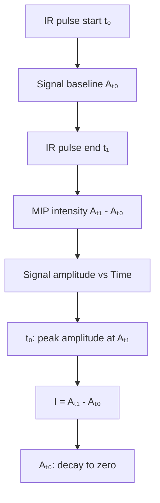

## O P T I C S

# Video-rate mid-infrared photothermal imaging by single-pulse photothermal detection per pixel

Jiaze Yin1 , Meng Zhang1 , Yuying Tan2 , Zhongyue Guo2 , Hongjian He1 , Lu Lan1 , Ji-Xin Cheng1,2,3\*

By optically sensing absorption-induced photothermal effect, mid-infrared (IR) photothermal (MIP) microscope enables super-resolution IR imaging of biological systems in water. However, the speed of current sample-scanning MIP system is limited to milliseconds per pixel, which is insufficient for capturing living dynamics. By detecting the transient photothermal signal induced by a single IR pulse through fast digitization, we report a laser-scanning MIP microscope that increases the imaging speed by three orders of magnitude. To realize single-pulse photothermal detection, we use synchronized galvo scanning of both mid-IR and probe beams to achieve an imaging line rate of more than 2 kilohertz. With video-rate speed, we observed the dynamics of various biomolecules in living organisms at multiple scales. Furthermore, by using hyperspectral imaging, we chemically dissected the layered ultrastructure of fungal cell wall. Last, with a uniform field of view more than 200 by 200 square micrometer, we mapped fat storage in free-moving Caenorhabditis elegans and live embryos.

Copyright © 2023 The Authors, some rights reserved; exclusive licensee American Association for the Advancement of Science. No claim to original U.S. Governmen Works. Distributed under a Creative Commons Attribution NonCommercial License 4.0 (CC BY-NC)

## INTRODUCTION

Recently developed mid-infrared (IR) photothermal (MIP) microscopy, also called optical photothermal IR microscopy, has enabled super-resolution IR imaging in the far field (1–3). MIP microscopy uses a visible beam to probe a localized and transient temperature rise induced by a nanosecond-pulsed IR excitation. Such local tem perature modulation introduces thermal expansion and refractive index alteration. Those changes are collectively revealed by detect ing the scattering intensity modulation of a probe beam at visible wavelength, enabling IR spectroscopic imaging at the submicron scale (4, 5). Moreover, the indirect measurement by a visible beam bypasses the water absorption issue and allows photothermal IR imaging of living systems. Since the first high-quality live-cell imaging demonstration in 2016 (4), this method is quickly expand ed with various innovations including fluorescence detection (6–8), optical phase detection (9–12), photoacoustic detection (13), and integration with computational tomography (14, 15). MIP microscopy has been commercialized into a product termed miRage and has enabled very broad applications, as summarized in recent reviews (1, 3).

Optically detected photothermal imaging measures a small modulation on a large background (16). Generally, such a task i achieved through heterodyne detection at the IR pulse repetition rate via a lock-in amplifier. Because of the nature of the photother mal process, the demodulation frequency is below megahertz (17), where large laser noise exists (18). To beat the laser noise, a pixel acquisition time of a few milliseconds is required (2, 4, 19). Spatially multiplexed photothermal detection using a complementary metal oxide semiconductor (CMOS) camera much improved the detec tion efficiency and maximum frame rate. In such wide-field MIP systems, photothermal contrast is acquired by subtracting the camera-captured frames between IR on and IR off status (9, 14, 20). However, a common CMOS sensor has a limited photon budget on the level of tens of thousands electrons. Consequently, frame averaging is mandatory to resolve the subtle modulation depth (12, 20, 21). Furthermore, excitation fluence of weakly focused IR quickly diminishes with the field of view (FOV). High-energy mid-IR laser source must be used for compensation. Collectively, the imaging speed of current mid-IR photothermal microscope is limited to seconds or minutes per frame for biologica specimens, which is insufficient to capture quick dynamics inside living systems or large area mapping with a high throughput. Here, we report a single-pulse laser-scanning MIP microscope that allows high-sensitivity and high-speed imaging at video rate.

To achieve video-rate scanning-based imaging, it is necessary to have a system response at each pixel that is submicrosecond (22). Unlike coherent Raman microscopy, the modulation rate in photo thermal microscopy is limited to 1 MHz or lower to avoid thermal accumulation in photothermal microscopy (17). In such a scenario, the photothermal contrast at each pixel needs to be extracted within a single IR excitation period, which makes lock-in filtering ineffec tive in picking up the signal from the noisy background (23). We overcome this difficulty by substituting the lock-in–based narrow band detection with a wideband amplifier and a megahertz digitizer for time-gated detection. Using this method, the photothermal modulation induced by a single IR pulse can be resolved in the time domain (18). With improved system response, a faster imaging scheme rather than sample scanning is needed to match the expected pixel dwell time of microseconds. To address this issue, we use two sets of galvo mirrors for synchronized scanning of both the focused mid-IR and the visible probe beams and achieve a line rate of more than 2 kHz. These synergistic innovations allow microsecond-scale acquisition of photothermal signal from a single IR pulse at each pixel. The system provides video-rate (25-Hz) imaging (150 by 100 pixels) of chemical dynamics in a living cell. Moreover, synchronized scanning of IR and visible beam allows uniform illumination of a large FOV (more than 400 μm) fo high-throughput chemical scrutinization. With such capacity, we captured fast lipid dynamics inside a living fungal cell. Video-rate imaging further allowed the spectroscopic decomposition of a

1 Department of Electrical & Computer Engineering, Boston University, Boston, MA 02215, USA. 2 Department of Biomedical Engineering, Boston University, Boston, MA 02215, USA. 3 Photonics Center, Boston University, Boston, MA 02215, USA. \*Corresponding author. Email: jxcheng@bu.edu

single-cell wall. The ultrastructure of the cell wall (outer wall, inner wall, and membrane) is revealed on the basis of their distinct IR ab sorption. Compared with the previous lock-in–based sample-scanning MIP microscope (4, 5, 19), our system increases the speed by three orders of magnitude (from millisecond per pixel to microsec ond per pixel). Broad applications to a wide range of living systems are demonstrated. The results are detailed below.

## RESULT

## Video-rate MIP microscope

As depicted in Fig. 1A, our video-rate MIP imaging system is built on an inverted microscope frame. The IR excitation beam is provid ed by a pulsed quantum cascade laser (MIRcat 2400, Daylight Solu tions). The IR repetition rate is controlled externally between 500 kHz and 1 MHz, with a duty cycle of less than 30%. The probe beam is provided by a continuous wave laser with a center wave length of 532 nm (Samba 532, Cobolt). The probe beam is rapidly scanned by a pair of dual axis galvo mirrors (Saturn 1B, Scanner MAX) with the highest resonant frequency at 3 kHz. The scanned probe beam is conjugated to the back pupil of the objective lens with a scan lens (f = 75 mm; doublet pair of AC508-150-A, Thorlabs) and a tube lens (f = 180 mm; TTL180-A, Thorlabs), introducing a beam expansion of 2.4 times. The probe beam is focused on the sample through a water immersion objective lens [×60; numerical aperture (NA), 1.2; UPlanSApo, Olympus]. The IR excitation is scanned by another pair of X-Y galvo mirrors (GVS002, Thorlabs). Reflective conjugation (see Zemax simulation in fig. S1) using concave mirrors as scan lens (f = 150 mm; CM254-150-P01, Thorlabs) and tube lens (f = 250 mm; CM254-250-P01, Thorlabs) relays the IR scanning to the back pupil of a reflective objective lens with 0.5 NA (×40; NA, 0.5; LMM40X-P01, Thorlabs). The design of all-re flective scanning and conjugation avoids chromatic aberration to meet the requirement for IR spectroscopic imaging. The focus of the IR beam is aligned to overlap with the visible focus before imaging. During the imaging process, the IR focal spot is synchro nously scanned with the visible probe, which maintains uniform ex citation and probing in a large FOV. The two pairs of galvo are synchronously scanned with an angle scaling factor calculated by the focal lengths of visible and IR objectives and the beam expansion ratio of the relay systems, which is calibrated at the beginning of the experiment.


<details>
<summary>flowchart</summary>


</details>


<details>
<summary>flowchart</summary>

```mermaid
graph TD
  A["Digitizer"] --> B["Ch1"]
  A --> C["Ch2"]
  A --> D["Ch3"]
  B --> E["Amp"]
  C --> F["GV1"]
  D --> G["MCT"]
  E --> H["HP"]
  F --> I["PD"]
  G --> J["GV2"]
  I --> K["DAC"]
  J --> K
    style A fill:#f9f,stroke:#333
    style K fill:#f9f,stroke:#333
    note right of A Trigger in
```
</details>


<details>
<summary>text_image</summary>

C
CM1 f = 150 mm
f₂ = 5 mm f₁ = 3 mm fₜᵤₑ = 180 mm fₛcan = 75 mm
f₁sinθ₁ = f₂sinθ₂
fₜᵤₑsinθ₁ = fₛcansinθ₀
CM2 f = 250 mm
GV2
IR
GV1
</details>


<details>
<summary>line chart</summary>

| Time | GV1 | GV2 |
|------|-----|-----|
| 0    | 0   | 0   |
| 1    | 1   | 0   |
| 2    | 0   | 1   |
| 3    | 1   | 0   |
| 4    | 0   | 0   |
| 5    | 1   | 1   |
| 6    | 0   | 0   |
| 7    | 0   | 0   |
| 8    | 1   | 1   |
| 9    | 0   | 0   |
| 10   | 0   | 0   |
| 11   | 1   | 1   |
| 12   | 0   | 0   |
| 13   | 0   | 0   |
| 14   | 1   | 1   |
| 15   | 0   | 0   |
| 16   | 0   | 0   |
| 17   | 0   | 0   |
| 18   | 1   | 1   |
| 19   | 0   | 0   |
| 20   | 0   | 0   |
| 21   | 0   | 0   |
| 22   | 1   | 1   |
| 23   | 0   | 0   |
| 24   | 0   | 0   |
| 25   | 0   | 0   |
| 26   | 0   | 0   |
| 27   | 1   | 1   |
| 28   | 0   | 0   |
| 29   | 0   | 0   |
| 30   | 0   | 0   |
| 31   | 0   | 0   |
| 32   | 1   | 1   |
| 33   | 0   | 0   |
| 34   | 0   | 0   |
| 35   | 0   | 0   |
| 36   | 0   | 0   |
| 37   | 1   | 1   |
| 38   | 0   | 0   |
| 39   | 0   | 0   |
| 40   | 0   | 0   |
| 41   | 0   | 0   |
| 42   | 1   | 1   |
| 43   | 0   | 0   |
| 44   | 0   | 0   |
| 45   | 0   | 0   |
| 46   | 0   | 0   |
| 47   | 0   | 0   |
| 48   | 1   | 1   |
| 49   | 0   | 0   |
| 50+  | V1  | V2*=(f₁/f₂)*γ
</details>


<details>
<summary>line chart</summary>

| Signal Type       | Description                     |
| ----------------- | ------------------------------- |
| Ch1 signal        | Green waveform with peaks     |
| Ch2 galvo position| Blue linear trend               |
| Ch3 IR pulse      | Red square pulses                |
</details>


<details>
<summary>flowchart</summary>


</details>

Fig. 1. A synchronized laser scanning mid-IR photothermal microscope with single-pulse digitization at each pixel. (A) Setup. OL, objective lens; RL, reflectiv objective lens; TL, tube lens; SL, scan lens; CM, concave mirror; GV, galvo mirrors; PD, photodiode; BS, 50/50 beam splitter; DM, infrared (IR)/visible dichroic mirror; MCT mercury-cadmium-telluride detector. (B) Acquisition and control diagram. Ch, acquisition channel; Amp, voltage amplifier; HP, high-pass filter; DAC, digital-to-analog converter. The DAC provides the driving signals for the two sets of GVs and line triggers for digitizer. The PD and MCT detects the photothermal signal and the IR puls intensity, respectively. (C) Scheme for synchronized scanning of IR excitation and visible probe beams. (D) Driving signals for galvo synchronization. f1 and f2 are the foca length of visible and IR objectives, respectively. γ is the ratio of beam expansion between visible and IR relay systems. (E) Synchronized recording of mid-IR phototherma (MIP) intensity, galvo positions, and IR pulse intensity at the digitizer. (F) Signal processing scheme. The IR heating start is monitored by MCT and denoted a $t _ { 0 } ,$ , and th corresponding signal amplitude is baseline $A _ { \mathrm { t 0 } } .$ The peak of temperature rising and photothermal signa $A _ { t 1 }$ arrive at the IR pulse end t1. The MIP intensity is a subtraction of peak amplitude $A _ { t 1 }$ by baseline $A _ { t 0 } .$ .

The probe beam carrying the modulation signals is reversely scanned by the galvo and detected in either forward or backward directions by two silicon photodiodes (DET100A2, Thorlabs). The photodiode is terminated with 50 ohms of impedance (T4119, Thorlabs) for converting the photocurrent into a voltage signal. The voltage signal carrying the modulation is sent to a high-pass filter with a cutoff frequency at 0.23 MHz (ZFHP-0R23-S+, Mini-Circuits) for rejecting the scanning background arising from the sample disturbance (illustrated as fig. S2) and the laser noise. The filtered signal is then connected to two cascaded low-noise voltage amplifiers with a gain of 46 dB each (SA-230F5, NF Corporation). The amplified signal is directly sent to a high speed digitizer with a sampling rate of 50 million samples per second (Oscar 14, GaGe Applied). The IR pulse monitored by a mercury-cadmium-telluride (MCT) detector (PVM-10.6, VIGO System) is simultaneously acquired by the same digitizer, serving as triggers for time-gated detection. The acquisition and control diagram is shown in Fig. 1B. A detailed illustration of the synchro nized scanning of two counterpropagating beams is shown in Fig. 1C. Two pairs of galvo mirrors are controlled with analog driving voltage from a four-channel digital-to-analog converter (DAC) (PCIe-6363, National Instruments). The analog driving signals are scaled with the corresponding scanning angle given by the focal length and relay optics as illustrated in Fig. 1D.

During the imaging process, the digitizer accepts the line triggers from DAC and synchronously records the MIP signal, galvo posi tions, and IR excitation triggers line by line as depicted as Fig. 1E. The raw photothermal signal of each line is first divided into smal segments according to the IR triggers. Each segment contains a single-pulse modulation, as illustrated in Fig. 1F. The single-pulse contrast at each pixel is then extracted by time-gated detection. More specifically, the contrast is a subtraction of the signal ampli tude before IR pulse heating (t ) from that after IR pulse heating $( t _ { 1 } )$ . With acquired MIP intensity of each pixel, the image is then reconstructed according to the scanning trajectory given by the galvo sensor.

## High signal-to-noise ratio over a large FOV

To evaluate the effectiveness of our single-pulse MIP microscope, we used polymethyl methacrylate (PMMA) particles with a diame ter of 500 nm. These particles were initially diluted with deionized water and subsequently spread onto a calcium fluoride CaF sub strate with a thickness of 0.2 mm for imaging purposes. The photo thermal signal was detected through backward scattering. The quantum cascade laser (QCL) laser was fired at a frequency of 500 kHz, with a pulse width of 400 ns. The laser scan imaging was conducted using a pixel dwell time of 2 μs, corresponding to a single pulse per pixel and a video rate for an image of 150 by 100 pixels. By adjusting the IR excitation to $1 7 2 9 \mathrm { c m } ^ { - 1 }$ , which corresponds to the absorption peak of the C═O bond of PMMA, our wideband detection system was able to distinctly capture the single-pulse photo thermal signal emanating from a single particle, as shown in Fig. 2A. The raw data from the digitizer are shown in black in the graph, representing the signal when the IR pump and visible probe lasers scan across the center of a particle at a speed of 50 nm/μs. The synchronously acquired IR triggers are displayed in red. The trace is divided into single-pulse segments, as illustrated in Fig. 2B, based on the IR triggers. Note that because of the high-pass filter removing low-frequency components, the raw signal has a nonzero baseline. To compensate for the baseline shift, the contrast of each segment is extracted by subtracting the amplitude between two gating windows before IR pulse heating (t0) and after IR pulse heating (t ). By assigning the contrast to pixels spaced 100 nm apart, the particle’s profile is revealed, as shown in Fig. 2C. The photothermal image is then acquired by performing raster scanning, as illustrated in Fig. 2D. A signal-to-noise ratio (SNR) of 86 was successfully ob tained for a single PMMA particle with a diameter of 500 nm. The system spatial resolution is then characterized by using the same sample, as shown in fig. S3. The deconvolution of the image with the actual particle size along the lateral and axial direction provide an estimation of the three-dimensional (3D) point spread function, resulting in a lateral resolution of 231 nm and an axial resolution of 386 nm.

In addition to video-rate MIP imaging, with synchronously scanned IR and visible lasers, a uniform imaging FOV of more than 400 μm can be maintained without compromising the sensi tivity. Here, we show single-pulse imaging of 500-nm PMMA par ticles in a large area, as shown in Fig. 2E. The imaging size of 2000 by 2000 is set with a pixel size of 200 nm, and chemical contrast is achieved by tuning the IR excitation to 1729 cm−1 . The inset of Fig. 2E displays a zoom-in image. The uniformity is evaluated by measuring the single-particle SNR across the FOV, as shown in Fig. 2F. With the synchronized scanning scheme, a high SNR of ap proximately 100 is maintained more than a 400-μm area, which is approximately 60 times greater than the IR focal spot. In conclu sion, our laser scanning MIP microscope supports high-throughpu applications that require submicron-resolution imaging of more than a 400-μm FOV without the need for sample movement.

## Video-rate MIP imaging reveals organelle activity in living fungal cells

Resolving organelle activity in a highly dynamic system requires high detection sensitivity and speed (24). Leveraging the large IR absorption cross section and fast scanning scheme, we demonstrate chemical imaging of small organelle dynamics inside living cell using the single-pulse MIP microscope. The lipids in fungi serve important functions including energy storage, membrane construc tion, and precursor synthesis (25). By tuning the IR excitation to $1 7 4 0 ~ \mathrm { c m } ^ { - \mathrm { \hat { 1 } } }$ corresponding to the absorption peak of the C═O bond in esterified lipid, the individual lipid droplets (LDs) can be specifically imaged with high spatial resolution in 3D, as shown in fig. S4.

By adjusting the focus to the center of the fungal cell Candida albicans, we were able to capture the rapid dynamics of lipid inside the cell at a speed of 20 Hz (see movie S1). Two types of LDs are differentiated on the basis of their distinct dynamics. A larger LD is localized in the cytoplasm with a relatively static posi tion. On the contrary, a fast-moving LD is seen in the vacuole of the cell. The vacuole inside fungal cells plays an important role of LD biogenesis and degradation. The high lipid motility inside a living fungal vacuole was revealed, as shown in Fig. 3A. With video-rate imaging speed, those fast dynamics can be resolved without distor tion. The time-lapse projection along the indicated line in Fig. 3A illustrates how the LD moved around the vacuole, as shown in Fig. 3B. The constant signal level from the cell membrane indicate no photobleaching. The trajectory of the LD is shown as a color coded image in Fig. 3C over an 8-s time period. Collectively, by re solving the fast organelle dynamics, our method can be used to study LD internalization or degeneration in response to nutritional environment alternations as well as cellular response to a treatment.

A  


<details>
<summary>line chart</summary>

| Time (μs) | Raw signal (V) | IR pulse (V) |
|-----------|----------------|--------------|
| ~15       | ~0.0           | ~0.0         |
| ~20       | ~-0.4          | ~-0.2        |
| ~25       | ~-0.6          | ~-0.3        |
| ~30       | ~-0.4          | ~-0.2        |
| ~35       | ~0.0           | ~0.0         |
</details>

B  


<details>
<summary>line chart</summary>

| Time (μs) | P7    | P8    | P9    | P10   | P11   | P12   | P13   | P14   | P15   | P16   |
|-----------|-------|-------|-------|-------|-------|-------|-------|-------|-------|-------|
| 0.0       | 0.0   | 0.0   | 0.0   | 0.0   | 0.0   | 0.0   | 0.0   | 0.0   | 0.0   | 0.0   |
| 0.5       | 0.2   | 0.3   | 0.4   | 0.5   | 0.6   | 0.7   | 0.8   | 0.9   | 1.0   | 1.1   |
| 1.0       | 0.0   | 0.0   | 0.0   | 0.0   | 0.0   | 0.0   | 0.0   | 0.0   | 0.0   | 0.0   |
| 1.5       | -0.2  | -0.1  | -0.1  | -0.1  | -0.1  | -0.1  | -0.1  | -0.1  | -0.1  | -0.1  |
| 2.0       | -0.2  | -0.1  | -0.1  | -0.1  | -0.1  | -0.1  | -0.1  | -0.1  | -0.1  | -0.1  |
</details>

C  


<details>
<summary>line chart</summary>

| Distance (μm) | Amplitude (V) |
| ------------- | ------------- |
| 0.0           | 0.0           |
| 0.5           | -0.1          |
| 1.0           | -0.6          |
| 1.2           | -0.8          |
| 1.5           | -0.6          |
| 2.0           | -0.1          |
| 2.5           | 0.0           |
</details>

D  


<details>
<summary>text_image</summary>

1729 cm⁻¹
5 µm
MIP intensity (V)
2
0
</details>

E  


<details>
<summary>text_image</summary>

1729 cm⁻¹
Zoom in
5 µm
50 µm
</details>

F  


<details>
<summary>line chart</summary>

| Distance (μm) | Single-particle SNR |
| ------------- | ------------------- |
| -200          | ~100                |
| -100          | ~150                |
| 0             | ~180                |
| 100           | ~120                |
| 200           | ~80                 |
</details>

Fig. 2. Single-pulse mid-IR photothermal imaging of 500-nm PMMA particles. (A) Raw data from the digitizer, with the black curve representing the photothermal signal, and the red curve representing the IR pulse triggers. The laser is scanned at the speed of 50 nm/μs. (B) Single-pulse segments divided according to IR triggers, with the contrast of each segment being the amplitude difference between time poin $t _ { 1 }$ and after $t _ { 0 } . ( \mathbf { C } )$ Extracted particle contrast from (A). (D) Reconstructed phototherma image of 500-nm-diameter polymethyl methacrylate (PMMA) particles with IR excitation at $1 7 2 9 \mathsf { c m } ^ { - 1 }$ 1. Indicated dashed line corresponds to the signal shown in (A). Scale bar, 5 μm. (E) Single-pulse imaging of 500-nm-diameter PMMA particles in a large field of view (FOV). Scale bar, 50 μm. Inset: Zoomed in image of indicated area. Scale bar 5 μm. (F) Single-particle signal-to-noise ratio (SNR) evaluated in the whole FOV. FWHM, full width at half maximum.

## Spectroscopic MIP imaging reveals layered composition of a fungal cell wall

The fungal cell wall is majorly composed of layered polysaccharides (mannans, glucan, and chitin). Imaging the cell wall without label ing remains difficult due to its extreme thin thickness of 100 to 300 nm (26, 27). Moreover, fast imaging speed is required to avoid the distortion caused by sample movement. With the chemical specif icity and submicron resolution, our single-pulse MIP microscope allows visualization of such structure in a living cell. By tuning the IR excitation to 1740 cm−1 that corresponds to the absorption of C═O bond in triglyceride, LDs inside the cells are seen clearly. Notably, by tuning the IR excitation to $1 0 7 0 \mathrm { c m } ^ { - 1 }$ that corresponds to the absorption of C─O bond in carbohydrate, the cell wall of in dividual fungi cells is clearly resolved, as shown in Fig. 4A. The cell wall, indicated by a dashed line in Fig. 4A, has the full width at half maximum (FWHM) of 326 nm, corresponding to a thickness of 239 nm after deconvolution with point spread function.

Next, leveraging the improved imaging throughput and the fast tuning function of the QCL, we extended the system’s ability for high-speed mid-IR spectroscopic imaging. As shown in Fig. 4B, hy perspectral imaging is accomplished by continuously acquiring MIP images, while the QCL sweeps the emission wavelength. Laser triggers are used to synchronize the frame numbers of the video with their corresponding wave numbers. The accuracy of hyperspectral imaging is confirmed using PMMA particles with a known peak location at $1 7 2 9 ~ \mathrm { { c m } ^ { - 1 } }$ , as depicted in fig. S5. After validating the method, we then focused on the fungal cell wal and resolved its layered ultrastructure based on their composition difference.

To provide molecular insights into the cell wall composition, spectroscopic imaging was performed by sweeping QCL from 900 to $1 2 0 0 ~ \mathrm { { c m } ^ { - 1 } }$ . We performed imaging at speed of 10 frames per second and swept the laser wavelength at the speed of $5 0 ~ \mathrm { c m } ^ { - 1 } ,$ , offering an effective spectral resolution at $5 ~ \mathrm { { c m } ^ { - 1 } }$ (see movie S2). No cell damage was observed during the imaging period, as shown in fig. S6, by the simultaneously acquired transmission images. The sum-up intensity of the hyperspectral stack is shown in Fig. 4C. The IR spectrum in the $\mathrm { C - O }$ group region can be clearly resolved at each pixel. In the color-coded hyperspectral image, an obvious layered structure of the cell wall can be observed due to the spectrum difference. Image deconvolution of indicated area in Fig. 4C is shown in Fig. 4D, where a distinctive three-layer structure model was seen. This result indicates a higher resolving capability than single color MIP. Note that the spatial resolution of single-color MIP imaging is still the diffraction limit of visible probe light. The structure below the diffraction limit can be revealed through spectral discrimination. Spectroscopic imaging has been used for improved the spatial resolution of single-molecule localization microscopy by using dyes having different excitation and emission spectra (28, 29). Here, we show that spectroscopic MIP imaging could resolve subdiffraction objects based on their distinct absorp tion spectra and potentially be used for improving the imaging res olution, as both SNR and spectral distance are high (30). To furthe explore the chemical composition, we extract the spectrum of indi cated pixels, as shown in Fig. 4 (E to G). The outer layer shows a sharp peak located in 1050 cm−1 , majorly contributed by outer wall composed of N-mannan (27, 31). In the middle of the cell wall, the peak becomes broad and blue-shifted due to the mix of multiple glucan and chitin corresponding to the inner wall structure (27), which displays a central peak at $1 0 8 0 ~ \mathrm { { c m } ^ { - 1 } }$ . The inner layer is majorly contributed by the membrane, which, given an absorption, peaked at the higher wave number of 1150 cm−1 . The comparison of the three-layer spectra is shown in Fig. 4H. The fungal cell wall plays an important role for maintain cell function and proliferation (26, 27). It is also the most common target of antifungal drugs for pathogenetic yeast. Direct investigation of its chemical composition and morphology change during cell-drug interaction can fuel up the development of treatment methods.

  
Fig. 3. Video-rate MIP imaging reveals fast lipid dynamics inside a fungal vacuole. (A) Lipid movements recorded at different time points. IR excitation tuned to 1740 cm−1 according to the absorption peak of lipids. Scale bar, 1 μm. (B) Y-t view of the line indicated in (A). (C) Temporal color-coded image showing the dynamics of the lipid droplets (LDs). The static features such as the cell membrane show a white color. Scale bar, 1 μm.

## Large-area single-pulse MIP imaging of chemical dynamics in living systems

To demonstrate the imaging capability on more complex living systems, we further apply the single-pulse MIP system to acquire the dynamics of cancer cells and multicellular organism Caenorhabditis elegans. OVCAR-5 ovarian cancer cells were cultured and imaged with living cell medium as buffer. By tuning the excitation into $1 5 5 3 ~ \mathrm { c m } ^ { - 1 }$ according to the absorption peak of Amide II band, the protein map was acquired and shown in Fig. 5A. With a pixel dwell time of 2 μs, a frame rate of 8 Hz was selected to map the whole cell body with fine spatial resolution. With MIP signals from proteins, the dynamics of mitochondria and nucleus can be clearly resolved (movie S3). The movements of indicated area at different time points are shown in Fig. 5B. By tuning the excitation to 1740 cm−1 according to the peak of C═O bond in ester, the LDs inside the cell are clearly resolved, as shown in Fig. 5C. Unlike the lipid dynamics shown in fungal cells, the LDs in cancer cells show direc tional transportation (movie S4), as indicated in Fig. 5D. It is known that LDs participate in cell cellular metabolism and coordinate between different organelles as a hub. By resolving the dynamics of such small organelles, our method provides a scheme for investigating metabolic activity in living conditions.

To demonstrate in vivo chemical imaging ability, we performed single-pulse MIP imaging of live C. elegans, a model animal exten sively used for studying metabolism in disease. Current methods for compositional imaging in C. elegans heavily rely on fluorescent dyes, and live imaging is primarily performed at the embryonic stage. Imaging postembryonic activity is limited to fixed biological samples. Although transgenic fluorescence has been applied, it remains difficult for resolving various chemical composition inside a live worm (32). Leveraging the label-free chemical imaging capability, we applied our system to live C. elegans. Ou method is applicable for examining cell dynamics during both em bryonic and postembryonic stages. By tuning the excitation to 1740 $\mathrm { c m } ^ { - 1 }$ , the stored lipid in epidermis can be clearly resolved (see movie S5), as shown in Fig. 5E, which is the main triglyceride depot. Moreover, by imaging its reproductive system, strong signals from lipid are seen inside the developing embryos (movie S6), as shown in Fig. 5F. During the imaging period, no photodamage was observed on the living system for continuous imaging over minutes. With the capability of in vivo imaging on C. elegans, we envision that the single-pulse MIP microscope can provide a way to investigate the molecules involved in life development.

## DISCUSSION

By using high-speed digitization and synchronous scan of IR and visible beams, the current work pushed the MIP imaging speed to the level of single IR pulse per pixel, enabling video-rate chemical imaging of living dynamics. With much improved throughput, we further extend the system for fast mid-IR photothermal spectro scopic imaging of living cells. For realizing the speed boost, we first used a lock-in–free demodulation method via high-speed digi tization. This method improved the system response for single-cycle photothermal demodulation and enabled high detection sensitivity at microsecond pixel dwell time. Subsequently, we implemented synchronized scanning of counterpropagated probe and pump beam to enable photothermal imaging with a line rate of more than 2 kHz in a uniform FOV of more than 400 μm and with a spatial resolution down to 230 nm.

A  


<details>
<summary>natural_image</summary>

Microscopic image showing fluorescently labeled cellular structures with scale bar (10 μm) and concentration labels (1070 cm⁻¹ + 1740 cm⁻¹), no readable text or symbols beyond annotations.
</details>

B  


<details>
<summary>text_image</summary>

I
LW
Sweeping (50 cm⁻¹/s)
HW
t
5 cm⁻¹
5 cm⁻¹
100 ms
Continuous scan t
</details>

C  


<details>
<summary>text_image</summary>

Spectroscopic stack
D
I M O
5 µm
1085 cm⁻¹ 1220 cm⁻¹
</details>

E  


<details>
<summary>line chart</summary>

| Sample | Peak Intensity (V) |
|--------|--------------------|
| O1     | 0.015              |
| O2     | 0.020              |
| O3     | 0.025              |
| O4     | 0.030              |
| O5     | 0.035              |
</details>

G


<details>
<summary>line chart</summary>

| Wave number (cm⁻¹) | Intensity (V) |
| ------------------ | ------------- |
| 900                | 0.015         |
| 950                | 0.025         |
| 1000               | 0.035         |
| 1050               | 0.040         |
| 1100               | 0.042         |
| 1150               | 0.038         |
| 1200               | 0.025         |
| 1250               | 0.015         |
</details>

F  


<details>
<summary>line chart</summary>

| X | I1 | I2 | I3 | I4 | I5 |
| --- | --- | --- | --- | --- | --- |
| 0 | 0.018 | 0.017 | 0.016 | 0.015 | 0.014 |
| 1 | 0.020 | 0.019 | 0.018 | 0.017 | 0.016 |
| 2 | 0.022 | 0.021 | 0.020 | 0.019 | 0.018 |
| 3 | 0.024 | 0.023 | 0.022 | 0.021 | 0.020 |
| 4 | 0.026 | 0.025 | 0.024 | 0.023 | 0.022 |
| 5 | 0.028 | 0.027 | 0.026 | 0.025 | 0.024 |
| 6 | 0.030 | 0.029 | 0.028 | 0.027 | 0.026 |
| 7 | 0.031 | 0.030 | 0.029 | 0.028 | 0.027 |
| 8 | 0.032 | 0.031 | 0.030 | 0.029 | 0.028 |
| 9 | 0.033 | 0.032 | 0.031 | 0.030 | 0.029 |
| 10 | 0.034 | 0.033 | 0.032 | 0.031 | 0.030 |
| 11 | 0.035 | 0.034 | 0.033 | 0.032 | 0.031 |
| 12 | 0.034 | 0.033 | 0.032 | 0.031 | 0.030 |
| 13 | 0.033 | 0.032 | 0.031 | 0.030 | 0.029 |
| 14 | 0.032 | 0.031 | 0.030 | 0.029 | 0.028 |
| 15 | 0.031 | 0.030 | 0.029 | 0.028 | 0.027 |
| 16 | 0.030 | 0.029 | 0.028 | 0.027 | 0.026 |
| 17 | 0.029 | 0.028 | 0.027 | 0.026 | 0.025 |
| 18 | 0.028 | 0.027 | 0.026 | 0.025 | 0.024 |
| 19 | 0.027 | 0.026 | 0.025 | 0.024 | 0.023 |
| 20 | 0.026 | 0.025 | 0.024 | 0.023 | 0.022 |
| 21 | 0.025 | 0.024 | 0.023 | 0.022 | 0.021 |
| 22 | 0.024 | 0.023 | 0.022 | 0.021 | 0.020 |
| 23 | 0.023 | 0.022 | 0.021 | 0.020 | 0.019 |
| 24 | 0.022 | 0.021 | 0.020 | 0.019 | 0.018 |
| 25 | 0.021 | 0.020 | 0.019 | 0.018 | 0.017 |
| 26 | 0.021 | 0.019 | 0.018 | 0.017 | 0.016 |
| 27 | 0.021 | 0.019 | 0.018 | 0.017 | 0.016 |
| 28 | 0.021 | 0.019 | 0.018 | 0.017 | 0.016 |
| 29 | 0.021 | 0.019 | 0.018 | 0.017 | 0.016 |
| 30 | 0.021 | 0.019 | 0.018 | 0.017 | 0.016 |
| 31 | 0.021 | 0.019 | 0.018 | 0.017 | 0.016 |
| 32 | 0.021 | 0.019 | 0.018 | 0.017 | 0.016 |
| 33 | 0.021 | 0.019 | 0.018 | 0.017 | 0.016 |
| 34 | 0.021 | 0.019 | 0.018 | 0.017 | 0.016 |
| 35 | 0.021 | 0.019 | 0.018 | 0.017 | 0.016 |
| 36 | 0.021 | 0.019 | 0.018 | 0.017 | 0.<ecel><nl>

</details>

H


<details>
<summary>line chart</summary>

| Wave number (cm⁻¹) | O     | M     | I     |
| ------------------ | ------- | ------- | ------- |
| 900                | 0.1   | 0.1   | 0.1   |
| 950                | 0.3   | 0.4   | 0.2   |
| 1000               | 0.6   | 0.7   | 0.3   |
| 1050               | 0.8   | 0.9   | 0.4   |
| 1100               | 0.7   | 0.8   | 0.6   |
| 1150               | 0.5   | 0.6   | 0.8   |
| 1200               | 0.2   | 0.3   | 0.9   |
| 1250               | 0.0   | 0.0   | 0.0   |
</details>

Fig. 4. Video-rate MIP enables hyperspectral imaging of fungal cell walls. (A) Multicolor images of fungal cells. IR at $1 0 7 0 ~ \mathsf { c m } ^ { - 1 }$ excites the polysaccharides com ponents inside the cell, where the cell wall gives a strong signal. Scale bar, 10 μm. (B) Hyperspectral MIP imaging scheme. LW, low wave number; HW, high wave number. (C) Fast hyperspectral imaging of fungal cell wall with the excitation from 1085 to $1 2 2 0 \mathsf { c m } ^ { - 1 }$ . The entire stack of 60 frames took 6 s. Scale bar, 5 μm. (D) Image decon volution of indicated area in (C). A three-layer feature can be resolved from the cell wall, indicating a compositional difference. O, outer; M, middle; I, inner. Scale bar, 500 nm. (E to G) Spectra extracted at indicated pixels in (C). (H) Averaged spectra of the three-layer features. a.u., arbitrary units.

Note that the sensitivity of pump-probe detection is determined by the modulation depth over shot noise as long as the laser noise is reasonably suppressed (2, 33). Leveraging the wide bandwidth, the demonstrated single-pulse digitization scheme is more efficient for picking up modulated photons with low duty cycles. In such scenar ios, lock-in detection of the first harmonic signal needs a longer integration time for reaching similar SNR (enough frequency resolution) and clear separation from nearby pixels (fully responded low-pass filter) during imaging. The digitization scheme can be adapted for pushing the imaging speed. For the pump-probe imaging modalities with relaxation time on the picoseconds scale (e.g., impulsive stimulated Raman scattering and transient absorp tion), ultrafast laser pulses are used as probe light for optical gating, and the signal is demodulated from a carrier wave generated by laser beam modulators. The modulation frequency over tens of megahertz can be used, making lock-in detection optimal (22). In these cases, fast digitization would not necessarily result in improved performance.

To bring the MIP imaging speed to the microsecond scale, we used the laser scan instead of traditional sample scan approach. The synchronized laser scanning of counterpropagated IR and visible beams is an innovative approach that effectively addresses issues of nonuniform imaging FOV and hindered sensitivity due to diluted IR fluence in photothermal imaging. The system provide high-quality imaging with uniform signal levels and spatial resolu tion across the entire FOV. In addition, the swiftly scanned IR exci tation and single-pulse detection have reduced overheating caused by prolonged dwelling times (18), enabling the use of higher IR rep etition rates while maintaining the signal amplitude, which are crit ical for high-speed imaging. Notably, mid-IR spectroscopic imaging requires a long wavelength tuning range over thousands of wave numbers. Our all-reflective laser scan design fundamentally solve the chromatic aberration issue, providing quantitative spectroscopic imaging results over the whole fingerprint. The proposed design can be extended to traditional mid-IR spectroscopic imaging (34) to realize a high-speed confocal mid-IR microscope. The counterpropagation system is of broader interest, as it offers advantages for imaging systems that use light at multiple wavelengths and where chromatic aberration cannot be ignored. By dividing the beam path, this system offers greater flexibility in using optics that are wavelength dependent, such as using ultrasound lenses (35) for microsecond focusing tuning. Furthermore, it will be beneficial for forward light detection in a laser scan imaging system, as the forward light is descanned and becomes stable after the synchro nized galvo. This could potentially enhance uniformity and reduce cross-phase modulation in a stimulated Raman scattering and transient absorption system, where the forward light collection is critical.

A  


<details>
<summary>natural_image</summary>

Microscopic image showing blue-stained tissue with scale bar (10 μm) and a 1553 cm⁻¹ measurement annotation (no other text or symbols)
</details>

B  


C  


<details>
<summary>natural_image</summary>

Microscopic image showing red fluorescent particles with a 10 μm scale bar and a 1740 cm⁻¹ scale marker (no textual annotations beyond scale and label)
</details>

D  


E  


<details>
<summary>natural_image</summary>

Microscopic image of lipid storage in epidermis, showing fluorescent cellular structures with 20 μm scale bar (no text or symbols beyond labels)
</details>

F  


<details>
<summary>natural_image</summary>

Fluorescence microscopy image showing lipid storage in embryos with 50 μm scale bar (no text or symbols beyond label and scale)
</details>

Fig. 5. Single-pulse MIP imaging of living cancer cells and C. elegans. (A) Protein dynamics in OVCAR-5 with IR excitation at $1 5 5 3 ~ \mathsf { c m } ^ { - 1 } .$ . Scale bar, 10 μm. (B) Intra cellular movements at different time points. Scale bar, 2 μm. (C) LDs dynamics with IR excitation at 1740 cm−1 . Scale bar, 10 μm. (D) Transportation of LD over time. Scal bar, 2 μm. (E) Map of lipid storage in an adult C. elegans. Scale bar, 20 μm. (F) Map of lipid storage in developing embryos inside worm. Scale bar, 50 μm

For improving the imaging speed, a wide-field mid-IR photo thermal microscope was introduced in 2019 (20). By using spatial multiplexed camera as the detector, it provides the phototherma contrast by taking the difference between two frames captured at heated and cooled down states. This approach achieved a maximum frame rate of 1250 Hz with the 2D sensor used. Optical phase–detected photothermal imaging was subsequently developed by adding a reference optical field to enhance the image contrast (9–12, 36). Recently, frame rates more than hundreds of kilohertz have been reached with the use of an ultrafast CMOS camera (37). The wide-field approach, which uses spatial multiplexed detection, provides a higher maximum frame rate than scanning approaches, making it a useful tool for submillisecond photography. Below, we compare the scanning and wide-field MIP approaches from the perspectives of imaging speed, SNR, and spatial resolution.

First, the photon budget of the detector affects the sensitivity of the system. In pump-probe detection, the SNR is determined by the modulation depth Ω over the shot noise: $\mathrm { S N R } = \Omega N / \sqrt { N } ,$ where N is the total number of probe photons received per pixel. When a CMOS camera is used as the detector, the photon received by each pixel is limited by the well depth capacity of each pixel, which is around tens of ke − (e.g., 15 ke − for pixel size of 5 by 5 μm). The number of frames needed for averaging to achieve a certain SNR can be calculated. The resulting values are plotted in fig. S7, with the modulation depth ranging from 0.05 to 1%. It is shown that a large number of averages is required for fair SNR. Con versely, the scanning approach uses a large-area photodiode that offers more than six orders of magnitude higher photon budget per pixel. This makes it more suitable for detecting small signals.

Second, the photothermal signal amplitude depends on the IR laser intensity. In wide-field excitation, the IR focal spot is loosely focused compared to its diffraction limit, and the laser fluence is diluted with the large illumination radius R compared to the focused condition r. The modulation depth Ω is reduced to $r ^ { 2 } / R ^ { 2 }$ when the same mid-IR laser is used. To compensate for the lost SNR, frame averaging by ${ \cal R } ^ { 4 } / r ^ { 4 }$ times is needed, assuming that a camera pixel has a similar photon budget as a photodiode. Because of these two reasons, developing wide-field approaches re quires a camera with a large well depth capacity and a mid-IR exci tation source with much higher pulse energy, such as an infrared optical parametric oscillator, to achieve high-throughput measure ments. Along these efforts, a rapid antimicrobial susceptibility testing platform is reported using an infrared optical parametric os cillator and a camera with 2 million well-depth capacity (38).

Third, both designs can achieve visible diffraction–limited reso lution determined by the probe wavelength. Photothermal imaging beyond the visible diffraction limit has been achieved in scanning type systems by exploiting the temporal dynamics of photothermal signals (39–41). In principle, this idea can be adapted to wide-field photothermal imaging for enhancing the resolution by using an ul trafast camera to record the photothermal dynamics. In terms of axial resolution, laser scanning is intrinsically parfocal, providing good sectioning ability for 3D imaging in vitro (figs. S3 and S4). Conversely, in wide-field approaches, volumetric information can be obtained through tomography (14, 15) and light field imaging (42), which involve adding multiangle illumination and performing computational reconstruction.

In summary, wide-field MIP imaging could provide extremely high frame rates when a mid-IR laser with a high pulse energy at high repetition rate and a fast camera with a large photon capacity are available. In comparison, the developed laser scan MIP microscope provides video-rate imaging speed at a large FOV using an easy-to-access quantum cascade laser with a wide wavelength tuning range across the entire IR window.

With the improved imaging speed to video rate, we demonstrat ed mid-IR scrutinizing of rapid organelle activity inside a living cell. It provides an unparalleled advantage over the near-field IR imaging methods that require sample epoxy embedding and ultramicrotome cuts sectioning (43, 44), thereby hindering live-cell analysis. In ad dition to dynamic imaging, our system advanced single-color MIP imaging toward fast spectroscopic imaging. By dissecting the fungal cell wall based on unique polysaccharide spectra at each layer, we are able to investigate its chemical composition at the ultrastructure level in living cells. This capability could be a valuable tool in microbiology, allowing for the study of the diverse functions of cell walls and the development of diagnostics and drugs to combat severe fungal infections (27). Moreover, the spectroscopic dissection ability can be combined with localization algorithms to resolve adjacent objects with spectral distance (30). Collectively, with the high sensitivity and the video-rate imaging speed, the developed platform enables dynamics imaging of fast cellular processes with IR specificity at a subcellular resolution. This capability will facilitate future research into the functions of biological molecules within their native living environments, leading to discoveries in bi omedicine and other fields.

## METHODS AND MATERIALS

## Mid-IR spectroscopic imaging

To perform the mid-IR spectroscopic imaging, the QCL is operated in continuous sweeping mode from 900 to $1 2 0 0 ~ \mathrm { { c m } ^ { - 1 } }$ . We performed imaging at speed of 10 frames per second and swept the laser wavelength at the speed of 50 cm−1 , offering an effective spectral resolution of $5 ~ { \mathrm { c m } } ^ { - 1 }$ . To calibrate the wave numbers of each frame, the imaging system is triggered by the QCL when the sweeping begins for continuous imaging of 6 s. The acquisition ends when the QCL finishes the sweeping. The start and end frames correspond to the setting wavelengths.

The hyperspectral dataset is analyzed and displayed with ImageJ. The frames with wave numbers from 1085 to 1220 cm−1 are assigned with linear stretched colors from the look-up table “Spec trum” from red to purple using the temporal color code function. Deconvolution is performed using ImageJ. The point spread function file is first generated by the plugin “point spread function (PSF) generator” (45) with probe wavelength at 532 nm and 1.2 NA. Deconvolution is performed with the plugin “Parallel Spectral Deconvolution” with the generalized Tikhonov regularization method.

## PMMA particles

The PMMA particles with a nominal diameter of 500 nm in solu tion form were first diluted with deionized water. Around 2 μl of the solution was then dropped on the surface of a calcium fluoride (CaF2) substrate with a thickness of 0.2 mm for imaging. The photo thermal signal was detected from backward scattering.

## C. albicans fungal cells

C. albicans isolates (strain number 55) were cultured in yeast extract peptone dextrose overnight at 37°C with 250 revolutions per minute shaking. The 500-μl Candida suspension was centrifuged, washed three times with phosphate-buffered saline, and diluted in phos phate-buffered saline. Around 15 μl of the solution was then dropped on the surface of a $\mathrm { C a F } _ { 2 }$ substrate with a thickness of 0.2 mm and sandwiched with a 0.15-mm-thick coverslip. The photo thermal signal was detected from forward scattering.

## OVCAR-5 cancer cells

OVCAR-5 ovarian cancer cells were cultured on $\mathrm { C a F } _ { 2 }$ substrate fo 24 hours. The culture medium was substituted by phosphate-buff ered saline right before imaging. During the imaging, the cell was sandwiched between the CaF substrate and a 0.15-mm-thick cov erslip. Spacer with a thickness of 0.25 mm was used for maintaining the medium buffer. The photothermal signal was detected from forward scattering.

## C. elegans strains

C. elegans strains, wild type (N2) and CB1370 [daf-2(e1370)], were obtained from the Caenorhabditis Genetics Center. C. elegans strains were cultured on agar plates seeded with OP50 Escherichia coli. For all experiments, the worms were suspended in phosphate buffered saline. Around 15 μl of the solution was then dropped on the surface of a CaF substrate with a thickness of 1 mm and sand wiched with a 0.15-mm-thick coverslip right before imaging.

## Supplementary Materials

This PDF file includes:

Figs. S1 to S7

Legends for movies S1 to S6

Other Supplementary Material for this

manuscript includes the following:

Movies S1 to S6

## REFERENCES AND NOTES

1. Y. Bai, J. Yin, J.-X. Cheng, Bond-selective imaging by optically sensing the mid-infrared photothermal effect. Sci. Adv. 7, eabg1559 (2021).  
2. I. M. Pavlovetc, E. A. Podshivaylov, R. Chatterjee, G. V. Hartland, P. A. Frantsuzov, M. Kuno, Infrared photothermal heterodyne imaging: Contrast mechanism and detection limits J. Appl. Phys. 127, 165101 (2020).  
3. Q. Xia, J. Yin, Z. Guo, J.-X. Cheng, Mid-infrared photothermal microscopy: principle, in strumentation, and applications. J. Phys. Chem. B. 126, 8597–8613 (2022)  
4. D. Zhang, C. Li, C. Zhang, M. N. Slipchenko, G. Eakins, J. X. Cheng, Depth-resolved mid infrared photothermal imaging of living cells and organisms with submicrometer spatia resolution. Sci. Adv. 2, e1600521 (2016).  
5. Z. Li, K. Aleshire, M. Kuno, G. V. Hartland, Super-resolution far-field infrared imaging by photothermal heterodyne imaging. J. Phys. Chem. B. 121, 8838–8846 (2017)  
6. M. Li, A. Razumtcev, R. Yang, Y. Liu, J. Rong, A. C. Geiger, R. Blanchard, C. Pfluegl, L. S. Taylor G. J. Simpson, Fluorescence-detected mid-infrared photothermal microscopy. J. Am. Chem. Soc. 143, 10809–10815 (2021).  
7. Y. Zhang, H. Zong, C. Zong, Y. Tan, M. Zhang, Y. Zhan, J. X. Cheng, Fluorescence-detecte mid-infrared photothermal microscopy. J. Am. Chem. Soc. 143, 11490–11499 (2021)  
8. A. Razumtcev, M. Li, J. Rong, C. C. Teng, C. Pfluegl, L. S. Taylor, G. J. Simpson, Label-free autofluorescence-detected mid-infrared photothermal microscopy of pharmaceutica materials. Anal. Chem. 94, 6512–6520 (2022).  
9. D. Zhang, L. Lan, Y. Bai, H. Majeed, M. E. Kandel, G. Popescu, J.-X. Cheng, Bond-selective transient phase imaging via sensing of the infrared photothermal effect. Light Sci. Appl. 8, 116 (2019).  
10. K. Toda, M. Tamamitsu, Y. Nagashima, R. Horisaki, T. Ideguchi, Molecular contrast on phase contrast microscope. Sci. Rep. 9, 9957 (2019).  
11. M. Schnell, S. Mittal, K. Falahkheirkhah, A. Mittal, K. Yeh, S. Kenkel, A. Kajdacsy-Balla P. S. Carney, R. Bhargava, All-digital histopathology by infrared-optical hybrid microscopy. Proc. Natl. Acad. Sci. U.S.A. 117, 3388–3396 (2020)  
12. T. Yuan, M. A. Pleitez, F. Gasparin, V. Ntziachristos, Wide-field mid-infrared hyperspectral imaging by snapshot phase contrast measurement of optothermal excitation. Anal. Chem. 93, 15323–15330 (2021).  
13. J. Shi, T. T. W. Wong, Y. He, L. Li, R. Zhang, C. S. Yung, J. Hwang, K. Maslov, L. V. Wang, Highresolution, high-contrast mid-infrared imaging of fresh biological samples with ultravioletlocalized photoacoustic microscopy. Nat. Photonics 13, 609–615 (2019).  
14. M. Tamamitsu, K. Toda, H. Shimada, T. Honda, M. Takarada, K. Okabe, Y. Nagashima R. Horisaki, T. Ideguchi, Label-free biochemical quantitative phase imaging with mid-in frared photothermal effect. Optica 7, 359–366 (2020)  
15. J. Zhao, A. Matlock, H. Zhu, Z. Song, J. Zhu, B. Wang, F. Chen, Y. Zhan, Z. Chen, Y. Xu, X. Lin, L. Tian, J.-X. Cheng, Bond-selective intensity diffraction tomography. Nat. Commun. 13, 7767 (2022).  
16. S. Adhikari, P. Spaeth, A. Kar, M. D. Baaske, S. Khatua, M. Orrit, Photothermal microscopy: Imaging the optical absorption of single nanoparticles and single molecules. ACS Nano 14, 16414–16445 (2020).  
17. B. S. Brown, G. V. Hartland, Influence of thermal diffusion on the spatial resolution in photothermal microscopy. J. Phys. Chem. C 126, 3560–3568 (2022).  
18. J. Yin, L. Lan, Y. Zhang, H. Ni, Y. Tan, M. Zhang, Y. Bai, J. X. Cheng, Nanosecond-resolution photothermal dynamic imaging via MHZ digitization and match filtering. Nat. Commun. 12, 7097 (2021).  
19. X. Li, D. Zhang, Y. Bai, W. Wang, J. Liang, J. X. Cheng, Fingerprinting a living cell by Raman integrated mid-infrared photothermal microscopy. Anal. Chem. 91, 10750–10756 (2019).  
20. Y. Bai, D. Zhang, L. Lan, Y. Huang, K. Maize, A. Shakouri, J. X. Cheng, Ultrafast chemica imaging by widefield photothermal sensing of infrared absorption. Sci. Adv. 5, eaav7127 (2019).  
21. K. Toda, M. Tamamitsu, T. Ideguchi, Adaptive dynamic range shift (ADRIFT) quantitative phase imaging. Light Sci. Appl. 10, 1 (2021).  
22. B. G. Saar, C. W. Freudiger, J. Reichman, C. M. Stanley, G. R. Holtom, X. S. Xie, Video-rate molecular imaging in vivo with stimulated Raman scattering. Science 330, 1368–1370 (2010).  
23. W. C. Michels, N. L. Curtis, A pentode lock-in amplifier of high frequency selectivity. Rev. Sci Instrum. 12, 444–447 (1941).  
24. H. Lin, C.-S. Liao, P. Wang, N. Kong, J.-X. Cheng, Spectroscopic stimulated Raman scattering imaging of highly dynamic specimens through matrix completion. Light Sci. Appl. 7, 17179–17179 (2018).  
25. M. C. Noverr, G. B. Huffnagle, Regulation of Candida albicans morphogenesis by fatty acid metabolites. Infect. Immun. 72, 6206–6210 (2004).  
26. R. Garcia-Rubio, H. C. de Oliveira, J. Rivera, N. Trevijano-Contador, The fungal cell wall: Candida, Cryptococcus, and Aspergillus species. Front. Microbiol. 10, 2993 (2020).  
27. N. A. Gow, M. D. Lenardon, Architecture of the dynamic fungal cell wall. Nat. Rev. Microbiol 21, 248–259 (2023).  
28. M. Bossi, J. Fölling, V. N. Belov, V. P. Boyarskiy, R. Medda, A. Egner, C. Eggeling, A. Schönle, S. W. Hell, Multicolor far-field fluorescence nanoscopy through isolated detection of distinct molecular species. Nano Lett. 8, 2463–2468 (2008).  
29. B. Dong, L. Almassalha, B. E. Urban, T.-Q. Nguyen, S. Khuon, T.-L. Chew, V. Backman, C. Sun, H. F. Zhang, Super-resolution spectroscopic microscopy via photon localization. Nat. Commun. 7, 12290 (2016).  
30. Y. Phal, L. Pfister, P. S. Carney, R. Bhargava, Resolution limit in infrared chemical imaging. J. Phys. Chem. C 126, 9777–9783 (2022).  
31. A. Galichet, G. Sockalingum, A. Belarbi, M. Manfait, FTIR spectroscopic analysis of Sac charomyces cerevisiae cell walls: Study of an anomalous strain exhibiting a pink-colored cell phenotype. FEMS Microbiol. Lett. 197, 179–186 (2001)  
32. Y. Chai, W. Li, G. Feng, Y. Yang, X. Wang, G. Ou, Live imaging of cellular dynamics durin Caenorhabditis elegans postembryonic development. Nat. Protoc. 7, 2090–2102 (2012).  
33. C. W. Freudiger, W. Yang, G. R. Holtom, N. Peyghambarian, X. S. Xie, K. Q. Kieu, Stimulate Raman scattering microscopy with a robust fibre laser source. Nat. Photonics 8, 153–159 (2014).  
34. S. Mittal, K. Yeh, L. S. Leslie, S. Kenkel, A. Kajdacsy-Balla, R. Bhargava, Simultaneous cance and tumor microenvironment subtyping using confocal infrared microscopy for all-digita molecular histopathology. Proc. Natl. Acad. Sci. U.S.A. 115, E5651–E5660 (2018).  
35. S. Kang, M. Duocastella, C. B. Arnold, Variable optical elements for fast focus control. Nat Photonics 14, 533–542 (2020).  
36. M. Tamamitsu, K. Toda, R. Horisaki, T. Ideguchi, Quantitative phase imaging with molecula vibrational sensitivity. Opt. Lett. 44, 3729–3732 (2019)  
37. E. M. Paiva, F. M. Schmidt, Ultrafast widefield mid-infrared photothermal heterodyne imaging. Anal. Chem. 94, 14242–14250 (2022)  
38. Z. Guo, Y. Bai, M. Zhang, L. Lan, J.-X. Cheng, High-throughput antimicrobial susceptibilit testing of Escherichia coli by wide-field mid-infrared photothermal imaging of protein synthesis. Anal. Chem. 95, 2238–2244 (2023).  
39. D. A. Nedosekin, E. I. Galanzha, E. Dervishi, A. S. Biris, V. P. Zharov, Super-resolution non linear photothermal microscopy. Small 10, 135–142 (2014)  
40. J. He, J. Miyazaki, N. Wang, H. Tsurui, T. Kobayashi, Label-free imaging of melanoma wit nonlinear photothermal microscopy. Opt. Lett. 40, 1141–1144 (2015).  
41. P. Fu, W. Cao, T. Chen, X. Huang, T. Le, S. Zhu, D.-W. Wang, H. J. Lee, D. Zhang, Super resolution imaging of non-fluorescent molecules by photothermal relaxation localizatio microscopy. Nat. Photonics 17, 330–337 (2023)  
42. D. Jia, Y. Zhang, Q. Yang, Y. Xue, Y. Tan, Z. Guo, M. Zhang, L. Tian, J.-X. Cheng, 3D chemica imaging by fluorescence-detected mid-infrared photothermal fourier light field microscopy. Chem. Biomed. Imaging, DOI:10.1021/cbmi.3c00022 (2023).  
43. K. Kochan, D. Perez-Guaita, J. Pissang, J. H. Jiang, A. Y. Peleg, D. McNaughton, P. Heraud B. R. Wood, In vivo atomic force microscopy–infrared spectroscopy of bacteria. J. R. Soc Interface 15, 20180115 (2018).  
44. S. Kenkel, M. Gryka, L. Chen, M. P. Confer, A. Rao, S. Robinson, K. V. Prasanth, R. Bhargava, Chemical imaging of cellular ultrastructure by null-deflection infrared spectroscopic measurements. Proc. Natl. Acad. Sci. U.S.A. 119, e2210516119 (2022)  
45. H. Kirshner, F. Aguet, D. Sage, M. Unser, 3-D PSF fitting for fluorescence microscopy: Im plementation and localization application. J. Microsc. 249, 13–25 (2013)

## Acknowledgments

Funding: This work is supported by R35 GM136223 and R33 CA261726 to J.-X.C. Autho contributions: Conceptualization: J.Y., L.L., and J.-X.C. Methodology: J.Y., L.L., and J.-X.C. Software: J.Y. and Z.G. Investigation: J.Y., M.Z., Y.T., and H.H. Resources: M.Z., Y.T., H.H., and Z.G Writing (original draft): J.Y. Writing (review and editing): J.Y., L.L., and J.-X.C. Supervision: J.-X.C Funding acquisition: J.-X.C. Competing interests: J.-X.C. discloses his financial interest with Photothermal Spectroscopy Corp, which did not support this work. J.C., J.Y., and L.L. are inventors on a patent application related to this work filed by Boston University (no. 63/398,017, filed 15 August 2022). The authors declare that they have no other competing interests. Dat and materials availability: All data needed to evaluate the conclusions in the paper are present in the paper and/or the Supplementary Materials. Raw data and code are available in Zenodo (DOI: 10.5281/zenodo.7853284)

Submitted 27 January 2023

Accepted 9 May 202

Published 14 June 2023

10.1126/sciadv.adg8814

# ScienceAdvances

## Video-rate mid-infrared photothermal imaging by single-pulse photothermal detection per pixel

Jiaze Yin, Meng Zhang, Yuying Tan, Zhongyue Guo, Hongjian He, Lu Lan, and Ji-Xin Cheng

Sci. Adv. 9 (24), eadg8814. DOI: 10.1126/sciadv.adg8814

View the article online

https://www.science.org/doi/10.1126/sciadv.adg8814

Permissions

https://www.science.org/help/reprints-and-permissions

Use of this article is subject to the Terms of service