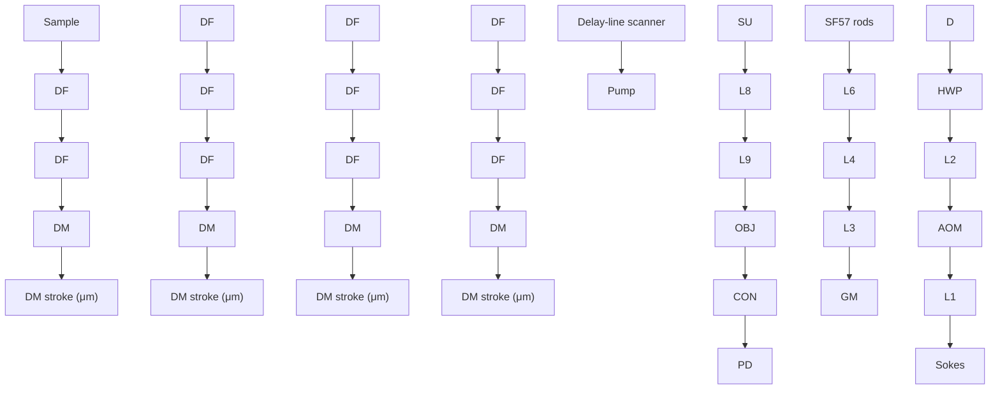
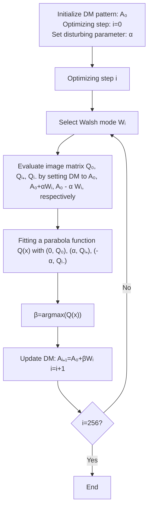
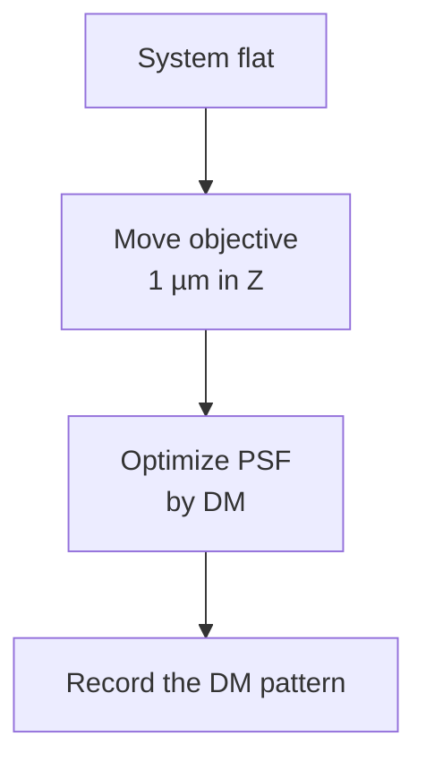

# Volumetric chemical imaging in vivo by a remote-focusing stimulated Raman scattering microscope

PENG LIN,1,6 HONGLI NI,1,6 HUATE LI,2 NICHOLAS A. VICKERS,2 YUYING TAN,3 RUYI GONG,1,4 THOMAS BIFANO,2,5 AND JI-XIN CHENG1,2,3,5,\*

1Department of Electrical and Computer Engineering, Boston University, 8 St. Mary’s St., Boston, MA 02215, USA  
2Department of Mechanical Engineering, Boston University, 110 Cummington Mall, Boston, MA 02215, USA  
3Department of Biomedical Engineering, Boston University, 44 Cummington Mall, Boston Boston, MA 02215, USA  
4School of Optical and Electronic Information, Huazhong University of Science and Technology, Luoyu Road 1037, Wuhan 430074, China  
5Photonics Center, Boston University, 8 St. Mary’s St, Boston, MA 02215, USA  
6These authors contributed equally  
\*jxcheng@bu.edu

Abstract: Operable under ambient light and providing chemical selectivity, stimulated Raman scattering (SRS) microscopy opens a new window for imaging molecular events on a human subject, such as filtration of topical drugs through the skin. A typical approach for volumetric SRS imaging is through piezo scanning of an objective lens, which often disturbs the sample and offers a low axial scan rate. To address these challenges, we have developed a deformable mirror-based remote-focusing SRS microscope, which not only enables high-quality volumetric chemical imaging without mechanical scanning of the objective but also corrects the system aberrations simultaneously. Using the remote-focusing SRS microscope, we performed volumetric chemical imaging of living cells and captured in real time the dynamic diffusion of topical chemicals into human sweat pores.

© 2020 Optical Society of America under the terms of the OSA Open Access Publishing Agreement

## 1. Introduction

Volumetric chemical imaging through an optical microscope can visualize molecular distributions and dynamic processes in a 3-dimensional (3-D) specimen with sub-micrometer resolution, which facilitates the study of cellular functions, developments, and activities in living organisms or tissues [1,2]. On human subjects, chemical imaging allowed monitoring of topical drug penetration into human skin in a non-destructive manner [3] and enabled intraoperative examination of tumor margins [4]. To image the molecules of interest, fluorescence microscopy is often employed to detect the fluorescent markers labeling specific molecules [5]. Yet, the exogenous markers often perturb the functionalities of molecules, and most of them are not allowed for human study [1,2,5,6]. Infrared spectroscopic imaging is label-free but significantly suffers from water absorption in living organisms and offers limited 3-D imaging capacity [7]. Nonlinear microscopy using second and third harmonics is sensitive to specific structures such as collagen or lipid droplets but provides insufficient chemical contrasts [8].

Coherent Raman scattering (CRS) imaging based on either coherent anti-Stokes Raman scattering (CARS) or stimulated Raman scattering (SRS) can map chemicals by probing their intrinsic molecular vibrations in a label-free manner with 3-D spatial resolution [1,2,6]. Compared with CARS, SRS is free of non-resonant background and can be operated under ambient light, gaining significant interest for clinical diagnosis. As a nonlinear microscopy technique, the CARS or SRS signal only arises from the center of focus and most images are acquired in a lateral plane. A few attempts have been made to extend SRS microscopy from 2-dimensional (2-D) to volumetric chemical imaging of cells and tissues. A straightforward way is to utilize a piezo positioner to move the objective lens along the axial direction [9,10]. By changing the relative distance between the objective and sample, different depths are scanned accordingly. However, this method has several limitations. First, the imaged sample can be disturbed by the iterative movement of the objective. Second, the volume rate is relatively slow since a piezo-based objective positioner has a low scanning rate of ∼20 Hz per line, limited by the microscope objective’s inertia [11]. Third, in the development of 3-D imaging capability in miniature CRS endoscopes, commercial objective positioners are too bulky to be integrated into the optical assembly [12–14]. Harnessing Bessel beams, Chen et al. reported an advanced volumetric SRS imaging technology mimicking computed tomography, where the elongated depth-of-focus of a Bessel beam is used to project a 3-D chemical map to a 2-D image [15]. However, this method requires a sophisticated setup and a sample rotation scheme to retrieve axial resolution.

Here, we report a remote-focusing SRS microscope and demonstrate its use for volumetric chemical imaging on human subjects. The principle of remote focusing is to control the position or shape of focus through engineering the wavefront of an incident beam at an objective’s distant Fourier pupil plane [16,17]. Consequently, the depth scanning process does not involve a piezo objective positioner to mechanically move an objective, avoiding perturbing the sample. Furthermore, the axial scanning speed could be significantly increased if employing a high-speed spatial light modulator or a light-weight remote-focusing unit. Although remote-focusing configurations have been extensively reported in fluorescence microscopy and optical coherence tomography [16–25], remote focusing on SRS microscopy has not yet been implemented due to the following challenges. SRS uses the pump and Stokes beams of different wavelengths to match a Raman vibrational mode [6]. To efficiently excite SRS signals, the two laser foci need to be well-overlapped spatially and temporally. These lead to the requirements of much rigorous alignment and achromatic engineering. In a state-of-the-art SRS microscope with near-infrared lasers, the wavelength difference can be up to ∼240 nm as targeting at the C-H vibrational region [6]. To this extent, remote-focusing units such as liquid-crystal spatial light modulators [17], ultrasound lenses [21], or liquid lenses [23,24] are not suitable due to their nature of severe chromatic aberration and degradation of focal quality. An alternative approach is to place a matched objective and a light-weight mirror in a conjugated position of the microscope objective [16,18,22]. Instead of moving the objectives, scanning of the light-weight mirror induces an equivalent axially focal shift in the sample. Such a method, however, presents challenges for the two laser beams to be aligned in both objectives. It also induces extra energy loss and cascaded chromatic aberrations due to the additional double-pass of the matched objective.

Our remote-focusing SRS microscope is based on a deformable mirror (DM) which controls the wavefronts of both pump and Stokes beams without chromatic aberrations. In this way, the foci can be axially scanned through displaying different patterns that effectively change the curvature of DM. A DM was previously used as an adaptive optics component to increase imaging depth of CARS microscope [26]. Here, we developed a calibration algorithm to optimize the DM patterns for refocusing pump and Stokes beams at different depths to enable volumetric SRS imaging. This algorithm simultaneously reduces the system aberrations to improve the imaging quality and detection sensitivity. Using the remote-focusing SRS microscope, we demonstrated volumetric chemical imaging of pancreatic cancer MIA PaCa-2 cells and performed an in vivo study to capture the process of dynamic chemical penetration into human sweat pores.

## 2. Experimental methods

## 2.1. Remote-focusing SRS microscope

We built a remote-focusing SRS microscope by installing a DM at the conjugate pupil plane of the objective to modulate the wavefronts of the collinearly combined pump and Stokes beam. Figure 1(a) shows an illustration that the foci can be remotely controlled by reshaping the incident wavefronts through changing the curvature of DM. To estimate the axial scan range that a DM could induce, we applied the equation $\begin{array} { r } { \Delta Z = 4 n ^ { 3 } \gamma ^ { 2 } \frac { S } { N A ^ { 2 } } } \end{array}$ NA2 modeled by spherical shapes [27], where n is the refractive index of the sample; γ is the fill-ratio of the projected objective pupil to DM active pupil; NA is the numerical aperture of objective; S is the stroke of DM defined as the maximum displacement of the DM’s membrane from its flat plane. When a DM is completely filled with an objective pupil (i.e.), the objective’s NA and DM’s stroke are the major factors affecting the axial scan range. Figure 1(b) shows an estimation of the axial scan range from 20 to 150 µm under various combinations of NA and DM’s stroke. This information helps to choose an appropriate combination of objective lens and DM for imaging samples of different thicknesses. In our case, we used a DM based on 140-actuator high-speed MEMS (micro-electro-mechanical systems) with a stroke of 4.8 µm (Boston Micromachines Corporation, USA) and a water-immersion objective of 1.05 NA (XLPlan N 25X, Olympus, Japan). The estimated axial scan range is about 41 µm, which could cover the thickness of most cells and the epidermis region of human skin.

text_image

(a)
DM
L
L
Pupil OBJ Sample
ΔZ

heatmap

| Numerical aperture (μm) | DM stroke (μm) | Axial scan range (μm) |
| ----------------------- | -------------- | --------------------- |
| 0.6                     | 0.6            | 0                     |
| 0.8                     | 0.8            | 20                    |
| 1.0                     | 1.0            | 40                    |
| 1.2                     | 1.2            | 60                    |
| 1.4                     | 1.4            | 80                    |
| 1.6                     | 1.6            | 100                   |
| 1.8                     | 1.8            | 120                   |
| 2.0                     | 2.0            | 140                   |

(c)  

flowchart

Fig. 1. Remote focusing SRS concept and setup. (a) Illustration of axial focal control by adjusting the curvature of DM. Solid and dash lines represent the light path reflected by concave and convex shapes, respectively. (b) An estimation of axial scan range when combining different numerical apertures of objective and strokes of DM. (c) Schematic of a remote-focusing SRS microscope. The setup contains a DM module for depth scanning and a galvanometric delay-line scanner for fast spectroscopic imaging. L: lens. OBJ: objective; CON: condenser; PD: photodiode; F: short-pass optical filter; AOM: acoustic optical modulator; HWP: half-wave plate; D: dichroic mirror; GM: galvanometric mirror; QWP: quarter-wave plate; PBS: polarization beam splitter; SU: scanning unit.

A schematic of the remote-focusing SRS microscope is illustrated in Fig. 1(c). The laser source is a dual-output ultrafast laser (InSight DeepSee, Spectral Physics, USA) with a tunable beam from 680 nm to 1100 nm of ∼120 fs duration and a fixed 1040-nm beam of ∼220 fs duration, both at 80 MHz repetition rate. The diameters of both output beams are about 1.1 mm. The Stokes beam is modulated by an acousto-optical modulator (1205-C, Isomet, USA) at 2.4 MHz. $\mathrm { L } _ { 1 }$ and $\mathrm { L } _ { 2 }$ are of 100-mm and 400-mm focal length to expand the Stokes beam diameter for 4 times. The pump beam is firstly directed to the galvo-mirror delay-line scanner. The original S-polarized pump beam is reflected by a polarization beam splitter (PBS) and converted to circular polarization with a quarter-wave plate and directed to the edge of the galvo mirror. Then, the pump beam is focused by a lens $\left( \mathrm { L } _ { 3 } \right)$ of 100 mm focal length to a 2-inch silver mirror and de-scanned. After repassing the quarter-wave plate, the pump beam becomes P-polarized state and passes through the PBS. L4 and L5 are of 100-mm and 400-mm focal length to expand the pump beam diameter for 4 times. The pump and Stokes beams are combined with a dichroic mirror (Chroma, USA). The red dash box is a remote-focusing module including a DM and a 4-f telescope of two 500-mm focal length achromatic double lenses $( \mathrm { L } _ { 6 }$ and $\operatorname { L } _ { 7 } { \mathrm { : } }$ AC508-500-B, Thorlabs, USA) relying the DM surface to the scanning unit $( \mathrm { G V S 0 1 } 2 ,$ , Thorlabs, USA). To properly install the DM, the incoming beams are set with about $4 ^ { \circ }$ incident angle versus the normal plane of the DM. The power loss after the reflection of the DM is about $4 \%$ . Next, a 4-f telescope of a 100-mm $\left( \mathrm { L } _ { 8 } \right)$ and 250 mm $\left( \mathrm { L } _ { 9 } \right)$ focal length lenses expands the beam size for 2.5 times and relays the image of DM surface from the scanning unit to the back aperture of the objective (XLPlan N 25X, Olympus, Japan). In transmission mode, the light is collected by a condenser with 1.40 NA (U-AAC, Olympus, Japan). A 980 nm short-pass filter (Chroma, USA) is used to block the Stokes beam. The transmitted pump beam is detected by a home-built photodiode. The SRS signal is then demodulated by a lock-in amplifier (MFLI, Zurich Instruments, Switzerland). The control and imaging acquisition software were home-built in LabVIEW (National Instruments, USA).

To enable volumetric spectroscopic SRS imaging, we built a high-speed spectral-focusing module to map the Raman transitions by rapidly sweeping the inter-pulse delay of the linear chirped pump and Stokes pulses via a galvo-mirror delay-line scanner. To induce spectral focusing [28], we inserted a 45-cm SF57 glass rod into the collinearly combined pump and Stokes beams for the linear chirping of the two pulses. To induce rapid inter-pulse delay, as shown in the gray-dash box in Fig. 1(c), the pump beam is directed to the edge of the galvo mirror and then reflected by a 2-inch mirror back to the original path. Figure 2(a) illustrates that by scanning the galvo mirror to a different angle, a temporal delay is produced because the retroreflected beam experiences a path difference. The change of inter-pulse delay equivalently alters the energy difference (i.e., Raman shifts) between the chirped pump and Stokes pulses. Figure 2(b) shows that the galvo-mirror delay-line scanner can linearly sweep the Raman shifts from $2 8 5 0 \mathrm { c m } ^ { - 1 }$ to $3 0 5 0 \mathrm { c m } ^ { - 1 }$ by tuning the mirror angle from $- 2 . 5 ^ { \circ } \mathrm { t o } 1 . 5 ^ { \circ }$ . Figure $2 ( \mathrm { c } )$ shows the spectral resolution of $\sim 1 7 . 2 \mathrm { c m } ^ { - 1 }$ at the C-H region measured by dimethyl sulfoxide (DMSO). The sweeping speed depends on the scanner frequency. In our setup, the frequency of the one-dimensional galvo mirror (GVS001, Thorlabs, USA) is up to 1 kHz. Importantly, our galvo-mirror delay-line scanner provides flexibility to rapidly scan the selected Raman shifts (e.g., two-color SRS images) at high speed, providing the capacity for rapid 3-D spectroscopic SRS imaging.

## 2.2. Preparation of a single-layer polymethyl methacrylate (PMMA) bead sample

Single-layer samples of 1 µm and 0.5 µm PMMA beads (Phosphorex Inc, USA) were used for calibration of DM-based refocusing and resolution characterization in this manuscript, respectively. To prepare the samples, we diluted the bead solution with purified water for 5 times and used an ultrasonic cleaner to sparse the beads for 15 mins. Then, we dropped about 1 µl on a cover glass and used airflow to evaporate the water. The remained beads on the glass were sandwiched with another cover glass for experiments.

text_image

(a)
Timing 1
In
Out
GM
L
M
Timing 2
α
Δτ
Stokes
Ω₁
pump
Δτ
Time (ps)

line chart

| Degree (°) | Measured Raman peaks (cm⁻¹) |
| ---------- | --------------------------- |
| -2.0       | 2920                        |
| -1.5       | 2940                        |
| -1.0       | 2960                        |
| -0.5       | 2980                        |
| 0.0        | 3000                        |
| 0.5        | 3020                        |
| 1.0        | 3040                        |
| 1.5        | 3060                        |

line chart

| Wavenumber (cm⁻¹) | DMSO | Fitting curve 1 | Fitting curve 2 |
| ----------------- | ---- | --------------- | --------------- |
| 2850              | 0    | 0               | 0               |
| 2900              | 10   | 10              | 0               |
| 2950              | 0    | 0               | 0               |
| 3000              | 4    | 4               | 4               |
| 3050              | 0    | 0               | 0               |

Fig. 2. Principle and performance of SRS spectroscopy through a galvo-mirror delay scanner. (a) Illustration of tuning galvo mirror angle to induce inter-pulse delay () to scan the Raman shifts (i.e. the frequency difference of the linearly chirped pump and Stokes pulses). α is the tuning angle respecting to the center position of the mirror, l is the path difference; v is the speed of light. and represent the Raman shifts at timing 1 and 2, respectively (b) Correlation of the Raman shift with respect to the tuning angle of the galvo mirror. The data is fitted by a linear curve $( \mathbf { R } ^ { 2 } = 0 . 9 9 )$ . (b) Spectral resolution measured with DMSO at $2 9 1 5 \mathrm { c m } ^ { - 1 }$ . The bandwidths of the fitting curve 1 and 2 are $1 7 . 2 \mathrm { c m } ^ { - 1 }$ and $2 2 . 7 \mathrm { c m } ^ { - 1 }$ , respectively.

## 2.3. Cell preparation

Human pancreatic cancer cell line MIA PaCa2 was obtained from American Type Culture Collection and cultured in RPMI 1640 medium within 10% fetal bovine serum (FBS) and 1% penicillin/streptomycin (P/S) at 37°C in a humidified incubator with 5% $\mathrm { C O } _ { 2 }$ supply. RPMI 1640, FBS and P/S was purchased from Thermo Fisher Scientific.

## 3. Results

## 3.1. DM significantly improves SRS image contrast

We developed an optimization procedure to utilize the DM to correct the system aberrations that were inevitably introduced by imperfect optics in the system. Imaging single-layer 1 µm PMMA beads at $3 0 6 0 \mathrm { c m } ^ { - 1 }$ as the SRS feedback signal, we sequentially perturbed the DM with 256 orders of Walsh-Hadamard series which are orthogonal binary phase patterns capable of compensating both low and high order aberrations [29]. A flowchart of the optimization procedure is detailed in Fig. 3(a). First, the DM surface was set to an initial pattern $( \mathrm { A _ { i } } )$ to obtain an initial value (Qi) by imaging 1-µm PMMA beads. The value $\mathrm { Q _ { i } }$ can be defined as the total intensity or signal-to-noise ratio of each SRS image. Note that for the initial depth (Z=0), we set the $\mathbf { A } _ { 0 }$ as a flat surface on DM. Second, we applied $\mathrm { W _ { i } }$ pattern multiplied by perturbing factor α and – α and then added onto $\mathbf { A _ { i } }$ to obtain two more test values $\mathrm { Q _ { i + } }$ and $\mathrm { Q _ { i - } }$ −, respectively. The value of α is 0.04 which sets ${ \mathfrak { a W } } _ { \mathrm { i } }$ to about ¼ of the excitation wavelength [29]. Third, we fitted the three test values versus their current DM patterns $( ( \mathrm { Q _ { i + } , A _ { i } { + } a W _ { i } } ) , ( \mathrm { Q _ { i } , A _ { i } } ) , ( \mathrm { Q _ { i - } , A _ { i } { + } a W _ { i } } ) )$ with a quadratic function to find a local maxima value corresponding to its DM pattern, named $\mathbf { A } _ { \mathrm { i + 1 } }$ , which will be used as the initial pattern to the next iteration of optimization. We conducted 256 times of iteration to ensure the enhancement of SRS signal can reach a plateau. The total calibration time is about 38 s when the frame size is 50×50 pixels with 5 µs pixel dwell time.

During the optimization procedure, we observed slight image shifts which can be addressed by adding a shift penalty on the optimization algorithm. Using an interferometric surface profiler can characterize the final DM pattern to analyze the aberrations being corrected [30].

(a)  

flowchart

(b)  

line chart

| X (μm) | SRS Intensity (a.u.) δx | SRS Intensity (a.u.) δz |
|--------|--------------------------|--------------------------|
| -1     | 0.00                     | 0.00                     |
| 0      | 0.25                     | 0.25                     |
| 1      | 0.00                     | 0.00                     |

(c)  

line chart

| DMSO diluted in D₂O (%) | SRS intensity (a.u.) |
| ------------------------ | --------------------- |
| 0.0                      | 0.15%                 |
| 0.5                      | 0.63%                 |
| 1.0                      | 1.25%                 |
| 2.5                      | 2.50%                 |

(d)  

natural_image

Fluorescent microscopy image of a single cell with green and blue staining (no text or symbols)

line chart

| Pixels | Before correction | After correction |
| ------ | ----------------- | ---------------- |
| 0      | 0.7               | 0.5              |
| 5      | 0.9               | 1.0              |
| 10     | 0.8               | 0.6              |
| 15     | 0.9               | 0.8              |
| 20     | 0.8               | 0.5              |
| 25     | 0.8               | 0.5              |

natural_image

Fluorescent microscopy image of a biological cell with green and blue staining (no text or symbols)

Fig. 3. System optimization with a DM. (a) A flowchart of the DM optimization procedure. (b) Characterization of PSFs. Left two images are X-Y and X-Z cross-sections of a 0.5 µm PMMA beads at $3 0 6 0 \mathrm { c m } ^ { - 1 }$ after aberration correction. The right boxes show lateral and axial PSFs measured before (grey line) and after aberration correction (red line), respectively. Scale bar: $4 \mu \mathrm { m } ;$ δx: 0.64 µm; δy:3.78 µm. (c) Limit of detection measurement. Sample: DMSO diluted in ${ \bf D } _ { 2 } { \bf O }$ at 2.5%, 1.25%, 0.63%, and 0.15% (v/v). The grey and red lines were measured at the flat DM shape and an optimized DM shape, respectively (d) SRS image of a MIA PaCa-2 cell at $2 8 8 4 \mathrm { c m } ^ { - 1 }$ . Left: image before AC. Right: image after AC. The inner graph shows the intensity along the red line indicated in the images. Scale bar: 5 µm.

After implementing the optimization procedure, we imaged a single 0.5-µm PMMA bead to characterize the system’s lateral and axial resolutions before and after aberration correction. As shown in Fig. 3(b), the full-width-at-half-maximums (FWHMs) at the lateral and axial directions were improved from 0.90 µm to 0.64 µm and from 6.00 µm to 3.78 µm, respectively. The SRS signal intensity was enhanced by ∼4 times. Figure 3(c) shows the improvement of the limit of detection of the system, where 0.15% dimethyl sulfoxide (DMSO) diluted in ${ \bf D } _ { 2 } { \bf O }$ can be detected at $2 9 1 5 \mathrm { c m } ^ { - 1 }$ after aberration correction. Figure 3(d) shows that the imaging quality of MIA PaCa2 cells at $2 8 8 4 \mathrm { c m } ^ { - 1 }$ was obviously improved. The lipid droplets were clearly distinguished after optimization. All measurements carried out in this section used 50 mW pump and 100 mW Stokes power measured before the microscope, corresponding to 15 mW pump and 30 mW Stokes power at the sample.

## 3.2. DM-based refocusing at different depths

To implement volumetric SRS imaging by DM, we developed a calibration procedure to obtain the DM patterns that induce refocusing at different depths. Figure 4(a) shows the workflow of the calibration procedure. We used single-layer 1-µm PMMA beads as the target. System flat is the initial depth (Z=0) optimized in the Section 3.1. For next depth, we moved the objective up or down with 1 µm interval by a piezo objective positioner and assumed that defocusing aberrations were introduced during the axial shift. Then, we again optimized the SRS signals using the same approach as described in Section 3.1 and recorded the DM pattern. Repeating the processes, we were able to obtain a set of optimized DM patterns for different Z positions. Later, to characterize the Z position and 3-D point spread function (PSF) for each DM pattern, we sequentially move the objective with the piezo objective positioner across the Z direction with 0.5 µm interval. In Fig. 4(b), the black circles represent the DM pattern number corresponding to its Z position obtained by fitting the peak intensity position of each measured axial PSF. The fitted Z position curve (red line) shows a linear relationship with the DM numbers, indicating the calibration algorithm works in the entire range. The blue dots represent the SRS intensities for different DM pattern numbers and show that the SRS intensity gradually reduces in both Z directions from its peak intensity $\scriptstyle ( Z = 0 )$ . This variation of intensity can be normalized through post-processing. Two possible reasons may account for the intensity variation. First, while the DM defocuses the laser foci to different depths, the condenser’s focal plane remains at the original depth, leading to the condenser’s light collection efficiency varies with different defocusing. Second, since the optimization at ${ \mathrm { { Z } } } { = } 0$ has used a portion of the DM’s stroke, the DM may have less stroke to properly correct the aberrations at each depth, especially at the extreme depths. Figure 4(c) and (d) show the axial PSFs and X-Z views of PSFs, respectively. The results suggest that the shape

(a)  

flowchart

(b)  

bar-line hybrid chart

| DM pattern (#) | Z position (µm) | SRS Intensity (a.u.) |
| -------------- | --------------- | -------------------- |
| 0              | -20             | 0.2                  |
| 10             | -10             | 0.4                  |
| 20             | 0               | 0.6                  |
| 30             | 10              | 0.8                  |
| 40             | 20              | 0.6                  |
| 50             | 25              | 0.4                  |

(c)  

line chart

| Z position (μm) | SRS intensity (a.u.) |
| --------------- | -------------------- |
| -30             | 0.1                  |
| -25             | 0.5                  |
| -20             | 0.7                  |
| -15             | 0.6                  |
| -10             | 0.4                  |
| -5              | 0.7                  |
| 0               | 0.9                  |
| 5               | 0.7                  |
| 10              | 0.6                  |
| 15              | 0.4                  |
| 20              | 0.3                  |
| 25              | 0.2                  |
| 30              | 0.1                  |

(d)  

text_image

-20
μm
-10
μm
0
μm
10
μm
20
μm

Fig. 4. Characterization of depth scanning. (a) A flowchart for calibrating the DM shapes for refocusing at different depths. (b) DM pattern number (#) corresponding to its refocusing Z position (black circle) and SRS intensity (blue dot). Red line: linear fitting of the Z position $( \mathbf { R } ^ { 2 } = 0 . 9 9 )$ . (c) Axial PSFs measured for different depths. (d) X-Z views of the PSFs for Z positions at −20, −10, 0, 10, 20 µm. Scale bar: 1 µm.

(a)  

natural_image

3D wireframe grid with scattered red and green data points, labeled X, Y, Z axes (no text or symbols on the grid itself)

(b)  
Spectrally stacked SRS images  
$Z = - 5 \mu \mathrm { m }$  

natural_image

Microscopic view of cellular or particulate structures with no visible text or symbols

$Z = 0 \mu \mathrm { m }$  

natural_image

Microscopic view of cellular or particulate structures with scattered bright spots (no visible text or labels)

$Z = + 5 ~ { \mu \mathrm { m } }$  

natural_image

Grayscale astronomical image showing a star field with bright spots against a dark background (no text or symbols)

Chemical map  

natural_image

Color-coded heat map visualization with blue, yellow, and red regions (no text or labels)

natural_image

Color-coded heat map with blue, yellow, and red regions (no text or symbols)

natural_image

Fluorescent microscopy image showing cellular structures with blue, yellow, and red markers (no text or symbols)

Fig. 5. Volumetric chemical imaging of single particles and cells by remote-focusing SRS. (a) Volumetric two-color SRS images of 10 µm polystyrene $( 2 9 5 5 \mathrm { c m } ^ { - 1 }$ , red) and Poly(methyl methacrylate) $( 3 0 6 0 \mathrm { c m } ^ { - 1 }$ , green) beads. (b) Spectrally stacked SRS images (top) and chemical maps (bottom) of MIA PaCa-2 cells (blue: cytoplasm, red: lipid droplets, yellow: nuclei, green: endoplasmic reticulum). Scale bar: 20 µm.

of PSFs are generally invariant over different depths. To sum up, we calibrated and obtained the DM patterns for refocusing of both pump and Stokes beams at different depths, paving the foundation for DM-enabled volumetric SRS imaging.

## 3.3. Volumetric spectroscopic SRS imaging of beads and cells

We applied the remote-focusing SRS microscope to map the 3-D chemical compositions in polymer beads and MIA PaCa2 cells. The bead sample of mixed 10-µm PS and PMMA beads diluted into 1% agarose gel (Sigma-Aldrich, USA) was sandwiched between two coverslips (1.5H, VWR, USA) with ∼100 µm spacer of double-sided tapes. Figure 5(a) shows that the PS and PMMA beads were volumetrically imaged and can be spectrally separated as by scanning their distinct Raman shifts at $2 9 5 5 \mathrm { c m } ^ { - 1 }$ and $3 0 6 0 \mathrm { c m } ^ { - 1 }$ . Figure 5(b) shows volumetric SRS images (512 512 pixels) of MIA PaCa2 cells at different depths (Z = −10, 0, 10, 20 µm) and at pixel dwell time of $1 0 ~ \mu \mathrm { s }$ . By tuning the pump and Stokes beams to 798 nm and 1040 nm, we were able to scan the spectral window from $2 7 5 0 \mathrm { c m } ^ { - 1 } \ \mathrm { t o } \ 3 1 0 0 \mathrm { c m } ^ { - 1 }$ . Using a spectral phaser analysis approach [31,32], the nucleus, endoplasmic reticulum, cytoplasm, and lipid droplets were segmented at different depths (Fig. 5(b)). Recent studies by 2-D SRS imaging unveiled unique spatial-temporal dynamics of lipid droplets in MIA PaCa2 cells under stress conditions, suggesting potential therapeutic targets for treating stress-resistant cancers [31]. However, the earlier analyses were limited to single plane imaging. Being able to map the subcellular components in 3-D, remote-focusing volumetric SRS imaging provides more precise and quantitative analysis on thick and complex cell bodies.

(a)  

text_image

PBS
PD F
OBJ
Chamber Chemicals
Sweat pore
Epidermis

(b)

line chart

| Wavenumber (cm⁻¹) | Skin | DMSO |
| ----------------- | ---- | ---- |
| 2750              | 0.0  | 0.0  |
| 2800              | 0.2  | 0.05 |
| 2850              | 0.4  | 0.1  |
| 2900              | 1.0  | 1.0  |
| 2950              | 0.4  | 0.25 |
| 3000              | 0.2  | 0.05 |
| 3050              | 0.1  | 0.0  |
| 3100              | 0.0  | 0.0  |

(c)  

text_image

0
μm
-20
μm
-40
μm
-60
μm
0 s
1.9 s
3.8 s
7.6 s
11.4 s
15.2 s

Fig. 6. Recording chemical penetration into a human sweat pore. (a) An add-on setup for epi-detected SRS imaging in vivo, including a polarization beam splitter (PBS), a photodiode (PD) and short-pass-filter (F). The blue arrows represent the polarization of the beams. The inner box is a schematic of DMSO dropped to a human sweat pore through a plastic chamber. (b) SRS spectra of human skin and DMSO. (c) Two-color volumetric imaging of DMSO penetrating into a sweat pore. Green and red represent skin at $2 8 8 4 \mathrm { c m } ^ { - 1 }$ and DMSO at $\mathsf { 2 9 1 4 c m ^ { - 1 } }$ , respectively. Scale bar: $1 0 0 \mu \mathrm { m }$ .

## 3.4. In vivo volumetric SRS imaging of DMSO penetration through human skin

Analyzing the filtration processes of topical drugs and cosmetic chemicals into human skin in vivo can facilitate the evaluation of delivery efficacy and development of penetration enhancers [3,33–36]. Conventional methods such as tape-stripping or microdialysis need invasive removal of a few layers of skin and thus are not able to provide direct visualization of the dynamic drug penetration process [33]. To show that volumetric SRS microscopy is a suitable tool to visualize such dynamic processes in real-time and under ambient light, we studied the sweat pore pathway as a testing system. The sweat pore pathway has been proposed to break the stratum corneum barrier and efficiently deliver some topical drugs into the epidermal layer [36,37]. Using our remote-focusing SRS microscope, we recorded the dynamic filtration process of DMSO into sweat pores on a volunteer. We choose DMSO since it is used as a cosmetic carrier for enhancing penetrations [36,37]. We modified our setup to an epi-detected SRS mode for in vivo imaging of human skin under ambient light, as shown in Fig. 6(a). In this setup, a PBS reflects the back-scatter light to a photodiode. The objective is a water immersion objective with 1.05 NA and 2-mm working distance (XLPlan N 25X, Olympus, Japan). To capture the fast process of DMSO penetration, we selectively scanned the two characteristic Raman peaks of DMSO (2914 cm−1) and skin (2884 cm−1) based on their SRS spectra (Fig. 6(b)). The fast galvo-mirror delay-line scanner enabled rapid switch between the two peaks. The DMSO and skin were then separated with a linear unmixing method [38]. Next, we sequentially switched the focal plane by applying the DM patterns obtained in Section 3.2 for imaging the 4 representative depths (Z = 0, −20, −40, and −60 µm). Each plane was mapped by 150×150 pixels with 5 µs pixel dwell time and totally ∼0.23 s image acquisition time. Taking into account the mechanical response time and unusable pixels at edges, the total acquisition time for 4 planes and two-color was ∼1.9 s. The pump and Stoke power measured at the sample are 60 and 100 mw, respectively. In the demonstration, we imaged a sweat pore on an upper palm and dropped DMSO through a plastic chamber. Figure 6(c) illustrates the DMSO filtration process with time. The DMSO, represented as red, quickly penetrated into the pore from the surface to deeper layers with a penetration depth up to 60 µm. Collectively, these data demonstrate that our remote-focusing SRS microscope is able to capture chemical penetration into human skin in real time.

## 4. Discussion

We reported a DM-based remote-focusing SRS microscope for in vivo volumetric chemical imaging. The system enables mechanical-scanning-free of an objective for 3-D SRS imaging and can simultaneously correct system aberrations to improve imaging outcomes. Integrated with a fast spectral focusing and scanning module, the system provides rapid hyperspectral or two-color 3-D SRS imaging capability.

The volume-rate of the current setup is limited by the imaging acquisition time at each plane scanned by the 2-D galvo mirrors. By employing a pair of resonant mirrors and high-frequency lock-in amplifier [39,40], SRS imaging frame-rate can be improved to video-rate ( 20 frames/s) >to mitigate motion artifacts while imaging living samples. Such a video-rate is hard to be followed by a piezo objective positioner to synchronously scan different depths for high speed volumetric SRS imaging. On the contrary, the update rate of a MEMS DM reaches up to 20 kHz [29] for depth scanning. Considering scanning 5 discrete depths at a given Raman transition with a DM and a pair of 16 kHz resonant mirrors, our method can potentially achieve 25.6 Hz volume-rate (125×125 pixels per depth, 500 ns pixel dwell time). The imaging speed may be further improved by using a sparse sampling approach and a matrix completion image reconstruction algorithm [41].

The current calibration algorithm for DM refocusing is based on the direct signal feedback from SRS images, having the advantage of simple implementation and sensor-free. The limitation is that the wavefront errors of the foci are not quantitatively measured. This can be further addressed by using a wavefront sensor to measure the wavefront errors as feedback to optimize the DM patterns. Another future development is to integrate a DM into a handheld SRS microscope [12] for remote-focusing volumetric chemical imaging. Such a configuration does not require a bulky objective positioner to move a miniature objective, paving a way to further reduce the dimension of handheld imaging probes. A miniature SRS volumetric endomicroscope will show great potential to delineate brain tumor margins in vivo during surgery with extended imaging depth, increasing the efficacy of diagnostic outcomes.

## 5. Conclusion

A deformable mirror based remote-focusing SRS microscope is demonstrated for real-time in vivo volumetric chemical imaging. The method offers the advantages of no sample perturbation, high speed, and aberration correction. High quality volumetric hyperspectral SRS images of MIA PaCa-2 cells are obtained. Furthermore, in vivo chemical imaging is demonstrated by observing the dynamics of DMSO penetrating into a human sweat pore. The reported method holds potentials to be integrated into a miniature SRS imaging device to facilitate in vivo volumetric chemical imaging for study of drug delivery and disease diagnosis.

## Funding

National Institutes of Health (R35GM136223, RO1GM118471); National Science Foundation (CHE-1807106).

## Acknowledgments

The authors thank Dr. Fengyuan Deng, Jing Zhang, Dr. Cheng Zong, and Dr. Kai-Chih Huang for helpful discussion.

## Disclosures

T.B. has a financial interest in Boston Micromachines Corporation, which produced the commercially available deformable mirrors used in this work

## References

1. J. X. Cheng and X. S. Xie, “Vibrational spectroscopic imaging of living systems: An emerging platform for biology and medicine,” Science 350(6264), aaa8870 (2015).  
2. F. Hu, L. Shi, and W. Min, “Biological imaging of chemical bonds by stimulated Raman scattering microscopy,” Nat. Methods 16(9), 830–842 (2019).  
3. X. Chen, S. Gregoire, F. Formanek, J. B. Galey, and H. Rigneault, “Quantitative 3D molecular cutaneous absorption in human skin using label free nonlinear microscopy,” J. Controlled Release 200, 78–86 (2015).  
4. T. C. Hollon, B. Pandian, A. R. Adapa, E. Urias, A. V. Save, S. S. Khalsa, D. G. Eichberg, R. S. D’Amico, Z. U. Farooq, S. Lewis, and P. D. Petridis, “Near real-time intraoperative brain tumor diagnosis using stimulated Raman histology and deep neural networks,” Nat. Med. 26(1), 52–58 (2020).  
5. E. C. Jensen, “Use of fluorescent probes: their effect on cell biology and limitations,” Anat. Rec. 295(12), 2031–2036 (2012).  
6. C. Zhang, D. Zhang, and J. X. Cheng, “Coherent Raman scattering microscopy in biology and medicine,” Annu. Rev. Biomed. Eng. 17(1), 415–445 (2015).  
7. D. Zhang, C. Li, C. Zhang, M. N. Slipchenko, G. Eakins, and J. X. Cheng, “Depth-resolved mid-infrared photothermal imaging of living cells and organisms with submicrometer spatial resolution,” Sci. Adv. 2(9), e1600521 (2016).  
8. S. Witte, A. Negrean, J. C. Lodder, C. P. De Kock, G. T. Silva, H. D. Mansvelder, and M. L. Groot, “Mansvelder, H. D.; Louise Groot, M., Label-free live brain imaging and targeted patching with third-harmonic generation microscopy,” Proc. Natl. Acad. Sci. U. S. A. 108(15), 5970–5975 (2011).  
9. J. Li, P. Lin, Y. Tan, and J.-X. Cheng, “Volumetric stimulated Raman scattering imaging of cleared tissues towards three-dimensional chemical histopathology,” Biomed. Opt. Express 10(8), 4329–4339 (2019).  
10. M. Wei, L. Shi, Y. Shen, Z. Zhao, A. Guzman, L. J. Kaufman, L. Wei, and W. Min, “Volumetric chemical imaging by clearing-enhanced stimulated Raman scattering microscopy,” Proc. Natl. Acad. Sci. U. S. A. 116(14), 6608–6617 (2019).  
11. W. Göbel, B. Kampa, and F. Helmchen, “Imaging cellular network dynamics in three dimensions using fast 3D laser scanning,” Nat. Methods 4(1), 73–79 (2007).  
12. C. S. Liao, P. Wang, C. Y. Huang, P. Lin, G. Eakins, R. T. Bentley, R. Liang, and J. X. Cheng, “In Vivo and in Situ Spectroscopic Imaging by a Handheld Stimulated Raman Scattering Microscope,” ACS Photonics 5(3), 947–954 (2018).  
13. A. Lombardini, V. Mytskaniuk, S. Sivankutty, E. R. Andresen, X. Chen, J. Wenger, M. Fabert, N. Joly, F. Louradour, A. Kudlinski, and H. Rigneault, “High-resolution multimodal flexible coherent Raman endoscope,” Light: Sci. Appl. 7(1), 10 (2018).  
14. A. Lukic, S. Dochow, H. Bae, G. Matz, I. Latka, B. Messerschmidt, M. Schmitt, and J. Popp, “Endoscopic fiber probe for nonlinear spectroscopic imaging,” Optica 4(5), 496–501 (2017).  
15. X. Chen, C. Zhang, P. Lin, K. C. Huang, J. Liang, J. Tian, and J. X. Cheng, “Volumetric chemical imaging by stimulated Raman projection microscopy and tomography,” Nat. Commun. 8(1), 15117 (2017).  
16. E. Botcherby, R. Juškaitis, M. Booth, and T. Wilson, “An optical technique for remote focusing in microscopy,” Opt. Commun. 281(4), 880–887 (2008)  
17. M. D. Maschio, A. M. D. Stasi, F. Benfenati, and T. Fellin, “Three-dimensional in vivo scanning microscopy with inertia-free focus control,” Opt. Lett. 36(17), 3503–3505 (2011).  
18. E.J. Botcherby, C.W. Smith, M.M. Kohl, D. Débarre, M.J. Booth, R. Juškaitis, O. Paulsen, and T. Wilson, “Aberration free three-dimensional multiphoton imaging of neuronal activity at kHz rates,” Proc. Natl. Acad. Sci. U.S.A 109(8), 2919–2924 (2012).  
19. M. Žurauskas, O. Barnstedt, M. Frade-Rodriguez, S. Waddell, and M. J. Booth, “Rapid adaptive remote focusing microscope for sensing of volumetric neural activity,” Biomed. Opt. Express 8(10), 4369 (2017).  
20. S. Francisco, S. Francisco, M. Field, and S. Francisco, “Deformable mirror- based two- photon microscopy for axial mammalian brain imaging,” bioRxiv, https://www.biorxiv.org/content/10.1101/736124v1, (2019).  
21. L. Kong, J. Tang, J. P. Little, Y. Yu, T. Lämmermann, C. P. Lin, R. N. Germain, and M. Cui, “Continuous volumetric imaging via an optical phase-locked ultrasound lens,” Nat. Methods 12(8), 759–762 (2015).  
22. K. T. Takasaki, D. Tsyboulski, and J. Waters, “Dual-plane 3-photon microscopy with remote focusing,” Biomed. Opt. Express 10(11), 5585 (2019).  
23. K. F. Tehrani, C. V. Latchoumane, W. M. Southern, E. G. Pendleton, A. Maslesa, L. Karumbaiah, J. A. Call, and L. J. Mortensen, “Five-dimensional two-photon volumetric microscopy of in-vivo dynamic activities using liquid lens remote focusing,” Biomed. Opt. Express 10(7), 3591 (2019).  
24. B. F. Grewe, F. F. Voigt, M. V. Hoff, and F. Helmchen, “Fast two-layer two-photon imaging of neuronal cell populations using an electrically tunable lens,” Biomed. Opt. Express 2(7), 2035–2046 (2011).  
25. B. Qi, A. P. Himmer, L. M. Gordon, X. V. Yang, L. D. Dickensheets, and I. A. Vitkin, “Dynamic focus control in high-speed optical coherence tomography based on a microelectromechanical mirror,” Opt. Commun. 232(1-6), 123–128 (2004).  
26. A. J. Wright, S. P. Poland, J. M. Girkin, C. W. Freudiger, C. L. Evans, and X. S. Xie, “Adaptive optics for enhanced signal in CARS microscopy,” Opt. Express 15(26), 18209 (2007).  
27. W. J. Shain, N. A. Vickers, B. B. Goldberg, T. Bifano, and J. Mertz, “Extended depth-of-field microscopy with a high-speed deformable mirror,” Opt. Lett. 42(5), 995–998 (2017).  
28. C. S. Liao, K. C. Huang, W. Hong, A. J. Chen, C. Karanja, P. Wang, G. Eakins, and J. X. Cheng, “Stimulated Raman spectroscopic imaging by microsecond delay-line tuning,” Optica 3(12), 1377–1380 (2016).  
29. C. Stockbridge, Y. Lu, J. Moore, S. Hoffman, R. Paxman, K. Toussaint, and T. Bifano, “Focusing through dynamic scattering media,” Opt. Express 20(14), 15086–15092 (2012).  
30. A. Diouf, A. P. Legendre, J. B. Stewart, T. G. Bifano, and Y. Lu, “Open-loop shape control for continuous microelectromechanical system deformable mirror,” Appl. Opt. 49(31), G148–G154 (2010).  
31. K. C. Huang, J. Li, C. Zhang, Y. Tan, and J. X. Cheng, “Multiplex Stimulated Raman Scattering Imaging Cytometry Reveals Lipid-Rich Protrusions in Cancer Cells under Stress Condition,” iScience 23(3), 100953 (2020).  
32. D. Fu and X. S. Xie, “Reliable cell segmentation based on spectral phasor analysis of hyperspectral stimulated Raman scattering imaging data,” Anal. Chem. 86(9), 4115–4119 (2014).  
33. C. Herkenne, I. Alberti, A. Naik, Y. N. Kalia, F. X. Mathy, V. Préat, and R. H. Guy, “In Vivo Methods for the Assessment of Topical Drug Bioavailability,” Pharm. Res. 25(1), 87–103 (2008).  
34. X. Chen, P. Gasecka, F. Formanek, J. B. Galey, and H. Rigneault, “In vivo single human sweat gland activity monitoring using coherent anti-Stokes Raman scattering and two-photon excited autofluorescence microscopy,” Br. J. Dermatol. 174(4), 803–812 (2016).  
35. A.M. Pena, X. Chen, I. Pence, T. Bornschlögl, S. Jeong, S. Grégoire, G.S. Luengo, P. Hallegot, P. Obeidy, A. Feizpour, and K.F. Chan, “Imaging and quantifying drug delivery in skin–Part 2: Fluorescence and vibrational spectroscopic imaging methods,” Adv. Drug Deliv. Rev, in press (2020).  
36. N. Dragicevic and H. I. Maibach, eds. Percutaneous penetration enhancers chemical methods in penetration enhancement: nanocarriers, (Springer, 2016).  
37. T. Haque and M. M. U. Talukder, “Chemical Enhancer: A Simplistic Way to Modulate Barrier Function of the Stratum Corneum,” Adv. Pharm. Bull. 8(2), 169–179 (2018).  
38. L. Zhang, L. Shi, Y. Shen, Y. Miao, M. Wei, N. Qian, Y. Liu, and W. Min, “Spectral tracing of deuterium for imaging glucose metabolism,” Nat. Biomed. Eng. 3(5), 402–413 (2019).  
39. B. G. Saar, C. W. Freudiger, J. Reichman, C. M. Stanley, G. R. Holtom, and X. S. Xie, “Video-Rate Molecular Imaging in Vivo with Stimulated Raman Scattering,” Science 330(6009), 1368–1370 (2010).  
40. R. He, Y. Xu, L. Zhang, S. Ma, X. Wang, D. Ye, and M. Ji, “Dual-phase stimulated Raman scattering microscopy for real-time two-color imaging,” Optica 4(1), 44–47 (2017).  
41. H. Lin, C.-S. Liao, P. Wang, N. Kong, and J. X. Cheng, “Spectroscopic stimulated Raman scattering imaging of highly dynamic specimens through matrix completion,” Light: Sci. Appl. 7(5), 17179 (2018).