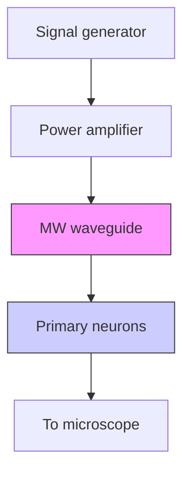

## M AT E R I A L S S C I E N C E

# Wireless neuromodulation at submillimeter precision via a microwave split-ring resonator

Carolyn Marar1 †, Ying Jiang2 †‡, Yueming Li3 , Lu Lan4 , Nan Zheng5 , Guo Chen4 , Chen Yang4,6 \*, Ji-Xin Cheng1,4,6 \*

A broad spectrum of electromagnetic waves has been explored for wireless neuromodulation. Transcranial magnetic stimulation, with long wavelengths, cannot provide submillimeter spatial resolution. Visible light, with its short wavelengths, suffers from strong scattering in the deep tissue. Microwaves have centimeter-scale penetration depth and have been shown to reversibly inhibit neuronal activity. Yet, microwaves alone do not provide sufficient spatial precision to modulate target neurons without affecting surrounding tissues. Here, we report a split-ring resonator (SRR) that generates an enhanced microwave field at its gap with submillimeter spatial precision. With the SRR, microwaves at dosages below the safe exposure limit are shown to inhibit the firing of neurons within 1 mm of the SRR gap site. The microwave SRR reduced seizure activity at a low dose in both in vitro and in vivo models of epilepsy. This microwave dosage is confirmed to be biosafe via histological and biochemical assessment of brain tissue.

Copyright © 2024 The

Authors, some rights

reserved; exclusive

licensee American

Association for the

Advancement of

Science. No claim to

original U.S.

Government Works.

Distributed under a

Creative Commons

Attribution

NonCommercial

License 4.0 (CC BY-­NC ).

## INTRODUCTION

Neuromodulation is a rapidly expanding field that has applications in neuroscience research, disease diagnosis, and treatment. Implantable neuromodulation devices are seeing greater use in the clinic for the treatment of conditions such as depression, epilepsy, and chronic pain (1–3). Of these techniques, deep brain stimulation is the most widely used, delivering electrical current via an implanted electrode to deep brain regions. The electrode, however, must be tethered to a subcutaneously implanted stimulator (4–6). This requirement makes the device highly invasive, as surgery is required to change the implanted stimulator battery.

Electromagnetic waves, such as radio frequency (RF) waves, have been used to noninvasively modulate various biological systems (7–9). For example, transcranial direct current stimulation (tDCS) (7) and transcranial magnetic stimulation (TMS) (8) have successfully reached the deep brain to treat Parkinson’s disease, depression, and epilepsy. However, because of the long wavelength (tens of meters) of the electromagnetic waves used, tDCS and TMS offer poor spatial resolution of a few centimeters (9). Wireless devices with sizes ranging from 10 to 500 mm3 based on RF, ultrasound, and magnetic waves have been reported (10–13).

Visible/infrared light has submicrometer wavelengths and can provide single-cell modulation at shallow depths through optogenetics and infrared neuromodulation (14–16). Yet, the strong tissue scattering limits spatial precision when used to noninvasively target the deep tissue. More recently, optical fiber–based optoacoustic neural stimulation has demonstrated submillimeter spatial resolution (17), but the need for coupling the laser to the fiber-based optoacoustic emitter prevents wireless implementation.

Microwaves, with frequencies between 300 MHz and 300 GHz, fill the gap between optical waves and magnetic waves used for neuromodulation, yet have rarely been explored for neuromodulation. Microwaves have much longer wavelengths than visible light and can noninvasively penetrate >50 mm into the human brain (18–20). Microwave wavelengths are also much shorter than those of the magnetic waves used in neuromodulation, promising higher spatial resolution for regional targeting. Reports of using the nonthermal effect of microwaves to modulate neural activity date back to the 1970s. Low-intensity microwave was applied to Aplysia pacemaker neurons for extended time periods (>60 s), and a reversible reduction in the firing rate was observed (21). The mechanism was attributed to microwave perturbation of current flow inside axons. Since then, several studies have focused on the effect of chronic exposure to microwaves from cell phones, Wi-Fi, and other communication apparatus (22–26). However, these studies used broadcasted microwaves, which lack spatial precision.

Here, we report minimally invasive microwave neuromodulation at an unprecedented spatial resolution by taking advantage of a split-ring resonator (SRR) design. The SRR has a perimeter of approximately one-half of the resonant microwave wavelength, thus acting as a resonant antenna. The microwave SRR has the potential to be implanted in the deep brain for wireless neuromodulation. It couples the microwave wirelessly and concentrates it at the gap, producing a localized electrical field. We report the localization of a microwave field to <1 mm in space around the gap of the SRR via resonance with the microwave SRR at 2.05-GHz frequency. The device allows for neuromodulation with a submillimeter spatial resolution, beyond the microwave diffraction limit. Meanwhile, we use a total dosage of \~500 J/kg, approximately six times lower than the threshold for safe microwave exposure (27). Under these settings, we demonstrate the capability of the microwave SRR to inhibit neuronal activity with submillimeter spatial precision. In addition, we explore a potential medical application of the microwave SRR in an in vivo model of epilepsy. At \~1.8 mm3 , the microwave SRR is at least five times smaller than currently available miniaturized wireless devices (10–13). Overall, the microwave SRR is less invasive than current high-precision deep-brain stimulation devices due to its external power source. It also presents a different treatment

1 Department of Biomedical Engineering, Boston University, Boston, MA 02215, USA. 2 Graduate Program for Neuroscience, Boston University, Boston, MA 02215, USA. 3 Department of Mechanical Engineering, Boston University, Boston, MA 02215, USA. 4 Department of Electrical & Computer Engineering, Boston University, Boston, MA 02215, USA. 5 Division of Materials Science and Engineering, Boston University, Boston, MA 02215, USA. 6 Department of Chemistry, Boston University, Boston, MA 02215, USA. \*Corresponding author. Email: jxcheng@bu.edu (J.-X.C.); cheyang@bu.edu (C.Y.) †These authors contributed equally to this work. ‡Present address: Department of Biological Engineering, Massachusetts Institute of Technology, Cambridge, MA 02139, USA.

paradigm for neurological disorders, directly inhibiting aberrant neuronal firing rather than altering the firing patterns with stimulation.

## RESULTS

## Microwaves reversibly inhibit activity in mammalian neurons via a nonthermal mechanism

Microwave inhibition of neuronal firing through a nonthermal mechanism has been previously demonstrated in Aplysia pacemak er neurons (21), avian neurons (26), and leech ganglia (28). To verify that the inhibitory effect also occurs in mammalian neurons, cultured primary cortical rat neurons were exposed to a continuous microwave field (Fig. 1A and fig. S1A). Oregon green dye was used to visualize neuronal activity via calcium transients. Neurons exhibited spontaneous activity without microwave treatment (Fig. 1B, top, and fig. S1B). Neurons were irradiated with 2.05-GHz continuous microwave at $1 . 7 ~ \mathrm { W / c m } ^ { 2 }$ for 3.0 s (Fig. 1B, bottom, and C). Immediately after microwave irradiation, an average reduction in firing rate of 64.2% was observed (Fig. 1D). The firing rate during microwave irradiation was not considered because of the relatively slow dynamics of the calcium spikes, but a plot of the spike frequency of the neurons reveals a clear decrease during the microwave on period (fig. S1C). Neurons showed significantly reduced firing rates for up to $2 0 \ s ,$ after which they recovered their baseline firing rate. When irradiated with 3.0-s continuous microwave $( 0 . 2 5 \mathrm { W } / \mathrm { c m } ^ { 2 } )$ at 2.05 GHz, no significant change in activity was observed (fig. S1, E and F). These results confirm that direct microwave irradiation at

$1 . 7 \ \mathrm { W / c m } ^ { 2 }$ for 3.0 s can effectively inhibit neuronal activity. The spike rate recovery shows that the inhibition is reversible and not induced by damage to the neurons.

To confirm that the observed inhibition with continuous microwave $( 1 . 7 \mathrm { W } / \mathrm { c m } ^ { 2 } )$ for 3.0 s was not due to thermal effects, we measured the thermal profile in the presence of microwaves using a fiber optic temperature sensor. Simultaneous thermal measurement of the cell culture under microwave irradiation showed that the temperature increase during the 3.0-s microwave exposure was ${ \sim } 0 . 3 5 ^ { \circ } \mathrm { C }$ (Fig. 1F, top). To produce a similar temperature change, an optical fiber tip was coated with carbon to act as a light absorber. A 1064-nm continuous laser was coupled into the fiber to heat up the tip (Fig. 1E). The laser was turned on for 3.0 s to create a thermal profile similar to that of the microwave, with a temperature rise ${ \mathrm { o f } } { \sim } 0 . 3 7 ^ { \circ } \mathrm { C }$ (Fig. 1F, bottom). Heating the cells by $0 . 3 7 ^ { \circ } \mathrm { C }$ for 3.0 s produced a 26.6% increase in firing rate which did not completely return to baseline within 30 s (Fig. 1, G and H, and fig. S1C). Moreover, transient heating of the cultured neurons had the opposite effect of microwave irradiation, suggesting the inhibitory mechanisms of the microwave may be counteracting thermal stimulation. These results confirm that microwaves can inhibit neuronal activity via a primarily nonthermal mechanism.

## The SRR efficiently concentrates microwaves at the gap site

The SRR can be modeled as an LC resonance circuit where the ring acts as an inductor L and the gap acts as a capacitor C (29). When the SRR with perimeter λ/2 resonates with the incident microwave, a strong electric field is formed at the capacitor. To theoretically verify the resonance effect of the SRR and determine the resonant frequency, we applied finite element modeling of a titanium SRR with an outer diameter of 3.6 mm in bulk water under electromagnetic fields from 0.3 to 2.7 GHz. At 1.9 GHz, a strong electromagnetic field was observed at the gap site (Fig. 2, A and B). The full width at half maximum (FWHM) of the microwave amplitude at the gap was 1.2 mm (Fig. 2B), whereas the wavelength of the microwave in water was 17.6 mm. We note that when the microwave propagates from air to water, the increase in refractive index causes a decrease in wavelength, calculated as $\begin{array} { r } { \lambda = \frac { c } { f \sqrt { \varepsilon } } , } \end{array}$ where λ is the wavelength, f is the frequency, c is the speed of light in a vacuum, and ε is the real part of the permittivity constant of water at 1.9 GHz (30). The concentration of the microwave field to 1.2 mm demonstrates the ability of the SRR to break the diffraction limit of the microwave. The maximum amplitude of the electric field in the SRR gap was 12113.1 V/m. The amplitude of the incident microwave field was 328.0 V/m. This result means that the SRR amplifies the electric field more than 36 times. Because cells would be positioned \~50 μm below the SRR gap site in experiments, a lateral cut line was placed 50 μm from the gap to measure the effective spatial resolution (Fig. 2C). The FWHM of the electric field amplitude was 746.3 μm, meaning that the SRR should achieve submillimeter spatial precision in neuromodulation.

flowchart

line chart

| Time (s) | Control | 1.7 W/cm² |
| -------- | ------- | --------- |
| -20      | ~1.00   | ~1.00     |
| -10      | ~1.00   | ~1.00     |
| 0        | ~1.00   | ~0.96     |
| 10       | ~1.00   | ~0.96     |
| 20       | ~1.00   | ~0.96     |
| 30       | ~1.00   | ~0.96     |
| 40       | ~1.00   | ~0.96     |

scatterplot

| Trial ID | Time (s) |
| -------- | -------- |
| 60       | 0        |
| 40       | 0        |
| 20       | 0        |
| 0        | 0        |
| -20      | 0        |

violin chart

| Time Interval | Frequency (spikes/s) |
| ------------- | -------------------- |
| -20-0 s       | 0.4                  |
| 3-13 s        | 0.2                  |
| 13-23 s       | 0.4                  |
| 23-33 s       | 0.6                  |

text_image

E
CW laser
Optical fiber
Carbon
coating
Primary
neurons
Heat

line chart

| Time (s) | Temperature change (°C) - 1.7 W/cm² | Temperature change (°C) - Laser on |
| -------- | ------------------------------------ | ---------------------------------- |
| -10      | ~0.0                                 | ~0.0                               |
| -5       | ~0.0                                 | ~0.0                               |
| 0        | ~0.0                                 | ~0.0                               |
| 5        | ~0.3                                 | ~0.4                               |
| 10       | ~0.2                                 | ~0.2                               |
| 15       | ~0.2                                 | ~0.1                               |

scatterplot

| Time (s) | Trial ID |
| -------- | -------- |
| 0        | 60       |
| 10       | 40       |
| 20       | 20       |
| 30       | 0        |
| 40       | -20      |

violin chart

| Time Interval | Frequency (spikes/s) |
| ------------- | --------------------- |
| -20-0 s       | ~0.4                  |
| 3-13 s        | ~0.6                  |
| 13-23 s       | ~0.8                  |
| 23-33 s       | ~0.6                  |

Fig. 1. Microwave inhibits neuronal activity via a nonthermal mechanism. (A) Schematic of in vitro experiments with direct microwave treatment; E represents electric field orientation and k represents propagation direction. (B) Sample Oregon green calcium traces for a cell with no treatment (top) and a cell under direct microwave irradiation for 3.0 s (bottom), normalized to the first 50 frames. (C) Dot raster representing calcium spike times of cells under direct microwave irradiation for $3 . 0 \ s \ ( N = 3$ dishes, $n = 6 6$ trials); colored bars indicate time intervals analyzed in (D). (D) Average calcium spike frequency of the cells in (C) for the given time intervals; solid lines represent data mean. (E) Schematic of the experiment using a carbon-coated optical fiber with a continuous 1064-nm laser to produce heat. (F) Thermal change in cell culture medium near the cells during 3.0-s microwave irradiation $( 1 . 7 \mathsf { W } / \mathsf { c m } ^ { 2 } ;$ top) and 3.0-s continuous laser heating of a carbon light absorber (bottom). (G) Dot raster representing calcium spike times of cells exposed to $0 . 3 7 ^ { \circ } \mathsf C$ heat for $3 . 0 \ s ( N = 3$ dishes, $n = 7 0$ trials). (H) Average calcium spike frequency of the cells in (G) for the given time intervals; solid lines represent data mean; red shaded boxes represent microwave/heat on period; statistical significance in (D) and (H) calculated using a paired sample t test where $^ { * } P < 0 . 0 5$ and $* * * P < 0 . 0 0 1$ . n.s. not significant.

To demonstrate the tunability of the resonant frequency, SRRs with varying diameters were simulated. The resonant frequency in an LC circuit is defined as

$$
f = \frac {1}{2 \pi \sqrt {L C}} \tag {1}
$$

where f is frequency, L is inductance, and C is capacitance. Increasing the perimeter of the SRR increases the inductance and consequently decreases the resonant frequency. In accordance, our simulation shows that by varying the diameter, we can tune the resonant frequency of the SRR (Fig. 2D). To validate the simulation, SRRs were fabricated from a tapered titanium alloy tube sectioned with electron discharge machining (Fig. 2E). Titanium alloy was chosen because it has shown excellent biocompatibility with tissues and has seen wide applications for tissue implants in the clinics, such as in artificial joints and pacemakers (31). An SRR with an outer diameter of 3.6 mm was irradiated with continuous microwave $( 1 . 7 \mathrm { W } / \mathrm { c m } ^ { 2 } )$ for 1.0 s at frequencies ranging from 1.7 to 2.4 GHz. This SRR achieved a maximum temperature increase of ${ \sim } 5 . 2 ^ { \circ } \mathrm { C }$ in the gap with a peak at 1.9 GHz (Fig. 2F), in accordance with our simulation. Collectively, these data suggest that the SRR generates an amplified electromagnetic field at the gap site with a tunable resonant frequency.

To experimentally validate hotspot formation, the SRR was placed in shallow water and imaged with a thermal camera. The continuous microwave was delivered through a waveguide with the magnetic field perpendicular to the SRR plane at 1.7 $\mathrm { W } / { \mathrm { c m } } ^ { 2 }$ and 1.9 GHz for 1.0 s. Thermal images shown in Fig. 2G provide visual evidence of the hotspot at the SRR gap. A maximum temperature increase of $5 . 3 ^ { \circ } \mathrm { C }$ was observed at the gap site. Such a hotspot at the resonant frequency confirms a localized, enhanced electric field, as predicted by our simulation.

For the neuromodulation applications presented here, we chose to use an SRR with a resonant frequency of 2.05 GHz, corresponding to a wavelength of 14.6 cm. This frequency is at the lower end of the dielectric loss spectrum for water, meaning it has lower absorption in water (30). This is essential for achieving high penetration depth with minimal thermal damage in biological tissues. Longer wavelengths, although they have lower absorption, were not used to minimize the size of the device.

heatmap

| Field Amplitude | Value |
| --------------- | ----- |
| Min             | Min   |
| Max             | Max   |

line chart

| Field amplitude (V/m) | Lateral position (mm) |
| --------------------- | --------------------- |
| 0                     | 0                     |
| 3000                  | 1                     |
| 6000                  | 2                     |
| 9000                  | 2                     |
| 12000                 | 2                     |

natural_image

Five metallic ring washers arranged in a row, with a 3 mm scale bar for size reference (no text or symbols on the washers themselves)

line chart

| Axial position (mm) | Field amplitude (V/m) |
| ------------------- | --------------------- |
| 0                   | 0                     |
| 1                   | 0                     |
| 2                   | 0                     |
| 3                   | 2000                  |
| 4                   | 12000                 |
| 5                   | 12000                 |
| 6                   | 0                     |

line chart

| Frequency (GHz) | 1.8 mm | 2.2 mm | 2.6 mm | 3.0 mm |
| --------------- | ------ | ------ | ------ | ------ |
| 0.5             | 0.0    | 0.0    | 0.0    | 0.0    |
| 1.0             | 0.0    | 0.0    | 0.9    | 1.0    |
| 1.5             | 0.2    | 0.7    | 0.4    | 0.3    |
| 2.0             | 0.6    | 0.3    | 0.2    | 0.2    |
| 2.5             | 0.2    | 0.2    | 0.2    | 0.2    |

line chart

| Frequency (GHz) | Temperature change (°C) | Normalized field amplitude |
| --------------- | ------------------------ | -------------------------- |
| 0.0             | 2.0                      | 0.6                        |
| 0.5             | 4.5                      | 0.8                        |
| 1.0             | 5.0                      | 1.0                        |
| 1.5             | 1.0                      | 0.9                        |
| 2.0             | 1.5                      | 0.7                        |
| 2.5             | 0.5                      | 0.5                        |
| 3.0             | 0.5                      | 0.4                        |
| 3.5             | 0.5                      | 0.3                        |
| 4.0             | 0.5                      | 0.2                        |

text_image

G
Baseline
1.9 GHz
26°C
19°C
4 mm

Fig. 2. The SRR concentrates microwaves at its gap. (A) Simulated electric field amplitude of an SRR with an outer radius of 1.8 mm in bulk water under a microwave field; arrows indicate the direction of microwave propagation (k), electric field (E), and magnetic field (H). (B) Profile of electric field amplitude at the axial cross section in (A). (C) Profile of electric field amplitude at the lateral cross section placed 50 μm from the SRR gap in (A). (D) Simulated electric field amplitude at the SRR gap for given frequencies for SRRs of varying outer radius normalized to the maximum value. (E) SRRs of varying diameters. (F) Maximum temperature change and simulated normalized field amplitude in the SRR gap for given frequencies for an SRR with an outer radius of 1.8 mm. (G) Thermal images of SRR from (F) before microwave irradiation and during 1-s continuous microwave irradiation demonstrating hotspot formation at the gap; white dashed line indicates the outline of the SRR.

## The SRR with pulsed microwave inhibits neurons with improved efficacy and submillimeter spatial precision

For clinical applications, it is preferable to prolong the microwave inhibition without increasing the thermal accumulation or microwave dosage. To this end, we modulated the microwave to generate a pulse train having a 10% duty cycle over 10 s, i.e., 10-ms pulses with a 10-Hz repetition rate. The overall energy dosage of the 10-s pulsed microwave is equivalent to the 1.0-s continuous microwave.

To first test whether pulsing the microwave affects inhibition efficiency, 1.0-s continuous and 10-s pulsed direct microwaves were compared in vitro (fig. S2A). The inhibition efficiencies of continuous and pulsed microwaves were compared by irradiating primary rat cortical neurons with direct microwave $( 1 . 7 \mathrm { W } / \mathrm { c m } ^ { 2 } )$ at 2.05 GHz (Fig. 3, B and C). Because the 1.0-s microwave duration is very short in comparison to calcium spiking dynamics, we compared the spike rates immediately after the microwave was turned off. The 1.0-s continuous microwave reduced the calcium spike rate by 36.2% (Fig. 3F and fig. S2B), and the pulsed microwave reduced activity by 40.3% after the microwave treatment (Fig. 3G and fig. S2C). The improved performance, despite equivalent energy dosage, may be due to a decrease in thermal accumulation, reducing the effects of thermal activation under the pulsed microwave. It may also be due to the longer treatment time. These results demonstrate that pulsing microwave prolongs the treatment and greatly enhances inhibition efficiency.

For safe application in vivo, it is desirable to minimize the required microwave dosage for inhibition to reduce the exposure of off-target tissues. The confinement of microwaves to the SRR gap creates a stronger concentrated electric field at the gap site. Thus, we expect the inhibition effect of microwaves to be enhanced in the presence of the SRR, reducing the required microwave dosage and limiting the affected area. The SRR was submerged in the culture medium above the primary cortical neurons at a distance of \~50 μm from the cells (Fig. 3A and fig. S2E). The SRR was oriented perpendicular to the culture dish and the microwave was delivered with E parallel to the SRR plane. Microwave irradiation of the SRR with pulsed microwave (1.7 W/cm2 ) at 2.05 GHz for 10 s led to an 85.6% decrease in calcium spikes, i.e., reduced to 14.4% of baseline activity, during microwave treatment (Fig. 3, D and H, and fig. S2D). In comparison, direct microwave irradiation for 10 s pulsed at $1 . 7 \mathrm { W / c m } ^ { 2 }$ led to a 45.3% decrease in calcium spikes, i.e., a reduction to 54.7% of baseline activity, during microwave treatment (Fig. 3, C and G). Thus, the SRR produced a fourfold improvement in efficiency in microwave inhibition. Together, these results demonstrate that the SRR boosts the inhibition efficiency of microwaves.

text_image

A
MW
waveguide
E
k
Plastic
tweezers
SRR
Primary
neurons
To microscope

scatterplot

| Trial ID | Time (s) | Value |
| -------- | -------- | ----- |
| B        | 0        | 60    |
| F        | 0        | 0     |

scatterplot

| Trial ID | Time (s) | Power (W/cm²) |
| -------- | -------- | ------------- |
| 80       | 0        | 1.7           |
| 60       | 0        | 1.7           |
| 40       | 0        | 1.7           |
| 20       | 0        | 1.7           |
| 0        | 0        | 1.7           |
| -20      | 0        | 1.7           |

scatterplot

| Time (s) | Trial ID |
| -------- | -------- |
| -20      | 0        |
| 0        | 40       |
| 20       | 60       |
| 40       | 80       |

bar chart

| Group | Cell viability |
|-------|----------------|
| Control | 0.78 |
| 1.1 W/cm², CW, SRR | 0.57 |
| 1.1 W/cm², PW, SRR | 0.70 |
| 1.1 W/cm², CW, 1.1 W/cm² | 0.78 |
| 1.1 W/cm², PW | 0.78 |

violin chart

| Time Range | Frequency (spikes/s) |
| ---------- | --------------------- |
| -20-0 s    | ~0.4                  |
| 1-11 s     | ~0.8                  |
| 11-21 s    | ~0.6                  |
| 21-31 s    | ~0.5                  |

violin chart

| Time Range | Frequency (spikes/s) |
| ---------- | --------------------- |
| -20-0 s    | ~0.2                  |
| 0-10 s     | ~0.8                  |
| 10-20 s    | ~0.2                  |
| 20-30 s    | ~0.6                  |
| 30-40 s    | ~0.4                  |

violin chart

| Time Range | Frequency (spikes/s) |
| ---------- | --------------------- |
| -20-0 s    | 0.2                   |
| 0-10 s     | 0.1                   |
| 10-20 s    | 0.3                   |
| 20-30 s    | 0.4                   |
| 30-40 s    | 0.5                   |

natural_image

Microscopic image showing concentric circular patterns with colored dashed lines and a 100 μm scale bar (no text or symbols beyond scale indicator)

line chart

| Time (s) | In gap | 0–100 µm | 100–200 µm | 200–300 µm |
| -------- | ------ | -------- | ---------- | ---------- |
| 0        | 1.00   | 1.00     | 1.00       | 1.00       |
| 10       | 0.98   | 0.99     | 1.01       | 0.99       |
| 20       | 0.97   | 0.98     | 1.02       | 0.98       |
| 30       | 0.96   | 0.97     | 1.03       | 0.97       |
| 40       | 0.95   | 0.96     | 1.04       | 0.96       |
| 50       | 0.96   | 0.97     | 1.05       | 0.97       |
| 60       | 0.95   | 0.96     | 1.06       | 0.96       |

bar chart

| Category     | Percent frequency decrease |
| ------------ | -------------------------- |
| In gap       | 55                         |
| 0–100 µm     | 15                         |
| 100–200 µm   | 10                         |
| 200–300 µm   | -20                        |

Fig. 3. The SRR with pulsed microwave improves neuronal inhibition and spatial precision. (A) Schematic of in vitro experimental setup with the SRR suspended over primary neurons. (B to D) Dot raster representing calcium spike times of cells under (B) direct continuous (CW) microwave for $1 \textsf { S } ( N = 3$ dishes, $n = 7 6$ trials), (C) direct pulsed (PW) microwave for $1 0 \varsigma ( N = 3$ dishes, $n = 9 3$ trials), and (D) at the SRR gap with PW microwave for $1 0 \varsigma ( N = 3$ dishes, $n = 8 3$ trials); red shaded boxes represent microwave on periods. (E) Cell viability for primary neuron cultures after 10 min of CW or PW microwave treatment with or without the SRR $( N = 3$ dishes); statistical significance was calculated using a two-sample t test where $^ { * } P < 0 . 0 5$ . (F to H) Calcium spike frequency of the cells in (B) to (D), respectively, for the given time intervals; solid lines represent data mean; statistical significance was calculated using a paired sample t test where $\ast \ast \ast P < 0 . 0 0 1$ 1. (I) Oregon green fluorescence image of cells near the SRR gap under 10-s PW microwave with circles marking analysis ranges; the red circle is at the gap and has a diameter of 300 μm; the space between circles is 100 μm. (J) Sample fluorescence traces for cells in each range; microwave was delivered from 20 to 30 s. (K) Means and SE of percent frequency decrease for neurons in each range.

To test whether pulsing the microwave and using the SRR affect biocompatibility, cell viability was measured after microwave treat ment at 1.1 W/cm2 , with or without the SRR, and under continuous or pulsed microwave (Fig. 3E). Treatment, i.e., 1.0-s continuous or 10-s pulsed microwave, was repeated every 30 s for 10 min. As a control, neurons were placed at room temperature for 10 min. Of all the conditions, only the 1.0-s continuous microwave with the SRR had a viability significantly lower than the control. This was probably due to overheating at this power density. With the SRR, the pulsed microwave had greater cell viability than the continuous microwave. While cell viability for pulsed microwave with the SRR is not significantly lower than the control, viability can further be improved by using lower power densities. These results demonstrate that pulse modulation is a viable method for prolonging microwave treatment without inducing neuronal toxicity.

To determine the spatial precision of the microwave SRR inhibi tion, Oregon green fluorescence was measured for cells up to 400 μm from the center of the SRR gap under a 10-s pulsed microwave (0.25 W/cm2 ; Fig. 3, I to K). While cells within the gap were inhibited by 53.3% (n = 20 neurons), inhibition dropped off outside this region. From 0 to 100 μm, cells were inhibited by 13.5% (n =  11 neurons); from 100 to 200 μm, cells were inhibited by 6.7% (n = 18 neurons); and from 200 to 300 μm, cells had a 0.3% (n = 19 neurons) increase in activity. These results indicate that inhibition can be limited to within \~200 μm of the SRR gap for a spatial precision of \~400 μm. These results demonstrate that the SRR breaks the microwave diffraction limit and enables the inhibition of neuronal activity with much higher spatial precision than direct microwaves.

## The SRR enables neural inhibition at a much lower microwave dosage

The enhanced and spatially confined microwave field provided by the SRR means that lower microwave powers can be used to achieve inhibition, thus decreasing the dosage. To investigate the dependence of inhibition on microwave power density, the SRR was placed \~50 μm above neurons in vitro, as previously described, and irradiated with 2.05-GHz pulsed microwave for 10 s at power densities of $0 . 6 6 \mathrm { W } / \mathrm { c m } ^ { 2 } ( \mathrm { F i g . 4 A } ) , 0 . 4 1 \mathrm { W } / \mathrm { c m } ^ { 2 } ( \mathrm { F i g . 4 B } ) , 0 . 2 5 \mathrm { W } / \mathrm { c m } ^ { 2 } ( \mathrm { F i g . 4 C } ) ,$ , and 0.17 W/cm2 (Fig. 4D) (estimated power densities at the SRR gap can be found in table S1). Under these power densities, the calcium spike rate was reduced by 71.6, 57.2, 43.1, and 15.8%, respectively, during microwave treatment (Fig. 4, E to H, and fig. S3). Furthermore, the duration of the inhibition decreased with power density. At 0.66, 0.41, and $0 . 2 5 \mathrm { W } / \mathrm { c m } ^ { 2 } ;$ , activity returned to baseline within 20 s after microwave treatment. $\mathrm { A t } 0 . 1 \dot { 7 } \mathrm { W / c m } ^ { 2 }$ , activity returned to baseline immediately after microwave treatment. At $0 . { \dot { 2 } } 5 \mathrm { W } / \mathrm { c m } ^ { 2 } ,$ , microwave SRR inhibition is comparable to direct microwave $( 1 . 7 \mathrm { W } / \mathrm { c m } ^ { 2 } ; 4 3 . 1 $ and 45.3%, respectively). No inhibition was observed at $0 . 2 5 \mathrm { W / c m } ^ { 2 }$ for direct microwave treatment (fig. S1, E and F). Thus, the SRR achieves inhibition at almost seven times lower operational power density than a direct microwave. These results demonstrate that the SRR can inhibit neuronal activity at much lower power densities than direct microwaves.

To confirm that microwave treatment does not cause a substantial temperature rise in the treated volume, an optical temperature probe was placed in a medium \~50 μm below the SRR gap. The SRR was irradiated with a pulsed microwave at 2.05 GHz for 10 s at power densities ranging from 0.17 to $1 . 7 \ \mathrm { W / c m } ^ { 2 }$ (fig. S4A). The largest power produced a \~0.5°C increase in temperature. To validate these measurements at the cellular level, mCherry fluorescence was used. MCherry has been shown to exhibit a linear decrease in fluorescence intensity with increasing temperature (32). Neurons were transfected with mCherry (Fig. 4I) and heated to temperatures ranging from $1 8 ^ { \circ }$ to $2 6 ^ { \circ } \mathrm { C }$ by perfusing the dish with a heated medium (fig. S4B). The change in fluorescence intensity versus temperature was linearly fitted with a slope of −0.033, indicating that a $\bar { 1 } ^ { \circ } \mathrm { C }$ increase is accompanied by a 3.3% decrease in mCherry fluorescence (Fig. 4J). The SRR was then placed \~50 μm from the neurons, as previously described, and irradiated with a pulsed microwave at 2.05 GHz for 10 s at power densities ranging from 0.17 to 1.7 W/ $\mathrm { c m } ^ { 2 }$ (Fig. 4K). On the basis of the calibration curve, mCherry fluorescence was used to measure the temperature change at the cellular level. The results revealed a less than $0 . 5 ^ { \circ } \mathrm { C }$ increase at 1.7 W/cm2 , with a linear dependence on power density (Fig. 4L). These measurements indicate that the temperature change experienced by cells under the SRR gap is negligible. Furthermore, pulsing the microwave is important to avoid thermal accumulation.

## The microwave SRR transiently reduces neural activity in an in vitro seizure model

Epileptic seizures are characterized by excessive neuronal excitability. The potassium channel inhibitor 4-aminopyridine (4-AP) is commonly used in in vitro models of epilepsy to induce acute seizures (33, 34). 4-AP blocks potassium channels, thus increasing neurotransmitter release during action potentials to elevate neuronal excitability. To demonstrate the ability of the SRR to transiently inhibit 4-AP–induced activity, 100 μM 4-AP was added to primary cortical neurons. Addition of 4-AP substantially increased calcium spike frequency (Fig. 5, A to C). The SRR was placed \~50 μm from the neurons and irradiated with 1.7 $\mathrm { W } / \mathrm { c m } ^ { 2 ^ { \bullet } }$ (Fig. 5D), 0.66 $\mathrm { W } / { \mathrm { c m } } ^ { 2 }$ (Fig. 5E), and 0.25 W/cm2 (Fig. 5F). Neuronal inhibition was evident, with calcium spike frequency reductions of 53.9, 26.9, 15.0%, respectively. At 0.082 $\mathrm { W } / \mathrm { c m } ^ { \hat { 2 } }$ (Fig. 5G), no inhibition was observed. For most cells, inhibition only occurred during microwave irradiation, but for some, the effect was longer lasting (fig. S5). The return of activity supports a nontoxic mechanism for microwave inhibition of neurons. The microwave SRR is less efficient at inhibiting seizure activity than spontaneous activity, most likely due to the increased network effects induced by 4-AP. Still, inhibition was significant at power densities of $0 . 2 5 \mathrm { W } / \dot { \mathrm { c m } } ^ { 2 }$ and larger. These results indicate that the microwave SRR is effective for transiently reducing seizure activity in vitro.

scatterplot

| Time (s) | Trial ID |
| -------- | -------- |
| 0        | 150      |
| 20       | 100      |
| 40       | 50       |

scatterplot

| Time (s) | Trial ID |
| -------- | -------- |
| 0        | 0.41 W/cm² |

violin chart

| Time Range | Frequency (spikes/s) |
| ---------- | --------------------- |
| -20-0 s    | ~0.2                  |
| 0-10 s     | ~0.6                  |
| 10-20 s    | ~0.4                  |
| 20-30 s    | ~0.8                  |
| 30-40 s    | ~0.2                  |

violin chart

| Time Range | Frequency (spikes/s) |
| ---------- | --------------------- |
| -20-0 s    | ~0.2                  |
| 0-10 s     | ~0.1                  |
| 10-20 s    | ~0.6                  |
| 20-30 s    | ~0.7                  |
| 30-40 s    | ~0.3                  |

scatterplot

| Time (s) | Trial ID |
| -------- | -------- |
| 0        | 100      |
| 20       | 50       |
| 40       | 0        |

scatterplot

| Time (s) | Trial ID |
| -------- | -------- |
| 0        | 0.17 W/cm² |

violin chart

| Time Range | Frequency (spikes/s) |
| ---------- | --------------------- |
| -20-0 s    | ~0.2                  |
| 0-10 s     | ~0.8                  |
| 10-20 s    | ~0.2                  |
| 20-30 s    | ~0.6                  |
| 30-40 s    | ~0.6                  |

violin chart

| Time Range | Frequency (spikes/s) |
| ---------- | --------------------- |
| -20-0 s    | ~0.3                  |
| 0-10 s     | ~0.8                  |
| 10-20 s    | ~0.6                  |
| 20-30 s    | ~0.5                  |
| 30-40 s    | ~0.4                  |

natural_image

Microscopic image showing red fluorescent cellular structures with a 100 μm scale bar (no text or symbols beyond scale indicator)

line chart

| Temperature (°C) | Normalized fluorescence intensity |
| ---------------- | ---------------------------------- |
| 18               | 1.0                                |
| 20               | 0.9                                |
| 22               | 0.8                                |
| 24               | 0.7                                |
| 26               | 0.65                               |
| 28               | 0.6                                |

line chart

| Power (W/cm²) | Time (s) |
| ------------- | -------- |
| 1.7           | 5        |
| 1.1           | 5        |
| 0.66          | 5        |
| 0.41          | 5        |
| 0.25          | 5        |
| 0.17          | 5        |

line chart

| Power density (W/cm²) | Temperature change (°C) |
| --------------------- | ------------------------ |
| 0.0                   | 0.1                      |
| 0.4                   | 0.15                     |
| 0.8                   | 0.2                      |
| 1.2                   | 0.25                     |
| 1.6                   | 0.35                     |

Fig. 4. The microwave SRR inhibits neurons in a power-dependent manner. (A to D) Dot rasters representing calcium spike times of neurons at the SRR gap under pulsed microwave of $( \mathsf { A } ) 0 . 6 6 \mathsf { W } / \mathsf { c m } ^ { 2 } ( N = 3$ dishes, n = 154 trials), (B) $0 . 4 1 \mathrm { \ W / c m } ^ { 2 } ( N = 3$ dishes, n = 142 trials), (C) $0 . 2 5 \mathsf { W } / \mathsf { c m } ^ { 2 } ( N = 3$ dishes, n = 128 trials), and (D) 0.17 W/ cm2 (N = 4 dishes, n = 119 trials) for 10 s. (E to H) Calcium spike frequency of the cells in (A) to (D), respectively, for the given time intervals; solid lines represent data mean; statistical significance was calculated using a paired sample t test where $* * * P < 0 . 0 0 1$ . (I) Fluorescence image of cells transfected with mCherry. (J) Calibration curve for mCherry fluorescence in cells (n = 5) at given temperatures normalized to the maximum intensity. (K) Means and SD of mCherry fluorescence traces for neurons (n = 5) \~50 μm below the SRR gap under pulsed microwave for 10 s. (L) Temperature change at varying power densities calculated from mCherry fluorescence for cells in (K); red shaded boxes represent microwave on periods.

## The microwave SRR transiently reduces seizure activity in an in vivo epilepsy model

A picrotoxin-induced mouse model of epilepsy was used to demonstrate in vivo proof of concept for epilepsy treatment with the microwave SRR (Fig. 6A). Picrotoxin is a γ-aminobutyric acid antagonist and thus a convulsant. Male C57BL/6J mice aged 14 to 16 weeks were intracerebrally injected with picrotoxin to induce acute seizure in the cortex (35). The cortex was chosen as the seizure target to avoid implantation of the SRR, which is too large for the mouse brain. Status epilepticus was induced in the cortex by injecting 10 nl of 20 mM picrotoxin in dimethyl sulfoxide (DMSO). Local field potential (LFP) recordings were taken before and after injection, demonstrating clear induction of seizure activity (Fig. 6, B and C). The seizure lasted over 1 hour when no treatment was applied.

We first tested if microwaves alone could inhibit seizure activity. Microwave treatment consisting of a 10-s pulsed microwave at 2.05 GHz and 0.25 W/cm2 was applied to two mice (n = 9 trials) (Fig. 6D). This power density was chosen because it was the lowest power density at which substantial inhibition with the SRR was observed in vitro. The inter-spike interval (ISI) was compared for the 10 s before and 10 s after microwave treatments and was found not to be significantly altered (Fig. 6F). The amplitude of the LFP spikes was measured for the 10 s after microwave treatment and normalized to the average amplitude of the spikes 10 s before microwave treatment. On average, spike amplitude was increased by \~1.4% after direct microwave treatment (Fig. 6G). As a control, arbitrary time points were chosen during untreated seizures to act as a 10-s “sham treatment” where no microwave was applied (fig. S6) in three mice (n = 9 trials). This sham period allowed for better comparison with the microwave conditions. ISI was compared for the periods before and after the sham period, and no significant difference was found. Spike amplitudes were compared for the 10-s intervals before and after this period to determine the inherent variation between these intervals. In the control group, spike amplitude was increased by <1% on average. There was no significant difference in amplitude change observed in the control versus the direct microwave treatment groups. These results indicate that direct microwave at 0.25 W/cm2 pulsed for 10 s does not significantly affect neuron firing and cannot effectively reduce seizure activity in vivo.

line chart

| Time (s) | Control | 100 µM 4-AP |
| -------- | ------- | ----------- |
| 0        | ~1.00   | ~1.01       |
| 10       | ~0.99   | ~1.00       |
| 20       | ~1.00   | ~1.01       |
| 30       | ~0.99   | ~1.00       |
| 40       | ~1.00   | ~1.01       |
| 50       | ~0.99   | ~1.00       |
| 60       | ~1.00   | ~1.01       |

scatterplot

| Trial ID | Time (s) |
| -------- | -------- |
| 10       | 0        |
| 80       | 5        |
| 60       | 10       |
| 40       | 15       |
| 20       | 20       |
| 0        | 25       |
| -10      | 30       |

scatterplot

| Time (s) | Trial ID |
| -------- | -------- |
| 0        | 0.66     |

scatter plot

| Trial ID | Time (s) |
| -------- | -------- |
| 0        | 0        |
| 0        | 10       |
| 0        | 20       |
| 0        | 30       |
| 0        | 40       |
| 0        | 50       |
| 0        | 60       |
| 10       | 0        |
| 10       | 10       |
| 10       | 20       |
| 10       | 30       |
| 10       | 40       |
| 10       | 50       |
| 10       | 60       |
| 20       | 0        |
| 20       | 10       |
| 20       | 20       |
| 20       | 30       |
| 20       | 40       |
| 20       | 50       |
| 20       | 60       |
| 30       | 0        |
| 30       | 10       |
| 30       | 20       |
| 30       | 30       |
| 30       | 40       |
| 30       | 50       |
| 30       | 60       |
| 40       | 0        |
| 40       | 10       |
| 40       | 20       |
| 40       | 30       |
| 40       | 40       |
| 40       | 50       |
| 40       | 60       |
| 50       | 0        |
| 50       | 10       |
| 50       | 20       |
| 50       | 30       |
| 50       | 40       |
| 50       | 50       |
| 50       | 60       |
| 60       | 0        |
| 60       | 10       |
| 60       | 20       |
| 60       | 30       |
| 60       | 40       |
| 60       | 50       |
| 60       | 60       |

scatterplot

| Trial ID | Time (s) | Power (W/cm²) |
| -------- | -------- | ------------- |
| 0        | 0        | 0.25          |

scatterplot

| Time (s) | Trial ID |
| -------- | -------- |
| 0        | 0        |
| 60       | 80       |

scatterplot

| Trial ID | Time (s) | Power (W/cm²) |
| -------- | -------- | ------------- |
| 10       | 0        | 0.082         |

violin chart

| Time Range | Frequency (spikes/s) |
| ---------- | --------------------- |
| -10-0 s    | 0.3                   |
| 0-10 s     | 0.1                   |
| 10-20 s    | 0.4                   |

violin chart

| Time Interval | Frequency (spikes/s) |
| ------------- | -------------------- |
| -10-0 s       | 0.4                  |
| 0-10 s        | 0.3                  |
| 10-20 s       | 0.5                  |

violin chart

| Time Interval | Frequency (spikes/s) |
| ------------- | -------------------- |
| -10-0 s       | 0.2                  |
| 0-10 s        | 0.3                  |
| 10-20 s       | 0.4                  |

violin chart

| Time Range | Frequency (spikes/s) |
| ---------- | --------------------- |
| -10-0 s    | ~0.2                  |
| 0-10 s     | ~0.8                  |
| 10-20 s    | ~0.9                  |

Fig. 5. The microwave SRR reduces activity in an in vitro seizure model. (A) Oregon green fluorescence traces for representative neurons with no drug (top) and 100 μM 4-AP (bottom), normalized to first 50 frames. (B) Dot raster representing calcium spike times of cells with no drug. (C) Dot raster of cells with 100 μM 4-AP. (D to G) Dot raster for cells at the SRR gap under pulsed microwave of $\mathrm { ( D ) } \ 1 . 7 \mathsf { W } / \mathsf { c m } ^ { 2 } \left( N = 3 \right.$ dishes, n = 114 trials), (E) 0.66 W/cm2 (N = 3 dishes, n = 112 trials), (F) $0 . 2 5 \mathrm { W / c m } ^ { 2 } ( N = 2$ dishes, n = 95 trials), and (G) 0.082 W/cm2 (N = 3 dishes, n = 105 trials) for 10 s. (H to K) Calcium spike frequency of the cells in (D) to (G), respectively, for the given time intervals; solid lines represent data mean; statistical significance was calculated using a paired sample t test where \*P < 0.05 and $* * * P < 0 . 0 0 1$ .

Next, a microwave SRR was placed on the surface of the cortex with the gap directly on the injection site (fig. S7A). Because the resonant frequency of the SRR is dependent upon the medium it is in, the SRR was covered in ultrasound gel, which has electric properties similar to water (36). Microwave treatment consisting of 10 s of pulsed microwave at 2.05 GHz and 0.25 W/cm2 was applied in four mice (n = 12 trials) (Fig. 6E). In three of the four mice, microwave induced notable seizure reduction. ISI was significantly increased by 21.1% after microwave SRR treatment (Fig. 6F). On average, LFP spike amplitude was reduced by 23.7%, with a maximum reduction of 49.4% (Fig. 6G). The change in amplitude for the microwave SRR group was significantly greater than that for the microwave-only and sham control groups. The spike amplitude was then measured for multiple 10-s intervals after the microwave SRR treatment and normalized to the average amplitude 10 s before treatment (fig. S7B). The average spike amplitude recovered to 92.9% of the baseline amplitude. While the spike amplitude somewhat recovered, it did not fully return to baseline, indicating an extended suppression from the microwave SRR. These results demonstrate that the microwave SRR can reduce seizure activity, and thus the impact of a seizure, in vivo. Furthermore, the efficient concentration of the microwave field at the SRR gap enables the use of lower power densities than microwaves alone.

We further evaluated the safety of our microwave treatment for in vivo applications. A mouse was exposed to three treatments of a 10-s pulsed microwave at 2.05 GHz and 0.25 $\mathrm { W } / { \mathrm { c m } } ^ { 2 }$ with 5-min rests in between. The tissue was paraffin embedded, sectioned, and hematoxylin and eosin (H&E) stained. The histology appeared normal, showing no signs of hemorrhage or cell death (Fig. 6H). Brain slices were also stained for cleaved caspase-3, a marker of cell apoptosis. The slices were counterstained with 4′,6-diamidino-2-phenylindole (DAPI), a nuclear marker. Immunofluorescence imaging shows that cleaved caspase-3 levels in the microwave treatment brain were not notably higher than those in the control brain (Fig. 6I). Cell viability in the cleaved caspase-3–stained slices was measured. A neuron with average fluorescence intensity above the background level was considered dead. Analysis revealed that the fraction of live cells in the control slices (N = 5 regions of interest) was not significantly different from that in the microwave treatment slices (N = 5 regions of interest). These results indicate that microwaves at power densities that can reduce seizure activity in vivo do not induce cellular damage in brain tissue. We note, however, that long-term studies need to be conducted to determine the optimal parameters for epilepsy treatment. Biosafety should be evaluated after this treatment.

text_image

A
k
E
H

line chart

| Time (s) | Voltage (mV) |
| -------- | ------------ |
| 0        | 0            |
| 5        | 0            |
| 10       | 0            |
| 15       | 0            |

line chart

| Time (s) | Voltage (mV) |
| -------- | ------------ |
| 0        | 0            |
| 10       | -1           |
| 20       | -2           |
| 30       | -3           |
| 40       | -2           |
| 50       | -1           |
| 60       | 0            |

line chart

| Time (s) | Voltage (mV) |
| -------- | ------------ |
| 4.5      | -3           |
| 5.0      | 0            |
| 5.5      | 1            |
| 6.0      | 0            |
| 6.5      | -1           |

line chart

| Time (s) | Voltage (mV) |
| -------- | ------------ |
| 0        | -4           |
| 5        | 0            |
| 10       | -2           |
| 15       | 0            |
| 20       | -2           |
| 25       | 0            |
| 30       | -2           |

bar chart

| Group | Before MW (s) | After MW (s) |
|-------|---------------|--------------|
| Sham | ~2.3 | ~2.1 |
| 0.25 W/cm² 10-s PW | ~2.4 | ~1.9 |
| 0.25 W/cm² 10-s PW + SRR | ~1.3 | ~1.6 |

box plot

| Group | Amplitude after/before |
|-------|------------------------|
| Sham | n.s. |
| 0.25 W/cm² 10-s PW | *** |
| 0.25 W/cm² 10-s PW + SRR | *** |

natural_image

Microscopic tissue section labeled 'Control' with pink and purple staining, showing cellular distribution (no text or symbols beyond label)

natural_image

Microscopic tissue section stained pink with scale bar and label (0.25 W/cm², 10-s PW ×3), no readable text or symbols beyond measurement annotations

natural_image

Microscopic image showing green fluorescent staining labeled 'Control' with a scale bar (no other text or symbols)

natural_image

Microscopic image of a green fluorescent sample under 0.25 W/cm² 10-s PW ×3 condition (no text or symbols visible)

box plot

| Group       | Fraction live cells |
| ----------- | ------------------- |
| Control     | 0.8                 |
| 0.25 W/cm²  | 0.7                 |

Fig. 6. The microwave SRR reduces seizure activity in an in vivo epilepsy model. (A) Schematic of experiments involving electrophysiology measurements, microwave treatment, and the SRR, made using BioRender. (B) Local field potential (LFP) recording of primary motor cortex activity before picrotoxin (PTX) injection. (C) LFP recording of seizure activity starting \~15 min after injection of 20 mM PTX. (D) LFP recording during direct microwave treatment. (E) LFP recording during microwave SRR treatment; red arrows mark microwave treatments. (F) Inter-spike interval for 10 s before and after treatment in sham mice (N = 3 mice, $n = 9$ trials), direct microwave treatment $( N = 2$ mice, $\boldsymbol { n } = 8 \mathrm { t r i a l s } ) ,$ , and microwave SRR treatment $( N = 4$ mice, $n = 1 2$ trials); the solid line represents data mean and the box represents SD; statistical significance was calculated using a paired sample t test where $^ { * } P < 0 . 0 5 . ( \mathbf { G } )$ Percent change in spike amplitude for 10 s after microwave treatment in sham mice $( N = 3 \mathrm { m i c e } _ { i }$ , 9 trials), direct microwave mice $( N = 2$ mice, 9 trials), and microwave SRR mice (N = 4 mice, 12 trials); the solid line represents data mean and whiskers represent SD; statistical significance was calculated using a two-sample t test where \*\*\*P < 0.001. (H) Control brain tissue and brain tissue after three microwave treatments stained with H&E. Scale bars, 200 μm. (I) Control brain tissue and brain tissue treated with 10-s PW microwave at $0 . 2 5 W / \mathsf { c m } ^ { 2 }$ and 2.05 GHz and stained for cleaved caspase-3. Scale bars, 100 μm. (J) Fraction of cells that were alive in cleaved caspase-3–stained control [N = 5 regions of interest (ROI)] and microwave-treated $( N = 5 \mathsf { R O I } )$ histology slices; the solid line represents data mean and whiskers represent SD; statistical significance was calculated using a two-sample t test where $^ { * } P < 0 . 0 5 , ^ { * * } P < 0 . 0 1$ , and $* * * P < 0 . 0 0 1$ .

## The microwave SRR mediates transcranial inhibition of neurons

Our eventual goal is to achieve wireless neuronal inhibition for the treatment of disorders like epilepsy. For the device to be wireless, a microwave must be delivered from outside the skull to the implanted SRR. The millimeter-scale wavelength of microwave allows for deep penetration into biological tissue, including bone.

To evaluate the transcranial inhibition capabilities of the microwave SRR, a macaque monkey skull with \~3 mm thickness was placed over the neuron culture inside the microwave waveguide (fig. S8A). The SRR was placed over primary cortical neurons and irradiated with pulsed microwave (0.41 $\mathrm { W } / \mathrm { c m } ^ { 2 } )$ at 2.1 GHz for 10 s (fig. S8, B and C). With the skull, the SRR achieved a 69.1% reduction in neuronal activity, while, without the skull, it achieved a 65.0% reduction during microwave treatment (fig. S8, D and E). As expected, the SRR performance was not substantially hindered by the presence of a skull. This result demonstrates the capability of the SRR to perform transcranial neuronal inhibition for wireless application of the device.

## DISCUSSION

Microwaves have not previously been used to modulate neurons in humans because, at high powers, they can cause thermal damage. As demonstrated here, through a tailor-designed microwave SRR, microwave inhibition efficiency and spatial precision are much improved, and dosages below the safe exposure limit can be used. These advances open exciting opportunities for wireless neuromodulation at submillimeter precision.

Wirelessly powered neural implants have received great attention in recent years. These implants have clear advantages over tethered devices in that they reduce tissue damage during surgical procedures and, subsequently, diminish infection in daily use. However, a primary challenge for wireless neural stimulators is to create miniature devices that efficiently operate in deep tissues. For efficient wireless power transfer, antennas need to have sizes comparable to the electromagnetic wavelength. Currently, the majority of miniaturized wireless neural modulators work in the megahertz range and require a surface-level receiver to couple with the waves to reach the deep brain, increasing the invasiveness and size of the device (10, 11). For piezoelectric devices, power delivery becomes inefficient due to their small size (12). More recently, ultrasound-powered neural modulators have enabled effective power transfer at several centimeters deep into the tissue (13). Such devices, however, are difficult to operate in free-moving animals due to the impedance mismatch between air and soft tissue, thus requiring direct contact and application of ultrasound gel. Compared to these devices, the reported SRR offers several unique advantages (Table 1). First, the SRR creates a microwave field with ultrahigh spatial precision on the order of 1 mm, which is less than one-hundredth the wavelength of the microwave. This precision enables region-specific brain modulation or selective inhibition of a single nerve. Second, the miniaturized SRR has a volume of 1.8 mm3 , which makes it the smallest device for wireless neuromodulation. This small size greatly reduces invasiveness and minimizes the wound healing response. Third, the SRR allows wireless neural inhibition at centimeter-scale depths. This capability enables deep-tissue modulation for the treatment of disorders involving excessive excitability, such as neuropathic pain.

A major advantage of the SRR is that it allows the use of microwave dosages within the safety limits established by IEEE (27). The threshold for safe RF exposure is 10 W/kg averaged over 6  min, which corresponds to an average dosage of 3600 J/kg. Each treatment, consisting of a 10-s pulsed microwave at 0.25 W/cm2 , corresponds to 500 J/kg in vitro (see the Supplementary Materials). This means that we can administer up to seven sessions of treatment within 6 min according to the IEEE standards. It is worth noting, however, that the operational power densities reported here are much higher than the microwave transmitted to the cells. Because of the change in the dielectric permittivity of water at the frequency used, \~67.6% of the microwave is reflected at the air-medium interface. This means that the microwave power transmitted to the cells is effectively only 32.4% of the operational power density (see the Supplementary Materials). If impedance matching between the microwave source and the sample can be improved, then lower microwave dosages can be used. In any case, our dosage is below those used in previous literature (10).

The major mechanism behind microwave toxicity is shown to be thermal damage to the blood-brain barrier (BBB) (27,  37,  38). Ikeda et al. (38) found that the dog brain could withstand temperatures up to 42°C for 45 min before irreversible damage to the BBB occurred. Studies in other species—including rats, monkeys, rabbits, and pigs—revealed that most brains could withstand at least 1 min at 43°C without damage, with pig brains lasting over 150 hours (39, 40). When placed in bulk water and irradiated with a 10-s pulsed microwave at 0.25 W/cm2 , the SRR caused less than 0.2°C temperature increase. Other works using similar microwave powers have confirmed that microwave-induced temperature changes in the mouse brain remain within physiological limits (41). Therefore, our device operates within the safety parameters for microwave exposure to the brain.

While microwave inhibition of neurons has previously been established, its mechanism remains unclear. It has been proposed that millimeter waves (MMW) modulate neurons via a thermal mechanism (42), but our work and others suggest that the effect may be more complex (21,  28,  41,  43). While neurons are modulated by changes in temperature, temperature increase is known to stimulate neurons rather than inhibit them by increasing the energy of molecules involved in channel gating (42). It has been observed that temperature increase alone cannot reproduce all of the effects of MMW in excitable cells, such as induction of nitric oxide production (43) and suppression of firing rate (21,  28). In this work, we found the pulsed microwave, which induces much less heating than the equivalent energy dosage of a continuous microwave, to be more effective for inhibition. It is further worth noting that when neurons were exposed to equivalent heat in the absence of microwaves their activity increased significantly. This suggests that inhibition occurs by a separate mechanism.

Table 1. Comparison of microwave SRR with existing neuromodulation devices. LED , light-emitting diode.

<table><tr><td>Device name</td><td>Power type</td><td>Device size (mm3)</td><td>Free-moving</td><td>Modulation type</td><td>Penetration depth</td></tr><tr><td>Micro-LED (10, 11)</td><td>Radio frequency</td><td>25–50</td><td>Y</td><td>Excitation</td><td>Several centimeters</td></tr><tr><td>Stim dust (12)</td><td>Piezoelectric</td><td>10</td><td>N</td><td>Excitation</td><td>Several centimeters</td></tr><tr><td>Magnetoelectric stimulator (13)</td><td>Magnetic field</td><td>175–500</td><td>Y</td><td>Excitation</td><td>Several centimeters</td></tr><tr><td>Microwave SRR (this work)</td><td>Microwave (1.0–2.5 GHz)</td><td>1.8</td><td>Y</td><td>Inhibition</td><td>Several centimeters</td></tr></table>

Our data suggest that a nonthermal mechanism contributes to microwave inhibition of neurons. However, the detailed biophysical mechanisms remain to be studied. There are several ways in which inhibition might occur. The rotational spectrum of water lies in the range of 5 to 125 cm−1 (44), which overlaps with the frequency range of microwaves. This resonance implicates altered behaviors of water molecules at the membrane-water interface (45,  46) and/or crevices in ion channels (47, 48) upon microwave irradiation. In addition, perturbation in interfacial water properties is expected to affect the solvation of ions, also leading to changes in ion channel activities (49, 50). These effects can potentially hyperpolarize the cell and increase the cell’s activation threshold. A deep understanding of the mechanisms behind microwave inhibition of neurons will enable the design of more efficient devices for safer implementation.

Further mechanistic studies are required to elucidate how micro wave inhibition can last beyond the irradiation period. We observed that at power densities above 0.17 W/cm2 , inhibition can last up to 10 s after the microwave is turned off. This is somewhat perplexing as dielectric relaxation of water occurs at picosecond timescales (51). There are some other possible explanations for prolonged microwave inhibition. One possibility is that microwave causes nanoscale voids to form in the water around the neurons. One study on the effects of microwaves on the refractive index of water noted that recovery lasted up to 30 min after microwave irradiation (52). The authors hypothesized that localized vaporization caused nanobubbles to form and these bubbles collapse very slowly as the water structure recovers. Another possibility is that microwaves disrupt synaptic transmission by perturbing neurotransmitters in the synaptic cleft. The reuptake and repriming of synaptic vesicles take 15 to 20 s and could account for the long recovery period (53).

While the SRR presents a promising platform for wireless neuro modulation, the device has some limitations in terms of invasive ness and orientation sensitivity. The largest dimension of the device is 3 to 4 mm, making implantation relatively invasive. In addition, for optimal conversion efficiency, the SRR needs to be oriented parallel to the electric field with a gap of 0° relative to the propagation vector (fig. S9) (54). This sensitivity makes the device difficult to use in free-moving conditions. These limitations may be addressed by designing a rod-shaped device. A rod antenna would function similarly to the SRR, but its geometry would allow implantation in the deep brain via an injector, making the surgery much less invasive. A rod antenna would also have a higher alignment tolerance, as it just needs to be parallel to the electric field. Alternatively, completely noninvasive neuromodulation may be implemented using external microwave antenna arrays to focus microwaves in the deep brain (20). This method would, however, sacrifice spatial precision. In addition to improving implant design, further studies are needed to optimize the treatment parameters and frequency for chronic epilepsy treatment. Histology should be performed after this treatment to confirm that it is safe.

In summary, the microwave SRR has the potential for wireless, battery-free neuromodulation in deep tissues with high spatial precision. The device operates within safety limits and occupies a volume < 2 mm3 . The device was shown to transiently reduce seizure activity in a mouse model of epilepsy. With optimized microwave treatment parameters and repetitive treatment, the SRR may be able to further reduce the magnitude and duration, and thus the impact, of a seizure. Improvements to the device include making a rodshaped device so that it can be easily injected into the tissue. Besides epilepsy, the SRR applies to conditions such as chronic pain or Parkinson’s disease. Multiple SRRs with varying diameters may be implanted to modulate multiple regions in sequence. The thermal stimulation capabilities of the SRR under conditions in which thermal effects dominate should also be investigated for use on its own or in conjunction with inhibition.

## MATERIALS AND METHODS

## Numerical simulation

Simulations were performed in COMSOL Multiphysics 5.3a. All SRRs were modeled in bulk water medium with electrical conductivity $5 . 5 \times { { 1 0 } ^ { - 6 } }$ S/m and a relative permittivity with real part 80 and imaginary part 10. Material parameters were taken from the solid, not oxidized titanium model in the COMSOL materials library. The physical field was simulated using the Electromagnetic Waves, Frequency Domain module. The input power was 1.0 W. The SRR was oriented in the x-z plane. The microwave originated from a $5 0 \mathrm { - c m } ^ { 2 }$ port with a plane wave input that has E polarized in the z direction. H was polarized perpendicular to the SRR plane in the y direction. The SRR was modeled with an inner radius of 0.8 to 2.2 mm. The outer radius was the inner radius plus 1.0 mm. The height of the SRR was 0.2 mm. The gap size was 0.3 mm. Scattering conditions were used at the boundaries of the simulated area.

## Titanium SRR fabrication

The SRR was fabricated from a titanium alloy tube with an outer diameter tapering from 2 to 4 mm. Electrical discharge machining wire cutting with a 100-μm-diameter wire was used to create a slit of \~300 μm down the length of the tube. Then, multiple parallel cuts were made every 200 μm perpendicular to the slit to produce SRRs of varying diameters.

## Cell culture

Primary cortical neurons were harvested from Sprague-Dawley rats at embryonic day 18 (E18). Cortices were dissected from rats of either sex and digested with papain (0.5 mg/ml in Earle’s balanced salt solution) (Thermo Fisher Scientific). Neurons were plated onto poly-d-lysine–coated glass bottom culture dishes in Dulbecco’s modified Eagle’s medium (Thermo Fisher Scientific) with 10% fetal bovine serum (Thermo Fisher Scientific). After 24 hours, the medium was replaced with a feeding medium consisting of Neurobasal medium supplemented with 2% B-27 (Thermo Fisher Scientific), 1% N2, and 1% GlutaMAX (Thermo Fisher Scientific). Fresh feeding medium was added to the culture every 3 to 4 days. Experiments were performed on days 10 to 14.

## Thermal imaging

The SRR was placed in a plastic dish and immersed in shallow deionized water. The microwave waveguide was oriented with E parallel to the SRR plane. The microwave was delivered at the resonant frequency. Imaging was performed using a thermal camera (A325sc, FLIR). The video was captured at a frame rate of 30 Hz.

## Optical temperature measurement

Precise thermal measurements were taken using an optical fiber temperature sensor (OpSens OTG-M220). The fiber tip was positioned \~50 μm below the SRR gap. Measurements were taken at a rate of 50 Hz.

## Carbon-coated optical fiber for cell heating

To fabricate the carbon-coated optical fiber, the tip of a polished mul timode optical fiber with a 200-μm diameter (200EMT, Thorlabs) was placed into the center of a flame for 3 to 5 s. In this way, a thin layer of candle soot was coated on the tip of the fiber to serve as a layer of absorber. Next, to stabilize the coating, a layer of polydimethylsiloxane (PDMS) was added. To prepare the PDMS, the silicone elastomer (Sylgard 184, Dow Corning Corporation, USA) was carefully dispensed into a container to minimize air entrapment. Then, the curing agent was added for a weight ratio of 10:1 (silicone elastomer to curing agent). A nanoinjector deposited the PDMS onto the tip of the candle soot–coated fiber. The position of both the fiber and the nanoinjector was controlled by three-dimensional (3D) manipulators for precise alignment, and the PDMS coating process was monitored under a laboratory-made microscope in real time. The coated fiber was stored overnight in a temperature-controlled environment (20°C) for 12 hours to allow the PDMS to cure.

## Calcium imaging

Calcium imaging was performed on a laboratory-built microscope based on an Olympus IX71 microscope frame with a 10× (UPLAN FLN 10×, 0.3 NA, Olympus) or 20× air objective (UPLSAPO 20×, 0.75 NA, Olympus). The sample was illuminated by a 470-nm lightemitting diode (LED; M470L2, Thorlabs), with an emission filter (FBH520-40, Thorlabs), an excitation filter (MF469-35, Thorlabs), and a dichroic mirror (DMLP505R, Thorlabs). A scientific complementary metal-oxide semiconductor (CMOS) camera (Zyla 5.5, Andor) was used to collect images at 20 frames per second. One hour before calcium imaging, cells were incubated at 37°C with 2 μM Oregon green 488 BAPTA-1 dye (Invitrogen) for 30 min. The medium was then replaced with fresh medium, and cells were incubated at 37°C for another 30 min.

## MCherry imaging

MCherry imaging was performed on the same setup as calcium im aging. The sample was illuminated by a 470-nm LED (M470L2, Thorlabs), with a 641/75-nm emission filter, a 562/40-nm excitation filter, and a 593-nm dichroic mirror (set MDF-MCHC from Thorlabs). Images were collected at 20 frames per second. For mCherry transfection, 2 μM pAAV-hSyn-mCherry was added to the cells 24 hours after seeding. pAAV-hSyn-mCherry was a gift from K. Deisseroth (Addgene, viral prep #114472-AAV9; http:// n2t.net/addgene:114472; RRID: Addgene\_114472). Experiments were carried out at 28–30°C.

## In vitro cell viability

After microwave treatment, dead cells were stained by incubation with 1.0 μM Styox green (Thermo Fisher Scientific) for 30 min. The stain was removed, and the cells were washed with phosphatebuffered saline three times. Sytox green fluorescence was imaged on a laboratory-built microscope based on an Olympus IX71 microscope frame with a 10× (UPLAN FLN 10×, 0.3 NA, Olympus). The sample was illuminated by a 470-nm LED (M470L2, Thorlabs), with an emission filter (FBH520-40, Thorlabs), an excitation filter (MF469-35, Thorlabs), and a dichroic mirror (DMLP505R, Thorlabs). A scientific CMOS camera (Zyla 5.5, Andor) was used to collect images at 20 frames per second. Viability was quantified by dividing the number of fluorescent cells by the total number of cells in the bright-field image of the culture.

## Animal surgery

All experimental procedures have complied with all relevant guidelines and ethical regulations for animal testing and research established and approved by the Institutional Animal Care and Use Facility of Boston University under protocol PROTO201800534. C57BL/6J mice aged 14 to 16 weeks were anesthetized using 3% isoflurane in oxygen and then maintained with 1.5 to 2% isoflurane via a nose cone throughout the surgery. A tail pinch was used to monitor anesthetization throughout, and body temperature was maintained with a heating pad. The hair and skin on the dorsal surface were removed. A craniotomy was performed using a dental drill to remove a \~3-mm-diameter patch of the skull over the right hemisphere. Saline was applied to immerse the brain. In relevant experiments, the SRR was placed flat on the cortical surface over the injection site and covered in ultrasound gel. Isoflurane anesthesia was then discontinued, and 150 μl of ketamine (80 mg/kg) and xylazine (6 mg/kg) was injected subcutaneously.

## Seizure induction

A modified version of the procedure described by Melo-Carrillo et al. (35) was used. Throughout the experiment, anesthesia was maintained via subcutaneous injection of ketamine (80 mg/kg) with xylazine (6 mg/kg). Anesthetization was checked every 10 min via tail pinch. The seizure was chemically induced by injecting 10 nl of 20 mM picrotoxin in DMSO into the cortex. Picrotoxin was injected using a motorized stereotaxic system (Stoelting) at a rate of 5  nl/ min. The needle was kept in place for 5 min after injection.

## Electrocorticogram recording

An electrocorticogram (ECoG) was recorded with either a singlechannel electrode or a multichannel electrode. For single-channel electrode recordings, a tungsten microelectrode (0.5 to 1.0 megohm, Microprobes) was inserted for LFP recording at the injection site. Extracellular recordings were acquired using a MultiClamp 700B amplifier (Molecular Devices) filtered at 0.1 to 100 Hz, digitized with an Axon DigiData 1550 digitizer (Molecular Devices), and denoised with a D400 Multi-channel 60 Hz Mains Noise Eliminator. Data were recorded at a rate of 20 kHz.

For multichannel electrode recordings, a multichannel neural probe (A1x16-Poly2-8 mm-100 s-177-A16, NeuroNexus, USA) with a resistance of about 1.0 megohm was inserted for LFP recording at the injection site. The extracellular signal was acquired by a 16-channel headstage (Part #C3334, Intan Technologies, USA) and digitized by the 512-channel recording controller (Part #C3004, Intan Technologies, USA). Data were recorded at 20 kHz. The channel with the highest SNR was chosen for analysis.

## Histology

After treatment with microwave, mice were euthanized via isoflurane anesthesia and cervical dislocation. Mice were then transcardiac perfused with saline and 10% formalin. The brain was removed, paraffin embedded, sectioned, and H&E stained at the Boston University Collaborative Research Laboratory. The brain was sliced every 250 μm with 10 μm thickness to obtain coronal slices. Imaging was performed on an Olympus VS120 Virtual Slide Scanner in the Boston University BME Micro/Nano Imaging Facility.

For cleaved caspase-3 staining, tissues were sliced coronally with 100 μm thickness. Slices were permeabilized via incubation with 0.25% Triton X-100 for 10 min at room temperature. Slices were washed and then blocked via incubation with 1% bovine serum albumin (BSA) in 0.1% Tween 20 solution for 30 min at room temperature. Slices were washed and incubated with 1:400 dilution cleaved caspase-3 (Asp175) antibody (Cell Signaling Technology) in 1% BSA 0.1% Tween 20 at 4°C overnight. Slices were washed and incubated with 0.1% Goat anti-Rabbit IgG (H + L) Cross-Adsorbed Secondary Antibody, Alexa Fluor 488 (Thermo Fisher Scientific) and counterstained with 0.3% DAPI (Thermo Fisher Scientific) in 1% BSA for 1 hour at room temperature. Immunofluorescence imaging was performed with a 20× objective on an Olympus FV3000 Laser Scanning Confocal Microscope in the Boston University BME Micro/Nano Imaging Facility.

Cell viability was measured in cleaved caspase-3–stained brain slices using CellProfiler 4.2.6. In the DAPI channel, an area with little-to-no fluorescence was chosen as a background measurement. Background was subtracted from the whole image and edge detection was used to identify neurons as objects with intensity over 0.15 and sizes 3 to 15 pixels. For identified neurons, the intensity was measured in the cleaved caspase-3 channel and adjusted by subtracting the background. Cells with positive cleaved caspase-3 signal were considered dead.

## Microwave treatment

The microwave was generated using a microwave signal generator (9 kHz to 3 GHz, SMB100A, Rohde & Schwarz) connected to a solid-state power amplifier (ZHL-100 W-242+, Mini-Circuits) to amplify the microwave by 51 dBm to 100-W peak power. The microwave was delivered from a 60.5-cm2 rectangular aluminum waveguide (WR430, Pasternack) oriented with an E field parallel to the SRR plane. In vitro, the SRR was placed perpendicular to the cells, with its gap \~50 μm from the cells. A 3D micromanipulator (Thorlabs Inc., NJ, USA) was used to precisely position the SRR over the cells. The SRR was held over the cells using plastic tweezers. The waveguide was placed at an angle of 30° over the culture dish to accommodate the tweezers. In vivo, the SRR was placed horizontally on the cortex. One round of treatment consisted of a 10-s microwave (0.25 W/cm2 ) with a pulse width of 10 ms and a repetition rate of 10 Hz. Pulse modulation was achieved using a function generator (33220A, Agilent).

## Data analysis

Calcium images were analyzed using ImageJ. The somata of all neurons with spontaneous baseline activity in a field of view/within the SRR gap were selected for fluorescence measurement. Calcium traces were processed using MATLAB R2020b using a lowpass filter at 0.1 Hz. The derivative of the trace was then calculated, and spikes were identified as points where the derivative was greater than 1.25 SDs above the mean (fig. S10). Average frequency was calculated by averaging the number of spikes in the stated interval and dividing by the time duration. Statistical significance was calculated using a paired sample t test.

ECoG data were analyzed by identifying microwave interference intervals, including a buffer of 2000 frames before and after the microwave to exclude microwave interference from the analysis. Similar intervals were chosen at arbitrary time points for sham control analysis (fig. S6). The signal was filtered with a 0.5- to 30-Hz bandpass filter. Spikes were identified by taking the derivative of the signal and locating points five times larger than the SD. All points within 0.5 s of another point were removed to avoid double-counting spikes. ISI was calculated by subtracting the time points between spikes. Amplitudes were calculated by finding minimum data points within 9000 frames of each spike and subtracting the voltages. Temperature traces were analyzed using OriginPro 2021.

## Statistical analysis

Statistical analyses were performed using OriginLab 2021. Data are expressed as the means  ±  SD unless otherwise stated. We used a paired sample t test for within-group comparisons and a two-sample t test for between-group comparisons.

## Supplementary Materials

This PDF file includes:

Supplementary Text

Figs. S1 to S10

Table S1

## REFERENCES AND NOTES

1. A. Vlaicu, M. Bustuchina Vlaicu, New neuromodulation techniques for treatment resistant depression. Int. J. Psychiatry Clin. Pract. 24, 106–115 (2020).  
2. P. Davis, J. Gaitanis, Neuromodulation for the treatment of epilepsy: A review of current approaches and future directions. Clin. Ther. 42, 1140–1154 (2020).  
3. E . D. Isagulyan, V. A. Mikhailova, K. S. Aslakhanova, K. V. Slavin, Prospects of neuromodulation for chronic pain. Brain Dis. 5, 100027 (2022).  
4. P. Boon, K. Vonck, V. De Herdt, A. Van Dycke, M. Goethals, L. Goossens, M. Van Zandijcke, T. De Smedt, I. Dewaele, R. Achten, W. Wadman, F. Dewaele, J. Caemaert, D. Van Roost, Deep brain stimulation in patients with refractory temporal lobe epilepsy. Epilepsia 48, 1551–1560 (2007).  
5. H . S. Mayberg, A. M. Lozano, V. Voon, H. E. McNeely, D. Seminowicz, C. Hamani, J. M. Schwalb, S. H. Kennedy, Deep brain stimulation for treatment-resistant depression. Neuron 45, 651–660 (2005).  
6. B. Rosin, M. Slovik, R. Mitelman, M. Rivlin-­Etzion, S. N. Haber, Z. Israel, E. Vaadia, H. Bergman, Closed-loop deep brain stimulation is superior in ameliorating parkinsonism. Neuron 72, 370–384 (2011).  
7. A. R. Brunoni, M. A. Nitsche, N. Bolognini, M. Bikson, T. Wagner, L. Merabet, D. J. Edwards, A. Valero-­Cabre, A. Rotenberg, A. Pascual-­Leone, R. Ferrucci, A. Priori, P. S. Boggio, F. Fregni, Clinical research with transcranial direct current stimulation (tDC S): Challenges and future directions. Brain Stimul. 5, 175–195 (2012).  
8. V . Walsh, A. Cowey, Transcranial magnetic stimulation and cognitive neuroscience. Nat. Rev. Neurosci. 1, 73–80 (2000).  
9. Z.-­D. Deng, S. H. Lisanby, A. V. Peterchev, Electric field depth–focality tradeoff in transcranial magnetic stimulation: Simulation comparison of 50 coil designs. Brain Stimul. 6, 1–13 (2013).  
10. K. L. Montgomery, A. J. Yeh, J. S. Ho, V. Tsao, S. Mohan Iyer, L. Grosenick, E. A. Ferenczi, Y. Tanabe, K. Deisseroth, S. L. Delp, A. S. Y. Poon, Wirelessly powered, fully internal optogenetics for brain, spinal and peripheral circuits in mice. Nat. Methods 12, 969–974 (2015).  
11. J. S. Ho, Y. Tanabe, S. M. Iyer, A. J. Christensen, L. Grosenick, K. Deisseroth, S. L. Delp, A. S. Y. Poon, Self-tracking energy transfer for neural stimulation in untethered mice. Phys. Rev. Appl. 4, 024001 (2015).  
12. D . K. Piech, B. C. Johnson, K. Shen, M. M. Ghanbari, K. Y. Li, R. M. Neely, J. E. Kay, J. M. Carmena, M. M. Maharbiz, R. Muller, A wireless millimetre-scale implantable neural stimulator with ultrasonically powered bidirectional communication. Nat. Biomed. Eng. 4, 207–222 (2020).  
13. A. Singer, S. Dutta, E. Lewis, Z. Chen, J. C. Chen, N. Verma, B. Avants, A. K. Feldman, J. O’Malley, M. Beierlein, C. Kemere, J. T. Robinson, Magnetoelectric materials for miniature, wireless neural stimulation at therapeutic frequencies. Neuron 107, 631–643. e5 (2020).  
14. E . S. Boyden, F. Zhang, E. Bamberg, G. Nagel, K. Deisseroth, Millisecond-timescale, genetically targeted optical control of neural activity. Nat. Neurosci. 8, 1263–1268 (2005).  
15. J. Wells, C. Kao, K. Mariappan, J. Albea, E. D. Jansen, P. Konrad, A. Mahadevan-Jansen, Optical stimulation of neural tissue in vivo. Opt. Lett. 30, 504–506 (2005).  
16. Z. Fekete, Á. C. Horváth, A. Zátonyi, Infrared neuromodulation: A neuroengineering perspective. J. Neural Eng. 17, 051003 (2020).  
17. Y. Jiang, H. J. Lee, L. Lan, H. Tseng, C. Yang, H.-Y. Man, X. Han, J.-X. Cheng, Optoacoustic brain stimulation at submillimeter spatial precision. Nat. Commun. 11, 881 (2020)  
18. Q. Liu, X. Liang, W. Qi, Y. Gong, H. Jiang, L. Xi, Biomedical microwave-induced thermoacoustic imaging. J. Innov. Opt. Health Sci. 15, 2230007 (2022).  
19. M. A. Ansari, N. Akhlaghipour, M. Zarei, A. R. Niknam, Microwave reflection, transmission, and absorption by human brain tissue, in Saratov Fall Meeting 2017: Optical Technologies in Biophysics and Medicine XIX (SPIE , 2018), vol. 10716, pp. 204–209.  
20. V . Harid, H. Kim, B.-Z. Li, T. Lei, A method for non-destructive microwave focusing for deep brain and tissue stimulation. PLOS ONE 18, e0278765 (2023).  
21. H . Wachtel, R. Seaman, W. Joines, Effects of low-intensity microwaves on isolated neurons. Ann. N. Y. Acad. Sci. 247, 46–62 (1975).  
22. N . Ismail, M. Z. M. Jenu. Modeling of electromagnetic wave penetration in a human head due to emissions from cellular phone, in 2007 Asia-Pacific Conference on Applied Electromagnetics, (IEEE , 2007), pp. 1–5.  
23. K.-A. Hossmann, D. M. Hermann, Effects of electromagnetic radiation of mobile phones on the central nervous system. Bioelectromagnetics 24, 49–62 (2003).  
24. E . A. Navarro, J. Segura, M. Portolés, C. Gómez-Perretta de Mateo, The microwave syndrome: A preliminary study in Spain. Electromagn. Biol. Med. 22, 161–169 (2003).  
25. J. Li, S. Liu, W. Liu, Y. Yu, Y. Wu, Suppression of firing activities in neuron and neurons of network induced by electromagnetic radiation. Nonlinear Dyn. 83, 801–810 (2016).  
26. R. C. Beason, P. Semm, Responses of neurons to an amplitude modulated microwave stimulus. Neurosci. Lett. 333, 175–178 (2002).  
27. IEEE , IEEE standard for safety levels with respect to human exposure to radio frequency electromagnetic fields, 3 kHz to 300 GHz. IEEE Std C95.1-2005 (Revision of IEEE Std C95.1-1991. (IEEE , 2006), pp. 1–238.  
28. S. Romanenko, P. H. Siegel, D. A. Wagenaar, V. Pikov, Effects of millimeter wave irradiation and equivalent thermal heating on the activity of individual neurons in the leech ganglion. J. Neurophysiol. 112, 2423–2431 (2014).  
29. O. Sydoruk, E. Tatartschuk, E. Shamonina, L. Solymar, Analytical formulation for the resonant frequency of split rings. J. Appl. Phys. 105, 014903 (2009).  
30. R. Buchner, J. Barthel, J. Stauber, The dielectric relaxation of water between 0°C and 35°C. Chem. Phys. Lett. 306, 57–63 (1999).  
31. A. T. Sidambe, Biocompatibility of advanced manufactured titanium implants-a review. Materials 7, 8168–8188 (2014).  
32. S. Yoo, D. R. Mittelstein, R. C. Hurt, J. Lacroix, M. G. Shapiro, Focused ultrasound excites cortical neurons via mechanosensitive calcium accumulation and ion channel amplification. Nat. Commun. 13, 493 (2022).  
33. H . Heuzeroth, M. Wawra, P. Fidzinski, R. Dag, M. Holtkamp, The 4-aminopyridine model of acute seizures in vitro elucidates efficacy of new antiepileptic drugs. Front. Neurosci. 13, 677 (2019).  
34. A. Gonzalez-Sulser, J. Wang, G. K. Motamedi, M. Avoli, S. Vicini, R. Dzakpasu, The 4-aminopyridine in vitro epilepsy model analyzed with a perforated multi-electrode array. Neuropharmacology 60, 1142–1153 (2011).  
35. A. Melo-­Carrillo, A. J. Schain, A. M. Strassman, R. Burstein, Activation of peripheral and central trigeminovascular neurons by seizure: Implications for ictal and postictal headache. J. Neurosci. 40, 5314–5326 (2020).  
36. M. Alkhodari, A. Zakaria, N. Qaddoumi, Monitoring bone density using microwave tomography of human legs: A numerical feasibility study. Sensors 21, 7078 (2021).  
37. A. J. Shoffstall, J. E. Paiz, D. M. Miller, G. M. Rial, M. T. Willis, D. M. Menendez, S. R. Hostler, J. R. Capadona, Potential for thermal damage to the blood-brain barrier during craniotomy: Implications for intracortical recording microelectrodes. J. Neural Eng. 15, 034001 (2018).  
38. N . Ikeda, O. Hayashida, H. Kameda, H. Ito, T. Matsuda, Experimental study on therma damage to dog normal brain. Int. J. Hyperthermia 10, 553–561 (1994).  
39. P. S. Yarmolenko, E. J. Moon, C. Landon, A. Manzoor, D. W. Hochman, B. L. Viglianti, M. W. Dewhirst, Thresholds for thermal damage to normal tissues: An update. Int. J. Hyperthermia 27, 320–343 (2011).  
40. N . McDannold, N. Vykhodtseva, F. A. Jolesz, K. Hynynen, MRI investigation of the threshold for thermally induced blood-brain barrier disruption and brain tissue damage in the rabbit brain. Magn. Reson. Med. 51, 913–923 (2004).  
41. O. Yaghmazadeh, M. Vöröslakos, L. Alon, G. Carluccio, C. Collins, D. K. Sodickson, G. Buzsáki, Neuronal activity under transcranial radio-frequency stimulation in metal-free rodent brains in-vivo. Commun. Eng. 1, 15 (2022).  
42. M. G. Shapiro, M. F. Priest, P. H. Siegel, F. Bezanilla, Thermal mechanisms of millimeter wave stimulation of excitable cells. Biophys. J. 104, 2622–2628 (2013).  
43. I . A. Titushkin, V. S. Rao, W. F. Pickard, E. G. Moros, G. Shafirstein, M. R. Cho, Altered calcium dynamics mediates P19-derived neuron-like cell responses to millimeter-wave radiation. Radiat. Res. 172, 725–736 (2009).  
44. R. T. Hall, J. M. Dowling, Pure rotational spectrum of water vapor. J. Chem. Phys. 47, 2454–2461 (2004).  
45. M. E. P. Didier, O. B. Tarun, P. Jourdain, P. Magistretti, S. Roke, Membrane water for probing neuronal membrane potentials and ionic fluxes at the single cell level. Nat. Commun. 9, 5287 (2018).  
46. M. Doǧangün, P. E. Ohno, D. Liang, A. C. McGeachy, A. G. Bé, N. Dalchand, T. Li, Q. Cui, F. M. Geiger, Hydrogen-bond networks near supported lipid bilayers from vibrational sum frequency generation experiments and atomistic simulations. J. Phys. Chem. B 122, 4870–4879 (2018).  
47. H . Chen, J. Deng, Q. Cui, B. Chanda, K. Henzler-Wildman, Mapping temperaturedependent conformational change in the voltage-sensing domain of an engineered heat-activated K+ channel. Proc. Natl. Acad. Sci. U.S.A. 118, e2017280118 (2021).  
48. S. Chowdhury, B. W. Jarecki, B. Chanda, A molecular framework for temperaturedependent gating of ion channels. Cell 158, 1148–1158 (2014).  
49. L . Wang, Measurements and implications of the membrane dipole potential. Annu. Rev. Biochem. 81, 615–635 (2012).  
50. O. S. Ostroumova, S. S. Efimova, V. V. Malev, Modifiers of membrane dipole potentials as tools for investigating ion channel formation and functioning. Int. Rev. Cell Mol. Biol. 315, 245–297 (2015).  
51. U. Kaatze, Dielectric relaxation of water, in Dielectric relaxation in biological systems: Physical principles, methods, and applications, V. Raicu, Y. Feldman, Eds. (Oxford Univ. Press, 2015), pp. 189–227.  
52. Y. Asakuma, T. Maeda, T. Takai, A. Hyde, C. Phan, S. Ito, S. Taue, Microwaves reduce water refractive index. Sci. Rep. 12, 11562 (2022).  
53. T . A. Ryan, S. J. Smith, Vesicle pool mobilization during action potential firing at hippocampal synapses. Neuron 14, 983–989 (1995).  
54. N . Katsarakis, T. Koschny, M. Kafesaki, E. N. Economou, C. M. Soukoulis, Electric coupling to the magnetic resonance of split ring resonators. Appl. Phys. Lett. 84, 2943–2945 (2004).

Acknowledgments: We thank A. Rotenberg, R. Burstein, and A. Melo-­Carrillo for guidance in establishing the epilepsy mouse model. We also thank the Heng-ye Man Lab at Boston University for providing cortical tissue for neuronal cell culture. Research reported in this publication was supported by the Boston University Micro and Nano Imaging Facility and the Office of the Director, National Institutes of Health of the National Institutes of Health under award number S10OD024993. The content is solely the authors’ responsibility and does not necessarily represent the official views of the National Institute of Health. Funding: This work was supported by the National Institutes of Health (grant nos. R01 NS109794 to J.-X.C. and R21 EY034275 to J.-X.C. and C.Y.), Army Research Office (grant W911NF2110132 to C.Y.), Nationa Science Foundation Research Traineeship Program (NRT): Understanding the Brain (UtB): Neurophotonics (DGE-1633516 to C.M.), and the Department of Defense (DoD) through the National Defense Science and Engineering Graduate (ND SEG) Fellowship Program (to C.M.). Author contributions: Conceptualization: C.M., Y.J., L.L., C.Y., and J.-X.C. Methodology: C.M., Y.J., L.L., C.Y., and J.-X.C. Investigation: C.M., Y.J., N.Z., Y.L., and G.C. Writing—original draft: C.M. and Y.J. Writing—reviewing and editing: C.M., Y.J., C.Y., and J.-X.C. Competing interests: J.-X.C., C.Y., Y.J., C.M., Y.L., L.L., and N.Z. are inventors on a patent for the microwave SRR presented in this work (US patent number 11564742, patent publication number 20220354573) filed by Trustees of Boston University (filed: 5 May 2022, date of patent: 31 January 2023). The same authors are on pending US patent application 18/089,122. The authors declare no other competing interests. Data and materials availability: All data needed to evaluate the conclusions in the paper are present in the paper and/or the Supplementary Materials.

Submitted 7 February 2024

Accepted 3 September 2024

Published 4 October 2024

10.1126/sciadv.ado5560

# ScienceAdvances

## Wireless neuromodulation at submillimeter precision via a microwave split-ring resonator

Carolyn Marar, Ying Jiang, Yueming Li, Lu Lan, Nan Zheng, Guo Chen, Chen Yang, and Ji-Xin Cheng

Sci. Adv. 10 (40), eado5560. DOI: 10.1126/sciadv.ado5560

View the article online

https://www.science.org/doi/10.1126/sciadv.ado5560

Permissions

https://www.science.org/help/reprints-and-permissions

Use of this article is subject to the Terms of service