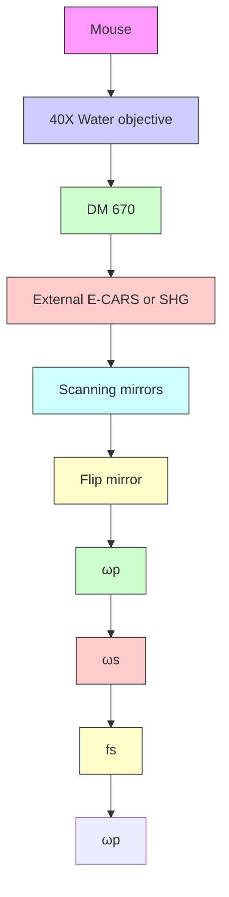

# In vivo coherent anti-Stokes Raman scattering imaging of sciatic nerve tissue

T. B . H U F F ∗ & J. - X . C H E N G ∗

∗Department of Chemistry,Purdue University, West Lafayette, IN 47907, U.S.A.

Weldon School of Biomedical Engineering, Purdue University, West Lafayette, IN 47907, U.S.A.

Key words. Coherent anti-Stokes Raman scattering, in vivo imaging, myelin.

## Summary

We report in vivo nonlinear optical imaging of mouse sciatic nerve tissue by epidetected coherent anti-Stokes Raman scattering and second harmonic generation microscopy. Following a minimally invasive surgery to open the skin, coherent anti-Stokes Raman scattering imaging of myelinated axons and second harmonic generation imaging of the surrounding collagen fibres were demonstrated with high signal-to-background ratio, three-dimensional spatial resolution, and no need for labelling. The underlying contrast mechanisms of in vivo coherent anti-Stokes Raman scattering were explored by three-dimensional imaging of fat cells that surround the nerve. The epidetected coherent anti-Stokes Raman scattering signals from the nerve tissues were found to arise from interfaces as well as back reflection of forward coherent anti-Stokes Raman scattering.

## Introduction

In vivo optical imaging has opened up a new window for observing biological structures and processes in normal and diseased states (Niell & Smith, 2004; Misgeld & Kerschensteiner, 2006). Visualization of molecular and cellular interactions in a living animal offers unique advantages over the traditional cell culture or tissue histology methods. In vivo imaging makes possible the study of dynamic processes such as T cell extravasation from blood (Vajkoczy et al., 2001) and axon degeneration/regeneration (Kerschensteiner et al., 2005) which cannot be mimicked by cell culture or extracted tissues. Additionally, in vivo imaging allowsonetofollowthesamecellorstructureovertimewithout significant perturbation to its environment.

Owing to the increased penetration depth associated with near infrared excitation, multiphoton microscopy (Zipfel et al., 2003) is emerging as a powerful tool for in vivo imaging (Helmchen & Denk, 2005). For example, two-photon excitation fluorescence imaging studies were able to show that microglial cells in a mouse brain are highly active even in their resting state (Nimmerjahn et al., 2005) and quickly respond to local brain injury (Davalos et al., 2005). Twophoton excitation fluorescence imaging of labelled tumour cells was combined with second harmonic generation (SHG) imaging of collagen fibrils for studies of tumour cell interaction with the extracellular matrix (Brown et al., 2003; Sahai et al., 2005).

A new type of multiphoton microscopy based on coherent anti-Stokes Raman scattering (CARS) has received added attention recently (for reviews, see Holtom et al., 2001; Cheng & Xie, 2004; Volkmer, 2005). CARS is a third-order nonlinear optical process in which a pump field $E _ { \mathrm { p } } ( \omega _ { \mathrm { p } } )$ and a Stokes field $E _ { \mathrm { s } } ( \omega _ { \mathrm { s } } )$ interact with a sample to generate a signal field $E _ { \mathrm { a s } }$ at the anti-Stokes frequency of $\omega _ { \mathrm { a s } } = 2 \omega _ { \mathrm { p } } - \omega _ { \mathrm { s } }$ (Shen, 1984). When $\omega _ { \mathrm { p } } { - } \omega _ { \mathrm { s } }$ is tuned to be resonant with a molecular vibration, the CARS signal can be significantly enhanced, producing a vibrational contrast. CARS microscopy permits molecularimagingwithseveraladvantages:Ramanresonance enhancement provides chemical selectivity without the need for labelling; coherent addition of CARS fields generates a large signal; nonlinear dependence on excitation intensities produces inherent three-dimensional (3D) resolution. CARS microscopy has been applied to image lipid bilayers (Muller &¨ Schins, 2002; Potma & Xie, 2003), DNA networks (Ichimura et al., 2004), photoresists (Potma et al., 2004), polymer films (Kee & Cicerone, 2004), membrane domains (Li et al., 2005; Potma & Xie, 2005), live cells (Cheng et al., 2002a; Nan et al., 2003), and isolated spinal tissues (Wang et al., 2005a). Recently, adipocytes and epithelium in a mouse ear were visualized in vivo with a CARS microscope operating at video rate (Evans et al., 2005).

Due to the limited penetration depth of CARS ( 100 µm), the study by Evans et al. was restricted to superficial structures

Correspondenceto:Ji-XinCheng,PurdueUniversity,WestLafayette,IN47907,U.S.A. e-mail: jcheng@purdue.edu

of mouse ear such as epithelial cells and dermal adipocytes. Nevertheless, it is important to explore the capability of CARS microscopy in imaging tissues deep under the skin which are sites for many significant diseases. By employing a careful and minimally invasive surgery, we demonstrate in this paper invivoCARSimagingofstructureslocatedbeneaththeskinand musculature. We choose to work on the sciatic nerve which is the largest single nerve in mammals. The facile accessibility of the sciatic nerve makes it a widely used system for studying peripheralnervoussystemdiseasesincludingleprosyandother inflammatory diseases (Gillen et al., 1998; Rambukkana et al., 2002; Zhu et al., 2003) as well as an ideal model for screening anti-inflammation drugs (Kurtoglu et al., 2004).

We employ epidetected CARS (E-CARS) for observation of mouse sciatic nerves. The epidetection scheme is critical for in vivo CARS imaging because it is virtually impossible for the forward CARS signal to pass through a thick sample. Because the phase-matching condition confines the CARS signal generated from the bulk solvent to the forward direction, the E-CARS image is largely free of the solvent background fo a thin sample (Volkmer et al., 2001). Instead, E-CARS signals can be generated from small scatterers and interfaces wherein an inhomogeneity is introduced (Cheng et al., 2002b). E-CARS may also arise from back reflection of forward detected CARS (F-CARS) due to multiple scattering events (Evans et al., 2005). In this paper, we show CARS images of parallel axonal myelin sheath surrounded by adipocytes in a mouse sciatic nerve with 3D spatial resolution and a high signal to background ratio. Moreover, by combining CARS and SHG into the same platform, we illustrate the 3D organization of collagen fibrils, axons, and adipocytes.

## Materials and methods

## Animal surgery

Adult Balb/C mice were anaesthetized by intraperitoneal injection of ketamine (50 mg kg−1) and xylazine (5 mg kg−1). Theskinoftheupperthighwasshavedandasmalllongitudinal incision was made. Dissection scissors were used to open the skin. The exposed tissue was gently rinsed with Milli-Q water in order to remove hair clippings from the incision. The sciatic nerve was clearly visible through the musculature and required no further dissection for imaging. To minimize image distortion caused by blood pulsing, the femoral artery was temporarily ligated near the upper thigh with silk sutures during the imaging period. The anaesthetized mouse was placed on its stomach on a homebuilt stage which contained a coverglass chamber to facilitate imaging on an inverted microscope. The animal was positioned such that the exposed tissue made direct contact with the coverglass. Tissue hydration was maintained by adding a small amount of phosphate buffered saline to the chamber. A heating pad was placed beneath the animal’s chest to maintain body temperature. Upon completion of the imaging procedure, animals were euthanized by a 2X ketamine-xylazine injection (ketamine 100 mg kg−1, xylazine 10 mg kg−1) followed by cervical dislocation to ensure euthanasia. All procedures were approved by the Purdue Animal Care and Use Committee.

## In vivo E-CARS and SHG imaging

A diagram of our experimental setup is shown in Fig. 1A. The 2.5 ps pump and Stokes beams were generated by two modelocked Ti:sapphire oscillators operated at a repetition rate of 77 MHz (Mira 900, Coherent, Santa Clara, CA, USA) and tightly synchronized (Sync-Lock, Coherent) with an average timing jitter of 100 fs. The two beams were collinearly combined using a dichroic combiner (LWP-45-R720-7850- PW-1004-UV, CVI Laser LLC, Albuquerque, NM). A Pockels cell (Model 350-160, Conoptics, Danbury, CT) was used to reduce the repetition rate of the combined beams to 4 MHz. The polarization of the incident beams was controlled by a half-wave plate. The combined beams were directed into a laser scanning confocal microscope (FV300/IX70, Olympus America, Melville, NY, USA). A 40X water immersion objective (LUM PlanFl/IR, numerical aperture $( \mathrm { N } . \mathrm { A } . ) = 0 . 8$ , Olympus) was used to focus the excitation beams into the sample. This objective has a working distance of 3.3 mm and relatively large field of view, $3 5 3 \times 3 5 3 \ \mu \mathrm { m }$ , which facilitates in vivo imaging of specific structures on an inverted microscope. The E-CARS signal was collected by the same objective, spectrally separated from the excitation source by a dichroic mirror (670dcxr, Chroma Technology Corp., Rockingham, VT, USA), transmitted through a bandpass filter (42-7336, Ealing Catalog Inc., Rocklin, CA), and detected by a photomultiplier tube (PMT, H7422-40, Hamamatsu, Japan) mounted at the back port of the microscope. The acquisition time for each image was 1.12 s. The total laser power at the sample was 6 mW.

flowchart

B  

natural_image

Microscopic view of elongated, fibrous structures with spherical particles in the background (no text or symbols)

C  
  
D

natural_image

Microscopic view of parallel striated structures with a white arrow pointing to a specific feature (no text or symbols present)

Fig. 1. Experimental Setup and in vivo E-CARS images. (A) Experimental setup for combined E-CARS and SHG imaging of a live mouse. (B) E-CARS imageofparallelmyelinatedaxonsinthesciaticnerveandthesurrounding fat cells. Scale bar  25 µm. (C) Node of Ranvier. The nodal myelin gap was confirmed by z sectioning. (D) Schmidt–Lanterman incisure. Bar = 5 µm in (C–D). $\omega _ { \mathrm { p } } - \omega _ { \mathrm { s } } = 2 8 4 0 \mathrm { c m } ^ { - 1 }$ for all the images.

A mode-locked femtosecond Ti:sapphire oscillator (Mira 900, Coherent, Santa Clara, CA, USA) was used for epidetected SHG imaging of collagen fibrils in the nerve tissue. The 200-fs laser beam was tuned to 795 nm and directed into the same laserscanningmicroscope.Thefslaserpoweratthesamplewas 32 mW. The backward SHG signal was spectrally separated by the same dichroic used for CARS imaging, transmitted through a bandpass filter (HQ375, Chroma), and detected by the external PMT at the back port.

## Results

In vivo CARS imaging of myelin sheath in mouse sciatic nerves

With $\omega _ { \mathrm { p } } \mathrm { ~ - ~ } \omega _ { \mathrm { s } }$ tuned to $2 8 4 0 ~ \mathrm { c m ^ { - 1 } }$ , the peak frequency of the CARS band for symmetric $\mathrm { C H } _ { 2 }$ stretch vibration, a large E-CARS signal was observed from the myelinated axons in the sciatic nerve as well as the surrounding fat cells (Fig. 1B). Detailed structures including the node of Ranvier (Fig. 1C) and Schmidt–Lanterman incisure (Fig. 1D) were clearly visualized. The apparent gap (Fig. 1B) between the sciatic nerve and the surrounding adipocytes is known to be occupied by a layer of collagen which protects the nerve bundle (Williams & Hall, 1970). The collagen fibrils have a much lower density of $\mathrm { C H } _ { 2 }$ groups than the myelin sheath, resulting in a nondetectable E-CARS signal.

The resonant versus nonresonant contribution to the E-CARS signal from the axonal myelin was quantified by comparing the CARS images from the same portion of sciatic nerve taken on resonance at $2 8 4 0 \ \mathrm { c m ^ { - 1 } \ ( F i g . \ 2 A ) }$ and off resonance at $3 0 0 0 \mathrm { c m } ^ { - 1 }$ (Fig. 2B). The intensity profiles below the images displayed a ratio of about 12.9:1, indicating that the detected E-CARS signal mainly arises from the $\mathrm { C H } _ { 2 }$ stretch vibration.

line chart

| Position (µm) | Intensity (a.u.) |
| ------------- | ---------------- |
| 0             | 0.5              |
| 5             | 1.2              |
| 10            | 2.8              |
| 15            | 1.9              |
| 20            | 3.1              |
| 25            | 2.5              |
| 30            | 3.5              |
| 35            | 1.7              |
| 40            | 0.8              |

line chart

| Position (μm) | Value |
| ------------- | ----- |
| 0             | 0     |
| 10            | 0     |
| 20            | 0     |
| 30            | 0     |
| 40            | 0     |

line chart

| X (μm) | Intensity (a.u.) |
| ------ | ---------------- |
| 0.0    | 3.5              |
| 0.2    | 2.0              |
| 0.4    | 1.0              |
| 0.6    | 0.8              |
| 0.8    | 1.5              |
| 1.0    | 2.5              |
| 1.2    | 2.0              |
| 1.4    | 1.0              |
| 1.6    | 0.8              |
| 1.8    | 1.5              |
| 2.0    | 2.0              |
| 2.2    | 1.0              |
| 2.4    | 0.5              |
| 2.6    | 1.5              |
| 2.8    | 2.5              |
| 3.0    | 3.0              |

line chart

| Z (μm) | Value |
| ------ | ----- |
| 0      | 0     |
| 1      | 0.5   |
| 2      | 1     |
| 3      | 2     |
| 4      | 3     |
| 5      | 3.5   |
| 6      | 3.8   |

Fig. 2. Spectral selectivity and spatial resolution. (A–B) E-CARS images of myelinated axons taken with $\omega _ { \mathrm { p } } \mathrm { ~ - ~ } \omega _ { \mathrm { s } }$ tuned to (A) $2 8 4 0 ~ \mathrm { c m ^ { - 1 } }$ and (B) 3000 $\mathrm { c m ^ { - 1 } }$ . The intensity profiles along the white lines are shown below the images. The CARS intensity at $2 8 4 0 \mathrm { c m } ^ { - 1 } \mathrm { i s } 1 2 . 9$ times that at $3 0 0 0 \mathrm { c m } ^ { - 1 }$ , indicating the spectral selectivity. (C) E-CARS image of small axons with the intensity profile located below (dots solid line). The lateral resolution was measured as the minimal FWHM $( = 0 . 5 1 \mu \mathrm { m } )$ from a single myelin sheath. (D) E-CARS image of a fat cell in the $x { - } z$ plane. The dots solid line show the intensity profile along the red line. The axial resolution was determined as the FWHM $( = 1 . 6 ~ \mu \mathrm { m } )$ of the derivative (solid line) of the axial intensity profile. $\omega _ { \mathrm { p } }$ $\omega _ { \mathrm { s } } = 2 8 4 0 \mathrm { c m } ^ { - 1 }$ for (C) and (D).

The spatial resolution of our CARS images was determined by using the structures in the same tissue sample. The lateral resolution was estimated as the minimal full-width at halfmaximum (FWHM) of a single myelin sheath (Fig. 2C). The lateral FWHM was found to be 0.51 µm. Due to the difficulty in distinguishing the top and bottom part of the myelin sheath surrounding an axon, we used a fat cell lipid droplet (Fig. 2D) to estimate the axial resolution. We calculated the first derivative of the intensity profile (Hashimoto et al., 2000) across the droplet/medium interface and measured the FWHM to be 1.6 µm. These values approximately correspond to the diffraction limited spot size of the water objective used in our experiment.

natural_image

Microscopic view of cellular or tissue structures with a scale bar and label 'A' (no text or symbols beyond labels)

natural_image

Close-up grayscale image of teeth and jawbone structure (no text or symbols visible)

natural_image

Microscopic view of fibrous tissue with visible striations and a scale bar (no text or symbols)

natural_image

Microscopic view of fibrous tissue with a scale bar and label 'D' (no text or symbols beyond label)

natural_image

Microscopic view of fibrous or layered material structure with a scale bar and label 'E' (no text or symbols beyond label)

natural_image

Microscopic view of fibrous or layered material structure with a scale bar (no text or symbols)

Fig. 3. E-CARS images of sciatic nerve at increasing depth (A) 0 µm, (B) 10 µm, (C) 20 µm, (D) 30 µm, (E) 40 µm and (F) 50 µm. The dark contrast along the axons in the left-hand side of (D), (E) and (F) is due to defocusing of excitation beams and scattering of E-CARS signals by adipocytes right beneath the axons. $\omega _ { \mathrm { p } } - \omega _ { \mathrm { s } } = 2 8 4 0 \mathrm { c m } ^ { - 1 } . \mathrm { B a r } = 2 0 \mu \mathrm { m } .$

In order to determine the penetration depth of our system for in vivo imaging of the sciatic nerve, we obtained E-CARS images of sciatic nerve tissue at various imaging depths (Fig. 3). We found that the penetration depth is dependent on the location along the nerve tissue on which CARS imaging is performed as the nerve is not at a constant depth throughout its length. Typically, we are able to obtain good E-CARS signals at a depth of 50 µm from the lower surface of the nerve (Fig. 3F). We consider that the limited penetration is mainly due to scattering of the excitation beams and E-CARS signals by the myelinated axons themselves. Scattering by adipocytes located around the nerve may further limit the penetration depth.

Additionally, we characterized the ordering degree of myelin lipids using the polarization sensitivity of CARS (Cheng et al., 2001; Potma & Xie, 2003). Figure 4A and B show E-CARS images of myelinated axons oriented along the y-axis with vertically and horizontally polarized excitation, respectively. For axons oriented along the y-axis, the symmetry axis of the CH2 groups of the myelin lipids in the equatorial plane is aligned along the y-axis as well, giving rise to a stronger CARS signal from the symmetric $\mathrm { C H } _ { 2 }$ stretch vibration when y-polarized excitation is applied. With the laser beams focused at the equatorial plane of the myelinated axon, the ratio of the E-CARS signal with y-polarized excitation versus that with x-polarized excitation was measured to be 2.5 ( 0.5). This value is smaller than the ratio of 3.0 ( 0.09) measured from the isolated spinal tissue (Wang et al., 2005a) possibly due to respiration motion of the mouse.

## In vivo CARS signal generation

The mechanism of E-CARS generation from the nerve tissue was explored by 3D imaging of the lipid droplets inside the fat cells surrounding the sciatic nerve at various focal depths (Fig. 5). A strong E-CARS signal was observed at both the top (Fig. 5A) and bottom (Fig. 5C) of the lipid droplet indicated with a red line. Additionally, a ring-like structure was observed between the top (or bottom) centre and the edge which appears as shoulders on the edges of the intensity profiles (Fig. 5E). When the incident beams were focused at the equatorial plane of the indicated fat cell (Fig. 5B), the E-CARS signal from the edge of the fat cell was found to be 2.3 times that from the centre region (Fig. 5E). The same features can be seen in other fat cells.

We have also obtained both F-CARS (red) and E-CARS (green) images of a lipid droplet isolated from the nerve tissue (Fig. 5D) with the laser beams focused at the equatorial plane. The intensity profiles (Fig. 5F) along the white line in Figure 5D displays significant differences between F- and E-CARS. Whereas the two traces cannot be compared quantitatively because of different optics and detectors used, it is clear that the greatest E-CARS signal arises from the interface between the lipid droplet and its surroundings, resembling our observations in vivo (Fig. 5B). By contrast, the F-CARS signal is the greatest in the centre region of the droplet and decreases rapidly at the edges. We note that lipid bodies in adipocytes are coated with a monolayer lipid membrane (Zweytick et al., 2000). To examine whether the interface peaks arise from the monolayer, we performed a polarization study (Supplementary Fig. S1) and observed little dependence of the CARS contrast on the excitation polarization. Because of the highly ordered lipid chains, a strong dependence on excitation polarization is expected if the CARS signal is from the monolayer or bilayer (Potma & Xie, 2003). Therefore, the E-CARS intensity peaks observed at the lipid droplet surface are indeed an interface effect.

  
Fig. 4. Dependence of the CARS signal from myelin on the excitation polarization. Myelin sheath was imaged using (A) vertically and (B) horizontally polarized excitation. Plotted below the images are the intensity profiles along the lines shown. A slight offset in the peak positionwhenchangingfromverticallytohorizontallypolarizedexcitation occurred due to sample movement induced by mouse respiration. The CARS intensity ratio for vertically versus horizontally polarized excitation is 2.5 ( 0.5). ω $\omega _ { \mathrm { s } } = 2 8 4 0 \mathrm { c m } ^ { - 1 }$ .

  
Fig. 5. E-CARS images of the fat tissue at the focal depths of (A) bottom (close to skin), $\mathsf { \Omega } , z = 0 . 0 \mu \mathrm { m } , \left( \mathrm { B } \right)$ )middle,z 6.8µm,and(C)top,z 13.6µm. The rings that appear around the cell in A and C are due to interference between the backward CARS field from the interface and the back-reflected forward CARS field. Scale bar 25 µm in (A)–(C). (D) F-CARS (red) and E-CARS (green) image of a single fat droplet on a glass cover slip. For all images, $\omega _ { \mathrm { p } } - \omega _ { \mathrm { s } }$ was tuned to $2 8 4 0 \mathrm { c m } ^ { - 1 }$ . (E) Intensity profile along the red lines in (A)–(C). The E-CARS signal is maximized in the central region of the lipid droplet when focused at the top (black) and bottom (blue) of the cell whereas it is greatest along the edges when focused at the equatorial plane (red). The peaks at the edges of the blue and black traces correspond to the interference pattern seen in (A) and (C). (F) Intensity profile along the white line in (D). The E-CARS (green) signal arises from the interface whereas the F-CARS (red) signal is maximized in the centre region.

## Combined E-CARS and SHG imaging

CARS microscopy has been combined with two-photon excitationfluorescencemicroscopyforvisualizationofmultiple structures in spinal and skin tissues (Evans et al., 2005; Wang et al., 2005a). Here we show multimodal multiphoton imaging of nerve tissues by combining CARS with SHG. The different signal generation mechanisms responsible for CARS (Shen, 1984) and SHG (Boyd, 2003) allow for selective imaging of different structures without fluorophore labelling. CARS microscopy provides a high contrast for myelinated axons as well as fat cells which are both rich in lipids. SHG, on the other hand, is sensitive to highly polarized protein fibrils (Freund et al., 1986; Campagnola et al., 2002). Figure 6A–C shows an overlay of the sequentially acquired E-CARS (green) and SHG (red-orange) images at various focal depths. $\mathrm { A t } \mathrm { Z } { = } 5 \mu \mathrm { m }$ (closer totheskin),weobservedlooseandcurvedfibrils(red-orange)as well as a hair root (green) which gives a strong CARS and auto fluorescence signal. Densely packed collagen was found when approaching the nerve $( Z = 2 8 \mu \mathrm { m } )$ . With the beams focused inside the nerve bundle $( \mathrm { Z } = 3 9 ~ \mu \mathrm { m } )$ , we observed collagen fibrils surrounding the adipocytes and along the outer edges of the nerve. A 3D visualization is available from Supplementary Movie 1.

natural_image

Fluorescent microscopy image showing red-stained cellular structures with a green-labeled region (no text or symbols)

natural_image

Microscopic image of a fibrous or cellular structure with orange-to-black gradient, labeled 'B' in top right corner (no other text or symbols)

natural_image

Microscopic fluorescent image showing green and red cellular structures with a scale bar (no text or symbols)

Fig. 6. E-CARS (green) and SHG (red-orange) images of mouse sciatic nerve tissue at varying depths. (A) $Z = 5 \ \mu \mathrm { m } ,$ , close to skin. (B) $Z = 2 8 \ \mu \mathrm { m } .$ $( \mathrm { C } ) \mathrm { Z } = 3 9 \mu \mathrm { m }$ . E-CARS probes the fat cells and myelinated axons whereas SHG probes the collagen fibrils surrounding sciatic nerve. $\omega _ { \mathrm { p } } - \omega _ { \mathrm { s } } = 2 8 4 0 \mathrm { c m } ^ { - 1 }$ . $\mathrm { B a r } = 2 0 \mu \mathrm { m } .$ .

Our results agree with the ultrastructure of peripheral nerve collagen revealed by electron microscopy. Electron microscopy studies exhibited dense collagen bundles that sheath the entire nerve (Ushiki & Ide, 1990). Moreover, electron microscopic immunocytochemistry analyses have indicated that the large bundles surrounding the sciatic nerve are composed of collagen I and III. (Lorimier et al., 1992). Consistent with these observations, our SHG imaging of the mouse sciatic nerve tissue shows collagen organized into distinct structures: Large but sparse fibrils are found in the tissue above the sciatic nerve whereas dense fibrils are seen surrounding the whole nerve (Fig. 5B and edges of Fig. 5C). These dense fibrils closely resemble the epineurial collagen as seen by electron microscopy.

## Discussion

## Experimental designs for in vivo CARS imaging

We have combined several strategies to obtain a large E-CARS signal from the sciatic nerve tissue. First, we employed a pair of 2.5 ps pulse trains generated from mode-locked Ti:sapphire oscillators to provide the pump and Stokes beams. The spectral width of a 2.5 ps pulse closely matches the line width of the $\mathrm { C H } _ { 2 }$ symmetric stretch Raman band ensuring that most of the excitation energy is utilized to generate resonant signal (Cheng et al., 2001). Second, we used a Pockels cell to reduce the repetition rate of the collinearly combined excitation beams to a few megahertz, thus maintaining a high peak power for nonlinear optical signal generation while minimizing average power induced damage to the sample. Third, we utilized a PMT externally mounted at the back port of our microscope as opposed to the PMT internally housed in the FV300 box. The nondescanned E-CARS signal from the sciatic nerve detected with the external PMT was found to be about 80 times greater than the internally housed PMT owing to the shorter sampledetector distance which allows more efficient collection of the highly divergent signal from the tissue.

There remain a number of technical challenges to overcome in development of in vivo CARS imaging of deep tissues. Minimizing the surgical work required to expose the desired tissue or even eliminating the need for surgery is perhaps the most important one. Due to the strong scattering of the excitation beams by the highly turbid skin tissue, the penetration of CARS is limited to features of thin skin (Evans et al., 2005). A minimally invasive surgical procedure to open the skin is necessary to reach deeper tissues, as shown in this paper. We anticipate that the penetration depth of CARS microscopy can be further extended by the following approaches: beam delivery with gradient index lenses which have been used in one- and two-photon fluorescence microscopy (Mehta et al., 2004), use of longer excitation wavelengths as demonstrated by the recently developed OPO system (Ganikhanov et al., 2006), and compensation of defocusing by adaptive aberration correction (Booth et al., 2002).

## Mechanisms of E-CARS signal generation in vivo

Theoretical and experimental studies based on in vitro systems (Cheng et al., 2002b) have identified three sources of E-CARS contrast: (i) scatterers with an axial length much less than the excitation wavelengths, (ii) interfaces perpendicular to the optical axis and (iii) back reflection of the forward CARS signal by an index mismatched interface. It has been recently proposed that a significant source for in vivo E-CARS contrast is back reflection of the forward CARS signal by multiple scattering events as it propagates through a thick tissue (Evans et al., 2005).

In order to examine the mechanisms for in vivo E-CARS from the nerve tissue, we have acquired 3D E-CARS images of the lipid droplets in the neighbouring fat cells (Fig. 5). The lipid droplets are much larger than the focal volume of the objective, eliminating the first contrast mechanism. The E-CARS signal from the top and bottom of the lipid droplet can be attributed to the droplet/medium interface (mechanism ii). The appearance of the ring-like structures (Fig. 5A) can be explained as a consequence of the interference between theepiscatteredCARSfieldsfromthedroplet/mediuminterface and the back-reflected forward CARS fields. This interference phenomenon was predicted theoretically (Cheng et al., 2002b) and observed from a vesicle placed on a cover slip (Potma & Xie, 2003). When focusing the beams at the equatorial plane, the intense E-CARS signal from the edges of the cell is likely due to the curved interface between the lipid droplet and the surrounding medium (mechanism ii). The contrast seen from the droplet central region can be a result of partial back reflection of the forward CARS signal by the upper interface (mechanism iii). Because of defocusing of the back-reflected forward CARS signal, the intensity from the central region is less than that from the edges.

OurinterpretationsoftheE-CARSsignalgenerationforthese fat cells in vivo are supported by the CARS images taken from an isolated fat cell (Fig. 5D). With the excitation beams focused at the equatorial plane of the lipid droplet, we find that the E-CARS contrast (green) at the edges is greater than that in the central region, similar to what we observed from the droplets in vivo. The corresponding intensity profile (Fig. 5F) shows two intense peaks located at the droplet/medium interface, with a FWHM of 0.5 µm. On the other hand, the F-CARS signal (red) is much greater in the centre region and drops at the interfaces.

TheE-CARScontrastofthemyelinsheathcanbeunderstood in a manner analogous to the aforementioned lipid bodies. We notice that the FWHM of the E-CARS intensity profiles from the lipid/medium interfaces are 0.5 µm (Fig. 5F) whereas the thickness of the myelin sheath is observed to be 1 µm (see the intensity profiles in Fig. 2A and C). It is conceivable that the strong E-CARS signal generated by the myelin sheath at the equatorial plane results from signal generation at the interfaces between the myelin sheath and the intra- and extraaxonal medium.

BesidesthestrongE-CARSsignalgeneratedbytheequatorial myelin, our images of sciatic nerve also show a weak signal in the intra-axonal space (see intensity profiles in Figs 2 and 4). Such a signal was not observed in CARS imaging of isolated spinal cord tissue (Wang et al., 2005b) and can be attributed to the multiple backscattering of forward CARS. The forwardpropagating photons would experience a significantly greater number of scattering events from densely packed tissues such as the skin (Cheong et al., 1990). The densily packed skin tissue could also distort the point spread function, which eliminates the E-CARS signal from interfaces. In such cases, back reflection of F-CARS signals becomes the major E-CARS mechanism (Evans et al., 2005).

## Conclusions

We have demonstrated in vivo E-CARS imaging of myelin sheath and SHG imaging of collagen fibrils in sciatic nerve tissues with a minimally invasive surgery to open the skin. Furthermore, we have explored the signal generation mechanisms of in vivo E-CARS. Through comparison of in vivo with ex vivo tissue samples, we revealed an E-CARS contrast which arises from the interfaces. The large CARS signals generated by myelin membranes make CARS microscopy an ideal tool for characterization of intact myelin sheath with real-time visualization capability, 3D spatial resolution, and polarization sensitivity. The ability to study nervous tissue in an in vivo environment avoids mechanical damage to the fragile neuronal cells. This method not only maintains sample integrity, but also ensures that the tissue receives sufficient oxygen and nutrient supply which is of significant concern when dealing with extracted tissue samples. Additionally, CARS microscopy can be coupled with other multiphoton imaging techniques such as SHG for multimodality in vivo imaging. These advances are expected to open up new opportunities for neurological studies, for example, following the sequence of pathological events in Guillain-Barre´ syndrome (Hughes & Cornblath, 2005), an inflammatory demyelinating peripheral nervous system neuropathy.

## Acknowledgements

We thank William Schoenlein, Melissa Bible, and Amy Peterson for their generous assistance with the animal surgeries. We also acknowledge Jonathan Sutcliffe for his help in some experiments. This work was supported by NSF grant # 0416785-MCB and NIH R21 grant # EB004966-01.

## References

Booth, M.J., Neil, M.A.A., Juskaitis, R. & Wilson, T. (2002) Adaptive aberration correction in a confocal microscope. Proc. Natl. Acad. Sci. USA 99, 5788–5792.  
Boyd, R.W. (2003). Nonlinear Optics. Academic Press, New York.  
Brown, E., McKee, T., di Tomaso, E., Pluen, A., Seed, B., Boucher, Y. & Jain, R.K. (2003) Dynamic imaging of collagen and its modulation in tumors in vivo using second-harmonic generation. Nat. Med. 9, 796–800.  
Campagnola, P.J., Millard, A.C., Terasaki, M., Hoppe, P.E., Malone, C.J. & Mohler, W.A. (2002) Three-dimensional high-resolution secondharmonic generation imaging of endogenous structural proteins in biological tissues. Biophys. J. 82, 493–508.  
Cheng, J.-X., Book, L.D. & Xie, X.S. (2001) Polarization coherent anti-Stokes Raman scattering microscopy. Opt. Lett. 26, 1341–1343.  
Cheng, J.-X., Jia, Y.K., Zheng, G. & Xie, X.S. (2002a) Laser-scanning coherent anti-Stokes Raman scattering microscopy and applications to cell biology. Biophys. J. 83, 502–509.  
Cheng, J.-X., Volkmer, A. & Xie, X.S. (2002b) Theoretical and experimental characterization of coherent anti-Stokes Raman scattering microscopy. J. Opt. Soc. Am. B 19, 1363–1375.  
Cheng, J.-X. & Xie, X.S. (2004) Coherent anti-Stokes Raman scattering microscopy: instrumentation, theory, and applications. J. Phys. Chem. B 108, 827–840.  
Cheong, W.-F., Prahl, S.A. & Welch, A.J. (1990) A review of the optical properties of biological tissues. J. Quantum Elec. 26, 2166–2185.  
Davalos, D., Grutzendler, J., Yang, G., et al. (2005) ATP mediates rapid microglial response to local brain injury in vivo. Nat. Neurosci. 8, 752– 758.  
Evans, C.L., Potma, E.O., Puoris’haag, M., Cotˆ e, D., Lin, C.P. & Xie, S. (2005)´ Chemical imaging of tissue in vivo with video-rate coherent anti-Stokes Raman scattering microscopy. Proc. Natl. Acad. Sci. USA 102, 16807– 16812.  
Freund, I., Deutsch, M. & Sprecher, A. (1986) Connective tissue polarity Optical second harmonic microscopy, crossed-beam summation, and small-angle scattering in rat tail tendon. Biophys. J. 50, 693–712.  
Ganikhanov, F., Carrasco, S., Xie, X.S., Katz, M., Seitz, W. & Kopf, D. (2006) Broadly tunable dual-wavelength light source for coherent anti-Stokes Raman scattering microscopy. Opt. Lett. 31, 1292–1294.  
Gillen, C., Jander, S. & Stoll, G. (1998) Sequential expression of mRNA for proinflammatory cytokines and interleukin-10 in the rat peripheral nervous system: comparison between immune-mediated demyelination and wallerian degeneration. J. Neurosci. Res. 51, 489–496.  
Hashimoto, M., Araki, T. & Kawata, S. (2000) Molecular vibration imaging in the fingerprint region by use of coherent anti-Stokes Raman scattering microscopy with a collinear configuration. Opt. Lett. 25, 1768–1770.  
Helmchen, F. & Denk, W. (2005) Deep tissue two-photon microscopy. Nat. Methods 2, 932–940.  
Holtom, G.R., Thrall, B.D., Chin, B.Y., Wiley, H.S. & Colson, S.D. (2001) Achieving molecular selectivity in imaging using multiphoton Raman spectroscopy techniques. Traffic 2, 781–788.  
Hughes, R.A.C. & Cornblath, D.R. (2005) Guillain-Barre´ syndrome. Lancet 366, 1653–1666.  
Ichimura,T.,Hayazawa,N.,Hashimoto,M.,Inouye,Y.&Kawata,S.(2004) Tip-enhanced coherent anti-Stokes Raman scattering for vibrational nanoimaging. Phys. Rev. Lett. 92, 220–801.  
Kee,T.W.&Cicerone,M.T.(2004)Simpleapproachtoone-laser,broadband coherentanti-StokesRamanscatteringmicroscopy.Opt.Lett.29,2701– 2703.  
Kerschensteiner, M., Schwab, M.E., Lichtman, J.W. & Misgeld, T. (2005) In vivo imaging of axonal degeneration and regeneration in the injured spinal cord. Nat. Med. 11, 572–577.  
Kurtoglu, Z., Ozturk, A.H., Bagdatoglu, C., Turac, A., Camdeviren, H., Uzmansel, D. & Aktekin, M. (2004) Effect of trapidil on the sciatic nerve with crush injury: a light microscopic study. Neuroanat. 3, 54–58.  
Li, L., Wang, H. & Cheng, J.-X. (2005) Quantitative coherent anti-Stokes Raman scattering imaging of lipid distribution in coexisting domains. Biophys. J. 89, 3480–3490.  
Lorimier, P., Mezin, P., Moleur, F.L., Pinel, N., Peyrol, S. & Stoebner, P. (1992) Ultrastructural-localization of the major components of the extracellular-matrix in normal rat nerve. J. Histochem. Cytochem. 40, 859–868.  
Mehta, A.D., Jung, J.C., Flusberg, B.A. & Schnitzer, M.J. (2004) Fiber optic in vivo imaging in the mammalian nervous system. Curr. Op. Neurobiol. 14, 617–628.  
Misgeld, T. & Kerschensteiner, M. (2006) In vivo imaging of the diseased nervous system. Nat. Rev. Neurosci. 7, 449–463.  
Muller, M. & Schins, J.M. (2002) Imaging the thermodynamic state of¨ lipid membranes with multiplex CARS microscopy. J. Phys. Chem. B. 106, 3715–3723.  
Nan, X., Cheng, J.-X. & Xie, X.S. (2003) Vibrational imaging of lipid droplets in live fibroblast cells using coherent anti-Stokes Raman microscopy. J. Lipid Res. 44, 2202–2208.  
Niell, C.M. & Smith, S.J. (2004) Live optical imaging of nervous system development. Annu. Rev. Physiol. 66, 771–798.  
Nimmerjahn, A., Kirchhoff, F. & Helmchen, F. (2005) Resting microglia cells are highly dynamic surveillants of brain parenchyma in vivo. Science 308, 1314–1318.  
Potma, E.O. & Xie, X.S. (2003) Detection of single lipid bilayers in coherent anti-Stokes Raman scattering (CARS) microscopy. J. Raman Spectrosc. 34, 642–650.  
Potma, E.O. & Xie, X.S. (2005) Direct visualization of lipid phase segregation in single lipid bilayers with coherent anti-Stokes Raman scattering microscopy. Chem. Phys. Chem. 6, 77–79.  
Potma, E.O., Xie, X.S., Muntean, L., et al. (2004) Chemical imaging of photoresists with coherent anti-Stokes Raman scattering (CARS) microscopy. J. Phys. Chem. B 108, 1296–1301.  
Rambukkana, A., Zanazzi, G., Tapinos, N. & Salzer, J.L. (2002) Contactdependent demyelination by mycobacterium leprae in the absense of immune cells. Science 296, 927–931.  
Sahai, E., Wyckoff, J., Philippar, U., Segall, J.E., Gertler, F. & Condeelis, J. (2005) Simultaneous imaging of GFP, CFP, and collagen in tumors in vivo using multiphoton microscopy. BMC Biotechnology 5, 14.  
Shen, Y.R. (1984) The Principles of Nonlinear Optics. John Wiley and Sons, New York.  
Ushiki, T. & Ide, C. (1990) Three-dimensional organization of the collagen fibrils in the rat sciatic nerve as revealed by transmission- and scanning electron microscopy. Cell Tiss. Res. 260, 175–184.  
Vajkoczy, P., Laschinger, M. & Engelhardt, B. (2001) α4-integrin-VCAM-1 binding mediates G protein-independent capture of encephalitogenic T cell blasts to CNS white matter microvessels. J. Clin. Invest. 108, 557– 565.  
Volkmer, A. (2005) Vibrational imaging and microspectroscopies based on coherent anti-Stokes Raman scattering microscopy. J. Phys. D. 38, R59–R81.  
Volkmer, A., Cheng, J.-X. & Xie, X.S. (2001) Vibrational imaging with high sensitivity via epidetected coherent anti-Stokes Raman scattering microscopy. Phys. Rev. Lett. 87, 023901-1–023901-4.  
Wang, H., Fu, Y., Zickmund, P., Shi, R. & Cheng, J.-X. (2005a) Coherent anti-Stokes Raman scattering imaging of axonal myelin in live spinal tissue. Biophys. J. 89, 581–591.  
Wang, H., Huff, T.B., Zweifel, D.A., He, W., Low, P.S., Wei, A. & Cheng, J.-X. (2005b) In vitro and in vivo two-photon luminescence imaging of single gold nanorods. Proc. Natl. Acad. Sci. USA 102, 15752–15756.  
Williams, P.L. & Hall, S.M. (1970) In vivo observations on mature myelinated nerve fibres of the mouse. J. Anat. 107, 31–38.  
Zhu, W., Mix, E. & Zhu, J. (2003) Inflammation and proinflammatory cytokine production, but no demyelination of facial nerves, in experimental autoimmune neuritis in Lewis rats. J. Neuroimmunol. 140, 97–101.  
Zipfel, W.R., Williams, P.L. & Webb, W.W. (2003) Nonlinear magic: multiphoton microscopy in the biosciences. Nat. Biotech. 21, 1369– 1377.  
Zweytick, D., Athenstaedt, K. & Daum, G. (2000) Intracellular lipid particles of eukaryotic cells. Biochim. Biophys. Acta 1469, 101– 120.