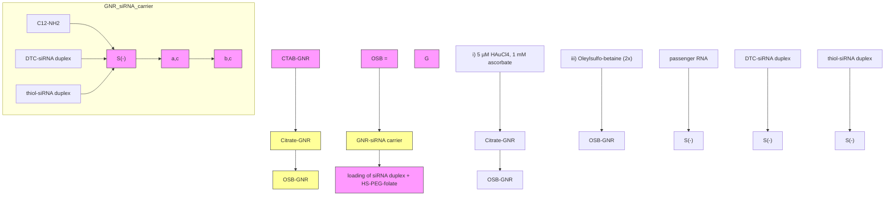

# siRNA Delivery Using Dithiocarbamate-Anchored Oligonucleotides on Gold Nanorods

Jianxin Wang, † Mini Thomas,† Peng Lin,†,‡,# Ji-Xin Cheng,†,‡,#,▽ Daniela E. Matei,∥,⊥ and Alexander Wei\*,†,§

† Department of Chemistry, Purdue University, 560 Oval Drive, West Lafayette, Indiana 47907, United States  
‡ Department of Biomedical Engineering, Purdue University, 206 South Martin Jischke Drive, West Lafayette, Indiana 47907, United States  
§ Department of Materials Science and Engineering, Purdue University, 701 West Stadium Avenue, West Lafayette, Indiana 47907, United States  
∥ Department of Obstetrics and Gynecology, Northwestern University Feinberg School of Medicine, 250 East Superior Street, Chicago, Illinois 60611, United States  
⊥Robert H. Lurie Comprehensive Cancer Center, Chicago, Illinois 60611, United States

## \*S Supporting Information

ABSTRACT: We present a robust method for loading small interfering RNA (siRNA) duplexes onto the surfaces of gold nanorods (GNRs) at high density, using near-infrared laser irradiation to trigger their intracellular release with subsequent knockdown activity. Citrate-stabilized GNRs were first coated with oleylsulfobetaine, a zwitterionic amphiphile with low cytotoxicity, which produced stable dispersions at high ionic strength. Amine-modified siRNA duplexes were converted into dithiocarbamate (DTC) ligands and adsorbed onto GNR surfaces in a single incubation step at 0.5 M NaCl, simplifying

bar chart

| Condition | Normalized TG2 activity (%) |
|---|---|
| - DTC-siRNA | 100 |
| + DTC-siRNA | 15 |

the charge screening process. The DTC anchors were effective at minimizing premature siRNA desorption and release, a common but often overlooked problem in the use of gold nanoparticles as oligonucleotide carriers. The activity of GNR− siRNA complexes was evaluated systematically against an eGFP-producing ovarian cancer cell line (SKOV-3) using folate receptor-mediated uptake. Efficient knockdown was achieved by using a femtosecond-pulsed laser source to release DTCanchored siRNA, with essentially no contributions from spontaneous (dark) RNA desorption. GNRs coated with thiolanchored siRNA duplexes were less effective and also permitted low levels of knockdown activity without photothermal activation. Optimized siRNA delivery conditions were applied toward the targeted knockdown of transglutaminase 2, whose expression is associated with the progression of recurrent ovarian cancer, with a reduction in activity of >80% achieved after a single pulsed laser treatment.

## INTRODUCTION

Small-interfering RNA (siRNA) oligonucleotide duplexes offer the capacity to suppress production of virtually any gene product. The mechanism of siRNA inhibition was elucidated nearly 20 years ago,1 sparking a global effort to harness siRNA’s therapeutic potential for the selective inhibition of proteins and signaling pathways, many previously considered to be “undruggable”.2 The design of robust platforms that enable the precise delivery and release of siRNA duplexes for efficient knockdown within target cells remains a primary challenge. Many promising contenders are nanoparticulate by design, several of which have entered clinical trials with the goal of transforming siRNA delivery into a true therapy.3−5

Gold nanoparticles (GNPs) were introduced as carriers for nucleic acid delivery more than a decade ago, initially via electrostatic adsorption with polyethylenimine,6,7 followed by chemisorption with thiol-terminated siRNA.8,9 An appealing reason for using GNPs as siRNA carriers is their capacity to produce a strong photothermal response at visible or nearinfrared (NIR) wavelengths. The plasmonic excitation of GNPs can trigger the release of bound surface molecules10,11 while enabling their escape from endocytic vesicles12 and can provide spatiotemporal control over siRNA release for “ondemand” knockdown therapies.13 NIR-absorbing GNPs are especially appealing as photothermal carriers because NIR light can penetrate into biological tissues with relatively low attenuation. 14

Special Issue: Delivery of Proteins and Nucleic Acids: Achievements and Challenges

Received: October 9, 2018

Revised: November 2, 2018

Published: November 5, 2018

Concerning the mechanism of siRNA knockdown, the RNA duplex (20−25 bp) serves as the substrate for the cytoplasmic RNA-induced silencing complex (RISC), which catalyzes the removal of one strand (passenger) and the hybridization of the remaining antisense strand (guide) with the target mRNA sequence, effectively tagging it for degradation.15 This means that the photothermal trigger should be designed to release intact RNA duplexes from GNP surfaces rather than singlestranded antisense RNA for maximum interference. In this respect, the use of a femtosecond (fs)-pulsed NIR laser is more effective than continuous-wave (CW) laser irradiation for siRNA duplex release. The absorption of ultrashort laser pulses by GNPs generates localized photoacoustic effects that favor the ejection of siRNA duplexes from the surface while rupturing the encapsulating liposome.10−12 By comparison, photothermal effects from CW laser irradiation are less intense and produce more conventional forms of heat that promote denaturation and the release of single-stranded RNA. 13,16

With regard to in vivo delivery, siRNA duplexes are capable of activating the innate immune response soon after cell uptake,17 especially for systems that rely on electrostatic adsorption to cationic lipids or polymers.15 GNPs loaded with dense monolayers of axially oriented RNA duplexes have proven to be an excellent alternative to cationic lipoplexes for siRNA delivery, as this architecture shields siRNA from nucleases and Toll-like receptors. Studies by Mirkin and coworkers have shown that “spherical nucleic acids” (dense monolayers of thiolated oligonucleotides on 13 nm GNP cores) are stable in physiological environments and resist enzymatic degradation,8,18 and can produce in vivo knockdown effects without generating a collateral immune response.19,20

These observations have motivated us to design siRNA carriers in which duplexes are covalently anchored onto cores of gold nanorods (GNRs), whose strong NIR absorptions have proven valuable in a variety of nanomedicine applications.21,22 The siRNA monolayer can be further shielded from proteinmediated degradation by installing PEG chains on the GNR surface,23 decorated with targeting ligands to encourage cellspecific uptake (Figure 1).24 Previous studies of GNRs as

chemical

Diagram of GNR (glutamate receptor) complex with DTC-siRNA duplex and PEG/siRNA interaction sites

Figure 1. Gold nanorod (GNR)−siRNA carrier, consisting of a monolayer of oriented siRNA duplexes anchored by dithiocarbamate (DTC) units, with thiolated polyethylene glycol−folate (HS-PEGfolate) as a coadsorbate.

siRNA carriers have relied on cationic polyelectrolytes for electrostatic adsorption ,25−36 but to our knowledge there have been no reports of GNRs supporting chemisorbed layers of siRNA duplexes, thus lagging behind other NIR-active carriers such as nanoshells12,37−41 and nanostars.42,43

Two major technical hurdles must be addressed to produce effective GNR−siRNA platforms. The first is the efficient chemisorption of oriented siRNA duplexes: siRNA loading must overcome electrostatic repulsion while maintaining dispersion stability during surface adsorption. Thiolated oligonucleotides are typically adsorbed onto GNPs at high density using the charge screening or “salt-aging” process by gradually increasing the ionic strength of the solution (up to 1 M).44−46 This practice is less straightforward for GNRs due to their structural anisotropy and the challenges posed by cetyltrimethylammonium bromide (CTAB), a cationic surfactant used in GNR synthesis22 whose efficient removal requires considerable attention to detail.47− 49 Several methods for exchanging CTAB with thiolated DNA have been de-50−52 but have not been applied toward the loading of siRNA duplexes on GNRs.

A second, more vexing problem associated with thiolated oligonucleotides is their appreciable rate of surface desorption under physiological conditions. This compromises the efficacy of a timed photothermal release and can also introduce off target effects, as has been observed with siRNA delivery based on electrostatic adsorption.25,27−30,34 The chemisorptive stability of thiols on Au depends on the chemical environment: In the extracellular milieu, electrolytes can accelerate ligand oxidation and displacement,53 whereas high levels of intracellular glutathione can displace ligands prematurely by mass action.54 The issue of nonspecific desorption can be addressed by replacing thiols with dithiocarbamates (DTCs) as the surface anchor for siRNA duplexes (Figure 1). Complex molecules with terminal amines are readily converted into DTCs by in situ treatment with CS ,55,56 enabling their robust 2adsorption onto Au surfaces including GNRs.23,24,49,57 Liu and coworkers demonstrated that DTC-DNA could be anchored onto GNPs at similar loading densities as thiolated DNA but with much greater resistance to displacement by dithiothrei tol.58

In this paper, we present a method for loading siRNA duplexes onto GNRs using DTC chemistry and demonstrate their receptor-mediated uptake by SKOV-3 cells, a drugresistant ovarian cancer cell line, with light-triggered siRNA release and efficient knockdown of two target gene products. siRNA loading is performed in a single step by using oleylsulfobetaine (OSB),59 a novel zwitterionic surfactant, to maintain colloidal stability at high ionic strength. The stability and release profiles of DTC−siRNA are compared against those of iminothiolate−siRNA using pulsed or CW laser irradiation for photothermal activation. Importantly, no background effects are observed when using DTC−siRNA in the absence of light irradiation. The GNR−siRNA delivery system has been vetted against the knockdown of enhanced green fluorescent protein (eGFP) in transfected SKOV-3 cells and against tissue transglutaminase 2 (TG2), a cross-linking enzyme whose expression is increased in recurrent and metastatic ovarian cancer,60 with a knockdown of >80% in the latter case.

## RESULTS AND DISCUSSION

Stabilizing Gold Nanorods at High Ionic Strength with Zwitterionic Surfactants. It is widely known that the surface chemistry and behavior of ligand-modified GNRs are easily compromised by the incomplete removal of CTAB, a cationic surfactant commonly used in GNR synthesis.22,47 To address this, we previously established a scalable protocol for the exhaustive removal of CTAB from GNR suspensions, followed by surface exchange with citrate ions.48,49 These

Scheme 1. Assembly of GNR−siRNA Carriers (Steps i−iv) and Chemisorptive siRNA Duplexes $( \mathsf { S t e p s ~ a - c } ) ^ { a }$

flowchart

a (a) CS , borate buffer (pH 9.5); (b) 2-iminothiolane, borate buffer (pH 8.5), EDTA; (c) antisense (guide) RNA, pH 7.4, 0.1 M NaCl.

citrate-stabilized GNRs (48 × 16 nm, $\lambda _ { \operatorname* { m a x } }$ 800 nm; Figure S1) were used as starting materials for the development of GNR− siRNA carriers (Scheme 1, left).

To prevent the aggregation of GNRs at high ionic strength $( I \ge \bar { 0 . 5 } \mathrm { ~ M } )$ , we examined a suite of zwitterionic surfactants with sulfobetaine (SB) or amidosulfobetaine (ASB) headgroups, which are known to form stable micelles under these conditions.59 Citrate-stabilized GNRs were centrifuged and dispersed twice in 0.1 M NaCl with millimolar amounts of SB surfactant, then adjusted with brine to an ionic strength of 0.5 or 1.0 M. Several amphiphiles (ASB-14, ASB-16, C18-SB, and OSB) were able to stabilize GNRs in 1 M NaCl with >90% retention of optical density after 1 day and 80% retention after 1 week (Figure S2). These zwitterionic surfactants were assessed for potential off-target toxicity using mitochondrial activity assays with SKOV-3 cells, hepatic HepaRG cells, and two kidney cell types (MDCK and LLC-PK1). All were found to be less toxic than CTAB by one to two orders of magnitude, with $\mathrm { I C } _ { 5 0 }$ values well above the level of residual surfactant after siRNA loading (Table 1 and Figure S3). Among these, we

Table 1. Cell Viability Assays for Sulfobetaine Amphiphiles and CTAB $\left( \mathbf { I C _ { 5 0 } } \right.$ in Micromoles/Liter) 4

<table><tr><td>cell type</td><td>ASB-14</td><td>ASB-16</td><td>C18-SB</td><td>OSB</td><td>CTAB</td></tr><tr><td>SKOV- $3^{b}$ </td><td>220</td><td>120</td><td>77</td><td>62</td><td>8</td></tr><tr><td>HepaRG $^{c}$ </td><td>105</td><td>58</td><td>52</td><td>32</td><td>8</td></tr><tr><td>MDCK $^{d}$ </td><td>120</td><td>81</td><td>56</td><td>42</td><td>9</td></tr><tr><td>LLC-PK1 $^{e}$ </td><td>n/a</td><td>n/a</td><td>n/a</td><td>62</td><td>6</td></tr></table>

a Assays based on metabolic activity, as measured by MTT oxidation, reported as mean values from triplicate experiments. b ATCC HTB-77, followed by transfection with eGFP. c Provided by Ourania Andrisani (Purdue University). d ATCC CCL-34. e ATCC CL-101. n/ a: not available.

selected OSB for its relatively good solubility in both low- and high-salt solutions59 and also for the stability of OSB-coated GNRs against shear stress, which enabled their efficient recovery after centrifugation.

Preparation of Gold Nanorod−siRNA Carriers. OSBstabilized GNRs were dispersed in 0.5 M NaCl for surface exchange with iminothiolate− or DTC−siRNA in duplex form, each prepared from the 5′-(ω-dodecylamino) passenger RNA strand, followed by hybridization with the complementary guide RNA (Scheme 1, right). Amine-modified RNA was subjected to in situ DTC formation in borate buffer (pH 9.5), then hybridized with antisense RNA at pH 7.4 prior to adsorption onto GNRs. In situ DTC formation was best performed on RNA composed of 2′-O-methyl ribonucleotides to avoid 2′-hydroxyl deprotonation and subsequent autocleavage of passenger strands. 2′-O-Methylation also protects RNA from degradation by nucleases and is generally well tolerated by siRNA-processing enzymes,61 therefore presenting a beneficial option for guide strands as well (Table 2).

Table 2. siRNA Sequences in This Study

<table><tr><td>oligonucleotide (length)</td><td>sequence ( $5' \rightarrow 3'$ )</td></tr><tr><td>eGFP passenger strand(25 nt;  $5'-H_2N-C12-modified$ )</td><td>mAmCmC mCmUmG mAmAmG mUmUmC mAmUmC mUmGmC mAmCmC mAmCdC dG</td></tr><tr><td>eGFP guide (antisense) strand ( $27\ \text{nt}$ ) $^b$ </td><td>CGG UGG UGC AGA UGA ACU UCA GGG UCA</td></tr><tr><td>TG2 passenger strand(22 nt;  $5'-H_2N-C12-modified$ )</td><td>mCmGmC mGmUmC mGmUmG mAmCmC mAmAmC mUmAmC mAmAdT dT</td></tr><tr><td>TG2 guide (antisense) strand (21 nt)</td><td>mUmUmG mUmAmG mUmUmG mGmUmC mAmCmG mAmCmG mCdGdG</td></tr></table>

a Abbreviations: $\mathrm { C } 1 2 = \mathrm { \left( C H \right)} _ { 2 }  _ { 1 2 }$ linker; d = 2′-deoxy (DNA base); m = 2′-O-methyl (modified RNA base); nt = nucleotide. b For fluorescence studies, a Dy547 label was attached to the 5′-end.

siRNA loading studies were typically performed with an OSB−GNR concentration of 85 pM (Figure S4) and a siRNA to-GNR ratio of 20 000:1. Thiolated 5 kDa-PEG-folate (HS PEG-folate) was also introduced during this step in equimolar quantities (Scheme 1, step (iv)) to provide additional steric stabilization and to promote receptor-mediated uptake by folic acid receptors, which are overexpressed in >90% of ovarian cancer cells including $\operatorname { S K O V } { - 3 . ^ { 6 2 } } ^ { * }$ To quantify siRNA loading, we used a 5′-Dy547-labeled eGFP guide strand to form the RNA duplex, followed by thermal dehybridization to release the guide strand into the supernatant for fluorimetric analysis, supported by a standard curve (Figure S5).63 This approach was used due to the strong chemisorption of the DTC anchored passenger strand, which is resistant to surface displacement (see below).55,58 Dehybridization was achieved by heating the GNR−siRNA carriers to $1 0 0 ~ ^ { \circ } \mathrm { C }$ in the presence of excess free passenger RNA, which inhibited rehybridization of the Dy547-labeled strand with GNR-bound RNA upon cooling.

line chart

| Wavelength (nm) | cit-GNRs | OSB-GNRs | GNR-siRNA |
| --------------- | -------- | -------- | --------- |
| 400             | 0.35     | 0.35     | 0.35      |
| 500             | 0.45     | 0.45     | 0.45      |
| 600             | 0.25     | 0.25     | 0.25      |
| 700             | 0.65     | 0.65     | 0.65      |
| 800             | 1.0      | 1.0      | 1.0       |
| 900             | 0.3      | 0.3      | 0.3       |
| 1000            | 0.05     | 0.05     | 0.05      |

bar chart

| Protein     | Zeta Potential (mV) |
|-------------|---------------------|
| cit-GNR     | -40                 |
| OSB-GNR     | -20                 |
| GNR-siRNA   | -40                 |

line chart

| Hydrodynamic size (nm) | cit-GNRs | OSB-GNRs | GNR-siRNA |
| ---------------------- | -------- | -------- | --------- |
| 20                     | 0.0      | 0.0      | 0.0       |
| 40                     | 1.0      | 1.0      | 0.0       |
| 60                     | 0.0      | 0.0      | 1.0       |
| 80                     | 0.0      | 0.0      | 0.5       |
| 100                    | 0.0      | 0.0      | 0.2       |
| 120                    | 0.0      | 0.0      | 0.1       |
| 140                    | 0.0      | 0.0      | 0.0       |
| 160                    | 0.0      | 0.0      | 0.0       |
| 180                    | 0.0      | 0.0      | 0.0       |
| 200                    | 0.0      | 0.0      | 0.0       |

natural_image

Microscopic image of rod-shaped particles with 100 nm scale bar (no text or symbols on particles)

Figure 2. Characterization of surface-modified GNRs. (a) Visible—NIR absorption spectra. (b) zeta potentials. (c) hydrodynamic size (NTA), anc (d) TEM image of GNR−siRNA carriers, prepared using DTC−siRNA duplexes encoded for eGFP knockdown plus HS-PEG-folate. Cit-GNRs were dispersed in 5 mM citrate; OSB−GNRs and GNR−siRNA carriers were dispersed in 0.1 M NaCl.

Initial attempts at siRNA loading using iminothiolatemodified siRNA duplexes produced a low loading density after GNR recovery, suggesting poor surface attachment. We considered that chemisorption might be compromised by residual Ag species on GNR surfaces, as identified in previous X-ray photoelectron spectroscopy (XPS) and imaging studies.48,64 This problem was effectively solved by treating CTAB-GNR suspensions with 5 μM HAuCl and ascorbic acid for the galvanic displacement of surface $\mathbf { A } \mathbf { g }$ prior to surfactant exchange, which had a negligible effect on GNR plasmon resonance. 65

Several charge-screening conditions were then evaluated for optimized siRNA loading with coadsorption of HS-PEG-folate. Remarkably, we found that a gradual “salt-aging” process was unnecessary; indeed, irreversible GNR aggregation was often observed when solution ionic strength was increased in stages up to 1 M. Instead, OSB−GNRs could be treated with DTC− siRNA duplex and HS-PEG-folate in a single step using 0.5 M NaCl, incubated overnight (<12 h) at room temperature with minimum loss of dispersion stability.52 On the basis of the thermal dehybridization of Dy547-labeled guide strands from GNR−siRNA carriers, we determined that the one-step siRNA loading in 0.5 M NaCl yielded a surface density of >230 duplexes per GNR, equal to a molecular footprint of 10 nm2 or $1 0 ^ { \hat { 5 } }$ duplexes $/ \mu \mathrm { m } ^ { 2 }$ (Figure S5). The siRNA density is similar to or higher than that reported for ssDNA-coated GNRs using other charge-screening methods,50−52 although differences in ligand-to-GNR ratios and ligand type preclude a systematic comparison.

The high siRNA density is even more remarkable when taking into account that the loading was performed with coadsorption of HS-PEG-folate, which is considered to adopt a mushroom-like conformation upon surface attachment.49 DTC ligands are generally more aggressive than thiols, and the disordered conformation of individual PEG chains is poorly matched with the dense packing of oriented siRNA duplexes. We postulate that the chemisorption of thiolated PEG is limited to the GNR termini, where the radius of curvature is small and the adsorption of bulky ligands is facile.66,67 We thus consider HS-PEG-folate to be a minor component in GNRsiRNA carriers despite its relative abundance in solution, based on this argument and other supporting data below.

The conversion of citrate-stabilized GNRs into GNR− siRNA complexes was characterized by absorption spectros copy, zeta potential, changes in hydrodynamic size $\overline { { \left( { { d } _ { \mathrm { h } } } \right) } }$ by nanoparticle tracking analysis (NTA). and TEM analysis (Figure 2). Previous studies have correlated increases in $d _ { \mathrm { h } }$ with changes in GNR length as a function of surface coating, with a resolution of 5 nm or less.49 A significant shift in NTA mode peak was observed upon exchanging OSB to DTC− siRNA, from a $d _ { \mathrm { h } }$ value of 45 nm for OSB−GNRs to 63 nm for GNR−siRNA carriers, with no apparent changes in the size of the GNR core. The 18 nm increase in $d _ { \mathrm { h } }$ agrees well with the model of radially oriented siRNA duplexes presented in Figure $^ { 1 , }$ using an estimated length of 9.2 nm for a 27 bp duplex based on B-DNA geometry. Any contributions by HS-PEG-folate to hydrodynamic size are eclipsed by the monolayer of oriented siRNA duplexes, whose persistence length ensures their radial extension from the GNR surface.

  
Figure 3. Confocal microscopy of GNR−siRNA carriers with coadsorbed HS-PEG-folate internalized by SKOV-3 cells. siRNA duplexes are DTCanchored and labeled with a fluorescent dye (Dy547). (a,b) SKOV-3 cells after 24 h of incubation with GNR−(Dy547)siRNA (85 pM) plus control (Ctrl−). (c) SYBR Green I counterstain of nuclear dsDNA and cytoplasmic RNA. (d) Overlay of panels a and c showing the cytoplasmic localization of GNR−siRNA. Bar = 30 μm.

siRNA Uptake, Retention, and Release in SKOV-3 Cells. Cell uptake studies were performed with GNRs loaded with DTC-anchored siRNA duplex (see Table 2 for siRNA sequence details), labeled with HS-PEG-folate and Dy547- modified guide strands for fluorescence imaging. SKOV-3 cells were incubated for 24 h with GNR−siRNA carriers at 85 pM (equivalent to 20 nM siRNA), then examined by confocal fluorescence microscopy for the confirmation of cell uptake (Figure 3). The siRNA carriers did not penetrate the nucleus in accord with previous observations of folate-mediated GNR uptake,24 although some SYBR Green I staining was observed in the cytoplasm suggesting colocalization with extranuclear DNA or RNA.68 A control experiment of GNR−siRNA carriers with coadsorbed HS-mPEG (without folate) showed much less internalization by SKOV-3 cells after 24 ${ \mathrm { h } } ,$ confirming the supporting role of folate receptor-mediated uptake (Figure S6). The cytotoxic response of SKOV-3 cells to GNR−siRNA carriers was low, following a 24 h exposure at the highest level tested (Figure S7).

The effect of chemisorption stability (iminothiolate vs DTC) on siRNA retention and release was quantified by flow cytometry based on the knockdown in eGFP production by transfected SKOV-3 cells. Cells were irradiated for 15 min with a CW-NIR laser irradiation 24 h after treatment with 340 pM GNR-siRNA with coadsorbed HS-PEG-folate. Solution temperatures were monitored by thermal imaging and maintained below $4 2 ~ ^ { \circ } \mathrm { C }$ by using a neutral density filter to avoid unintended hyperthermic effects, with a final CW laser power density of 1.33 $\mathrm { W } / \mathrm { c m } ^ { 2 }$ . For iminothiolate-anchored siRNA, a knockdown efficiency of over 40% was achieved 3 days after laser-triggered release (4 days post-transfection); however, >20% knockdown was also observed without laser irradiation (Figure 4a). This indicates that uncontrolled RNA release is significant when using the thiolated linker, albeit below the level needed to produce an efficient knockdown response. In contrast. GNRs conjugated with DTC-siRNA were able to resist nonspecific desorption within SKOV-3 cells, with essentially no knockdown effect 4 days after incubation at $3 7 ~ ^ { \circ } \mathrm { C }$ in the dark. Indeed, the stability of the DTC-anchored siRNA on GNRs was such that CW laser irradiation was unable to trigger any knockdown effect.

Importantly, short-term cell viability was unaffected by laser treatment after a 24 h exposure to folate-labeled GNR—siRNA carriers (Figure S8). This implies that changes in cell population dynamics over time, if any, can be attributed to the consequences of RNA interference. We previously established that GNRs are capable of inducing cell death at low laser power by compromising membrane integrity if irradiated within a few hours of cell uptake.21,24 Photothermolysis is greatly reduced for longer periods of incubation as the GNRs are internalized and stored in endosomes, which imparts greater control over cell fate by using NIR laser pulses for siRNA delivery and release.

  
Figure 4. (a) Retention and release profiles of iminothiolate (IT)- anchored siRNA versus dithiocarbamate (DTC)-anchored siRNA on GNRs labeled with HS-PEG-folate (340 pM; blue) versus controls without siRNA (red) in transfected SKOV-3 cells using CW laser irradiation (1.33 W/cm2 , 15 min). eGFP knockdown experiments performed using 340 nM GNR−siRNA; efficiencies quantified by flow cytometry 3 days after laser treatment. (b) eGFP knockdown using DTC-anchored GNR−siRNA carriers (85 pM; blue) versus controls without siRNA (red) 4 days after pulsed laser treatment (0.6 W/cm2 , 3 min). All measurements were performed in triplicate.

Having established the robust chemisorption of DTC anchored siRNA duplexes on GNRs, we relied on pulsed laser irradiation to trigger their photothermal release. SKOV-3 cells were incubated for 1 day with 85 pM GNR−siRNA carrier, then irradiated for 3 min with a stationary fs-pulsed laser at 1.2 W/cm2 (Figure S9) or with a scanning fs-pulsed laser at a mean power density of 0.6 $\mathrm { W } / { \mathrm { c m } } ^ { 2 }$ (1.5 nJ/pulse; Figure 4b). In the former case, eGFP production was evaluated by flow cytometry using various incubation periods post- irradiation. We observed knockdown effects to be most pronounced after a 4-day incubation period, in agreement with previous 8,13

GNR−siRNA treatment followed 24 h later by scanning fs pulsed laser irradiation and a 4 day incubation period yielded a knockdown efficiency of 70%, whereas the control groups produced no effect (Figure 4b). This effect was stronger than that produced by stationary pulsed laser treatment (45% knockdown), despite the lower mean power density. The greater knockdown effect under scanning conditions was achieved by focusing the laser pulses into a 5 μm spot, intensifying the local energy density by as much as $\varsigma \times 1 0 ^ { 5 }$ times relative to the unfocused beam. It is also worth noting that knockdown by the laser-triggered release of siRNA from GNR carriers at 85 pM is higher than that obtained by the delivery of 20 nM siRNA using a cationic transfection agent (Lipofectamine RNAiMAX), consistent with previous studies using nanoshell carriers12,38 (Figure S9).

a  

line chart

| Wavelength (nm) | 0 min | 10 min | 30 min | 60 min |
| --------------- | ----- | ------ | ------ | ------ |
| 400             | 0.7   | 0.4    | 0.3    | 0.25   |
| 600             | 0.3   | 0.2    | 0.15   | 0.1    |
| 800             | 1.0   | 0.5    | 0.4    | 0.3    |
| 1000            | 0.1   | 0.1    | 0.1    | 0.1    |

b  

line chart

| Wavelength (nm) | 0 h   | 1 h   | 5 h   |
| --------------- | ----- | ----- | ----- |
| 400             | 0.6   | 0.6   | 0.6   |
| 600             | 0.2   | 0.2   | 0.2   |
| 800             | 1.0   | 1.0   | 1.0   |
| 1000            | 0.3   | 0.3   | 0.3   |

C  

line chart

| Hydrodynamic size (nm) | Concentration (× 10⁷ particles/mL) |
| ---------------------- | ---------------------------------- |
| 0                      | 0                                  |
| 50                     | 23                                 |
| 100                    | 3                                  |
| 150                    | 2                                  |
| 200                    | 1                                  |
| 250                    | 0.5                                |
| 300                    | 0                                  |

d  

line chart

| Hydrodynamic size (nm) | 0 min | 30 min |
| ---------------------- | ----- | ------ |
| 50                     | 11.0  | 11.5   |
| 100                    | 2.0   | 1.0    |
| 150                    | 0.5   | 0.8    |
| 200                    | 0.2   | 0.3    |
| 250                    | 0.1   | 0.1    |
| 300                    | 0.0   | 0.0    |

Figure 5. Dispersion stability of mPEG-coated GNRs versus exposure to 20 mM mercaptoethanol based on absorption spectroscopy ((a,b) incubation at $\overline { { 2 5 } } ^ { \circ } \mathrm { C } )$ and NTA ((c,d) incubation at 37 °C). (a,c) GNRs coated with thiolated mPEG (5 kDa); $^ { ( \mathrm { b , d } ) }$ GNRs coated with DTC mPEG.

We attribute the absence of “dark” knockdown from GNR− siRNA carriers to the thermal stability of DTC chemisorption, including in the presence of competing adsorbates.55,58 Further support for this argument was obtained by evaluating the dispersion stabilities of coated GNRs in the presence of $\beta -$ mercaptoethanol, a reagent used to displace chemisorbed thiols from GNPs.69 GNRs coated with thiolated 5 kDa mPEG were treated with 20 mM mercaptoethanol, then monitored by absorption spectroscopy and NTA (Figure 5a,c). These were observed to aggregate within minutes, ostensibly due to ligand exchange and degradation of the supporting monolayer. In comparison, GNRs coated with DTC-anchored mPEG (Figure S10) were far more resistant to mercaptoethanol-induced aggregation, with a dispersion half life well over 24 h (Figure 5b,d). We note that DTC-anchored ligands can also stabilize GNRs without Au overgrowth, suggesting their robust adsorption onto Ag surfaces or adatoms (Figure S11).

To demonstrate triggered RNA interference on a gene product of biomedical importance, we applied the GNR− siRNA system toward the knockdown of tissue TG2, a critical target in preventing the metastasis of recurrent ovarian cancers.70 TG2 promotes the epithelial-to-mesenchymal transition in SKOV-3 cells and facilitates their dislodgement from the primary tumor and invasion into the peritoneal matrix, leading to metastatic implants.60,71 In vivo studies using orthotopic tumor mouse models have shown that TG2 knockdown in ovarian cancer cells inhibits peritoneal metastasis,71,72 which motivated us to develop GNR-based carriers for the efficient delivery of TG2 siRNA to ovarian cancer cells with spatiotemporal control over siRNA release.

TG2-specific siRNA duplexes were modified by in situ DTC formation (see Table 2 for sequence details), then combined with HS-PEG-folate and added to OSB-stabilized GNRs using the ratios and optimized conditions described previously to yield the corresponding GNR−siRNA platforms. These were incubated with SKOV-3 cells for 24 ${ \mathrm { h } } ,$ then exposed to scanning pulsed laser irradiation for 3 min and incubated for an additional 4 days. TG2 knockdown was quantified by using a colorimetric assay to measure specific enzyme activity (Figure S12), with comparison against a positive control $( N \ = \ 3 ;$ Figure 6). On the basis of this assay, the mean knockdown in TG2 activity was determined to be >80%, 4 days after a 3 min exposure to scanning fs-pulsed laser irradiation.

## CONCLUSIONS

siRNA duplexes are securely anchored onto gold nanorod surfaces at high loading densities by using in situ DTC formation. This can be achieved with the assistance of zwitterionic surfactants such as OSB to support GNR dispersions at high ionic strength, allowing DTC-mediated chemisorption to be performed at 0.5 M NaCl in a single, efficient step. The siRNA duplexes are densely packed on GNRs with a mean footprint of 10 nm2 , corresponding to over 230 duplexes per nanorod. The carriers are compact in size $\left( d _ { \mathrm { h } } ^ { \ } \right.$ < 65 nm) and form stable dispersions under physiological conditions. The DTC-anchored siRNA are highly resistant to nonspecific desorption and are released specifically by ultrafast laser pulses tuned to the GNR plasmon resonance. The enhanced control of siRNA retention and release is important for avoiding siRNA overdose and reducing the risk of nonspecific or off-target effects.73 The uptake of GNR− siRNA carriers by ovarian cancer cells is greatly increased by the coadsorption of folate-PEG, enabling the targeted knockdown of cancer-relevant gene products by 80%. The use of DTC chemistry for nucleic acid chemisorption and triggered release has substantial advantages over the use of thiols and can be applied toward other siRNA delivery systems based on GNP carriers.

bar chart

| DTC-siRNA | Normalized TG2 activity % |
| --------- | ------------------------- |
| -         | 100                       |
| +         | 15                        |

Figure 6. TG2 knockdown in SKOV-3 cells using GNR−siRNA carriers (85 pM) prepared with DTC-anchored siRNA and labeled with HS-PEG-folate, 4 days after scanning fs-pulsed laser irradiation $\left( N = 3 \right)$ . Knockdown efficiency was estimated using a TG2-specific activity assay, which indicated >80% reduction relative to untreated cells (Figure S11).

## METHODS

All materials were obtained from Sigma-Aldrich unless otherwise noted. Polyethylene glycol (PEG) derivatives were obtained from Nanocs, RNA oligonucleotides from GE Dharmacon, Lipofectamine RNAiMAX transfection reagent from Invitrogen, 3-(N,N-dimethylpalmitoyl-aminopropyl)- ammonio)sulfopropyl betaine and 3-(N,N-dimethylmyristoylaminopropyl)-ammonio)sulfopropyl betaine (ASB-14 and ASB-16) from G-Biosciences, and 3-(N,N-dimethyloctadecylammonio)sulfopropyl betaine (C18-SB) from Be Pharm. Oleyl sulfobetaine (OSB) was synthesized as recently described.59

Absorbance spectra and optical densities (ODs) were measured with a Cary Bio50 spectrophotometer (Varian). TEM images were obtained using a CM-100 microscope (Philips) with an accelerating voltage of 100 kV. Confocal fluorescence images were obtained using a FV1000 laser scanning microscope (Olympus) with 488 and 543 nm laser lines and emission filters set at 505−525 and 560−660 nm, respectively. Zeta potential analysis was performed with a ZetaSizer Nano (Malvern Instruments) using 633 nm laser illumination.

Nanoparticle tracking analysis (NTA) was performed with a Nanosight LM-10 microscope (Malvern Instruments) using 405 nm laser illumination; data analysis was supported by NTA v3.0. In a typical NTA study, surfactant-stabilized GNRs were diluted to OD 0.01 to 0.05 using particle-free distilled water stored in polyethylene containers, just prior to analysis. Three tracking videos were collected per sample; 50 $\mu \mathrm { L }$ of fresh solution was injected in between each run to prevent particles from settling, followed by a 60 s recording at a camera level of 12. Optimized parameters for video analysis (advanced mode) included a detection threshold of $8 , \mathsf { a } 9 \times \mathsf { j }$ blur setting, and automated settings for track length. GNR concentrations were also estimated by NTA and calibrated against standardized 100 nm polystyrene particles. OSB−GNRs were analyzed at two concentrations to establish the relationship between OD and particle concentration (Figure S4).

Preparation of OSB−GNRs. CTAB-GNRs were prepared on a gram scale using the method described by Khanal and Zubarev,74 f ollowed by an overgrowth process based on a protocol described by Mirkin and coworkers.65 In brief, an aqueous suspension of GNRs (100−200 pM) in 0.01 M CTAB was treated with a final concentration of 1 mM ascorbic acid and 5 μM HAuCl for 1 h. Citrate-stabilized GNRs were prepared by subjecting CTAB−GNRs to three rounds of centrifugation and redispersion (C/R) in 1 wt % Na-PSS $( M _ { \mathrm { w } }$ 70 kDa) and two rounds of C/R in 5 mM sodium citrate based on a previously established protocol.48 Citrate−GNRs were subjected to two rounds of C/R in 0.1 M NaCl containing 1 mM OSB, resulting in OSB−GNRs.

Preparation of Iminothiolate−siRNA and DTC−siRNA. 5′-Dodecylamino-modified passenger RNA in borate buffer (pH 8.5) containing 5 mM EDTA was treated with a 20-fold excess of 2-iminothiolane (2-IT) for 3 h at $2 5 ^ { \circ } \mathrm { C } ,$ , then purified with a Zeba spin column (7 kDa MWCO) to remove excess 2- IT. The IT-modified passenger RNA was treated with one molar equivalent of antisense (guide) RNA in 100 mM NaCl for 10 min at $2 5 ~ ^ { \circ } \mathrm { C }$ to form the iminothiolate−siRNA duplex.

To prepare DTC−siRNA, a saturated aqueous solution of CS was freshly prepared in RNase-free water (28 mM). Dodecylamino-modified passenger RNA in borate buffer (pH 9.5) was then treated with a 100-fold excess of $\mathrm { C S } _ { 2 }$ solution, with a final RNA concentration above 50 μM. The reaction mixture was allowed to sit for 8−10 h at $2 5 ~ ^ { \circ } \mathrm { C }$ for in situ DTC formation, then neutralized with mildly acidic PBS (pH 6) to a final pH of 7.4. The DTC-modified passenger RNA was treated with one molar equivalent of antisense RNA in 100 mM NaCl for 10 min at $2 5 ~ ^ { \circ } \mathrm { C }$ to form the DTC−siRNA duplex, which was confirmed by native PAGE (data not shown).

Preparation and Quantitative Analysis of GNR− siRNA Carriers. A suspension of OSB−GNR in 0.1 M NaCl (OD 2, ca. 170 pM) was treated with excess DTC−siRNA or IT−siRNA duplex and HS-PEG-folate, both in a 20 000:1 ratio with OSB-GNRs. and allowed to incubate in 0.5 M NaC (adjusted concentration) for up to 12 h at $2 5 ^ { \circ } \mathrm { C } .$ . The resulting GNR−siRNA carriers were subjected to three rounds of C/R in PBS buffer at pH 7.4. To quantify the loading density, siRNA duplexes were prepared by first converting dodecyla mino-modified passenger RNA into iminothiolate− or DTC− siRNA, followed by hybridization with Dy547-labeled antisense (guide) RNA and loading the corresponding siRNA duplexes onto GNRs, as described above. For antisense strand release, a 64 pM solution of GNR−siRNA carrier (1 mL) was split into two portions. One portion was mixed with a 100 nM solution of free passenger $\mathrm { R N A } ,$ then incubated for 10 min on a heating block at 100 °C for thermal dehybridiza tion;63 the other portion was kept at room temperature. GNRs from each portion were removed by centrifugation for 10 min at 15 000 g. Fluorescence intensities of the resulting supernatant were recorded using a Cary Eclipse spectrophotometer (Varian; $\lambda _ { \mathrm { e x } } / \lambda _ { \mathrm { e m } }$ 548/564 nm) and used to quantify the concentration of released Dy547-labeled antisense RNA after background subtraction. The molarity of Dy547-labeled RNA was calibrated against a standard linear curve (Figure S5), which yielded a concentration of 14.7 nM. All measurements were performed in triplicate.

Cell Culture. All cells were cultured at $3 7 ~ ^ { \circ } \mathrm { C }$ in a humidified atmosphere with 5% $\mathrm { C O } _ { 2 } .$ . SKOV-3 cells (human ovarian cancer cell line, HTB-77, American Type Culture Collection (ATCC)), MDCK cells (canine kidney epithelial cell line, CCL-34, ATCC), HepaRG cells (human hepatoma cell line), and LLC-PK1 cells (pig kidney proximal tubule epithelial cell, CL-101, ATCC) were cultivated in T-75 flasks using a RPMI 1640 culture medium (Corning Cellgro) supplemented with 10% fetal bovine serum (FBS Premium; Atlanta Biologicals), 1% glutamine, and 1% penicillin− streptomycin (Invitrogen/Thermo Fisher). SKOV-3 cells were cultured in RPMI 1640 without folic acid (Gibco/ Thermo Fisher), supplemented with 10% FBS and 1% penicillin−streptomycin. Folate receptor expression was confirmed by the controlled uptake of a dye-labeled conjugate, as characterized by flow cytometry (see Figure S13). eGFPexpressing SKOV-3 cells were prepared by transfection with the corresponding DNA plasmid (pEGFP-N1, ClonTech) using linear 25 kDa polyethyleneimine as the transfection agent and G418 sulfate as a selection antibiotic.75 Fluorescence-based cell sorting was used for additional selection and repeated every tenth passage to maintain a high level of expression for gene-knockdown experiments.

Cell Viability Assays. Cell survival was quantified by the mitochondrial oxidation of methyl thiazolyl tetrazolium bromide (MTT) or by the exclusion of Trypan Blue. All experiments were performed in triplicate; reported concentration values are based on final volumes. In a typical MTT assay, SKOV-3 cells were harvested after passage and plated at a density of 5000 cells/100 $\mu \mathrm { L }$ in 96-well microtiter plates, then incubated at $3 7 ~ ^ { \circ } \mathrm { C }$ under a $5 \% \mathrm { C O } _ { 2 }$ atmosphere for 24 h. Cells were treated with 100 $\mu \mathrm { L }$ aliquots of test agent (sulfobetaine surfactant or GNR−siRNA carrier), prepared as serial dilutions with culture medium. Wells were incubated at $3 7 ~ ^ { \circ } \mathrm { C }$ for 24 h, exchanged with fresh medium (90 μL) plus freshly prepared 0.5% MTT $( 1 0 ~ \mu \mathrm { L } )$ , incubated for another 4 ${ \mathrm { h } } ,$ then exchanged with dimethyl sulfoxide (200 μL) and incubated at $2 5 ^ { \circ } \mathrm { C }$ in the dark for 16 h. The production of purple formazan was quantified by an automated plate reader (TECAN Spectrafluor Plus) at 590 nm. Cell viability was normalized relative to control cells treated with media alone prior to the MTT assay. In a typical Trypan Blue exclusion assay, SKOV-3 cells were suspended and mixed with one equal volume of 0.4% w/v Trypan Blue and allowed to stand for 3 min. Cell viability was quantified by loading a 10 μL sample onto a hemocytometer (Neubauer-improved) and determining the ratio of unstained cells versus total cell count.

Knockdown Studies. SKOV-3 cells were cultured in 96- well microtiter plates at $3 7 ~ ^ { \circ } \mathrm { C }$ for 24 h, then treated with GNR-siRNA carrier (85 or 340 pM) and incubated for another 24 h prior to exposure to laser irradiation. CW irradiation was produced from a diode laser with a collimating lens and a long-pass filter (808 nm, 1.33 $\mathrm { W } / \mathrm { c m } ^ { 2 } )$ . Pulsed irradiation was produced from a tunable solid-state laser (Insight DS+, Spectral Physics) with a pulse duration of 120 fs and a repetition rate of 80 MHz. Cells were washed thrice with PBS prior to laser treatment, except in the case of scanning pulse laser irradiation.

For experiments involving CW irradiation, individual wells were exposed to a 8 mm laser beam for 15 min, with solution surface temperatures monitored using a thermal camera and maintained at or below $4 2 ~ ^ { \circ } \mathrm { C }$ by using neutral density filters. For experiments with stationary fs-pulsed irradiation, individual wells were exposed for 3 min to an 8 mm laser beam having a mean power density of 1.2 $\mathrm { W } / { \mathrm { c m } } ^ { 2 }$ . For experiments with scanning fs-pulsed irradiation, the laser was focused to a 5 μm spot using a 4× objective (NA 0.1) and rastered across each well for a 3 min period (1.2 s per scan repetition) with a mean power density of 0.6 $\mathrm { W } / \mathrm { c m } ^ { - 2 }$ . Incident laser powers were measured with a thermopile meter (Newport). After laser irradiation, cells were incubated in the dark at $3 7 ~ ^ { \circ } \mathrm { C }$ for up to 5 days, with medium replaced every other day.

Knockdown efficiencies were quantified by fluorescence based cytometry (eGFP) or by a colorimetric enzyme activity assay (TG2). Flow cytometry (FACSCalibur, Becton-Dickinson) was performed 3 or 4 days after laser-triggered siRNA release (for representative data, see Figure S14). eGFPtransfected SKOV-3 cells in 96-well plates were washed with PBS and harvested by trypsinization, then resuspended in PBS and subjected to analysis. The distribution of eGFP fluorescence intensities was collected from a population of 10 000 cells using 488 nm laser excitation and a 530/30 nm emission filter. Mean intensity values were used to calculate knockdown efficiency; experiments were performed in triplicate.

TG2 activity was quantified by a colorimetric assay (TG2- CovTest, Novus Biologicals) and performed according to the manufacturer’s instructions. Absorbance readings were cali brated by performing the assay using different SKOV-3 cell counts (serial two-fold dilution from $3 . 2 \times 1 0 ^ { 4 }$ cells; Figure S11). Treated cells were lysed at $0 ~ ^ { \circ } \mathrm { C }$ for 10 min in a buffer composed of 150 mM NaCl, 50 mM Tris-Cl (pH 8.0), 1% Triton X-100, and 1% phenylmethylsulfonyl fluoride (PMSF), then subjected to centrifugation at 12 000g for 10 min. The cell lysates were used to establish a standard curve for the colorimetric assay. The experimental samples and untreated controls (Ctrl+ ) were both assayed in triplicate, and the relative knockdown in TG2 activity was estimated by using the linear fit from the standard curve.

## ASSOCIATED CONTENT

## \*S Supporting Information

The Supporting Information is available free of charge on the ACS Publications website at DOI: 10.1021/acs.bioconj chem.8b00723.

Characterization and quantification of surface-modified GNRs: cytotoxicity studies of GNR-siRNA and SB surfactants; standard curves for RNA density and TG2 activity; optimization of RNA knockdown conditions; flow cytometry of eGFP knockdown and folate expression (PDF)

## AUTHOR INFORMATION

## Corresponding Author

\*E-mail: alexwei@purdue.edu.

## ORCID

Jianxin Wang: 0000-0001-8621-543X

Alexander Wei: 0000-0002-8587-1037

## Present Addresses

\# P.L. and J.-X.C.: Department of Electrical and Computer Engineering, Boston University, 8 St. Mary’s Street, Boston, Massachusetts 02215, United States.

$\mathsf { V } _ { \mathrm { J - X . C . } }$ : Department of Biomedical Engineering, Boston University, 44 Cummington Mall, Boston, Massachusetts 02215, United States.

## Notes

The authors declare no competing financial interest.

## ACKNOWLEDGMENTS

We gratefully acknowledge support from the Purdue University Center for Cancer Research (P30 CA023168), the Walther Cancer Institute, The U.S. Department of Veterans Affairs (I01 BX000792-06), and Mr. Dundas I. Flaherty. P.L. was supported by a Stephen R. Ash Fellowship at Purdue. We also thank Chi Zhang for assistance with fs-pulsed laser excitation, Ourania Andrisani for HepaRG cells, and Philip Low for folate-AF647.

## ABBREVIATIONS

ASB, amidosulfobetaine; Cit, citrate; CTAB, cetyltrimethylammonium bromide; CW, continuous wave; DTC, dithio carbamate; EDTA, ethylenediaminetetraacetic acid; eGFP, enhanced green fluorescent protein; FBS, fetal bovine serum; fs, femtosecond; GNP, gold nanoparticle; GNR, gold nanorod; LLC-PK1, Lilly laboratory cells, porcine kidney 1; MDCK, Madin-Darbey canine kidney; mPEG, methyl(polyethylene) glycol; mRNA, messenger RNA; MTT, methyl thiazolyl tetrazolium; NIR, near-infrared; NTA, nanoparticle tracking analysis; OSB, oleylsulfobetaine; PBS, phosphate-buffered saline; RISC, RNA-induced silencing complex; siRNA, smallinterfering ribonucleic acid; ssDNA, single-stranded DNA; TEM, transmission electron microscopy; TG2, transglutaminase 2; XPS, X-ray photoelectron spectroscopy

## REFERENCES

(1) Fire, A., Xu, S., Montgomery, M. K., Kostas, S. A., Driver, S. E., and Mello, C. C. (1998) Potent and specific genetic interference by double-stranded RNA in Caenorhabditis elegans. Nature 391, 806− 811.  
(2) Whitehead, K. A., Langer, R., and Anderson, D. G. (2009) Knocking down barriers: advances in siRNA delivery. Nat. Rev. Drug Discovery 8, 129−138.  
(3) Wei, A., Thomas, M., Mehtala, J., and Wang, J. (2013) Gold nanoparticles (GNPs) as multifunctional materials for cancer treatment. In Biomaterials for Cancer Therapeutics pp 349−389, Woodhead Publishing.  
(4) Jiang, Y., Huo, S. D., Hardie, J., Liang, X. J., and Rotello, V. M. (2016) Progress and perspective of inorganic nanoparticle-based siRNA delivery systems. Expert Opin. Drug Delivery 13, 547−559.  
(5) Ho, W., Zhang, X. Q., and Xu, X. Y. (2016) Biomaterials in siRNA Delivery: A Comprehensive Review. Adv. Healthcare Mater. 5, 2715−2731.  
(6) Thomas, M., and Klibanov, A. M. (2003) Conjugation to gold nanoparticles enhances polyethylenimine’s transfer of plasmid DNA into mammalian cells. Proc. Natl. Acad. Sci. U. S. A. 100, 9138−43.  
(7) Oishi, M., Nakaogami, J., Ishii, T., and Nagasaki, Y. (2006) Smart PEGylated Gold Nanoparticles for the Cytoplasmic Delivery of siRNA to Induce Enhanced Gene Silencing. Chem. Lett. 35, 1046− 1047.  
(8) Giljohann, D. A., Seferos, D. S., Prigodich, A. E., Patel, P. C., and Mirkin, C. A. (2009) Gene Regulation with Polyvalent siRNA− Nanoparticle Conjugates. J. Am. Chem. Soc. 131, 2072−2073.  
(9) Ding, Y., Jiang, Z., Saha, K., Kim, C. S., Kim, S. T., Landis, R. F., and Rotello, V. M. (2014) Gold Nanoparticles for Nucleic Acid Delivery. Mol. Ther. 22, 1075−1083.  
(10) Jain, P. K., Qian, W., and El-Sayed, M. A. (2006) Ultrafast Cooling of Photoexcited Electrons in Gold Nanoparticle− Thiolated DNA Conjugates Involves the Dissociation of the Gold−Thiol Bond. J. Am. Chem. Soc. 128, 2426−2433.  
(11) Qin, Z., and Bischof, J. C. (2012) Thermophysical and biological responses of gold nanoparticle laser heating. Chem. Soc. Rev. 41, 1191−1217.  
(12) Braun, G. B., Pallaoro, A., Wu, G., Missirlis, D., Zasadzinski, J. A., Tirrell, M., and Reich, N. O. (2009) Laser-Activated Gene Silencing via Gold Nanoshell-siRNA Conjugates. ACS Nano 3, 2007− 15.  
(13) Riley, R. S., Dang, M. N., Billingsley, M. M., Abraham, B., Gundlach, L., and Day, E. S. (2018) Evaluating the Mechanisms of Light-Triggered siRNA Release from Nanoshells for Temporal Control Over Gene Regulation. Nano Lett. 18, 3565−3570.  
(14) Wang, L. V., and Wu, H.-I. (2007) Biomedical Optics: Principles and Imaging, Wiley and Sons.  
(15) Watts, J. K., and Corey, D. R. (2012) Silencing disease genes in the laboratory and the clinic. J. Pathol. 226, 365−379.  
(16) Goodman, A. M., Hogan, N. J., Gottheim, S., Li, C., Clare, S. E., and Halas, N. J. (2017) Understanding Resonant Light-Triggered DNA Release from Plasmonic Nanoparticles. ACS Nano 11, 171−179.  
(17) Marques, J. T., and Williams, B. R. G. (2005) Activation of the mammalian immune system by siRNAs. Nat. Biotechnol. 23, 1399.  
(18) Seferos, D. S., Prigodich, A. E., Giljohann, D. A., Patel, P. C., and Mirkin, C. A. (2009) Polyvalent DNA Nanoparticle Conjugates Stabilize Nucleic Acids. Nano Lett. 9, 308−311.  
(19) Zheng, D., Giljohann, D. A., Chen, D. L., Massich, M. D., Wang, X. Q., Iordanov, H., Mirkin, C. A., and Paller, A. S. (2012) Topical delivery of siRNA-based spherical nucleic acid nanoparticle conjugates for gene regulation. Proc. Natl. Acad. Sci. U. S. A. 109, 1197511980.  
(20) Jensen, S. A., Day, E. S., Ko, C. H., Hurley, L. A., Luciano, J. P., Kouri, F. M., Merkel, T. J., Luthi, A. J., Patel, P. C., Cutler, J. I., et al. (2013) Spherical nucleic acid nanoparticle conjugates as an RNAibased therapy for glioblastoma. Sci. Transl. Med. 5, 209ra152.  
(21) Tong, L., Wei, Q., Wei, A., and Cheng, J. X. (2009) Gold nanorods as contrast agents for biological imaging: optical properties, surface conjugation and photothermal effects. Photochem. Photobiol. 85, 21−32.  
(22) Dreaden, E. C., Alkilany, A. M., Huang, X., Murphy, C. J., and El-Sayed, M. A. (2012) The golden age: Gold nanoparticles for biomedicine. Chem. Soc. Rev. 41, 2740−2779.  
(23) Huff. T. B.. Hansen, M. N., Zhao. Y.. Cheng, J. X., and Wei, A (2007) Controlling the cellular uptake of gold nanorods. Langmuir 23, 1596−1599.  
(24) Tong, L., Zhao, Y., Huff, T. B., Hansen, M. N., Wei, A., and Cheng, J. X. (2007) Gold Nanorods Mediate Tumor Cell Death by Compromising Membrane Integrity. Adv. Mater. 19, 3136−3141.  
(25) Bonoiu, A. C., Mahajan, S. D., Ding, H., Roy, I., Yong, K. T., Kumar, R., Hu, R., Bergey, E. J., Schwartz, S. A., and Prasad, P. N. (2009) Nanotechnology approach for drug addiction therapy: gene silencing using delivery of gold nanorod-siRNA nanoplex in dopaminergic neurons. Proc. Natl. Acad. Sci. U. S. A. 106, 5546−5550.  
(26) Bonoiu, A. C., Bergey, E. J., Ding, H., Hu, R., Kumar, R., Yong, K.-T., Prasad, P. N., Mahajan, S., Picchione, K. E., Bhattacharjee, A., et al. (2011) Gold nanorod−siRNA induces efficient in vivo gene silencing in the rat hippocampus. Nanomedicine 6, 617−630.  
(27) Zhang, W., Meng, J., Ji, Y., Li, X., Kong, H., Wu, X., and Xu, H. (2011) Inhibiting metastasis of breast cancer cells in vitro using gold nanorod−siRNA delivery system. Nanoscale 3, 3923−3932.  
(28) Mahajan, S. D., Aalinkeel, R., Reynolds, J. L., Nair, B., Sykes, D. E., Bonoiu, A., Roy, I., Yong, K.-T., Law, W.-C., Bergey, E. J., et al. (2012) Suppression of MMP-9 Expression in Brain Microvascular Endothelial Cells (BMVEC) Using a Gold Nanorod (GNR)−siRNA Nanoplex. Immunol. Invest. 41, 337−355.  
(29) Masood, R., Roy, I., Zu, S., Hochstim, C., Yong, K. T., Law, W. C., Ding, H., Sinha, U. K., and Prasad, P. N. (2012) Gold nanorod sphingosine kinase siRNA nanocomplexes: a novel therapeutic tool for potent radiosensitization of head and neck cancer. Integr. Biol. 4, 132−141.  
(30) Reynolds, J., Law, W., Mahajan, S., Aalinkeel, R., Nair, B., Sykes, D., Yong, K.-T., Hui, R., Prasad, P., and Schwartz, S. (2012)  
Nanoparticle Based Galectin-1 Gene Silencing, Implications in Methamphetamine Regulation of HIV-1 Infection in Monocyte Derived Macrophages. J. Neuroimmune Pharmacol. 7, 673−685.  
(31) Xiao, Y., Jaskula-Sztul, R., Javadi, A., Xu, W., Eide, J., Dammalapati, A., Kunnimalaiyaan, M., Chen, H., and Gong, S. (2012) Co-delivery of doxorubicin and siRNA using octreotideconjugated gold nanorods for targeted neuroendocrine cancer therapy. Nanoscale 4, 7185−7193.  
(32) Shen, J., Kim, H.-C., Mu, C., Gentile, E., Mai, J., Wolfram, J., Ji, L.-N., Ferrari, M., Mao, Z.-W., and Shen, H. (2014) Multifunctional Gold Nanorods for siRNA Gene Silencing and Photothermal Therapy. Adv. Healthcare Mater. 3, 1629−1637.  
(33) Yin, F., Yang, C., Wang, Q., Zeng, S., Hu, R., Lin, G., Tian, J., Hu, S., Lan, R. F., Yoon, H. S., et al. (2015) A Light-Driven Therapy of Pancreatic Adenocarcinoma Using Gold Nanorods-Based Nanocarriers for Co-Delivery of Doxorubicin and siRNA. Theranostics 5, 818−833.  
(34) Zhao, X., Huang, Q., and Jin, Y. (2015) Gold nanorod delivery of LSD1 siRNA induces human mesenchymal stem cell differ entiation. Mater. Sci. Eng., C 54, 142−149.  
(35) Wang, B.-K., Yu, X.-F., Wang, J.-H., Li, Z.-B., Li, P.-H., Wang, H., Song, L., Chu, P. K., and Li, C. (2016) Gold-nanorods-siRNA nanoplex for improved photothermal therapy by gene silencing. Biomaterials 78, 27−39.  
(36) Min, K. H., Kim, Y. H., Wang, Z. T., Kim, J., Kim, J. S., Kim, S. H., Kim, K., Kwon, I. C., Kiesewetter, D. O., and Chen, X. Y. (2017) Engineered Zn(II)-Dipicolylamine-Gold Nanorod Provides Effective Prostate Cancer Treatment by Combining siRNA Delivery and Photothermal Therapy. Theranostics 7, 4240−4254.  
(37) Huschka, R., Barhoumi, A., Liu, Q., Roth, J. A., Ji, L., and Halas, N. J. (2012) Gene Silencing by Gold Nanoshell-Mediated Delivery and Laser-Triggered Release of Antisense Oligonucleotide and siRNA. ACS Nano 6, 7681−7691.  
(38) Huang, X., Pallaoro, A., Braun, G. B., Morales, D. P., Ogunyankin, M. O., Zasadzinski, J., and Reich, N. O. (2014) Modular Plasmonic Nanocarriers for Efficient and Targeted Delivery of Cancer-Therapeutic siRNA. Nano Lett. 14, 2046−2051.  
(39) Jeong, E. H., Ryu, J. H., Jeong, H., Jang, B., Lee, H. Y., Hong, S., Lee, H., and Lee, H. (2014) Efficient delivery of siRNAs by a photothermal approach using plant flavonoid-inspired gold nanoshells. Chem. Commun. 50, 13388−13390.  
(40) Wang, Z., Li, S., Zhang, M., Ma, Y., Liu, Y., Gao, W., Zhang, J., and Gu, Y. (2017) Laser-Triggered Small Interfering RNA Releasing Gold Nanoshells against Heat Shock Protein for Sensitized Photothermal Therapy. Adv. Sci. 4, 1600327.  
(41) Ding, L., Sun, R., and Zhang, X. (2017) Rap2b siRNA significantly enhances the anticancer therapeutic efficacy of adriamycin in a gold nanoshell-based drug/gene co-delivery system. Oncotarget 8, 21200−21211.  
(42) Sardo, C., Bassi, B., Craparo, E. F., Scialabba, C., Cabrini, E., Dacarro, G., D’Agostino, A., Taglietti, A., Giammona, G., Pallavicini, P., et al. (2017) Gold nanostar−polymer hybrids for siRNA delivery: Polymer design towards colloidal stability and in vitro studies on breast cancer cells. Int. J. Pharm. 519, 113−124.  
(43) Zhu, H., Liu, W., Cheng, Z., Yao, K., Yang, Y., Xu, B., and Su, G. (2017) Targeted Delivery of siRNA with pH-Responsive Hybrid Gold Nanostars for Cancer Treatment. Int. J. Mol. Sci. 18, 2029.  
(44) Hurst, S. J., Lytton-Jean, A. K. R., and Mirkin, C. A. (2006) Maximizing DNA Loading on a Range of Gold Nanoparticle Sizes. Anal. Chem. 78, 8313−8318.  
(45) Zhang, J., Song, S., Wang, L., Pan, D., and Fan, C. (2007) A gold nanoparticle-based chronocoulometric DNA sensor for amplified detection of DNA. Nat. Protoc. 2. 28882895.  
(46) Zhang, X., Servos, M. R., and Liu, J. (2012) Instantaneous and Quantitative Functionalization of Gold Nanoparticles with Thiolated DNA Using a pH-Assisted and Surfactant-Free Route. J. Am. Chem. Soc. 134, 7266−7269.  
(47) Leonov, A. P., Zheng, J., Clogston, J. D., Stern, S. T., Patri, A. K., and Wei, A. (2008) Detoxification of gold nanorods by treatment with polystyrenesulfonate. ACS Nano 2, 2481−2488.  
(48) Mehtala, J. G., Zemlyanov, D. Y., Max, J. P., Kadasala, N., Zhao, S., and Wei, A. (2014) Citrate-Stabilized Gold Nanorods. Langmuir 30, 13727−13730.  
(49) Mehtala, J. G., and Wei, A. (2014) Nanometric Resolution in the Hydrodynamic Size Analysis of Ligand-Stabilized Gold Nanorods. Langmuir 30, 13737−13743.  
(50) Wijaya, A., Schaffer, S. B., Pallares, I. G., and Hamad-Schifferli, K. (2009) Selective release of multiple DNA oligonucleotides from gold nanorods. ACS Nano 3, 80−86.  
(51) Shi, D., Song, C., Jiang, Q., Wang, Z.-G., and Ding, B. (2013) A facile and efficient method to modify gold nanorods with thiolated DNA at a low pH value. Chem. Commun. 49, 2533−2535.  
(52) Li, J., Zhu, B., Zhu, Z., Zhang, Y., Yao, X., Tu, S., Liu, R., Jia, S., and Yang, C. J. (2015) Simple and Rapid Functionalization of Gold Nanorods with Oligonucleotides Using an mPEG-SH/Tween 20- Assisted Approach. Langmuir 31, 7869−7876.  
(53) Flynn, N. T., Tran, T. N. T., Cima, M. J., and Langer, R. (2003) Long-Term Stability of Self-Assembled Monolayers in Biological Media. Langmuir 19, 10909−10915.  
(54) Hong, R., Han, G., Fernandez, J. M., Kim, B.-J., Forbes, N. S.,́ and Rotello, V. M. (2006) Glutathione-mediated delivery and release using monolayer protected nanoparticle carriers. J. Am. Chem. Soc. 128, 1078−1079.  
(55) Zhao, Y., Perez-Segarra, W., Shi, Q., and Wei, A. (2005) Dithiocarbamate assembly on gold. J. Am. Chem. Soc. 127, 7328− 7329.  
(56) Zhu, H., Coleman, D. M., Dehen, C. J., Geisler, I. M., Zemlyanov, D., Chmielewski, J., Simpson, G. J., and Wei, A. (2008) Assembly of dithiocarbamate-anchored monolayers on gold surfaces in aqueous solutions. Langmuir 24, 8660−8666.  
(57) Hansen, M. N., Chang, L. S., and Wei, A. (2008) Resorcinarene-Encapsulated Gold Nanorods: Solvatochromatism and Magnetic Nanoshell Formation. Supramol. Chem. 20, 35−40.  
(58) Sharma, J., Chhabra, R., Yan, H., and Liu, Y. (2008) A facile in situ generation of dithiocarbamate ligands for stable gold nanoparticle-oligonucleotide conjugates. Chem. Commun., 2140−2142.  
(59) Wang, J., Morales-Collazo, O., and Wei, A. (2017) Micellization and Single-Particle Encapsulation with Dimethylammo niopropyl Sulfobetaines. ACS Omega 2, 1287−1294.  
(60) Shao, M., Cao, L., Shen, C., Satpathy, M., Chelladurai, B., Bigsby, R. M., Nakshatri, H., and Matei, D. (2009) Epithelial-to-Mesenchymal Transition and Ovarian Tumor Progression Induced by Tissue Transglutaminase. Cancer Res. 69, 9192−9201.  
(61) Gaynor, J. W., Campbell, B. J., and Cosstick, R. (2010) RNA interference: A chemist’s perspective. Chem. Soc. Rev. 39, 4169−4184.  
(62) Xia, W., and Low, P. S. (2010) Folate-targeted therapies for cancer. J. Med. Chem. 53. 68116824.  
(63) Barhoumi, A., Huschka, R., Bardhan, R., Knight, M. W., and Halas, N. J. (2009) Light-induced release of DNA from plasmon resonant nanoparticles: Towards light-controlled gene therapy. Chem. Phys. Lett. 482, 171−179.  
(64) Jackson, S. R., McBride, J. R., Rosenthal, S. J., and Wright, D. W. (2014) Where’s the Silver? Imaging Trace Silver Coverage on the Surface of Gold Nanorods. J. Am. Chem. Soc. 136, 5261−5263.  
(65) Jones, M. R., Macfarlane, R. J., Lee, B., Zhang, J., Young, K. L., Senesi, A. J., and Mirkin, C. A. (2010) DNA-nanoparticle superlattices formed from anisotropic building blocks. Nat. Mater. 9, 913−917.  
(66) Caswell, K. K., Wilson, J. N., Bunz, U. H. F., and Murphy, C. J. (2003) Preferential End-to-End Assembly of Gold Nanorods by Biotin−Streptavidin Connectors. J. Am. Chem. Soc. 125, 13914− 13915.  
(67) Nie, Z., Fava, D., Rubinstein, M., and Kumacheva, E. (2008) Supramolecular" Assembly of Gold Nanorods End-Terminated with Polymer “Pom-Poms”: Effect of Pom-Pom Structure on the Association Modes. J. Am. Chem. Soc. 130, 3683−3689.  
(68) Suzuki, T., Fujikura, K., Higashiyama, T., and Takata, K. (1997) DNA Staining for Fluorescence and Laser Confocal Microscopy. J. Histochem. Cytochem. 45, 49−53.  
(69) Melamed, J. R., Riley, R. S., Valcourt, D. M., Billingsley, M. M., Kreuzberger, N. L., and Day, E. S. (2017) Quantification of siRNA Duplexes Bound to Gold Nanoparticle Surfaces. Methods Mol. Biol. 1570, 1−15.  
(70) Verma, A., and Mehta, K. (2007) Transglutaminase-mediated activation of nuclear transcription factor-kappaB in cancer cells: a new therapeutic opportunity. Curr. Cancer Drug Targets 7, 559−565.  
(71) Satpathy, M., Cao, L., Pincheira, R., Emerson, R., Bigsby, R., Nakshatri, H., and Matei, D. (2007) Enhanced Peritoneal Ovarian Tumor Dissemination by Tissue Transglutaminase. Cancer Res. 67, 7194−7202.  
(72) Lengyel, E., Burdette, J. E., Kenny, H. A., Matei, D., Pilrose, J., Haluska, P., Nephew, K. P., Hales, D. B., and Stack, M. S. (2014) Epithelial ovarian cancer experimental models. Oncogene 33, 3619− 3633.  
(73) Caffrey, D. R., Zhao, J., Song, Z., Schaffer, M. E., Haney, S. A., Subramanian, R. R., Seymour, A. B., and Hughes, J. D. (2011) siRNA Off-Target Effects Can Be Reduced at Concentrations That Match Their Individual Potency. PLoS One 6, No. e21503.  
(74) Khanal, B. P., and Zubarev, E. R. (2007) Rings of Nanorods. Angew. Chem., Int. Ed. 46, 2195−2198.  
(75) Thomas, M., Lu, J. J., Ge, Q., Zhang, C., Chen, J., and Klibanov, A. M. (2005) Full deacylation of polyethylenimine dramatically boosts its gene delivery efficiency and specificity to mouse lung. Proc. Natl. Acad. Sci. U. S. A. 102, 5679−5684.